<h1 align="center"> UNIVERSIDAD PERUANA DE CIENCIAS APLICADAS </h1>

<h2 align="center"> INGENIERIA DE SOFTWARE</h2>
<h2 align="center"> CICLO 2026-1</h2>

<div align="center">
   
</div>

<br>
<h3 align="center"> Desarrollo de Aplicaciones Open Source </h3>
<h3 align="center"> 1ASI0729-2610-10155 </h3>
<h3 align="center"> Profesor del Curso: Mori Paiva, Hugo Allan </h3>
<h3 align="center"> "INFORME DE TRABAJO FINAL"</h3>
<h3 align="center"> Nombre de Startup: FreshGuard  </h3>
<h3 align="center"> Nombre del Producto: ColdTrack  </h3>
<div align="center">

| **Member**                | **Code**   |
|---------------------------|------------|
| Eslander Celis Berrospi   | U201911249 |
| Rodrigo Oblitas Alcalde   | U20221G185 |
| Mariano Vilela Menendez   | U201918216 |
| Aarón Avila Palacios      | U201823654 |
| Mathias Arechaga Saavedra | U202320699 |


</div>

<h3 align="center"> MAYO - 2026   </h3>

<div style="page-break-before: always;"></div>


# Registro de Versiones del Informe
| Versión | Fecha      | Autor(es)                 | Descripción                                                                              |
|---------|------------|---------------------------|------------------------------------------------------------------------------------------|
| 1.1     | 12/04/2026 | Eslander Celis Berrospi   | Desarrollo del capítulo I: Introducción                                                  |
| 1.2     | 18/04/2026 | Eslander Celis Berrospi   | Desarrollo del capítulo III: Requirements specification                                  |
| 1.3     | 22/04/2026 | Eslander Celis Berrospi   | Completar el documento con Student Outcome                                               |
| 1.4     | 22/04/2026 | Aarón Avila Palacios      | Desarrollo del capítulo V                                                                |
| 1.5     | 22/04/2026 | Aarón Avila Palacios      | Desarollo del capítulo II: Empathy Mapping, As-is Scenario Mapping y Ubiquitous Language |
| 1.6     | 23/04/2026 | Mathias Arechaga Savedra  | Desarollo del capítulo IV: Web app wireframes, Mock-ups, Wireflows                       |
| 1.7     | 23/04/2026 | Mathias Arechaga Saavedra | Desarollo del capítulo II: User personas, user task matrix, journey map                    |
| 2.1     | 11/05/2026 | Aarón Avila Palacios      |                                                               |


# Project Report Collaboration Insights

#### Repositorio del informe del proyecto
El informe del proyecto se encuentra alojado en el siguiente repositorio de la organización de GitHub del equipo:

- 🔗 Enlace de la organización: https://github.com/1ASI0729-2610-10155
- 🔗 Enlace de repositorios: https://github.com/orgs/1ASI0729-2610-10155/repositories

A continuación, se detallan las actividades realizadas en cada entrega, la participación de los miembros del equipo, y las evidencias correspondientes.

## AV1
Para la primera entrega (AV1) se trabajó en la estructura inicial del informe, definiendo el índice y distribuyendo las secciones entre los miembros.

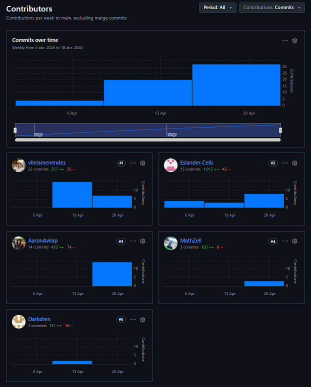

## TB1
Para la segunda entrega (TB1) se hicieron las correciones necesarias al proyecto y se agrego todo el Sprint 2

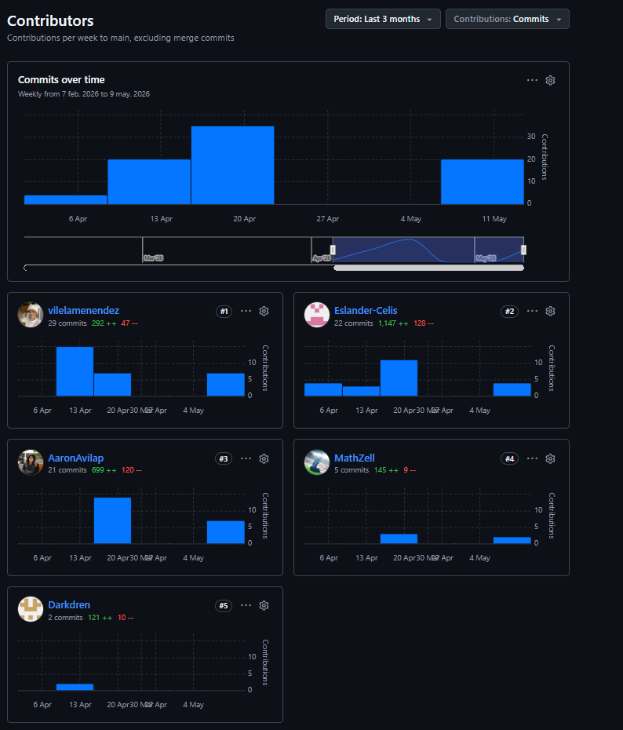

## Contenido

* [Registro de Versiones del Informe](#registro-de-versiones-del-informe)

* [Project Report Collaboration Insights](#project-report-collaboration-insights)

* [Student Outcome](#student-outcome)

* [Capitulo I: Introducción](#capitulo-i-introducción)

  * [1.1. Startup Profile](#11-startup-profile)

    * [1.1.1. Descripcion de la Startup](#111-descripcion-de-la-startup)
    * [1.1.2. Perfiles de integrantes del equipo](#112-perfiles-de-integrantes-del-equipo)
  * [1.2. Solution Profile](#12-solution-profile)

    * [1.2.1. Antecedentes y problematica](#121-antecedentes-y-problematica)
    * [1.2.2. Lean UX Process](#122-lean-ux-process)

      * [1.2.2.1. Lean UX Problem Statements](#1221-lean-ux-problem-statements)
      * [1.2.2.2. Lean UX Assumptions](#1222-lean-ux-assumptions)
      * [1.2.2.3. Lean UX Hypothesis Statements](#1223-lean-ux-hypothesis-statements)
      * [1.2.2.4. Lean UX Canvas](#1224-lean-ux-canvas)
  * [1.3. Segmentos Objetivo](#13-segmentos-objetivo)

    * [Segmento Objetivo 1: Estudiantes Universitarios](#segmento-objetivo-1-estudiantes-universitarios)
    * [Segmento Objetivo 2: Profesores Universitarios](#segmento-objetivo-2-profesores-universitarios)

* [Capitulo II: Requirements Elicitation & Analysis](#capitulo-ii-requirements-elicitation--analysis)

  * [2.1. Competidores](#21-competidores)

    * [2.1.1. Analisis competitivo](#211-analisis-competitivo)
    * [2.1.2. Estrategias y tacticas frente a competidores](#212-estrategias-y-tacticas-frente-a-competidores)
  * [2.2. Entrevistas](#22-entrevistas)

    * [2.2.1. Diseno de entrevistas](#221-diseno-de-entrevistas)
    * [2.2.2. Registro de entrevistas](#222-registro-de-entrevistas)
    * [2.2.3. Analisis de entrevistas](#223-analisis-de-entrevistas)
  * [2.3. Needfinding](#23-needfinding)

    * [2.3.1. User Personas](#231-user-personas)
    * [2.3.2. User Task Matrix](#232-user-task-matrix)
    * [2.3.3. User Journey Mapping](#233-user-journey-mapping)
    * [2.3.4. Empathy Mapping](#234-empathy-mapping)
    * [2.3.5. As-is Scenario Mapping](#235-as-is-scenario-mapping)
  * [2.4. Ubiquitous Language](#24-ubiquitous-language)

* [Capitulo III: Requirements specification](#capitulo-iii-requirements-specification)

  * [3.1. To-Be Scenario Mapping](#31-to-be-scenario-mapping)
  * [3.2. User Stories](#32-user-stories)
  * [3.3. Impact Mapping](#33-impact-mapping)
  * [3.4. Product Backlog](#34-product-backlog)

* [Capitulo IV: Product Design](#capitulo-iv-product-design)

  * [4.1. Style Guidelines](#41-style-guidelines)

    * [4.1.1. General Style Guidelines](#411-general-style-guidelines)
    * [4.1.2. Web Style Guidelines](#412-web-style-guidelines)
  * [4.2. Information Architecture](#42-information-architecture)

    * [4.2.1. Organization Systems](#421-organization-systems)
    * [4.2.2. Labeling Systems](#422-labeling-systems)
    * [4.2.3. SEO Tags and Meta Tags](#423-seo-tags-and-meta-tags)
    * [4.2.4. Searching Systems](#424-searching-systems)
    * [4.2.5. Navigation Systems](#425-navigation-systems)
  * [4.3. Landing Page UI Design](#43-landing-page-ui-design)

    * [4.3.1. Landing Page Wireframe](#431-landing-page-wireframe)
    * [4.3.2. Landing Page Mock-up](#432-landing-page-mock-up)
  * [4.4. Web Applications UX/UI Design](#44-web-applications-uxui-design)

    * [4.4.1. Web Applications Wireframes](#441-web-applications-wireframes)
    * [4.4.2. Web Applications Wireflow Diagrams](#442-web-applications-wireflow-diagrams)
    * [4.4.2. Web Applications Mock-ups](#442-web-applications-mock-ups)
    * [4.4.3. Web Applications User Flow Diagrams](#443-web-applications-user-flow-diagrams)
  * [4.5. Web Applications Prototyping](#45-web-applications-prototyping)
  * [4.6. Domain-Driven Software Architecture](#46-domain-driven-software-architecture)

    * [4.6.1. Software Architecture Context Diagram](#461-software-architecture-context-diagram)
    * [4.6.2. Software Architecture Container Diagrams](#462-software-architecture-container-diagrams)
    * [4.6.3. Software Architecture Components Diagrams](#463-software-architecture-components-diagrams)
  * [4.7. Software Object-Oriented Design](#47-software-object-oriented-design)

    * [4.7.1. Class Diagrams](#471-class-diagrams)
    * [4.7.2. Class Dictionary](#472-class-dictionary)
  * [4.8. Database Design](#48-database-design)

    * [4.8.1. Database Diagram](#481-database-diagram)

* [Capitulo V: Product Implementation, Validation & Deployment](#capitulo-v-product-implementation-validation--deployment)

  * [5.1. Software Configuration Management](#51-software-configuration-management)

    * [5.1.1. Software Development Environment Configuration](#511-software-development-environment-configuration)
    * [5.1.2. Source Code Management](#512-source-code-management)
    * [5.1.3. Source Code Style Guide & Conventions](#513-source-code-style-guide--conventions)
    * [5.1.4. Software Deployment Configuration](#514-software-deployment-configuration)

  * [5.2. Landing Page, Services & Applications Implementation](#52-landing-page-services--applications-implementation)

    * [5.2.1. Sprint 1](#521-sprint-1)

      * [5.2.1.1. Sprint Planning 1](#5211-sprint-planning-1)
      * [5.2.1.2. Aspect Leaders and Collaborators](#5212-aspect-leaders-and-collaborators)
      * [5.2.1.3. Sprint Backlog 1](#5213-sprint-backlog-1)
      * [5.2.1.4. Development Evidence for Sprint Review](#5214-development-evidence-for-sprint-review)
      * [5.2.1.5. Execution Evidence for Sprint Review](#5215-execution-evidence-for-sprint-review)
      * [5.2.1.6. Services Documentation Evidence for Sprint Review](#5216-services-documentation-evidence-for-sprint-review)
      * [5.2.1.7. Software Deployment Evidence for Sprint Review](#5217-software-deployment-evidence-for-sprint-review)
      * [5.2.1.8. Team Collaboration Insights during Sprint](#5218-team-collaboration-insights-during-sprint)
        
    * [5.2.2. Sprint 2](#522-sprint-2)

      * [5.2.2.1. Sprint Planning 2](#5221-sprint-planning-2)
      * [5.2.2.2. Aspect Leaders and Collaborators](#5222-aspect-leaders-and-collaborators)
      * [5.2.2.3. Sprint Backlog 2](#5223-sprint-backlog-2)
      * [5.2.2.4. Development Evidence for Sprint Review](#5224-development-evidence-for-sprint-review)
      * [5.2.2.5. Execution Evidence for Sprint Review](#5225-execution-evidence-for-sprint-review)
      * [5.2.2.6. Services Documentation Evidence for Sprint Review](#5226-services-documentation-evidence-for-sprint-review)
      * [5.2.2.7. Software Deployment Evidence for Sprint Review](#5227-software-deployment-evidence-for-sprint-review)
      * [5.2.2.8. Team Collaboration Insights during Sprint](#5228-team-collaboration-insights-during-sprint)
* [Conclusiones](#conclusiones)
* [Bibliografía](#bibliografía)
* [Anexos](#anexos)


# Student Outcome

ABET – EAC - Student Outcome 3

Capacidad de comunicarse efectivamente con un rango de audiencias.
En el siguiente cuadro se describe las acciones realizadas y enunciados de
conclusiones por parte del grupo, que permiten sustentar el haber alcanzado el logro del ABET – EAC - Student Outcome 3.

<table>
   <tr>
        <th>CRITERIO ESPECIFICO</th>
        <th>ACCIONES REALIZADAS</th>
        <th>CONCLUSIONES</th>
    </tr>
    <tr>
        <th> Comunica oralmente con efectividad a diferentes rangos de audiencia.</th>
        <td>
         <b>Aarón Avila: AV1</b><br>
         Durante el desarrollo del proyecto, participé activamente en la explicación de herramientas como el Empathy Mapping, As-is Scenario Mapping y el Ubiquitous Language, así como en la presentación del proceso de implementación y validación del producto. Me enfoqué en transmitir las ideas de forma clara y comprensible, adaptando el lenguaje según el público, para facilitar la comprensión tanto de aspectos técnicos como de experiencia de usuario.<br><br> 
         <b>Eslander Celis: AV1</b><br>
         Durante el desarrollo del proyecto, fortalecí mi comunicación oral al presentar y explicar temas como la descripción de la startup, los antecedentes y la problemática, así como la definición de los segmentos objetivos. También participé en exposiciones sobre los User Stories, el Product Backlog y el Impact Map, procurando transmitir las ideas de forma clara y ordenada. Me enfoqué en adaptar mi discurso según el tipo de audiencia, ya sea técnica o no técnica, para asegurar que la información sea entendida y aporte al trabajo en equipo.<br><br> 
         <b>Rodrigo Oblitas: AV1</b><br>
         Durante el proyecto, desarrollé mi comunicación oral al explicar conceptos del Lean UX Process, como el Problem Statement, Assumptions e Hypothesis, además de participar en la presentación de la Landing Page. Procuré expresar las ideas de manera clara y estructurada, facilitando la comprensión de los enfoques planteados y adaptando el contenido según la audiencia.<br><br> 
         <b>Mathias Arechaga: AV1</b><br>
         Durante el desarrollo del proyecto, participé en la exposición de herramientas de diseño centrado en el usuario, como User Personas, User Journey Mapping y prototipos de la aplicación web. Me enfoqué en explicar de forma clara los flujos, interfaces y funcionalidades, adaptando mi lenguaje para que tanto aspectos técnicos como visuales sean entendidos por todos.<br><br> 
         <b>Mariano Vilela: AV1</b><br>
         Durante el proyecto, fortalecí mi comunicación oral al presentar el análisis de competidores, el diseño y resultados de entrevistas, así como el To-Be Scenario Mapping e Impact Mapping. Procuré transmitir la información de forma ordenada y clara, facilitando la comprensión de los hallazgos y su impacto en la propuesta de solución.<br><br> 
            <b>Aarón Avila: TB1</b><br>
Durante esta entrega, participé en la presentación del frontend de la aplicación ColdTrack, explicando la estructura de las vistas, la navegación entre módulos y el funcionamiento de los componentes implementados. Procuré comunicar de manera clara el propósito de cada interfaz y cómo estas mejoran la experiencia del usuario, adaptando mi explicación según el nivel técnico de la audiencia.<br><br> 

<b>Eslander Celis: TB1</b><br>
Durante el desarrollo del frontend de ColdTrack, fortalecí mi comunicación oral al exponer la implementación de las principales funcionalidades de la aplicación, incluyendo las vistas de autenticación, dashboard y gestión de productos. Expliqué de manera ordenada el flujo de navegación y la interacción entre componentes, procurando que tanto aspectos técnicos como funcionales sean comprendidos por todos los integrantes y docentes.<br><br> 

<b>Rodrigo Oblitas: TB1</b><br>
Durante esta entrega, participé en la explicación del diseño visual y la estructura del frontend, detallando la implementación de componentes reutilizables y estilos responsivos. Me enfoqué en comunicar las decisiones de diseño de manera clara y estructurada, facilitando la comprensión de la propuesta desarrollada.<br><br> 

<b>Mathias Arechaga: TB1</b><br>
Durante el desarrollo del frontend, participé en la presentación de los prototipos implementados y las funcionalidades visuales de la aplicación. Expliqué el comportamiento de las interfaces y la distribución de los elementos gráficos, utilizando un lenguaje claro para facilitar la comprensión de la experiencia de usuario planteada.<br><br> 

<b>Mariano Vilela: TB1</b><br>
Durante esta entrega, fortalecí mi comunicación oral al presentar las mejoras visuales y la organización de las vistas del frontend de ColdTrack. Expliqué cómo las interfaces fueron diseñadas para facilitar la interacción del usuario con el sistema, transmitiendo las ideas de manera ordenada y comprensible.<br><br>  
        </td>
        <td>
          <b>AV1</b><br>
          Durante el desarrollo del proyecto, el equipo evidenció una comunicación oral sólida al intervenir de manera constante en exposiciones, reuniones y actividades colaborativas. Cada miembro supo ajustar su forma de expresarse según el tipo de audiencia, tanto en entornos técnicos con sus compañeros como en contextos académicos frente a docentes. Esta capacidad se reflejó en la explicación ordenada y fundamentada de temas como el perfil de solución, la segmentación de usuarios, las arquitecturas planteadas y el diseño de la experiencia de usuario. Asimismo, el equipo sobresalió al compartir los resultados de entrevistas e investigaciones de forma clara, facilitando un intercambio de ideas fluido y productivo. En general, la comunicación oral fue fundamental para mantener la coherencia del trabajo, validar decisiones y transmitir propuestas de manera profesional. <br><br>
          <b>TB1:</b><br>
Durante el desarrollo del frontend de ColdTrack, el equipo demostró una comunicación oral efectiva al presentar de manera clara las funcionalidades implementadas, la estructura de navegación y el diseño de las interfaces de usuario. Cada integrante explicó distintos componentes del sistema, adaptando el nivel técnico de sus exposiciones según la audiencia, lo que permitió transmitir tanto aspectos funcionales como decisiones de diseño de forma comprensible. Asimismo, las reuniones y presentaciones realizadas facilitaron la coordinación del equipo y la validación de avances durante la implementación del producto. En conjunto, la comunicación oral contribuyó significativamente a mantener una correcta organización y comprensión del proyecto.<br><br>
    </tr>
    <tr>
        <th>Comunica por escrito con efectividad a diferentes rangos de audiencia.</th>
        <td>
          <b>Aarón Avila: AV1</b><br>
          Desarrollé mi comunicación escrita al elaborar secciones como Empathy Mapping, As-is Scenario Mapping y Ubiquitous Language, así como el capítulo de implementación y validación del producto. Procuré mantener una redacción clara, ordenada y coherente, facilitando la comprensión de los conceptos tanto técnicos como funcionales dentro del proyecto.<br><br> 
          <b>Eslander Celis: AV1</b><br>
         Por otro lado, desarrollé mi comunicación escrita al redactar secciones como la descripción de la startup, el análisis de la problemática, los segmentos objetivos y la elaboración de los User Stories, Product Backlog e Impact Map. Mantuve un estilo claro, coherente y bien estructurado, lo que permitió que la información sea comprensible para distintos lectores. Esto contribuyó a una documentación consistente y alineada con los objetivos del proyecto.<br><br> 
         <b>Rodrigo Oblitas: AV1</b><br>
         Fortalecí mi comunicación escrita al redactar apartados del Lean UX Process, como Problem Statement, Assumptions e Hypothesis, además del contenido relacionado a la Landing Page. Me enfoqué en estructurar la información de manera clara y precisa, asegurando que sea entendida por distintos tipos de audiencia.<br><br> 
         <b>Mathias Arechaga: AV1</b><br>
         Desarrollé mi comunicación escrita al documentar herramientas de diseño como User Personas, User Journey Mapping y los prototipos de la aplicación web. Mantuve un enfoque claro y organizado, permitiendo que la información visual y funcional sea fácilmente comprendida por el lector.<br><br> 
         <b>Mariano Vilela: AV1</b><br>
         Fortalecí mi comunicación escrita al desarrollar el análisis de competidores, el diseño y análisis de entrevistas, así como el To-Be Scenario Mapping e Impact Mapping. Procuré presentar la información de forma clara, estructurada y coherente, facilitando la comprensión de los resultados y su aplicación en el proyecto.<br><br> 
             <b>Aarón Avila: TB1</b><br>
Desarrollé mi comunicación escrita al documentar el proceso de implementación del frontend de ColdTrack, describiendo las vistas desarrolladas, la estructura de componentes y las funcionalidades principales de la aplicación. Procuré mantener una redacción clara y organizada para facilitar la comprensión del avance realizado.<br><br> 

<b>Eslander Celis: TB1</b><br>
Fortalecí mi comunicación escrita al redactar documentación relacionada con el frontend de la aplicación, incluyendo la descripción de las vistas implementadas, la navegación del sistema y las funcionalidades desarrolladas durante el sprint. Mantuve una estructura clara y coherente para asegurar que la información sea entendida tanto por lectores técnicos como no técnicos.<br><br> 

<b>Rodrigo Oblitas: TB1</b><br>
Durante esta entrega, desarrollé mi comunicación escrita al documentar aspectos relacionados con el diseño visual, estilos responsivos y componentes reutilizables implementados en el frontend. Procuré presentar la información de manera ordenada y comprensible para facilitar la interpretación del trabajo realizado.<br><br> 

<b>Mathias Arechaga: TB1</b><br>
Fortalecí mi comunicación escrita al documentar los prototipos implementados y la organización visual de las interfaces del frontend. Me enfoqué en redactar de forma clara las funcionalidades y flujos de interacción desarrollados en la aplicación.<br><br> 

<b>Mariano Vilela: TB1</b><br>
Desarrollé mi comunicación escrita al elaborar documentación relacionada con las mejoras visuales y la experiencia de usuario del frontend de ColdTrack. Procuré estructurar la información de forma clara y coherente para facilitar la comprensión de las decisiones tomadas durante la implementación.<br><br> 
        </td>
        <td>
          <b>AV1:</b><br>
          El equipo evidenció una buena capacidad de comunicación escrita al desarrollar distintos componentes del proyecto, como entrevistas, User Stories, backlog, documentación técnica, diseño de interfaces y secciones del informe final. Cada integrante utilizó un lenguaje claro, ordenado y adecuado según el tipo de público, permitiendo que la información sea entendida tanto por especialistas como por personas con menor conocimiento técnico. La claridad en la explicación de conceptos, junto con una correcta estructuración del contenido, hizo que los documentos cumplieran adecuadamente su propósito informativo y de apoyo en la toma de decisiones. En conjunto, esta habilidad fue clave para asegurar la coherencia del proyecto y lograr una documentación completa y profesional, alineada con los objetivos del equipo. <br><br>
           <b>TB1:</b><br>
        El equipo evidenció una comunicación escrita efectiva durante el desarrollo del frontend de ColdTrack, elaborando documentación clara y estructurada sobre las vistas, componentes y funcionalidades implementadas en la aplicación. Cada integrante redactó información relacionada con el diseño visual, navegación y experiencia de usuario, utilizando un lenguaje adecuado según el tipo de audiencia. La organización y claridad de los documentos permitieron comprender fácilmente el progreso del proyecto y las decisiones tomadas durante el sprint. En conjunto, la comunicación escrita contribuyó a mantener una documentación consistente, profesional y alineada con los objetivos planteados para la implementación del frontend.<br><br>
        </td>
    </tr>
</table>


# Project: 
# Capitulo I: Introduccion

## 1.1. Startup Profile

### 1.1.1. Descripcion de la Startup
FreshGuard Technologies es una startup tecnológica enfocada en optimizar la calidad de los alimentos durante su transporte mediante el uso de tecnología de monitoreo en tiempo real. Su producto principal, ColdTrack, es una aplicación que se integra con sensores de temperatura y humedad instalados en las unidades de transporte, permitiendo a las empresas supervisar las condiciones de los productos desde los centros de distribución hasta su destino final. A través de esta solución, los usuarios pueden visualizar datos en tiempo real, recibir alertas ante variaciones críticas y acceder a un registro histórico de cada envío. De esta manera, FreshGuard Technologies busca reducir pérdidas, mejorar la eficiencia logística y garantizar que los alimentos lleguen en condiciones óptimas al consumidor.

- **Nombre de la startup:** FreshGuard Technologies

- **Producto:** ColdTrack

- **Misión:**
Nuestra misión es garantizar la calidad y seguridad de los alimentos durante su transporte mediante el uso de tecnología de monitoreo en tiempo real, permitiendo a las empresas tomar decisiones rápidas y efectivas para evitar pérdidas y asegurar condiciones óptimas.

- **Visión:**
Nuestra visión es convertirnos en la solución líder en monitoreo de condiciones de transporte de alimentos en Perú y Latinoamérica, destacando por nuestra innovación, confiabilidad y aporte a la seguridad alimentaria.

- **Valores:**
Responsabilidad, innovación y confiabilidad.
### 1.1.2. Perfiles de integrantes del equipo
<table border="1" cellspacing="0" cellpadding="8">
  <tr>
   <td style="text-align: center" align="center">
        <p align="center">
         Eslander Celis Berrospi - U201911249 
         <br>
         
         </p>
        </td>
        <td style="text-align: center" align="center">
         Soy Eslander, estudiante de Ingeniería de Software. Me considero una persona responsable y comprometida con mis objetivos, con una gran disposición para aprender y mejorar de manera continua. Valoro mucho la ética y el trabajo en equipo, aportando siempre ideas y soluciones para alcanzar resultados de calidad. Me esfuerzo por mantener un enfoque ordenado en mis tareas y contribuir activamente al desarrollo colectivo. Tengo conocimientos en Python, C++ y HTML, lo que me permite desarrollar soluciones tecnológicas y fortalecer mis habilidades en programación. Estoy motivado a seguir aprendiendo y asumir nuevos retos que me ayuden a crecer tanto profesional como personalmente.
        </td>
       
  </tr>
  <tr>
    <td style="text-align: center" align="center">
        <p align="center">
        Rodrigo Oblitas Alcalde - U20221G185 
         <br>
         
         </p>
        </td>
        <td style="text-align: center" align="center">
         Soy Rodrigo Oblitas, estudiante de Ingenieria de Software. Actualmente curso el sexto ciclo y me considero una persona comprometida con mi formacion academica y profesional. Me gusta programar porque me permite crear soluciones, resolver problemas y seguir aprendiendo nuevas tecnologias. Tambien disfruto entrenar, ya que me ayuda a mantener disciplina, constancia y equilibrio en mi vida diaria. Busco seguir fortaleciendo mis habilidades en programacion y aportar activamente al trabajo en equipo para lograr resultados de calidad.
        </td>
       
  </tr>

 <tr>
    <td style="text-align: center" align="center">
        <p align="center">
        Aarón Avila Palacios - U201823654
         <br>
         
         </p>
        </td>
        <td style="text-align: center" align="center">
        Soy estudiante de Ingeniería de software y estoy cursando el quinto ciclo de la carrera. Tengo 23 años. Tengo conocimientos en programación orientada a objetos en lenguaje de programación C++, también en diseño de prototipos de aplicaciones, diseño gráfico, diseño e implementación de páginas web. Todas estas habilidades ayudan al desarrollo del proyecto, dado que son de vital importancia en este curso y en nuestra carrera. Soy capaz de desarrollar de manera eficaz cualquier tarea que se me asigne. 
        </td>
 </tr>
        <tr>
    <td style="text-align: center" align="center">
        <p align="center">
        Mariano Vilela Menendez - U201918216
         <br>
         
         </p>
        </td>
        <td style="text-align: center" align="center">
        Soy Mariano Vilela Menéndez, estudiante de Ingeniería de Software. Me considero una persona responsable, proactiva y comprometida con mi formación académica y profesional. Tengo un gran interés por la tecnología y el desarrollo de software, lo que me motiva a aprender constantemente nuevas herramientas y lenguajes de programación. Disfruto resolver problemas, trabajar en equipo y aportar ideas que generen soluciones eficientes y de calidad. Busco seguir fortaleciendo mis habilidades técnicas y personales, asumiendo nuevos retos que me permitan crecer y contribuir de manera positiva en cada proyecto en el que participe.
        </td>

 <tr>
    <td style="text-align: center" align="center">
        <p align="center">
        Rodrigo Oblitas Alcalde - U20221G185 
         <br>
         
         </p>
        </td>
        <td style="text-align: center" align="center">
         Soy Mathias Arechaga, estudiante de Ingeniería de Software y actualmente cursando el quinto ciclo. Me considero una persona dedicada y orientada a crecer tanto en el ámbito académico como profesional. Me interesa el mundo de la programación porque me permite diseñar soluciones, afrontar retos y adquirir constantemente nuevos conocimientos tecnológicos. Cuento con manejo de HTML y conocimientos básicos de Python, lo que me facilita desarrollar proyectos simples mientras sigo perfeccionando mis competencias.
        </td>

  </tr>

</table>

## 1.2. Solution Profile
ColdTrack es una plataforma digital diseñada para monitorear en tiempo real las condiciones de temperatura y humedad durante el transporte de alimentos, asegurando que estos se mantengan dentro de los rangos adecuados desde los centros de distribución hasta su destino final. El sistema se integra con sensores instalados en las unidades de transporte, los cuales envían datos constantemente a la aplicación, permitiendo a los usuarios visualizar el estado de cada envío en todo momento.

La plataforma genera alertas automáticas cuando se detectan variaciones que podrían comprometer la calidad del producto, facilitando una rápida toma de decisiones para evitar pérdidas. Además, los usuarios pueden acceder a un historial detallado de cada transporte, lo que permite analizar el desempeño logístico y garantizar un mayor control en la cadena de distribución.

Con una interfaz intuitiva y fácil de usar, ColdTrack no solo mejora la supervisión del transporte de alimentos, sino que también incrementa la eficiencia operativa, reduce riesgos y asegura que los productos lleguen en condiciones óptimas al consumidor final.

### 1.2.1. Antecedentes y problematica
#### 1. What / ¿QUÉ?

##### ¿Cuál es el problema que se busca resolver?  
El problema es la falta de control y monitoreo en tiempo real de la temperatura y humedad durante el transporte de alimentos, lo que puede generar deterioro en los productos.

##### ¿Qué producto o servicio se propone?  
Se propone una aplicación llamada ColdTrack que permite monitorear en tiempo real las condiciones ambientales mediante sensores.

##### ¿Para qué se utiliza esta solución?  
Se utiliza para garantizar que los alimentos se mantengan en condiciones óptimas durante su traslado.

---

#### 2. When / ¿CUÁNDO?

##### ¿Cuándo ocurre el problema?  
El problema ocurre durante el transporte de alimentos desde los centros de distribución hasta su destino final.

##### ¿En qué momento del proceso es más crítico?  
Es más crítico durante trayectos largos o cuando ocurren fallas en los sistemas de refrigeración sin ser detectadas oportunamente.

---

#### 3. Where / ¿DÓNDE?

##### ¿Dónde surge el problema?  
El problema surge en el proceso logístico de distribución de alimentos, específicamente en las unidades de transporte.

##### ¿Dónde se utilizará la solución?  
La solución será utilizada en camiones y sistemas de transporte que trasladan alimentos desde centros de distribución.

---

#### 4. Who / ¿QUIÉN?

##### ¿Quiénes están involucrados en la situación?  
Están involucradas empresas distribuidoras de alimentos, operadores logísticos, conductores y el equipo de desarrollo de la startup.

##### ¿Quiénes son los usuarios del producto?  
Los usuarios principales son las empresas de distribución, supervisores logísticos y personal encargado del control de calidad.

---

#### 5. Why / ¿POR QUÉ?

##### ¿Por qué ocurre este problema?  
Ocurre debido a la falta de herramientas tecnológicas que permitan monitorear en tiempo real las condiciones ambientales durante el transporte.

##### ¿Por qué es importante resolverlo?  
Porque impacta directamente en la calidad de los alimentos, genera pérdidas económicas y puede afectar la salud de los consumidores.

---

#### 6. How / ¿CÓMO?

##### ¿Cómo se llevará a cabo la solución?  
Se implementará una aplicación conectada a sensores que registran temperatura y humedad en tiempo real.

##### ¿Cómo funcionará en la práctica?  
Los sensores enviarán datos constantemente a la app, la cual permitirá visualizar condiciones, generar alertas y almacenar un historial de cada transporte.

---

#### 7. How Much / ¿CUÁNTO?

##### ¿Cuánto impacta el problema?  
El problema puede generar pérdidas frecuentes de productos debido a condiciones inadecuadas durante el transporte.

##### ¿Cuánto costará implementar la solución?  
Para el prototipo, el costo será bajo, pero en una implementación real implicará inversión en sensores, infraestructura tecnológica y mantenimiento.


### 1.2.2. Lean UX Process

El Lean UX Process es una metodologia de trabajo iterativa que permite validar rapidamente las ideas del producto con base en las necesidades reales de los usuarios. Para ColdTrack, este proceso permite comprender los problemas que enfrentan las empresas de distribucion de alimentos durante el transporte, plantear suposiciones sobre sus necesidades y convertirlas en hipotesis que puedan comprobarse mediante pruebas, entrevistas y prototipos. De esta manera, el equipo puede reducir riesgos antes de desarrollar la solucion completa y asegurar que la aplicacion responda a problemas reales relacionados con el monitoreo de temperatura, humedad, alertas y trazabilidad de los envios.

#### 1.2.2.1. Lean UX Problem Statements

Nuestro servicio esta disenado para ayudar a las empresas distribuidoras de alimentos, supervisores logisticos, personal de control de calidad y conductores a monitorear en tiempo real las condiciones de temperatura y humedad durante el transporte. Hemos observado que muchas organizaciones no cuentan con una herramienta centralizada que permita detectar variaciones criticas durante la ruta, lo que genera perdida de productos, retrasos en la toma de decisiones y menor control sobre la calidad de los alimentos. Esto esta causando problemas economicos, operativos y de seguridad alimentaria, ya que las fallas pueden ser identificadas demasiado tarde. ¿Como podriamos mejorar el control del transporte de alimentos mediante una plataforma que permita visualizar datos en tiempo real, recibir alertas oportunas y consultar el historial de cada envio, midiendo el exito a traves de la reduccion de perdidas, mayor rapidez de respuesta y mejor trazabilidad logistica?

#### 1.2.2.2. Lean UX Assumptions

**User Assumptions (Suposiciones de Usuario)**

- **¿Quien es el usuario?:** Los usuarios son empresas distribuidoras de alimentos, supervisores logisticos, personal de control de calidad y conductores encargados de asegurar que los productos lleguen en condiciones adecuadas.
- **¿Donde encaja nuestro producto en su trabajo o vida?:** ColdTrack encaja dentro del proceso diario de transporte y supervision de alimentos, especialmente durante el traslado desde centros de distribucion hasta el destino final.
- **¿Que problemas resuelve nuestro producto?:** Resuelve la falta de monitoreo en tiempo real, la deteccion tardia de variaciones de temperatura o humedad, la ausencia de alertas oportunas y la poca trazabilidad del estado de los envios.
- **¿Cuando y como se usa nuestro producto?:** Se utiliza antes, durante y despues del transporte. Antes del envio permite verificar la unidad y sensores; durante la ruta permite monitorear condiciones y recibir alertas; despues del envio permite revisar el historial registrado.
- **¿Que caracteristicas son importantes?:** Las caracteristicas importantes son monitoreo en tiempo real, alertas automaticas, registro historico, visualizacion de temperatura y humedad, gestion de envios y una interfaz clara para supervisores y conductores.
- **¿Como debe verse y comportarse nuestro producto?:** Debe ser una aplicacion sencilla, clara y confiable, con informacion facil de interpretar, tiempos de respuesta rapidos y alertas visibles que permitan actuar de inmediato.

**Business Assumptions (Suposiciones de Negocio)**

- **Necesidades y problemas:** Creemos que las empresas de distribucion de alimentos necesitan herramientas digitales que reduzcan perdidas y mejoren el control de calidad durante el transporte.
- **Plataforma:** Estas necesidades pueden resolverse mediante una aplicacion conectada a sensores de temperatura y humedad instalados en las unidades de transporte.
- **Segmentacion:** Los usuarios principales seran empresas del sector alimentario, operadores logisticos, supervisores de calidad y personal de transporte.
- **Comportamientos:** El valor principal que un usuario quiere obtener de ColdTrack es mayor control sobre las condiciones del envio y capacidad de reaccionar rapidamente ante incidentes.
- **Beneficios:** Los usuarios obtendran reduccion de perdidas, mejor trazabilidad, mayor eficiencia operativa y mayor seguridad en la distribucion de alimentos.
- **Captacion de clientes:** Obtendremos usuarios mediante alianzas con empresas distribuidoras, demostraciones del prototipo, recomendaciones del sector logistico y presencia en canales digitales.
- **Modelos de ingresos:** Para una implementacion real, el servicio podria funcionar bajo un modelo de suscripcion por empresa o por unidad de transporte monitoreada.
- **Competencia:** Nuestra competencia incluye soluciones de monitoreo logistico, sistemas de sensores IoT y plataformas de gestion de transporte.
- **Ventaja competitiva:** ColdTrack se diferencia por enfocarse especificamente en el transporte de alimentos, integrando monitoreo ambiental, alertas e historial de envios en una sola plataforma.

**Technical Assumptions (Suposiciones Tecnicas)**

- **Tecnologia utilizada:** Se utilizaran tecnologias web modernas para desarrollar la aplicacion y permitir el acceso desde distintos dispositivos.
- **Integraciones:** La plataforma se integrara con sensores de temperatura y humedad capaces de enviar datos periodicamente al sistema.
- **Escalabilidad:** La solucion debe estar preparada para manejar multiples unidades de transporte, varios envios simultaneos y crecimiento progresivo de usuarios.
- **Disponibilidad:** La aplicacion debe mantener disponibilidad constante durante las rutas, ya que las alertas y datos en tiempo real son importantes para la toma de decisiones.

**Market Assumptions (Suposiciones de Mercado)**

- **Tamano del mercado:** El mercado objetivo incluye empresas peruanas y latinoamericanas dedicadas a la distribucion de alimentos que necesitan conservar la calidad de sus productos durante el transporte.
- **Competencia:** Existen plataformas de gestion logistica y soluciones IoT, pero no todas estan enfocadas en la cadena de frio y el control especifico de alimentos.
- **Tendencias:** Existe una mayor demanda de digitalizacion logistica, trazabilidad y control de calidad en la industria alimentaria.

**Design Assumptions (Suposiciones de Diseno)**

- **Interaccion del usuario:** La plataforma debe permitir que el usuario revise rapidamente el estado de un envio y entienda si existe algun riesgo.
- **Experiencia del usuario:** La experiencia debe ser fluida, directa y facil de usar, especialmente para conductores o personal operativo que necesita informacion clara durante la ruta.
- **Colores y tipografia:** Los usuarios valoraran una interfaz limpia, profesional y legible, con colores que permitan identificar estados normales, advertencias y alertas criticas.
- **Preferencias visuales:** Los usuarios preferiran graficos simples, indicadores de estado y datos resumidos antes que pantallas saturadas de informacion.
- **Prototipos y pruebas:** Se validaran las principales funciones mediante prototipos y pruebas de usabilidad con usuarios relacionados al transporte y control de calidad.

#### 1.2.2.3. Lean UX Hypothesis Statements

**Hypothesis Statement 01:**

Creemos que las empresas distribuidoras de alimentos necesitan monitorear en tiempo real la temperatura y humedad durante el transporte. Sabremos que estamos en lo correcto cuando los supervisores consulten frecuentemente el estado de los envios y reporten mayor control sobre sus operaciones.

**Hypothesis Statement 02:**

Creemos que las alertas automaticas ante variaciones criticas permitiran reducir perdidas de productos. Sabremos que estamos en lo correcto cuando los usuarios puedan actuar antes de que las condiciones afecten la calidad de los alimentos.

**Hypothesis Statement 03:**

Creemos que contar con un historial de cada envio mejorara la trazabilidad y el analisis logistico. Sabremos que estamos en lo correcto cuando las empresas utilicen los registros para revisar incidentes y tomar decisiones de mejora.

**Hypothesis Statement 04:**

Creemos que una interfaz clara y sencilla facilitara la adopcion de ColdTrack por parte de supervisores y conductores. Sabremos que estamos en lo correcto cuando los usuarios puedan interpretar el estado del envio sin requerir capacitacion extensa.

**Hypothesis Statement 05:**

Creemos que la integracion con sensores de temperatura y humedad aumentara la confiabilidad del control durante la ruta. Sabremos que estamos en lo correcto cuando los datos registrados permitan identificar cambios ambientales en tiempo real.

**Hypothesis Statement 06:**

Creemos que los conductores necesitan recibir informacion directa sobre posibles fallas durante el transporte. Sabremos que estamos en lo correcto cuando las alertas ayuden a responder rapidamente ante problemas en la unidad o en el sistema de refrigeracion.

**Hypothesis Statement 07:**

Creemos que ColdTrack ayudara a mejorar la eficiencia operativa de las empresas distribuidoras. Sabremos que estamos en lo correcto cuando se reduzca el tiempo dedicado a revisar manualmente las condiciones del transporte.

**Hypothesis Statement 08:**

Creemos que la visualizacion centralizada de los envios permitira una mejor supervision logistica. Sabremos que estamos en lo correcto cuando los usuarios puedan revisar varias rutas o unidades desde una sola plataforma.

**Hypothesis Statement 09:**

Creemos que la digitalizacion del control de calidad durante el transporte aumentara la confianza de las empresas en sus procesos. Sabremos que estamos en lo correcto cuando los usuarios consideren que la informacion registrada respalda mejor sus decisiones.

**Hypothesis Statement 10:**

Creemos que una solucion enfocada en alimentos tendra mayor valor para empresas que requieren preservar la calidad de sus productos. Sabremos que estamos en lo correcto cuando los usuarios identifiquen a ColdTrack como una herramienta mas adecuada que plataformas logisticas genericas.

#### 1.2.2.4. Lean UX Canvas

| **Seccion** | **Descripcion** |
|-------------|-----------------|
| **Business Problem** | Las empresas distribuidoras de alimentos tienen dificultades para controlar en tiempo real las condiciones de temperatura y humedad durante el transporte, lo que puede ocasionar perdidas economicas, deterioro de productos y problemas de calidad. |
| **Business Outcomes** | Reducir perdidas de alimentos, mejorar la eficiencia logistica, aumentar la trazabilidad de los envios y fortalecer el control de calidad durante el transporte. |
| **Users** | Empresas distribuidoras de alimentos, supervisores logisticos, personal de control de calidad y conductores encargados del traslado de productos. |
| **User Outcomes & Benefits** | Los usuarios podran conocer el estado de los envios en tiempo real, recibir alertas ante condiciones criticas, actuar rapidamente y revisar historiales para mejorar sus procesos. |
| **Solutions** | Aplicacion web ColdTrack conectada a sensores de temperatura y humedad, con monitoreo en tiempo real, alertas automaticas, visualizacion de datos e historial de envios. |
| **Hypotheses** | Si las empresas utilizan ColdTrack para monitorear sus envios, entonces podran reducir riesgos de deterioro y tomar decisiones mas rapidas durante el transporte. |
| **What is the most important thing we need to learn first?** | Validar si los usuarios consideran critico recibir alertas en tiempo real y si el historial de datos aporta valor para la supervision y control de calidad. |
| **What is the least amount of work we need to do to learn the next most important thing?** | Crear un prototipo funcional con visualizacion de temperatura y humedad, alertas basicas y registro de un envio para probarlo con usuarios del sector logistico. |

## 1.3. Segmentos Objetivo

Para ColdTrack, se identifican dos segmentos objetivo principales que utilizan la aplicación para monitorear las condiciones de temperatura y humedad durante el transporte de alimentos.

---

### Segmento Objetivo 1: Personal de Logística y Operaciones

Este segmento está compuesto por los trabajadores encargados de supervisar y gestionar el transporte de alimentos dentro de una empresa.

**Aspectos Demográficos:**

- Edad: 25 a 50 años  
- Género: Todos los géneros  
- Nivel educativo: Técnico o universitario  
- Ocupación: Personal de logística, operaciones o control de calidad  

**Aspectos Geográficos:**

- Ubicación: Perú (principalmente zonas urbanas)  
- Lugar de uso: Oficinas y centros de distribución  

**Aspectos Psicográficos:**

- Buscan tener control y visibilidad sobre los envíos.  
- Valoran herramientas que les permitan tomar decisiones rápidas.  
- Están interesados en mejorar la eficiencia del transporte.  

**Necesidades:**

- Monitorear temperatura y humedad en tiempo real.  
- Recibir alertas ante fallas.  
- Tener registro histórico de los envíos.  

**Beneficios clave:**

- Mejor control del proceso logístico.  
- Reducción de pérdidas de productos.  
- Mayor eficiencia en la operación.  

---

### Segmento Objetivo 2: Personal de Transporte

Este segmento está compuesto por las personas encargadas de trasladar los alimentos durante las rutas de distribución.

**Aspectos Demográficos:**

- Edad: 25 a 55 años  
- Género: Todos los géneros  
- Nivel educativo: Secundaria completa o técnico  
- Ocupación: Conductores o personal de transporte  

**Aspectos Geográficos:**

- Ubicación: Perú  
- Lugar de uso: Durante el transporte (en ruta)  

**Aspectos Psicográficos:**

- Se enfocan en cumplir correctamente con la entrega.  
- Prefieren herramientas simples y fáciles de usar.  
- Valoran recibir información clara y directa.  

**Necesidades:**

- Recibir alertas sobre cambios en temperatura o humedad.  
- Saber cuándo actuar ante un problema.  
- Tener acceso rápido a la información del estado del envío.  

**Beneficios clave:**

- Respuesta rápida ante fallas.  
- Mayor seguridad en el transporte.  
- Facilidad de uso durante el trabajo.  

# Capitulo II: Requirements Elicitation & Analysis

## 2.1. Competidores
En esta sección, se presenta un análisis de los principales competidores de nuestra startup, centrado en aquellos que operan con modelos de negocio basados en logística inteligente o que ofrecen servicios que se superponen con las funciones de monitoreo térmico de ColdTrack. Evaluamos tanto competidores directos, enfocados en la cadena de frío, como competidores indirectos que ofrecen soluciones de rastreo satelital generalista.

1. Hunter Monitoreo

Descripción:

Hunter es una empresa líder en el mercado peruano con una amplia trayectoria en soluciones de seguridad y rastreo vehicular. Aunque su enfoque principal es la recuperación de vehículos y la seguridad ante robos, cuentan con módulos adicionales para la gestión de flotas que incluyen sensores de temperatura para carga crítica.

Principales características:

Rastreo satelital GPS en tiempo real con cobertura nacional.

Sensores de temperatura integrados al hardware del vehículo.

Plataforma de monitoreo orientada principalmente a la seguridad patrimonial.

Soporte técnico local y centrales de monitoreo 24/7.

Reportes de paradas, rutas y cumplimiento de horarios.

Infraestructura robusta y consolidada en el sector transporte en Perú.

2. Beetrack (DispatchTrack)

Descripción:

Beetrack es una plataforma de software enfocada en la gestión de última milla y logística de distribución. Su fuerte es la optimización de rutas y la experiencia del cliente final, permitiendo a las empresas tener una trazabilidad completa del proceso de entrega mediante el uso de smartphones.

Principales características:

Monitoreo de guías de despacho en tiempo real.

Optimización de rutas para reducir tiempos de entrega.

Notificaciones al cliente final sobre el estado de su pedido.

Recolección de pruebas de entrega (fotos, firmas digitales).

Dashboard analítico sobre el desempeño de los transportistas.

Se integra fácilmente con otros sistemas de gestión empresarial (ERP).

3. Testo (Soluciones de registro)

Descripción:

Testo es un competidor indirecto de hardware que ofrece data loggers o termógrafos de alta precisión. A diferencia de las plataformas integradas, Testo se especializa en el registro físico de datos ambientales que luego son descargados por el usuario para auditorías de calidad.

Principales características:

Dispositivos de medición de temperatura y humedad de grado farmacéutico.

Alta precisión y calibración certificada.

Modelos con conexión USB o WiFi para descarga de datos.

Memoria interna para almacenamiento de lecturas en trayectos largos.

Software especializado para la creación de informes de cumplimiento sanitario.

Muy utilizado en laboratorios y grandes centros de almacenamiento.

### 2.1.1. Analisis competitivo
| ¿Por qué llevar a cabo este análisis? | Pregunta: ¿Deberíamos llevar a cabo este análisis para conocer el entorno, la competencia, tomar decisiones de desarrollo y construir nuestra propuesta de valor? |
| :--- | :--- |

| Productos | ColdTrack | Hunter Monitoreo | Beetrack | Termógrafos USB |
| :--- | :--- | :--- | :--- | :--- |
| **Perfil** | **Overview** | App + IoT especializada en monitoreo de temperatura y humedad en tiempo real para la cadena de frío alimentaria. | Empresa de seguridad y rastreo GPS con módulos de control de temperatura para flotas logísticas. | Plataforma SaaS de última milla centrada en optimización de rutas y trazabilidad de entrega al cliente. | Dispositivos físicos que registran datos térmicos localmente para descarga manual post-viaje. |
| | **Ventaja competitiva** | Especialización en inocuidad, alertas críticas en tiempo real, trazabilidad por lote y modo offline automático. | Infraestructura de seguridad robusta y soporte técnico local consolidado en Perú. | Interfaz intuitiva, enfoque en la experiencia del cliente final y optimización logística. | Bajo costo, no requiere instalación técnica y alta precisión de sensores certificados. |
| **Perfil de Marketing** | **Mercado Objetivo** | Empresas distribuidoras de alimentos, supermercados y operadores logísticos en Perú y Latam. | Empresas de transporte de carga pesada, seguridad de activos y logística general. | Empresas de retail, consumo masivo y servicios de delivery de última milla. | Laboratorios farmacéuticos y pequeños productores de alimentos para auditorías. |
| | **Estrategias de Marketing** | Alianzas con gremios alimentarios, marketing digital enfocado en B2B y demostraciones de IoT. | Campañas institucionales masivas, convenios de seguridad y marketing directo. | Marketing de contenidos, presencia en eventos logísticos y alianzas con e-commerce. | Distribución minorista, ventas por volumen en marketplaces y ferias industriales. |
| **Perfil de Producto** | **Productos & Servicios** | Monitoreo Real-time, alertas push, trazabilidad por lote, reportes de calidad e historial. | Rastreo GPS, sensores de combustible/temp, control de flotas y recuperación de robos. | Planificación de rutas, trazabilidad de despacho, prueba de entrega digital y métricas. | Registro de temperatura/humedad, generación de reportes PDF/Excel mediante conexión USB. |
| | **Precios & Costos** | Suscripción SaaS mensual por unidad monitoreada + costo único inicial por kit de sensores. | Costo elevado de instalación fija + cuotas mensuales de servicio de monitoreo 24/7. | Modelo de suscripción basado en el volumen de despachos o número de conductores. | Pago único por dispositivo (desechables o reutilizables). Sin cuotas mensuales. |
| | **Canales de distribución** | Web oficial, venta consultiva directa y partners tecnológicos de hardware IoT. | Red de oficinas físicas a nivel nacional, agentes de ventas y convenios corporativos. | Plataforma web (SaaS), equipos de ventas regionales y App Stores. | Distribuidores de suministros industriales, ferreterías técnicas y canales online. |
| **Análisis SWOT** | **Fortalezas** | Especialización nativa en alimentos, alertas en tiempo real y facilidad de uso operativo. | Respaldo de marca, amplia cobertura en Perú y capacidad de respuesta ante robos. | Excelente UI/UX, líder en optimización de rutas y alta compatibilidad con ERPs. | Precisión técnica certificada, autonomía total (no depende de red) y bajo costo. |
| | **Debilidades** | Startup nueva en el mercado, requiere validación de confianza ante grandes corporaciones. | Interfaz compleja, costo de mantenimiento alto y enfoque secundario en temperatura. | No especializado en condiciones ambientales (temperatura), depende 100% de la nube. | No permite reacción inmediata, requiere intervención manual para leer datos. |
| | **Oportunidades** | Normativas de salud más estrictas, digitalización de PYMES y expansión regional. | Integrar IA para predicción de fallas y diversificar servicios de sensorización. | Expandir funciones hacia el control de cadena de frío y nuevos mercados en Latam. | Implementar versiones con conexión Bluetooth para descarga inalámbrica básica. |
| | **Amenazas** | Competencia de empresas de GPS consolidadas y resistencia al cambio tecnológico. | Nuevas startups con tecnologías más ligeras (IoT) y precios más agresivos. | Saturación del mercado de última milla y entrada de competidores globales. | Digitalización total de la cadena que vuelva obsoletos los dispositivos "offline". |

### 2.1.2. Estrategias y tacticas frente a competidores

**Estrategia de Especialización en Inocuidad Alimentaria:**

Táctica: A diferencia de Hunter (enfocado en seguridad/robos), ColdTrack se posicionará como una herramienta de cumplimiento sanitario.

Táctica: Generación automatizada de reportes de cumplimiento térmico diseñados específicamente para auditorías de DIGESA y controles de calidad internos.

**Estrategia de Experiencia de Usuario (UX) Simplificada:**

Táctica: Implementar una interfaz "Zero-Training" con alertas visuales (código de colores) y sonoras críticas, permitiendo que el conductor actúe sin distracciones tecnológicas.

Táctica: Dashboard ejecutivo para gerentes de logística que consolida el estado de toda la flota en una sola vista, superando la complejidad de las plataformas tradicionales.

**Estrategia de Resiliencia Técnica (Modo Offline):**

Táctica: Desarrollo de un sistema de caché local en el dispositivo IoT que garantice la trazabilidad del 100% de la ruta, incluso en zonas de la geografía peruana con nula cobertura celular, superando la debilidad de competidores puramente SaaS.

Táctica: Sincronización automática de datos masivos una vez que el vehículo recupera la conexión a internet.

**Estrategia de Costo Escalable y Acceso Flexible:**

Táctica: Adopción de un modelo SaaS (Software as a Service) mensual por unidad, eliminando las barreras de entrada de contratos forzosos a largo plazo.

Táctica: Oferta de un kit de sensores de bajo costo inicial para facilitar la digitalización de pequeñas y medianas empresas (PYMES) que actualmente usan termógrafos manuales.

**Estrategia de Trazabilidad por Lote y Carga:**

Táctica: Permitir la vinculación de sensores móviles directamente a los lotes de mercancía y no solo al vehículo, ofreciendo una granularidad de datos que Beetrack o Hunter no cubren actualmente.

## 2.2. Entrevistas

### 2.2.1. Diseño de entrevistas

<h4 id="Segment">Segmento objetivo: Personal de Logística y Operaciones</h4> 

<h4 id="PreguntPersonal">Preguntas Personales:</h4> 

¿Cuál es su nombre?

¿Cuál es su edad?

¿Cuál es su cargo o rol exacto dentro de la empresa?

¿Cuántos años de experiencia tiene en el sector logístico o control de calidad de alimentos?

---

<h4 id="PreguntEspe">Preguntas específicas:</h4> 

¿Cómo gestionan actualmente el monitoreo de temperatura y humedad en sus unidades de transporte?

¿Qué tipo de herramientas o sistemas utilizan en su día a día para este control (termómetros manuales, dataloggers, hojas de Excel, software)?

¿Cuáles son los principales problemas o frustraciones que enfrenta para garantizar que no se rompa la cadena de frío?

¿Ha tenido problemas recientes de pérdida de productos por fallas en la refrigeración que no se detectaron a tiempo?

¿Qué tan rápido pueden reaccionar actualmente frente a una emergencia de temperatura en medio de una ruta?

¿Qué información o métricas le resultaría más urgente visualizar en una plataforma en tiempo real?

¿Estaría dispuesto a implementar una nueva solución tecnológica si esta no requiere una instalación compleja de hardware?

¿Qué funcionalidades considera indispensables para que su equipo confíe en esta nueva plataforma?

---

<h4 id="Segment">Segmento objetivo: Personal de Transporte (Conductores)</h4> 

<h4 id="PreguntPersonal">Preguntas Personales:</h4> 

¿Cuál es su nombre?

¿Cuál es su edad?

¿Cuántos años de experiencia tiene manejando vehículos de transporte de carga refrigerada?

¿Qué tipo de alimentos perecibles suele transportar con mayor frecuencia?

---

<h4 id="PreguntEspe">Preguntas específicas:</h4> 

Durante un viaje, ¿cómo verifica actualmente que la temperatura de la cámara frigorífica se mantenga en los niveles correctos?

¿Qué tipo de aplicaciones móviles utiliza en su celular para facilitar su trabajo diario (GPS, WhatsApp, apps de la empresa)?

¿Cuáles son los principales problemas que enfrenta en la ruta respecto al cuidado de la carga?

¿Alguna vez se le ha dañado la mercadería por un cambio de temperatura que no notó a tiempo? ¿Cómo ocurrió?

Cuando ocurre una falla técnica con la refrigeración lejos de la base, ¿cuál es el protocolo que debe seguir?

¿Suele transitar por zonas donde la señal de internet o celular es inestable? ¿Cómo maneja la comunicación en esos casos?

Si tuviera una app que le avise de problemas con la temperatura, ¿cómo le gustaría que sea la alarma para que no lo distraiga mientras maneja?

¿Qué tendría que tener esta aplicación para que sienta que le ayuda en su trabajo y no que lo está complicando?

### 2.2.2. Registro de entrevistas

#### **Primer Segmento - Personal de Logística y Operaciones:** <br>
| **ENTREVISTA 1** | |
|------------------|----------------------------|
| **Nombre entrevistado** | Gianelly Vásquez |
| **Edad** | 27 |
| **Profesión** | supervisora de control de calidad |
| **Departamento** | Lima |
| **Inicio del video** | 0:00 |
| **Fin del video** | 3:55 |
| **Link del video** | [ Entrevista 1 ](https://upcedupe-my.sharepoint.com/:v:/g/personal/u202416908_upc_edu_pe/IQBXzX9sjMywR5oHRjJ8GAxeAdWlzKxOcQMLt52n6XrGGnc?e=VBNRJi&nav=eyJyZWZlcnJhbEluZm8iOnsicmVmZXJyYWxBcHAiOiJTdHJlYW1XZWJBcHAiLCJyZWZlcnJhbFZpZXciOiJTaGFyZURpYWxvZy1MaW5rIiwicmVmZXJyYWxBcHBQbGF0Zm9ybSI6IldlYiIsInJlZmVycmFsTW9kZSI6InZpZXcifX0%3D  )   |
| **Foto entrevista** |  |
| **Resumen** | Gianelly Vásquez, supervisora de control de calidad en transporte de alimentos refrigerados que vive en Jesús María, actualmente gestiona el monitoreo de temperatura de forma manual usando termómetros digitales, dataloggers básicos y registros en Excel, sin contar con un sistema integrado en tiempo real, lo que genera dependencia del conductor y riesgo de errores humanos; su principal problema es la falta de visibilidad durante el trayecto, ya que las fallas en la cadena de frío suelen detectarse tarde, ocasionando pérdidas de productos, especialmente en rutas largas, y dificultando una reacción oportuna ante emergencias; por ello, considera que la solución ideal debería ofrecer monitoreo en tiempo real, alertas automáticas ante variaciones de temperatura, ubicación del vehículo, historial de datos y una interfaz fácil de usar desde el celular, creyendo que una aplicación como ColdTrack podría mejorar el control, reducir pérdidas y optimizar la operación logística. |

| **ENTREVISTA 2** | |
|------------------|----------------------------|
| **Nombre entrevistado** | Carlos Ramirez |
| **Edad** | 26 |
| **Profesión** | Jefe de operaciones de Logística |
| **Departamento** | Lima |
| **Inicio del video** | 4:03 |
| **Fin del video** | 9:20 |
| **Link del video** | [ Entrevista 2 ](https://upcedupe-my.sharepoint.com/:v:/g/personal/u202416908_upc_edu_pe/IQBXzX9sjMywR5oHRjJ8GAxeAdWlzKxOcQMLt52n6XrGGnc?e=VBNRJi&nav=eyJyZWZlcnJhbEluZm8iOnsicmVmZXJyYWxBcHAiOiJTdHJlYW1XZWJBcHAiLCJyZWZlcnJhbFZpZXciOiJTaGFyZURpYWxvZy1MaW5rIiwicmVmZXJyYWxBcHBQbGF0Zm9ybSI6IldlYiIsInJlZmVycmFsTW9kZSI6InZpZXcifX0%3D  )  |
| **Foto entrevista** | 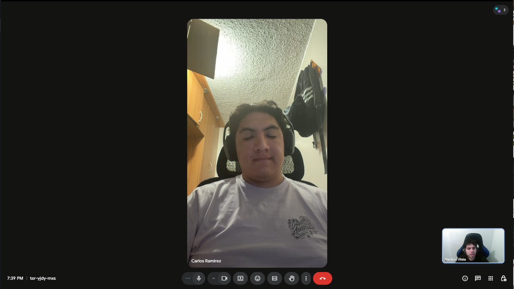 |
| **Resumen** | Carlos Ramírez, jefe de operaciones de logística en la empresa Transportes Valle S.A.C., de 26 años y con base en Lima, actualmente enfrenta dificultades en la gestión de sus operaciones debido a la falta de monitoreo en tiempo real durante el transporte; esta limitación le impide tener visibilidad inmediata sobre el estado de las unidades y la trazabilidad de los procesos logísticos, generando dependencia de reportes manuales o comunicación directa con los conductores, lo que incrementa el riesgo de retrasos, errores y una toma de decisiones tardía ante incidencias en ruta; su principal problema radica en la ausencia de un sistema que le permita supervisar de manera continua y centralizada las operaciones, lo cual afecta la eficiencia y el control operativo; por ello, considera que una solución ideal debería incluir monitoreo en tiempo real, geolocalización de vehículos, alertas automáticas ante desviaciones o incidentes, y acceso a información desde dispositivos móviles, ya que una herramienta como ColdTrack podría optimizar la gestión logística, mejorar la capacidad de respuesta y fortalecer el control de las operaciones. |


| **ENTREVISTA 3**        |                                                                    |
|-------------------------|--------------------------------------------------------------------|
| **Nombre entrevistado** | Gianmarco Palacios                                                 |
| **Edad**                | 33                                                                 |
| **Profesión**           | Encargado de area de abastecimiento                                |
| **Departamento**        | Arequipa                                                           |
| **Inicio del video**    | 9:20                                                              |
| **Fin del video**       | 15:10                                                              |
| **Link del video**      |[ Entrevista 3 ](https://upcedupe-my.sharepoint.com/:v:/g/personal/u202416908_upc_edu_pe/IQBXzX9sjMywR5oHRjJ8GAxeAdWlzKxOcQMLt52n6XrGGnc?e=VBNRJi&nav=eyJyZWZlcnJhbEluZm8iOnsicmVmZXJyYWxBcHAiOiJTdHJlYW1XZWJBcHAiLCJyZWZlcnJhbFZpZXciOiJTaGFyZURpYWxvZy1MaW5rIiwicmVmZXJyYWxBcHBQbGF0Zm9ybSI6IldlYiIsInJlZmVycmFsTW9kZSI6InZpZXcifX0%3D  )                                                              |
| **Foto entrevista**     |  |
| **Resumen** | Gianmarco Palacios, con 5 años de experiencia en logística, gestiona el monitoreo de temperatura y humedad mediante sensores y módulos integrados ("in-house"). Su principal problema es la pérdida de conectividad y la demora en el envío de información en ciertas rutas, lo que dificulta el control total de la cadena de frío. Aunque no ha tenido incidentes críticos recientemente, reporta pérdidas de productos 1 o 2 veces al mes debido a fallas en el sistema o envíos incorrectos. Está abierto a implementar nuevas soluciones tecnológicas siempre que sean eficaces y de baja complejidad de hardware. Considera indispensable que una plataforma ofrezca alertas en tiempo real multicanal (app y mensajería como WhatsApp) para permitir una reacción oportuna ante cualquier contingencia. |


#### **Segundo Segmento - Personal de Transporte:** <br>

| **ENTREVISTA 1** |                            |
|------------------|----------------------------|
| **Nombre entrevistado** | Edery Abanto |
| **Edad** | 30 |
| **Profesión** | personal de transporte |
| **Departamento** | Lima |
| **Inicio del video** | 15:13 |
| **Fin del video** | 20:40 |
| **Link del video** |[ Entrevista 4 ](https://upcedupe-my.sharepoint.com/:v:/g/personal/u202416908_upc_edu_pe/IQBXzX9sjMywR5oHRjJ8GAxeAdWlzKxOcQMLt52n6XrGGnc?e=VBNRJi&nav=eyJyZWZlcnJhbEluZm8iOnsicmVmZXJyYWxBcHAiOiJTdHJlYW1XZWJBcHAiLCJyZWZlcnJhbFZpZXciOiJTaGFyZURpYWxvZy1MaW5rIiwicmVmZXJyYWxBcHBQbGF0Zm9ybSI6IldlYiIsInJlZmVycmFsTW9kZSI6InZpZXcifX0%3D  )  |
| **Foto entrevista** |  |
| **Resumen** | Edri Abanto, conductor de transporte de carga refrigerada de 30 años con 5 años de experiencia, encargado de trasladar productos perecibles como lácteos, embutidos y carnes frescas que requieren una cadena de frío estricta, actualmente monitorea la temperatura mediante un sistema integrado en la cabina que le permite visualizar el estado general sin detenerse, pero que no proporciona datos precisos, ni alertas preventivas, ni información en tiempo real compartible con la central, lo que genera una dependencia de la observación manual y aumenta el riesgo de no detectar fallas a tiempo; su principal problema es la inestabilidad de la temperatura durante la ruta debido a factores externos como el clima o paradas prolongadas, así como la falta de alertas automáticas ante fallas progresivas del sistema de refrigeración, lo que ya ha ocasionado pérdidas de mercadería en el pasado por detección tardía de incidentes; además, enfrenta limitaciones de conectividad en ciertas zonas, lo que dificulta la comunicación y el monitoreo continuo; por ello, considera que la solución ideal debería ofrecer alertas sonoras progresivas, indicadores visuales claros mediante códigos de color, monitoreo en tiempo real y una interfaz intuitiva que no requiera interacción constante, creyendo que una aplicación como ColdTrack podría brindarle mayor seguridad operativa, facilitar la toma de decisiones durante la ruta y reducir significativamente el riesgo de pérdida de productos. |

| **ENTREVISTA 2**        |                                                                    |
|-------------------------|--------------------------------------------------------------------|
| **Nombre entrevistado** | Fernando Perez                                                     |
| **Edad**                | 51                                                                 |
| **Profesión**           | personal de transporte                                             |
| **Departamento**        | Lima                                                               |
| **Inicio del video**    | 20:45                                                              |
| **Fin del video**       | 22:53                                                              |
| **Link del video**      |[ Entrevista 5 ](https://upcedupe-my.sharepoint.com/:v:/g/personal/u202416908_upc_edu_pe/IQBXzX9sjMywR5oHRjJ8GAxeAdWlzKxOcQMLt52n6XrGGnc?e=VBNRJi&nav=eyJyZWZlcnJhbEluZm8iOnsicmVmZXJyYWxBcHAiOiJTdHJlYW1XZWJBcHAiLCJyZWZlcnJhbFZpZXciOiJTaGFyZURpYWxvZy1MaW5rIiwicmVmZXJyYWxBcHBQbGF0Zm9ybSI6IldlYiIsInJlZmVycmFsTW9kZSI6InZpZXcifX0%3D  )                                                                |
| **Foto entrevista**     |  |
| **Resumen** | El entrevistado Fernando Perez, un transportista de 50 años que trabaja en la ruta Lima, explica que controla la temperatura de la carga revisando el termómetro y haciendo paradas para verificar su estado. Usa principalmente Google Maps y WhatsApp para su trabajo. Señala que los principales problemas son los cambios bruscos de temperatura, el tráfico y la falta de información inmediata ante fallas.|

### 2.2.3. Analisis de entrevistas
**Análisis Segmento 1: Personal de Logística y Operaciones**

Las entrevistas realizadas al personal de logística y operaciones evidenciaron problemáticas recurrentes relacionadas con la falta de monitoreo en tiempo real y la limitada visibilidad durante el transporte de productos, especialmente en la cadena de frío. En primer lugar, se identificó que la mayoría de los entrevistados dependen de métodos manuales o sistemas poco integrados, como registros en Excel, comunicación directa con conductores o herramientas desarrolladas internamente, lo que incrementa el riesgo de errores humanos y retrasa la detección de incidentes.

Asimismo, se observó que uno de los principales problemas es la detección tardía de fallas en la temperatura o condiciones del transporte, lo que genera pérdidas de productos y dificulta la toma de decisiones oportunas. Además, factores como la pérdida de conectividad y la falta de trazabilidad continua afectan directamente la eficiencia operativa y el control logístico.

Por otro lado, los entrevistados coinciden en la necesidad de implementar soluciones tecnológicas que permitan un monitoreo en tiempo real, con funcionalidades como geolocalización de unidades, alertas automáticas ante variaciones o incidentes, acceso a información desde dispositivos móviles y almacenamiento de historial de datos. También destacan la importancia de contar con plataformas fáciles de usar y que no requieran una alta complejidad técnica.

**Análisis Segmento 2: Personal de Transporte**

Las entrevistas realizadas al personal de transporte revelaron diversas dificultades operativas relacionadas con el monitoreo de la carga durante el traslado, especialmente en lo que respecta al control de temperatura en productos perecibles. En primer lugar, se identificó que los conductores dependen en gran medida de la observación manual o de sistemas básicos instalados en la cabina, los cuales no brindan información precisa ni alertas preventivas, lo que limita la detección temprana de fallas.

Asimismo, se evidenció que problemas como la inestabilidad de la temperatura, los cambios bruscos por factores externos, el tráfico y las paradas prolongadas afectan directamente la calidad de los productos transportados. A esto se suma la falta de conectividad en ciertas zonas, lo que dificulta la comunicación continua con la central y reduce la capacidad de reacción ante incidentes.

Por otro lado, los entrevistados resaltaron la necesidad de contar con herramientas más avanzadas que incluyan monitoreo en tiempo real, alertas automáticas (visuales y sonoras), interfaces intuitivas y fácil acceso a la información sin generar distracciones durante la conducción. También valoran la posibilidad de integrar aplicaciones de uso cotidiano como sistemas de mensajería para recibir notificaciones.


## 2.3. Needfinding

### 2.3.1. User Personas

<h5 id="SegUser">Segmento #1: Personal de Logística y Operaciones </h5>
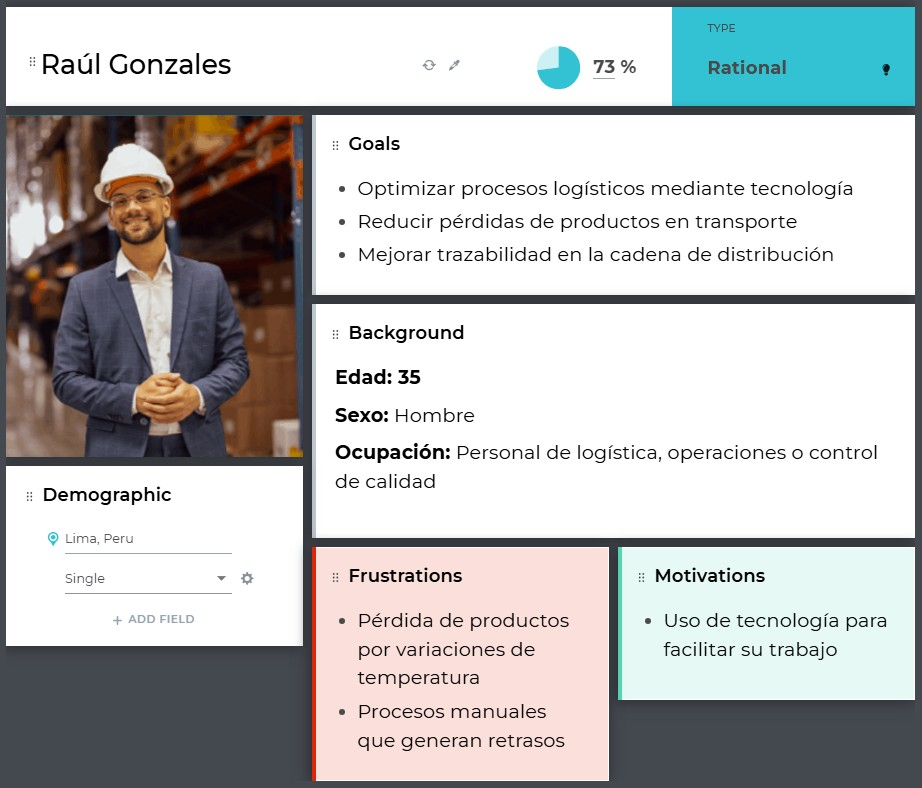

<h5 id="SegUser">Segmento #2: Personal de transporte </h5>
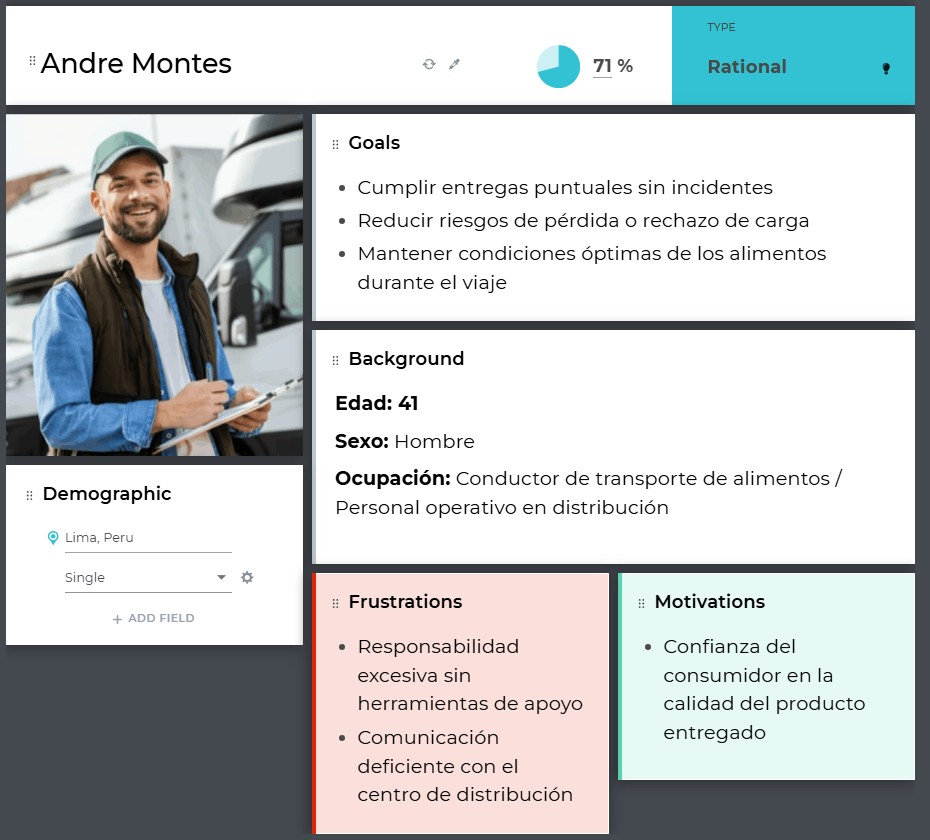


### 2.3.2. User Task Matrix
| **User Task** | **Personal de Logística y Operaciones** | **Personal de Transporte** |
|---------------|----------------------------|------------------------|
| Planificar rutas y tiempos | Frecuencia: Often          | Frecuencia: Rarely     |
| Monitorear condiciones de transporte | Frecuencia: Often          | Frecuencia: Often      |
| Analizar historial de envíos | Frecuencia: Often          | Frecuencia: Rarely     |
| Generar reportes de desempeño | Frecuencia: Often          | Frecuencia: Never      |
| Cumplir entregas puntuales | Frecuencia: Sometimes      | Frecuencia: Often      |
| Comunicar incidencias | Frecuencia: Often          | Frecuencia: Often      |
| Mantener condiciones óptimas de alimentos | Frecuencia: Sometimes      | Frecuencia: Often      |

### 2.3.3. User Journey Mapping
<h5 id="JourUser">Segmento #1: Personal de Logística y Operaciones </h5>


<h5 id="JourUser">Segmento #2: Personal de transporte </h5>
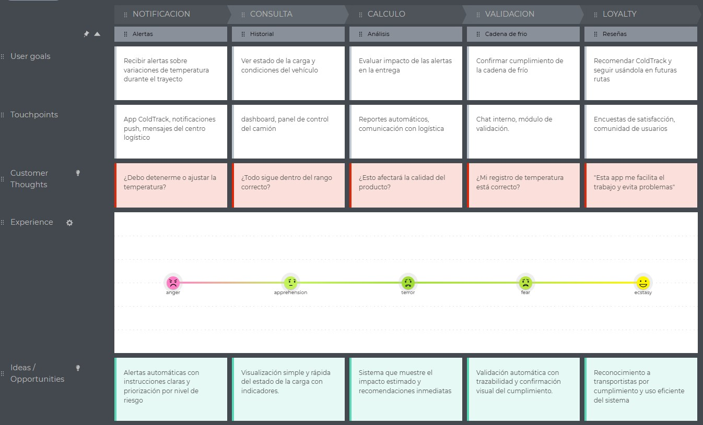

### 2.3.4. Empathy Mapping

**USER PERSONA: Raúl Gonzales**


**USER PERSONA: Andre Montes**
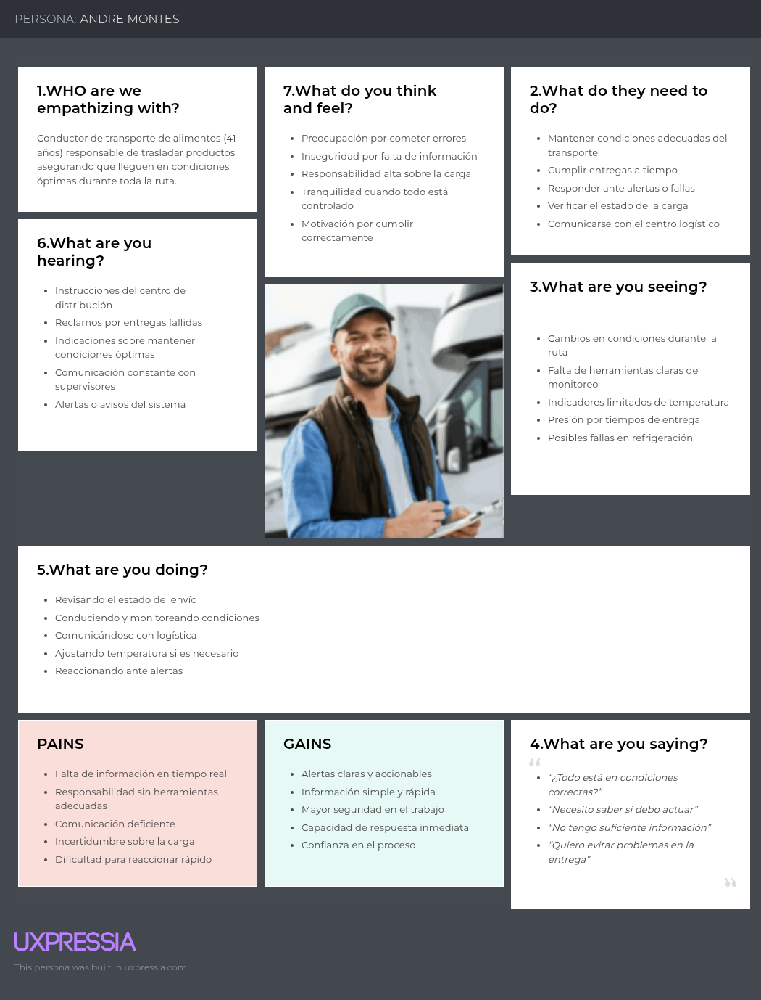

### 2.3.5. As-is Scenario Mapping

**USER PERSONA: Raúl Gonzales**
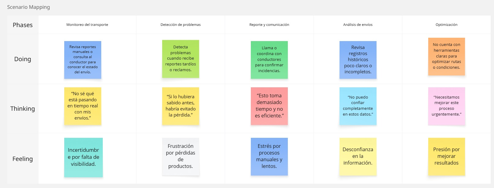

**USER PERSONA: Andre Montes**
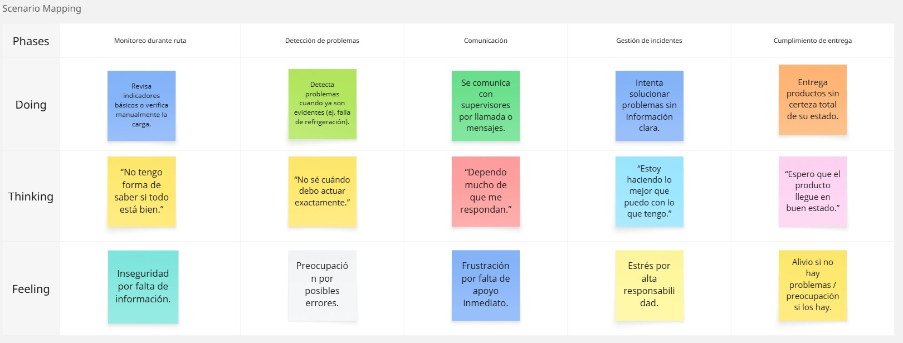

## 2.4. Ubiquitous Language

### Core Domain

- **Shipment (Envío):**  
  Conjunto de productos alimenticios que se trasladan desde un centro de distribución hasta un destino final.

- **Food Transportation (Transporte de Alimentos):**  
  Proceso logístico de traslado de alimentos asegurando que mantengan su calidad durante el trayecto.

- **Cold Chain (Cadena de Frío):**  
  Sistema de control que garantiza que los alimentos se mantengan dentro de condiciones de temperatura adecuadas durante todo el transporte.

- **Distribution Center (Centro de Distribución):**  
  Instalación donde se almacenan, preparan y despachan los productos para su envío.

- **Delivery Route (Ruta de Entrega):**  
  Recorrido que realiza la unidad de transporte desde el punto de origen hasta el destino.

---
### Monitoring and Conditions

- **Real-Time Monitoring (Monitoreo en Tiempo Real):**  
  Supervisión continua de las condiciones ambientales de un envío durante todo su trayecto.

- **Temperature (Temperatura):**  
  Nivel de calor dentro de la unidad de transporte que influye en la conservación de los alimentos.

- **Humidity (Humedad):**  
  Nivel de humedad presente en el ambiente del transporte que puede afectar la calidad del producto.

- **Environmental Conditions (Condiciones Ambientales):**  
  Conjunto de factores como temperatura y humedad que determinan el estado de los alimentos durante el transporte.

- **Optimal Range (Rango Óptimo):**  
  Valores adecuados de temperatura y humedad que garantizan la correcta conservación de los alimentos.

- **Condition Status (Estado de Condición):**  
  Situación actual del envío en función de sus condiciones ambientales (normal, advertencia o crítico).

---

### Alerts and Incidents

- **Alert (Alerta):**  
  Notificación generada cuando las condiciones del envío se alejan del rango óptimo.

- **Critical Alert (Alerta Crítica):**  
  Aviso que indica una situación grave que requiere acción inmediata para evitar pérdidas.

- **Warning Alert (Alerta de Advertencia):**  
  Notificación preventiva que indica un posible riesgo antes de llegar a una condición crítica.

- **Incident (Incidente):**  
  Evento que afecta o puede afectar negativamente el estado del envío.

- **Response Action (Acción de Respuesta):**  
  Medida tomada para corregir o mitigar un problema detectado durante el transporte.

---

### Traceability and Control

- **Traceability (Trazabilidad):**  
  Capacidad de rastrear y conocer el estado de un envío durante todo su recorrido.

- **Shipment History (Historial de Envío):**  
  Registro de las condiciones y eventos que ocurrieron durante el transporte de un envío.

- **Condition Check (Verificación de Condición):**  
  Revisión del estado ambiental del envío en un momento determinado.

---

### Stakeholders

- **Logistics Supervisor (Supervisor Logístico):**  
  Persona encargada de supervisar los envíos y asegurar que se cumplan las condiciones adecuadas.

- **Transport Personnel (Personal de Transporte):**  
  Persona responsable de trasladar físicamente los productos durante la ruta.

- **Quality Control Staff (Control de Calidad):**  
  Personal encargado de verificar que los productos cumplan con los estándares de calidad.

- **Distribution Company (Empresa Distribuidora):**  
  Organización responsable de gestionar el transporte de alimentos.

---

### Business Impact

- **Loss Event (Evento de Pérdida):**  
  Situación en la que los productos se deterioran debido a condiciones inadecuadas durante el transporte.

- **Loss Reduction (Reducción de Pérdidas):**  
  Disminución de productos dañados gracias a un mejor control de las condiciones.

- **Operational Efficiency (Eficiencia Operativa):**  
  Mejora en los procesos logísticos que permite optimizar tiempo, costos y recursos.

- **Food Safety (Seguridad Alimentaria):**  
  Garantía de que los alimentos llegan en condiciones aptas para el consumo.

- **Decision Making (Toma de Decisiones):**  
  Proceso de elegir acciones basadas en la información disponible sobre los envíos.

---

# Capitulo III: Requirements Specification

## 3.1. To-Be Scenario Mapping
1. Segmento 1: Personal de Logística y Operaciones.
 
 
2. Segmento 2: Personal de Transporte.
 
 
## 3.2. User Stories
En esta sección, estructuraremos nuestro proceso de desarrollo y aseguraremos de cubrir los os necesarios para satisfacer las necesidades del usuario.

A continuación, estableceremos las épicas, para luego detallarlas en historias de usuario. De este modo estableceremos los objetivos y funcionalidades.                                        

| Epic/Story ID | Título | Descripción | Criterios de Aceptación | Relacionado con (Epic ID) |
|---|---|---|---|---|
| EP-001 | Registro y Gestión de Usuarios | Como personal de logística y operaciones y personal de transporte<br>Quiero registrarme, iniciar sesión y gestionar mi cuenta de forma segura<br>Para acceder a las funcionalidades de ColdTrack según mi rol. | N/A | N/A |
| EP-002 | Gestión de Envíos | Como personal de logística y operaciones<br>Quiero crear, visualizar y gestionar envíos<br>Para mantener el control del transporte de alimentos desde el origen hasta el destino. | N/A | N/A |
| EP-003 | Monitoreo en Tiempo Real | Como personal de logística y operaciones y personal de transporte<br>Quiero visualizar en tiempo real la temperatura y humedad de los envíos mediante sensores<br>Para asegurar condiciones óptimas durante el transporte. | N/A | N/A |
| EP-004 | Sistema de Alertas | Como personal de logística y operaciones y personal de transporte<br>Quiero recibir alertas automáticas ante condiciones críticas de temperatura o humedad<br>Para tomar decisiones rápidas y evitar pérdidas de productos. | N/A | N/A |
| EP-005 | Historial y Reportes | Como personal de logística y operaciones y personal de transporte<br>Quiero acceder al historial de envíos y generar reportes<br>Para analizar el desempeño logístico y mejorar la trazabilidad. | N/A | N/A |
| EP-006 | Landing Page y Comunicación | Como visitante<br>Quiero acceder a información de la aplicación, conocer sus beneficios, contactar al equipo y visualizar testimonios<br>Para evaluar el uso de ColdTrack y resolver dudas. | N/A | N/A |
| US-001 | Registro de usuario | Como personal de logística y operaciones y personal de transporte<br>Quiero registrarme seleccionando mi rol<br>Para acceder a las funcionalidades correspondientes de ColdTrack. | Escenario 1: Registro como personal de logística y operaciones<br><br>Dado que el personal de logística y operaciones accede al formulario de registro<br>Cuando completa todos los datos correctamente y selecciona el rol “Logística”<br>Entonces el sistema registra la cuenta exitosamente<br>Y permite acceder a funcionalidades de supervisión.<br><br>Escenario 2: Registro como personal de transporte<br><br>Dado que el personal de transporte accede al formulario de registro<br>Cuando completa todos los datos correctamente y selecciona el rol “Transporte”<br>Entonces el sistema registra la cuenta exitosamente<br>Y permite acceder a funcionalidades en ruta. | EP-001 |
| US-002 | Inicio de sesión | Como personal de logística y operaciones y personal de transporte<br>Quiero iniciar sesión en el sistema<br>Para acceder de manera segura a mi cuenta y funcionalidades. | Escenario 1: Inicio exitoso<br><br>Dado que el personal de logística y operaciones o el personal de transporte se encuentra registrado en el sistema<br>Cuando ingresa sus credenciales correctamente<br>Entonces el sistema valida la información<br>Y permite el acceso al panel principal.<br><br>Escenario 2: Credenciales incorrectas<br><br>Dado que el personal de logística y operaciones o el personal de transporte ingresa datos inválidos<br>Cuando intenta iniciar sesión<br>Entonces el sistema muestra un mensaje de error<br>Y bloquea el acceso. | EP-001 |
| US-003 | Recuperar contraseña | Como personal de logística y operaciones y personal de transporte<br>Quiero recuperar mi contraseña<br>Para restablecer el acceso a mi cuenta en caso de olvido. | Escenario 1: Recuperación exitosa<br><br>Dado que el personal de logística y operaciones o el personal de transporte olvidó su contraseña<br>Cuando ingresa el correo registrado<br>Entonces el sistema envía un enlace de recuperación<br>Y permite restablecer la contraseña.<br><br>Escenario 2: Correo inválido<br><br>Dado que el correo ingresado no está registrado<br>Cuando se solicita la recuperación de contraseña<br>Entonces el sistema muestra un mensaje de error. | EP-001 |
| TS-001 | Crear usuario | Como sistema<br>Quiero registrar usuarios en la base de datos<br>Para permitir el acceso seguro a ColdTrack. | Escenario 1: Creación exitosa<br><br>Dado que el sistema recibe datos válidos de registro<br>Cuando procesa la solicitud<br>Entonces guarda la información del usuario en la base de datos<br>Y retorna una respuesta exitosa.<br><br>Escenario 2: Datos inválidos<br><br>Dado que faltan campos obligatorios en la solicitud<br>Cuando el sistema procesa la información<br>Entonces rechaza la operación<br>Y retorna un error. | EP-001 |
| TS-002 | Autenticación | Como sistema<br>Quiero validar las credenciales de acceso<br>Para garantizar la seguridad de los usuarios registrados. | Escenario 1: Autenticación válida<br><br>Dado que las credenciales coinciden con un usuario registrado<br>Cuando se realiza la validación<br>Entonces el sistema genera un token de acceso válido.<br><br>Escenario 2: Autenticación inválida<br><br>Dado que las credenciales no coinciden<br>Cuando se intenta autenticar<br>Entonces el sistema retorna un error de acceso. | EP-001 |
| US-004 | Crear envío | Como personal de logística y operaciones<br>Quiero registrar envíos<br>Para controlar el transporte de productos alimenticios. | Escenario 1: Registro exitoso<br><br>Dado que el personal de logística y operaciones completa todos los campos requeridos<br>Cuando registra el envío<br>Entonces el sistema guarda la información correctamente<br>Y el envío aparece en la lista de envíos activos.<br><br>Escenario 2: Datos incompletos<br><br>Dado que el personal de logística y operaciones deja campos obligatorios vacíos<br>Cuando intenta registrar el envío<br>Entonces el sistema muestra errores de validación<br>Y no permite el registro. | EP-002 |
| US-005 | Ver envíos activos | Como personal de logística y operaciones y personal de transporte<br>Quiero visualizar los envíos activos<br>Para monitorear el estado actual del transporte. | Escenario 1: Lista disponible<br><br>Dado que el personal de logística y operaciones o el personal de transporte accede a la sección de envíos<br>Y existen envíos registrados<br>Cuando visualiza la información<br>Entonces el sistema muestra la lista completa de envíos activos.<br><br>Escenario 2: Lista vacía<br><br>Dado que el personal de logística y operaciones o el personal de transporte accede a la sección de envíos<br>Y no existen envíos registrados<br>Cuando visualiza la información<br>Entonces el sistema muestra un mensaje indicando que no hay registros. | EP-002 |
| US-006 | Ver detalle del envío | Como personal de logística y operaciones y personal de transporte<br>Quiero visualizar el detalle de un envío<br>Para revisar temperatura, humedad y estado del transporte. | Escenario 1: Visualización correcta<br><br>Dado que el personal de logística y operaciones o el personal de transporte selecciona un envío<br>Cuando accede al detalle<br>Entonces el sistema muestra temperatura, humedad y estado del envío.<br><br>Escenario 2: Error de carga<br><br>Dado que ocurre un fallo en el sistema<br>Cuando se intenta visualizar el detalle del envío<br>Entonces el sistema muestra un mensaje de error. | EP-002 |
| TS-003 | CRUD envíos | Como sistema<br>Quiero gestionar operaciones de envíos<br>Para mantener actualizada la información logística. | Escenario 1: Consulta exitosa<br><br>Dado que existen envíos registrados en la base de datos<br>Cuando el sistema realiza una consulta<br>Entonces retorna correctamente la lista de envíos.<br><br>Escenario 2: Error interno<br><br>Dado que ocurre un fallo en el servidor<br>Cuando el sistema realiza la consulta<br>Entonces retorna un error. | EP-002 |
| US-007 | Asignar sensor a envío | Como personal de logística y operaciones<br>Quiero vincular sensores a los envíos<br>Para monitorear las condiciones del transporte en tiempo real. | Escenario 1: Asignación correcta<br><br>Dado que el personal de logística y operaciones selecciona un sensor válido<br>Cuando lo vincula a un envío<br>Entonces el sistema asocia correctamente el sensor.<br><br>Escenario 2: Sensor inválido<br><br>Dado que el sensor no existe o no está disponible<br>Cuando el personal de logística y operaciones intenta vincularlo<br>Entonces el sistema muestra un error. | EP-002 |
| US-008 | Finalizar envío | Como personal de logística y operaciones<br>Quiero finalizar un envío<br>Para registrar el cierre del transporte y enviarlo al historial. | Escenario 1: Finalización exitosa<br><br>Dado que el envío ha concluido correctamente<br>Cuando el personal de logística y operaciones lo finaliza<br>Entonces el sistema cambia el estado a “Completado”<br>Y envía el registro al historial.<br><br>Escenario 2: Error en cierre<br><br>Dado que ocurre un fallo durante el proceso<br>Cuando el personal de logística y operaciones intenta finalizar el envío<br>Entonces el sistema no guarda los cambios. | EP-002 |
| TS-004 | Asignación sensor | Como sistema<br>Quiero vincular sensores válidos a los envíos<br>Para permitir el monitoreo continuo de las condiciones del transporte. | Escenario 1: Asignación válida<br><br>Dado que el sensor existe en el sistema<br>Cuando se realiza la vinculación con un envío<br>Entonces el sistema asocia correctamente el sensor.<br><br>Escenario 2: Error<br><br>Dado que el sensor no es válido<br>Cuando el sistema intenta asignarlo<br>Entonces retorna un error. | EP-002 |
| US-009 | Ver temperatura en tiempo real | Como personal de logística y operaciones y personal de transporte<br>Quiero visualizar la temperatura en tiempo real<br>Para asegurar que los productos se mantengan en condiciones óptimas. | Escenario 1: Datos en tiempo real<br><br>Dado que el sensor se encuentra activo<br>Cuando el personal de logística y operaciones o el personal de transporte accede al monitoreo<br>Entonces el sistema muestra la temperatura actualizada.<br><br>Escenario 2: Sin conexión<br><br>Dado que el sensor deja de enviar datos<br>Cuando se accede al monitoreo<br>Entonces el sistema muestra una advertencia de conexión. | EP-003 |
| US-010 | Ver humedad en tiempo real | Como personal de logística y operaciones y personal de transporte<br>Quiero visualizar la humedad del envío<br>Para verificar las condiciones adecuadas de transporte. | Escenario 1: Visualización correcta<br><br>Dado que el sensor funciona correctamente<br>Cuando el personal de logística y operaciones o el personal de transporte accede al monitoreo<br>Entonces el sistema muestra el porcentaje de humedad actualizado.<br><br>Escenario 2: Error de sensor<br><br>Dado que el sensor no envía información<br>Cuando se accede al monitoreo<br>Entonces el sistema muestra una alerta de error. | EP-003 |
| US-011 | Estado del envío | Como personal de logística y operaciones y personal de transporte<br>Quiero visualizar el estado general del envío<br>Para identificar posibles riesgos durante el transporte. | Escenario 1: Estado normal<br><br>Dado que las condiciones del envío están dentro del rango permitido<br>Cuando el sistema analiza los datos<br>Entonces muestra un estado óptimo.<br><br>Escenario 2: Estado crítico<br><br>Dado que los valores superan los límites establecidos<br>Cuando el sistema evalúa la información<br>Entonces muestra un estado de alerta. | EP-003 |
| US-012 | Visualizar gráficos históricos | Como personal de logística y operaciones<br>Quiero visualizar gráficos históricos de monitoreo<br>Para analizar el comportamiento de temperatura y humedad. | Escenario 1: Datos disponibles<br><br>Dado que existen registros históricos de monitoreo<br>Cuando el personal de logística y operaciones accede a los gráficos<br>Entonces el sistema muestra la información visual.<br><br>Escenario 2: Sin datos<br><br>Dado que no existen registros históricos<br>Cuando se accede a la sección de gráficos<br>Entonces el sistema muestra un mensaje informativo. | EP-003 |
| TS-005 | Integración IoT | Como sistema<br>Quiero recibir datos de sensores IoT<br>Para almacenar y procesar información de monitoreo. | Escenario 1: Recepción válida<br><br>Dado que el sensor IoT envía información correctamente<br>Cuando el sistema recibe los datos<br>Entonces los almacena en la base de datos.<br><br>Escenario 2: Datos inválidos<br><br>Dado que los datos recibidos están corruptos<br>Cuando el sistema procesa la información<br>Entonces descarta los datos inválidos. | EP-003 |
| TS-006 | Tiempo real | Como sistema<br>Quiero utilizar WebSockets para actualizar información en tiempo real<br>Para mantener sincronizados los datos de monitoreo. | Escenario 1: Conexión activa<br><br>Dado que existe una conexión WebSocket establecida<br>Cuando llegan nuevos datos de monitoreo<br>Entonces el sistema actualiza la información en tiempo real.<br><br>Escenario 2: Desconexión<br><br>Dado que la conexión se pierde<br>Cuando el sistema detecta la desconexión<br>Entonces intenta reconectarse automáticamente. | EP-003 |
| US-013 | Alertas de temperatura | Como personal de logística y operaciones y personal de transporte<br>Quiero recibir alertas automáticas<br>Para actuar rápidamente ante cambios críticos de temperatura. | Escenario 1: Alerta generada<br><br>Dado que el sistema detecta que la temperatura supera los límites establecidos<br>Cuando analiza los datos recibidos por los sensores<br>Entonces genera una alerta<br>Y notifica al personal de logística y operaciones y al personal de transporte.<br><br>Escenario 2: Condición normal<br><br>Dado que las condiciones del envío se mantienen dentro del rango permitido<br>Cuando el sistema monitorea los sensores<br>Entonces no se genera ninguna alerta. | EP-004 |
| US-014 | Notificación al conductor | Como personal de transporte<br>Quiero recibir notificaciones inmediatas<br>Para responder rápidamente ante incidencias durante la ruta. | Escenario 1: Recepción correcta<br><br>Dado que se genera una alerta crítica<br>Cuando el sistema envía la notificación<br>Entonces el personal de transporte la recibe en su dispositivo.<br><br>Escenario 2: Sin conexión<br><br>Dado que el dispositivo del personal de transporte no tiene conexión<br>Cuando se genera una alerta<br>Entonces el sistema almacena la notificación y la envía posteriormente. | EP-004 |
| US-015 |  Ver historial de alertas | Como personal de logística y operaciones y personal de transporte<br>Quiero visualizar alertas pasadas<br>Para revisar incidencias registradas anteriormente. | Escenario 1: Registros disponibles<br><br>Dado que existen alertas registradas<br>Cuando el personal de logística y operaciones o el personal de transporte accede al historial<br>Entonces el sistema muestra la lista de alertas.<br><br>Escenario 2: Sin registros<br><br>Dado que no existen alertas registradas<br>Cuando se accede al historial<br>Entonces el sistema muestra un mensaje vacío. | EP-004 |
| TS-007 | Motor alertas | Como sistema<br>Quiero detectar anomalías automáticamente<br>Para generar alertas cuando los valores estén fuera de rango. | Escenario 1: Detección de error<br><br>Dado que un valor se encuentra fuera del rango permitido<br>Cuando el sistema analiza los datos de monitoreo<br>Entonces genera una alerta automáticamente.<br><br>Escenario 2: Sin anomalías<br><br>Dado que los valores son correctos<br>Cuando el sistema analiza la información<br>Entonces no ejecuta ninguna acción. | EP-004 |
| TS-008 | Notificaciones | Como sistema<br>Quiero enviar notificaciones automáticas<br>Para informar incidencias a los usuarios correspondientes. | Escenario 1: Envío exitoso<br><br>Dado que existe una alerta generada<br>Cuando el sistema envía la notificación<br>Entonces el destinatario la recibe correctamente.<br><br>Escenario 2: Error de envío<br><br>Dado que ocurre un fallo en el envío<br>Cuando el sistema intenta enviar la notificación<br>Entonces reintenta automáticamente el proceso. | EP-004 |
| US-016 | Ver historial de envíos | Como personal de logística y operaciones y personal de transporte<br>Quiero revisar el historial de envíos<br>Para consultar información de transportes anteriores. | Escenario 1: Historial disponible<br><br>Dado que existen registros históricos de envíos<br>Cuando el personal de logística y operaciones o el personal de transporte accede al historial<br>Entonces el sistema muestra la lista de envíos.<br><br>Escenario 2: Sin historial<br><br>Dado que no existen registros históricos<br>Cuando se accede al historial<br>Entonces el sistema muestra un mensaje informativo. | EP-005 |
| US-017 | Descargar reporte | Como personal de logística y operaciones<br>Quiero exportar reportes de envíos<br>Para analizar información logística y compartir resultados. | Escenario 1: Descarga exitosa<br><br>Dado que existen datos disponibles en el sistema<br>Cuando el personal de logística y operaciones solicita un reporte<br>Entonces el sistema genera un archivo descargable correctamente.<br><br>Escenario 2: Error<br><br>Dado que ocurre un fallo durante la generación del reporte<br>Cuando se solicita la descarga<br>Entonces el sistema muestra un mensaje de error. | EP-005 |
| US-018 | Filtrar historial | Como personal de logística y operaciones y personal de transporte<br>Quiero filtrar registros del historial<br>Para encontrar información específica rápidamente. | Escenario 1: Filtro aplicado<br><br>Dado que el personal de logística y operaciones o el personal de transporte selecciona criterios de búsqueda<br>Cuando aplica el filtro<br>Entonces el sistema muestra resultados filtrados.<br><br>Escenario 2: Sin coincidencias<br><br>Dado que no existen registros que coincidan con los filtros<br>Cuando se aplica la búsqueda<br>Entonces el sistema muestra un mensaje informativo. | EP-005 |
| TS-009 | Guardar historial | Como sistema<br>Quiero persistir datos históricos<br>Para almacenar información de envíos finalizados. | Escenario 1: Guardado correcto<br><br>Dado que existen datos válidos de un envío finalizado<br>Cuando el sistema almacena la información<br>Entonces guarda correctamente el historial.<br><br>Escenario 2: Error<br><br>Dado que ocurre un fallo durante el almacenamiento<br>Cuando el sistema intenta guardar la información<br>Entonces registra el error correspondiente. | EP-005 |
| TS-010 | Exportar PDF | Como sistema<br>Quiero generar reportes en PDF<br>Para permitir la descarga y análisis de información logística. | Escenario 1: Generación exitosa<br><br>Dado que existen datos disponibles para exportar<br>Cuando el sistema genera el reporte PDF<br>Entonces crea correctamente el archivo descargable.<br><br>Escenario 2: Error<br><br>Dado que ocurre un fallo en la generación del documento<br>Cuando el sistema intenta exportar el PDF<br>Entonces muestra un mensaje de error. | EP-005 |
| US-019 | Ver información de la app (Landing) | Como visitante<br>Quiero conocer información sobre ColdTrack<br>Para entender el propósito y beneficios de la aplicación. | Escenario 1: Información visible<br><br>Dado que el visitante accede a la landing page<br>Cuando navega por la plataforma<br>Entonces visualiza información clara sobre ColdTrack.<br><br>Escenario 2: Comprensión<br><br>Dado que el visitante revisa el contenido de la página<br>Cuando analiza la información mostrada<br>Entonces comprende los beneficios del sistema. | EP-006 |
| US-020 | Ver testimonios | Como visitante<br>Quiero visualizar testimonios de usuarios<br>Para conocer experiencias relacionadas con ColdTrack. | Escenario 1: Visualización<br><br>Dado que existen testimonios registrados<br>Cuando el visitante accede a la sección correspondiente<br>Entonces el sistema muestra los testimonios disponibles.<br><br>Escenario 2: Navegación<br><br>Dado que existen múltiples testimonios<br>Cuando el visitante interactúa con la sección<br>Entonces puede desplazarse entre ellos correctamente. | EP-006 |
| US-021 | Formulario de contacto | Como visitante<br>Quiero comunicarme con el equipo de ColdTrack<br>Para resolver dudas o solicitar información adicional. | Escenario 1: Envío correcto<br><br>Dado que el visitante completa el formulario de contacto<br>Cuando envía el mensaje<br>Entonces el sistema registra correctamente la información.<br><br>Escenario 2: Error<br><br>Dado que faltan campos obligatorios en el formulario<br>Cuando el visitante intenta enviarlo<br>Entonces el sistema muestra errores de validación. | EP-006 |
| US-022 | Ver equipo de desarrollo | Como visitante<br>Quiero visualizar a los integrantes del equipo<br>Para generar confianza y credibilidad en el proyecto. | Escenario 1: Visualización<br><br>Dado que el visitante accede a la sección del equipo<br>Cuando la página carga correctamente<br>Entonces el sistema muestra a los integrantes del proyecto.<br><br>Escenario 2: Error<br><br>Dado que ocurre un fallo durante la carga<br>Cuando el visitante accede a la sección<br>Entonces el sistema muestra un mensaje alternativo. | EP-006 |
| US-023 | Ver funcionalidades del sistema | Como visitante<br>Quiero conocer las funcionalidades principales del sistema<br>Para comprender el valor de ColdTrack. | Escenario 1: Visualización<br><br>Dado que el visitante accede a la sección de funcionalidades<br>Cuando navega por la página<br>Entonces el sistema muestra las principales características de ColdTrack.<br><br>Escenario 2: Comprensión<br><br>Dado que el visitante revisa la información disponible<br>Cuando analiza las funcionalidades mostradas<br>Entonces comprende el valor de la aplicación. | EP-006 |
| TS-011 | Formulario contacto | Como sistema<br>Quiero almacenar mensajes enviados desde el formulario de contacto<br>Para gestionar consultas de usuarios interesados. | Escenario 1: Guardado correcto<br><br>Dado que el sistema recibe datos válidos desde el formulario<br>Cuando procesa la solicitud<br>Entonces almacena correctamente el mensaje.<br><br>Escenario 2: Error<br><br>Dado que los datos enviados son inválidos<br>Cuando el sistema procesa la información<br>Entonces rechaza la solicitud. | EP-006 |
| TS-012 | Testimonios API | Como sistema<br>Quiero listar testimonios mediante una API<br>Para mostrar experiencias de usuarios en la landing page. | Escenario 1: Datos disponibles<br><br>Dado que existen testimonios registrados en la base de datos<br>Cuando el sistema consulta la API<br>Entonces retorna correctamente la lista de testimonios.<br><br>Escenario 2: Sin datos<br><br>Dado que no existen testimonios registrados<br>Cuando el sistema consulta la API<br>Entonces retorna una lista vacía. | EP-006 |

## 3.3. Impact Mapping


## 3.4. Product Backlog
| Prioridad | User Story ID | Título HU | Story Points |
|----------|--------------|----------|-------------|
| 1 | US-001 | Registro de usuario | 5 |
| 2 | US-002 | Inicio de sesión | 5 |
| 3 | US-004 | Crear envío | 8 |
| 4 | US-007 | Asignar sensor a envío | 8 |
| 5 | US-009 | Ver temperatura en tiempo real | 8 |
| 6 | US-010 | Ver humedad en tiempo real | 8 |
| 7 | US-013 | Alertas de temperatura | 8 |
| 8 | US-014 | Notificación al conductor | 5 |
| 9 | US-006 | Ver detalle del envío | 5 |
| 10 | US-011 | Estado del envío | 5 |
| 11 | US-005 | Ver envíos activos | 5 |
| 12 | US-008 | Finalizar envío | 5 |
| 13 | US-012 | Visualizar gráficos históricos | 8 |
| 14 | US-015 | Ver historial de alertas | 5 |
| 15 | US-016 | Ver historial de envíos | 5 |
| 16 | US-018 | Filtrar historial | 5 |
| 17 | US-003 | Recuperar contraseña | 3 |
| 18 | US-017 | Descargar reporte | 8 |
| 19 | US-019 | Ver información de la app (Landing) | 3 |
| 20 | US-020 | Ver testimonios | 3 |
| 21 | US-021 | Formulario de contacto | 3 |
| 22 | US-022 | Ver equipo de desarrollo | 2 |
| 23 | US-023 | Ver funcionalidades del sistema | 3 |

# Capitulo IV: Product Design

## 4.1. Style Guidelines

En esta sección, detallamos los lineamientos de diseño, estilo y apariencia visual de la plataforma ColdTrack. El objetivo es garantizar una interfaz intuitiva que permita a los supervisores logísticos y conductores monitorear datos críticos de temperatura sin distracciones. Para ello, hemos optado por una estética moderna y funcional, utilizando elementos visuales claros que facilitan la toma de decisiones rápida.

### 4.1.1. General Style Guidelines

**Branding:** El logotipo de **ColdTrack** ha sido diseñado para reflejar tecnología y seguridad en la cadena de frío. Los colores seleccionados transmiten profesionalismo y confianza, reforzando la identidad de una solución robusta.

<p align="center">
  
</p>

**Tono de Comunicación:**
- **Analítico y Profesional:** Para brindar seguridad sobre la precisión de los datos de los sensores.
- **Directo y Preventivo:** Uso de alertas claras para facilitar la reacción inmediata ante cambios en la temperatura.
- **Eficiente:** Enfocado en la reducción de mermas y la optimización de la logística.

**Tipografía:** Para garantizar un rendimiento óptimo y una apariencia integrada en cualquier sistema operativo, ColdTrack utiliza una **pila de fuentes nativas (System Fonts)**. Esto permite que la aplicación se sienta familiar y sea altamente legible tanto en dispositivos móviles como en escritorio, utilizando fuentes como -apple-system, BlinkMacSystemFont (macOS/iOS), Segoe UI (Windows) y Roboto (Android).

**Colores de Marca:**
Basándonos en la implementación actual de la Landing Page, la paleta se define por los siguientes códigos hexadecimales:
- **Primario (#0052CC):** Azul corporativo que representa confianza y frío controlado.
- **Secundario (#F5F5F5):** Gris claro para fondos de secciones y tarjetas.
- **Oscuro (#0F1117):** Color para el footer y elementos de alto contraste.
- **Éxito (#10B981):** Verde para estados "Normales" de los envíos.
- **Advertencia (#F59E0B):** Ámbar para alertas preventivas en el dashboard.

**Paleta de Colores:**

| Color | Código Hex | Uso Principal |
| :--- | :--- | :--- |
| Primario | #0052CC | Identidad de marca, botones CTA y navegación. |
| Secundario | #F5F5F5 | Fondos de secciones y tarjetas de características. |
| Oscuro | #0F1117 | Fondo de Footer y elementos de contraste. |
| Éxito | #10B981 | Indicadores de estado óptimo (Badge Normal). |
| Advertencia | #F59E0B | Alertas de temperatura (Badge Advertencia). |

**Espaciado y Distribución:** Se utiliza un diseño basado en contenedores (container) y una rejilla responsiva (shipments-grid). El espaciado generoso entre las tarjetas de "Envío" en el preview del dashboard asegura que el usuario pueda identificar rápidamente qué unidad requiere atención.

### 4.1.2. Web Style Guidelines

La plataforma **ColdTrack** está diseñada bajo un enfoque **Responsive**, asegurando que la visualización de los datos sea fluida en computadoras de escritorio, tablets y smartphones.

**Componentes Implementados:**

**Cabecera (Header):**
- **Navegación Fija (Sticky):** Permite acceso rápido a Características, Cómo Funciona y Beneficios.
- **Identidad:** Logo de ColdTrack y nombre de marca siempre visibles a la izquierda.
- **Acceso:** Botón de "Iniciar Sesión" destacado con fondo azul a la derecha.

**Hero Section:**
- **Propuesta de Valor:** Título principal centrado ("Monitoreo en Tiempo Real...") y descripción del impacto del producto en la calidad.
- **Dashboard Preview:** Representación visual con tarjetas individuales para envíos activos, mostrando métricas de temperatura en grados Celsius y porcentaje de humedad.

**Secciones Operativas:**
- **Características:** Tres pilares con iconos minimalistas: Monitoreo en Tiempo Real, Alertas Automáticas e Historial Detallado.
- **Cómo Funciona:** Proceso numerado del 1 al 4 (Instalación, Transmisión, Monitoreo y Reportes).
- **Beneficios:** Sección con fondo azul sólido y tarjetas translúcidas que destacan la Eficiencia, Reducción de Riesgos y Decisiones Rápidas.

---

## 4.2. Information Architecture

### 4.2.1. Organization Systems

Hemos implementado una **Estructura Jerárquica (Tree Structure)** basada en la navegación por secciones:

* **Estructura de la Landing Page:**
  * **Inicio (Hero):** Captación y visión general del dashboard.
  * **Características:** Detalle técnico de las capacidades del sistema.
  * **Proceso (Cómo Funciona):** Guía paso a paso de la implementación IoT.
  * **Valor (Beneficios):** Impacto directo en la operación logística.

* **Estructura del Dashboard:**
  * **Raíz:** Monitoreo en Vivo (Resumen de envíos activos).
  * **Nivel 1:** Tarjetas de Envío (ID, Estado con Badges de color, Temperatura, Humedad).

### 4.2.2. Labeling Systems

El sistema de etiquetado utiliza términos claros para evitar ambigüedades operativas:
- **"Dashboard - Monitoreo en Vivo":** Define el área de trabajo en tiempo real.
- **"Normal" / "Advertencia":** Etiquetas de estado (Badges) con colores verde y naranja respectivamente.
- **"Envío #XXXX":** Identificador único para trazabilidad de carga.

### 4.2.3. SEO Tags and Meta Tags

- **Title:** ColdTrack - Monitoreo en Tiempo Real para el Transporte de Alimentos.
- **Description:** Asegura la calidad de tus productos con control de temperatura y humedad en cada etapa del transporte.
- **Keywords:** monitoreo de alimentos, cadena de frío, sensores IoT, transporte refrigerado.
- **Meta Tags:** Viewport configurado para escalabilidad (width=device-width, initial-scale=1.0).

### 4.2.4. Searching Systems

- **Navegación Anclada:** Enlaces internos en el Header (#caracteristicas, #como-funciona, #beneficios) que permiten un desplazamiento suave (smooth scroll) hacia las secciones correspondientes.

### 4.2.5. Navigation Systems

- **Sticky Navbar:** Menú superior fijo que mantiene el acceso al login y a las secciones durante todo el recorrido.
- **Call to Action (CTA):** Botones principales ("Comenzar Ahora") con alta visibilidad para guiar la conversión del usuario.

---

## 4.3. Landing Page UI Design

### 4.3.1. Landing Page Wireframe

<p align="center">
  
</p>

<p align="center">
  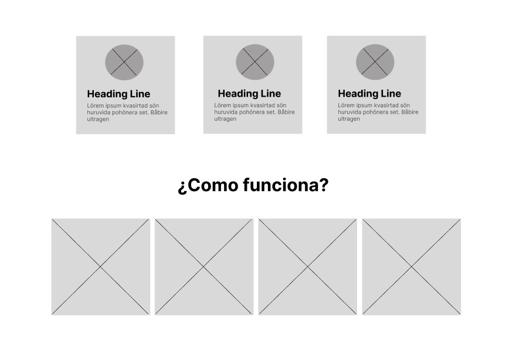
</p>

<p align="center">
  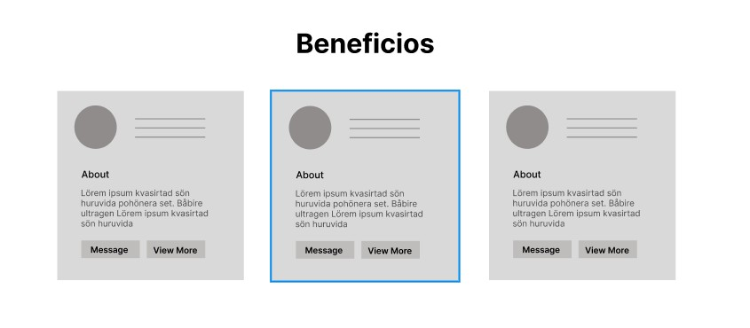
</p>


### 4.3.2. Landing Page Mock-up

**Sección Hero y Detalles del Dashboard:**
Visualización principal de la propuesta de valor y estados de monitoreo activos.

<p align="center">
  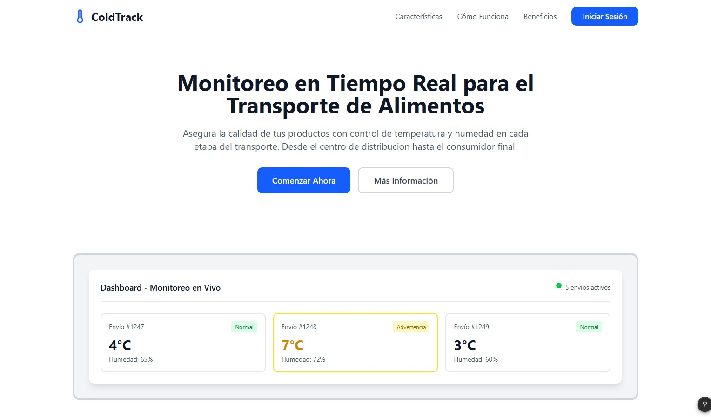
</p>

**Características y Funcionamiento:**
Explicación de las capacidades técnicas y el flujo de implementación del sistema.

<p align="center">
  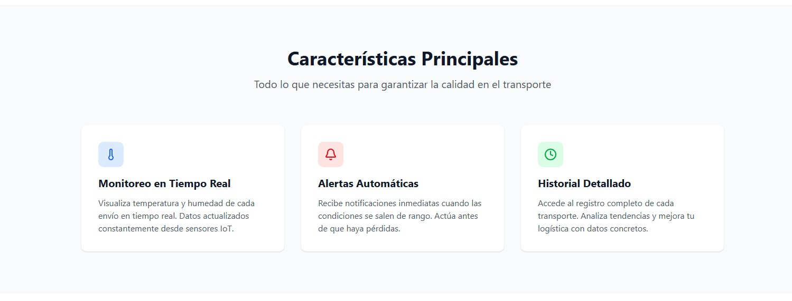
</p>

**Beneficios y Footer:**
Sección de impacto operativo y enlaces de navegación secundaria.

<p align="center">
  
</p>

<p align="center">
  
</p>

## 4.4. Web Applications UX/UI Design

### 4.4.1. Web Applications Wireframes

<p align="center">
  
</p>

### 4.4.2. Web Applications Wireflow Diagrams

<p align="center">
  
</p>

### 4.4.3. Web Applications Mock-ups

<p align="center">
  
</p>

### 4.4.4. Web Applications User Flow Diagrams

<p align="center">
  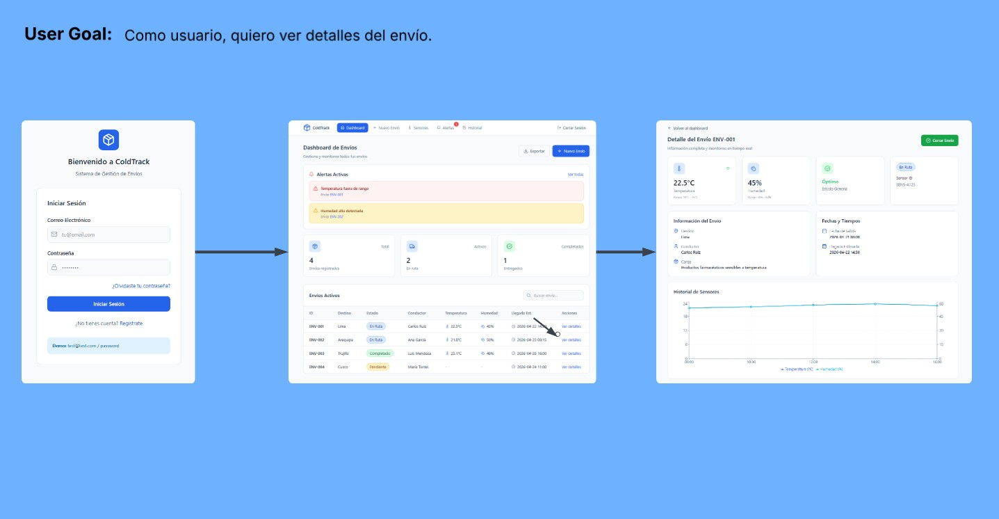
</p>

<p align="center">
  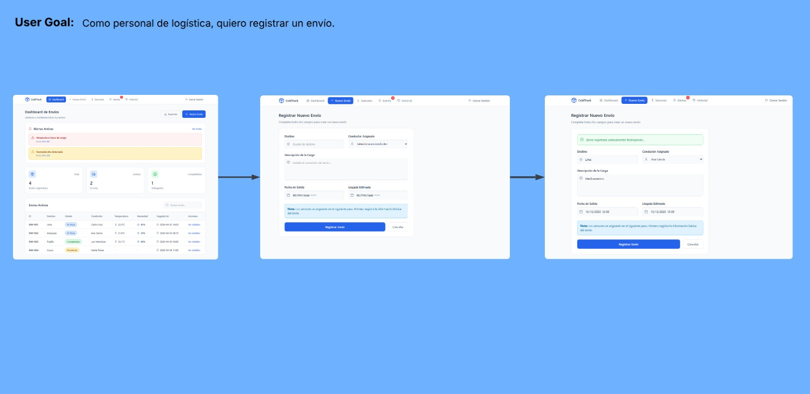
</p>

<p align="center">
  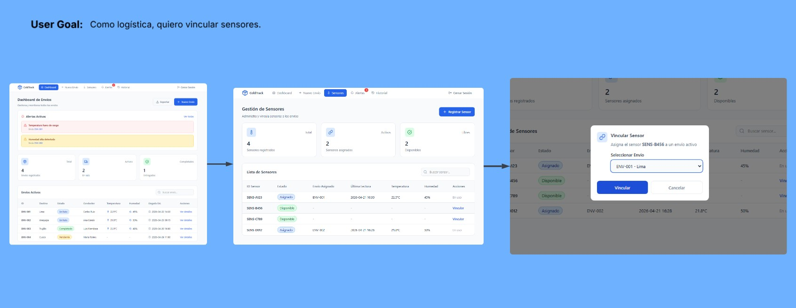
</p>

## 4.5. Web Applications Prototyping

<p align="center">
  
</p>

#### Link del video explicativo: https://upcedupe-my.sharepoint.com/:v:/g/personal/u202320699_upc_edu_pe/IQACBR9pDoCKSIpvd7NcFc3CAcul48K88RqMf49wIC2AbMA?nav=eyJyZWZlcnJhbEluZm8iOnsicmVmZXJyYWxBcHAiOiJPbmVEcml2ZUZvckJ1c2luZXNzIiwicmVmZXJyYWxBcHBQbGF0Zm9ybSI6IldlYiIsInJlZmVycmFsTW9kZSI6InZpZXciLCJyZWZlcnJhbFZpZXciOiJNeUZpbGVzTGlua0NvcHkifX0&e=Ji22ya

## 4.6. Domain-Driven Software Architecture
En esta sección, el equipo profundiza en la arquitectura de software para la solución ColdTrack, tomando como base los hitos alcanzados durante el Big Picture Event Storming. 
El objetivo es realizar una transición desde el entendimiento del negocio hacia un modelo técnico riguroso bajo la perspectiva de Domain-Driven Design (DDD).

Este enfoque permite delimitar los Bounded Contexts necesarios para separar responsabilidades críticas, como el monitoreo IoT en tiempo real, la gestión logística de los envíos y el motor automatizado de alertas tempranas. 
A través de esta metodología, se han identificado los Aggregates, Events, Commands y Queries que garantizan la integridad de la lógica de negocio en cada etapa del transporte de carga refrigerada y la conservación de la cadena de frío.

Finalmente, se presenta y explica la representación visual de la arquitectura utilizando el C4 Model. 
Esta estructura jerárquica nos permite comunicar de manera efectiva la solución a través de tres niveles de detalle: el Software Architecture Context Level Diagram, los Software Architecture Container Level Diagrams y los Software Architecture Component Diagrams.

### 4.6.1. Design-Level Event Storming
La sesión se llevó a cabo de manera colaborativa utilizando la herramienta Lucidchart y se estructuró en las siguientes actividades clave: 

1. Refinamiento de Eventos de Dominio
2. Identificación de Comandos y Actores
3. Definición de Agregados (Aggregates)
4. Delimitación de Bounded Contexts
5. Integración de Sistemas Externos y Queries

<p align="center">
  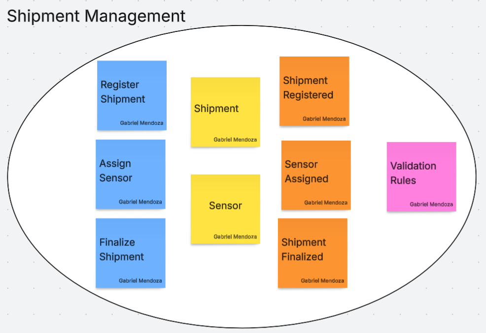
</p>

<p align="center">
  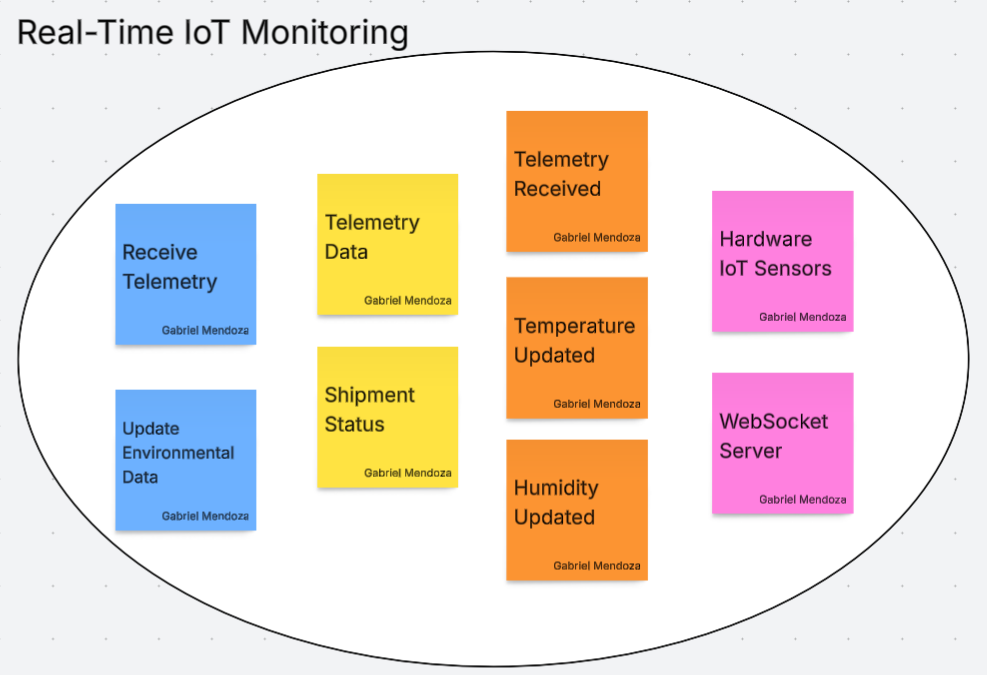
</p>

<p align="center">
  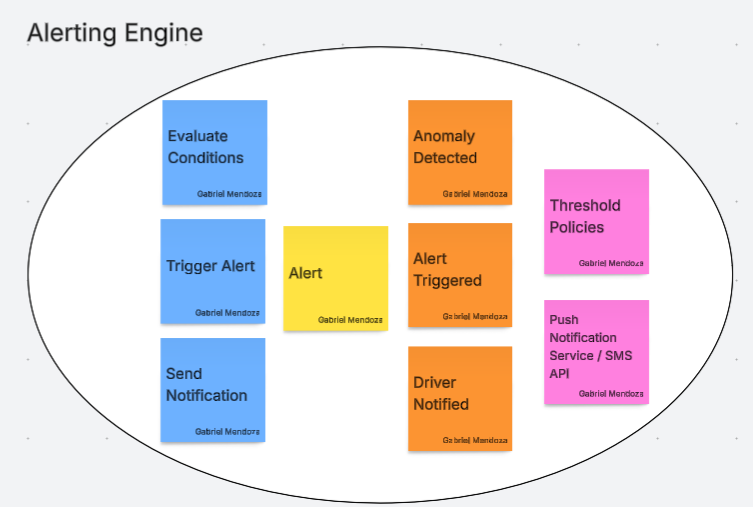
</p>

<p align="center">
  
</p>

<p align="center">
  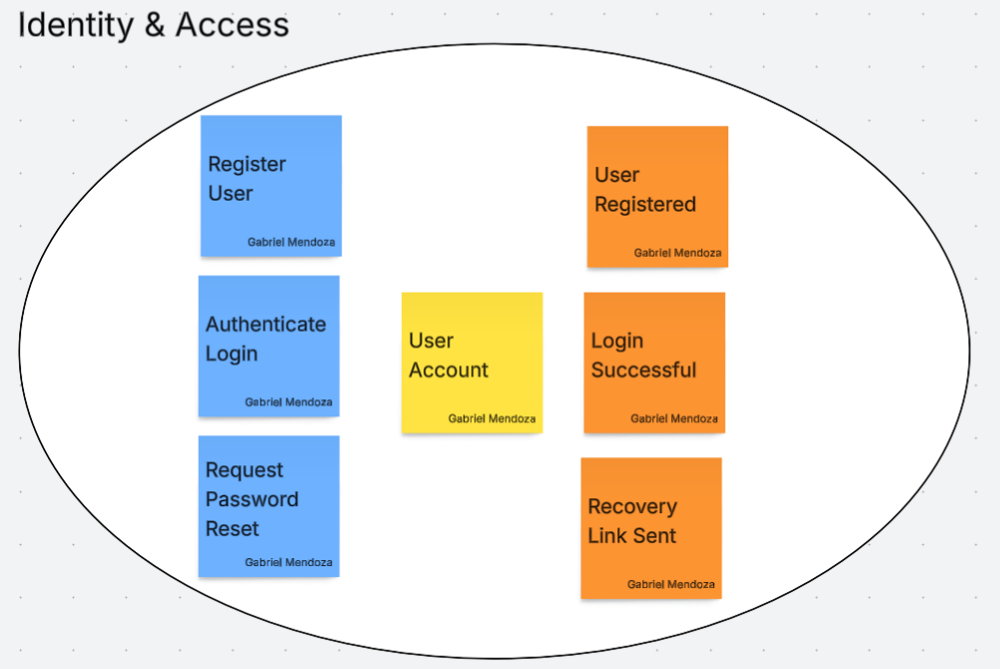
</p>


### 4.6.2. Software Architecture Context Diagram
<p align="center">
  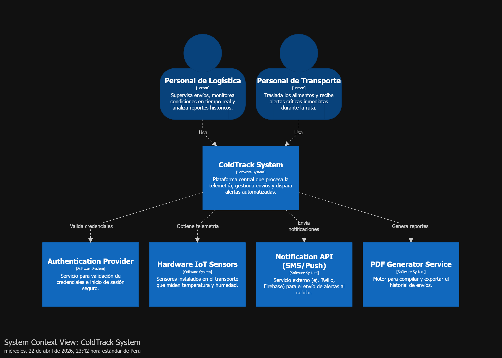
</p>

### 4.6.3. Software Architecture Container Diagrams

<p align="center">
  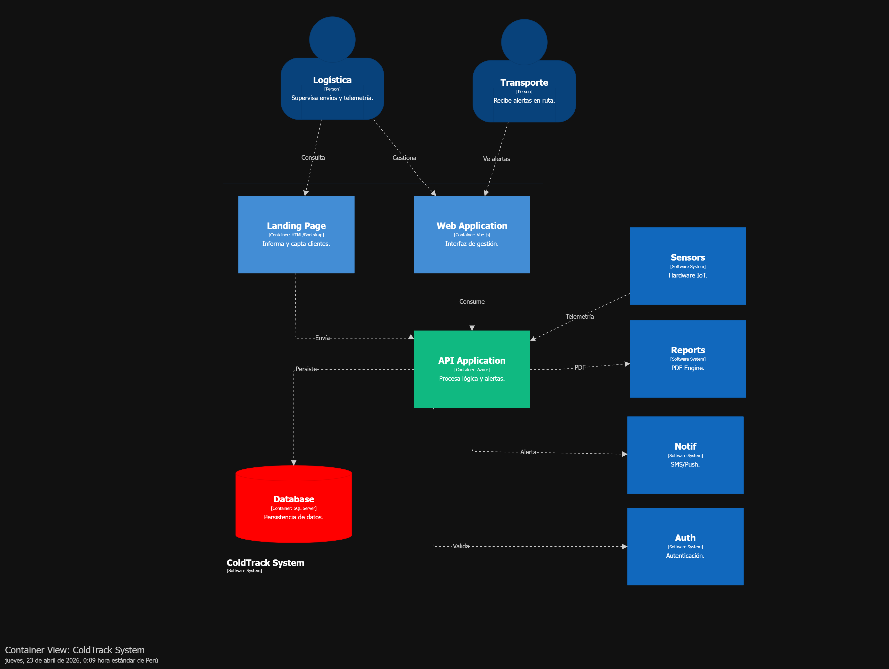
</p>

### 4.6.3. Software Architecture Components Diagrams

<p align="center">
  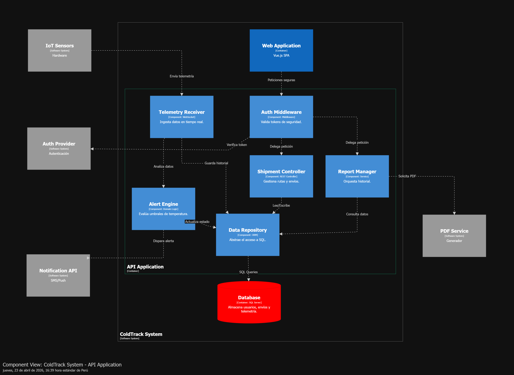
</p>
## 4.7. Software Object-Oriented Design

### 4.7.1. Class Diagrams

<p align="center">
  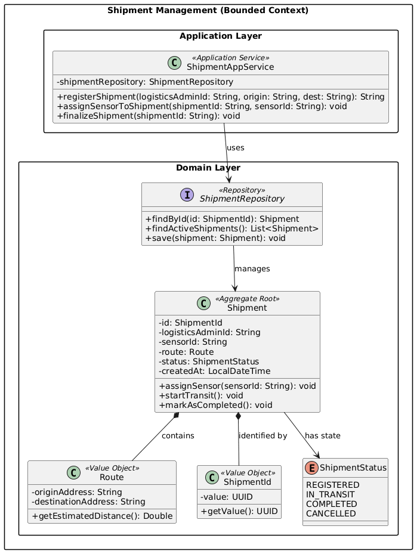
</p>

<p align="center">
  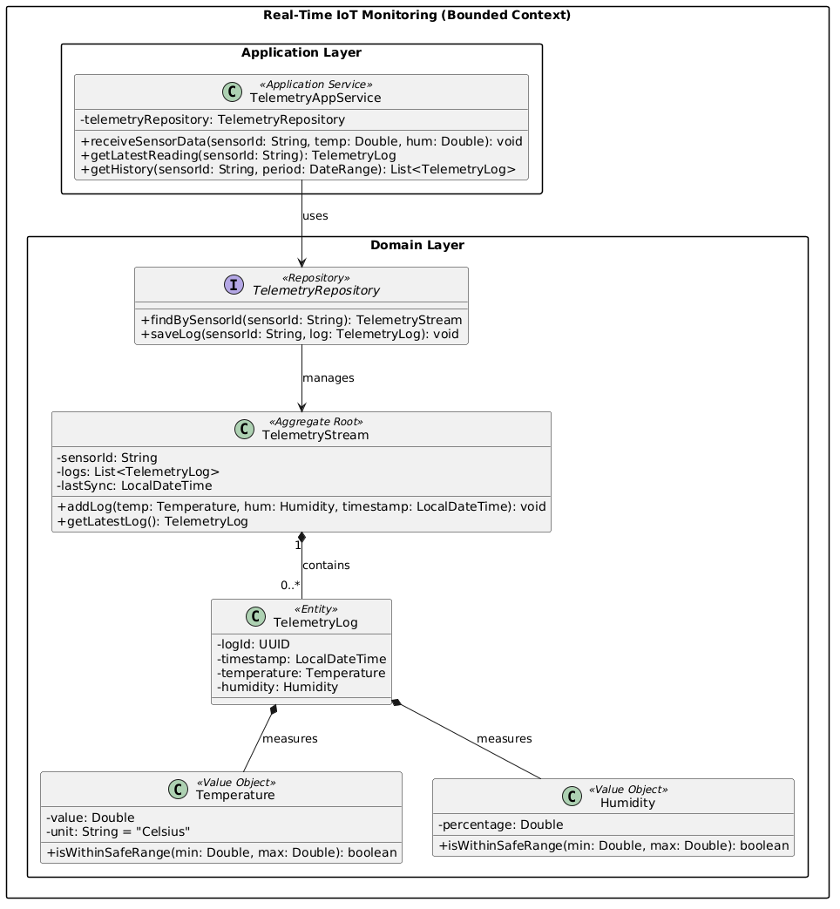
</p>

<p align="center">
  
</p>

<p align="center">
  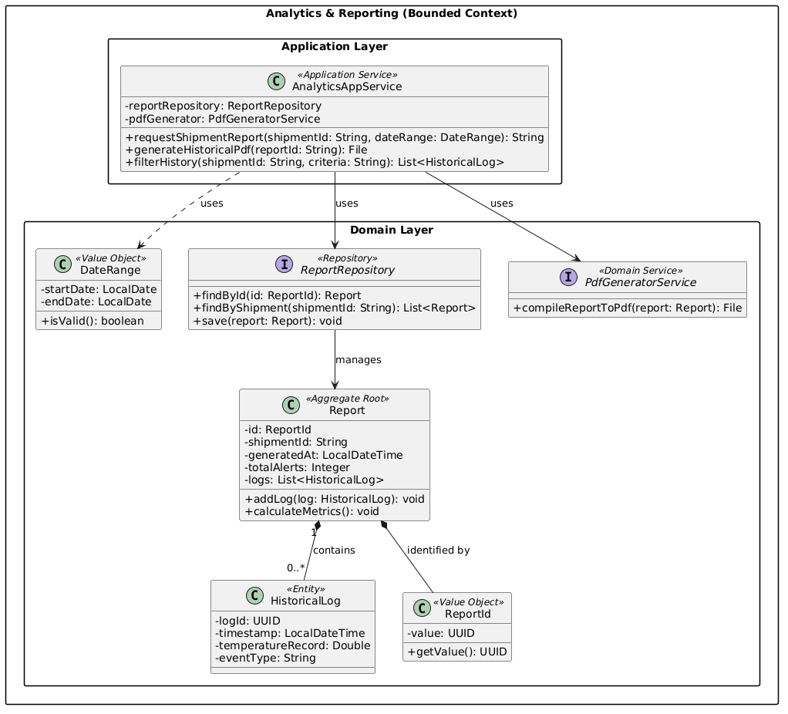
</p>

<p align="center">
  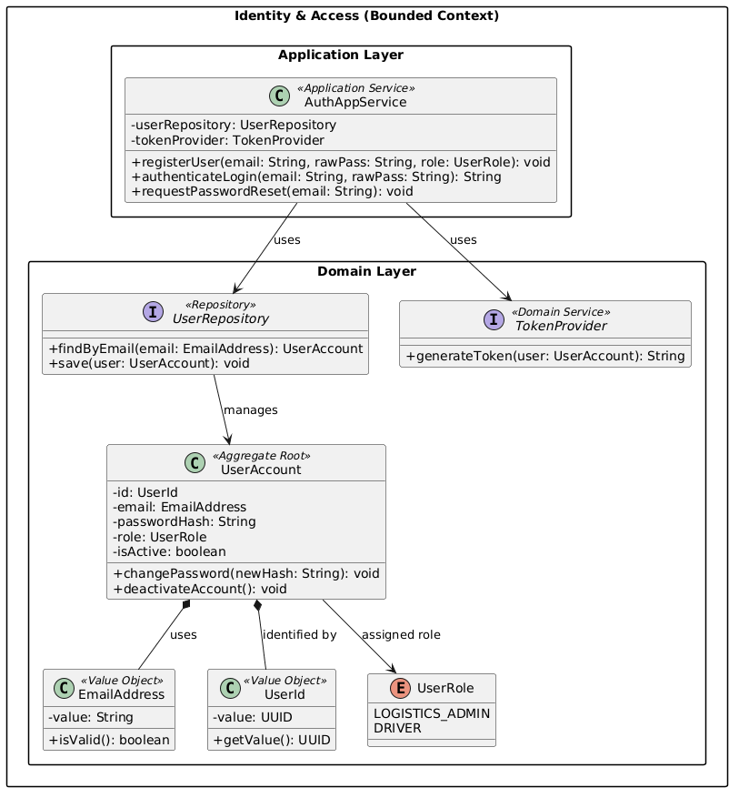
</p>

### 4.7.2. Class Dictionary

A continuación, se detalla el diccionario de clases, el cual describe la responsabilidad y el propósito de las entidades, objetos de valor, agregados y servicios definidos en el diseño orientado a objetos del sistema ColdTrack.


## 4.8. Database Design

En esta sección se presenta el modelo relacional de la base de datos de ColdTrack. El esquema detalla las entidades principales del sistema, sus atributos y las relaciones entre ellas. Este diseño asegura la integridad referencial y soporta los módulos clave definidos en la arquitectura, como la gestión de usuarios, el registro de vehículos, la asignación de sensores y el historial de telemetría y alertas.


#### 1. Shipment Management (Gestión de Envíos)
Este módulo centraliza la planificación y el estado logístico de los traslados físicos de los alimentos.

| Clase / Interfaz | Estereotipo (DDD) | Descripción y Responsabilidad |
| :--- | :--- | :--- |
| **ShipmentAppService** | Application Service | Orquesta los casos de uso logísticos. Coordina la creación de envíos, la asignación de sensores físicos y la finalización de las rutas, delegando la persistencia al repositorio. |
| **Shipment** | Aggregate Root | Representa un envío físico de alimentos. Gestiona su propio ciclo de vida (estado) y protege la invariante de negocio de que cada envío debe estar asociado a un sensor físico en la ruta. |
| **Route** | Value Object | Encapsula la información de origen y destino del transporte. Al ser inmutable, cualquier cambio en la ruta requiere la creación de un nuevo objeto de valor. |
| **ShipmentId** | Value Object | Identificador único y tipado del envío, evitando errores comunes al usar cadenas de texto (`String`) genéricas. |
| **ShipmentStatus** | Enum | Define los estados posibles del envío: `REGISTERED` (creado), `IN_TRANSIT` (en ruta), `COMPLETED` (finalizado con éxito) y `CANCELLED`. |
| **ShipmentRepository** | Repository | Abstracción de acceso a datos para persistir y recuperar los agregados `Shipment` de la base de datos SQL Server. |

#### 2. Real-Time IoT Monitoring (Monitoreo de Telemetría)
Este contexto está enfocado exclusivamente en la ingesta, validación e hidratación de los datos capturados por el hardware.

| Clase / Interfaz | Estereotipo (DDD) | Descripción y Responsabilidad |
| :--- | :--- | :--- |
| **TelemetryAppService** | Application Service | Expone los puertos de entrada para recibir la data en tiempo real desde los sensores vía WebSockets o API REST, y facilita la consulta del historial de un sensor. |
| **TelemetryStream** | Aggregate Root | Actúa como un contenedor lógico de todas las lecturas de un sensor específico. Garantiza el orden cronológico y la agrupación de los datos durante un viaje. |
| **TelemetryLog** | Entity | Representa una captura de telemetría individual en un momento exacto del tiempo. |
| **Temperature** | Value Object | Encapsula el valor numérico de la temperatura y su unidad (Celsius). Contiene lógica intrínseca para validar si el valor se encuentra dentro de un rango seguro establecido. |
| **Humidity** | Value Object | Encapsula el porcentaje de humedad relativa, validando que el valor matemático ingresado tenga sentido (por ejemplo, entre 0% y 100%). |
| **TelemetryRepository** | Repository | Interfaz encargada de la persistencia de alto rendimiento para el gran volumen de logs de telemetría generados durante la ruta. |

#### 3. Alerting Engine (Motor de Alertas)
Responsable de evaluar anomalías en las condiciones ambientales e interactuar con servicios externos para notificar a los actores.

| Clase / Interfaz | Estereotipo (DDD) | Descripción y Responsabilidad |
| :--- | :--- | :--- |
| **AlertAppService** | Application Service | Ejecuta el flujo de evaluación. Si detecta una anomalía mediante el `ThresholdPolicy`, crea una alerta y coordina con el `NotificationGateway` el envío del mensaje. |
| **Alert** | Aggregate Root | Entidad principal que registra una incidencia crítica (ej. ruptura de cadena de frío). Controla cuándo fue disparada, si el conductor ya la reconoció y si fue resuelta. |
| **ThresholdPolicy** | Domain Service | Contiene la lógica de dominio pura (umbrales permitidos) para determinar si las condiciones de temperatura actuales violan la seguridad alimentaria. |
| **AlertId** | Value Object | Identidad única inmutable de la alerta generada. |
| **AlertType** | Enum | Categoriza la anomalía: `CRITICAL_TEMPERATURE`, `HIGH_HUMIDITY` o `SENSOR_DISCONNECTED`. |
| **AlertStatus** | Enum | Gestiona el ciclo de atención: `TRIGGERED` (disparada), `ACKNOWLEDGED` (vista por el conductor) y `RESOLVED` (solucionada). |
| **NotificationGateway** | Gateway (Interface) | Abstracción (Puerto) para integrarse con servicios externos como Twilio o Firebase para disparar SMS o notificaciones Push. |

#### 4. Analytics & Reporting (Analítica y Reportes)
Módulo encargado de consolidar la información histórica para facilitar la toma de decisiones gerenciales.

| Clase / Interfaz | Estereotipo (DDD) | Descripción y Responsabilidad |
| :--- | :--- | :--- |
| **AnalyticsAppService** | Application Service | Coordina la solicitud de reportes. Filtra el historial de un envío y delega la construcción del archivo físico al motor generador de PDF. |
| **Report** | Aggregate Root | Un consolidado del rendimiento de un envío finalizado. Almacena métricas pre-calculadas (como el total de alertas disparadas) para consultas eficientes. |
| **HistoricalLog** | Entity | Un registro plano, desnormalizado y optimizado para la lectura, diseñado para conformar las filas de datos en los reportes exportables. |
| **DateRange** | Value Object | Encapsula una fecha de inicio y una de fin, garantizando que el inicio no sea posterior al fin del rango temporal. |
| **PdfGeneratorService** | Domain Service | Motor interno que se encarga de formatear la data de dominio y compilarla en un documento PDF descargable. |

#### 5. Identity & Access (Gestión de Identidad y Accesos)
Maneja la seguridad, controlando quién puede interactuar con el sistema según su rol.

| Clase / Interfaz | Estereotipo (DDD) | Descripción y Responsabilidad |
| :--- | :--- | :--- |
| **AuthAppService** | Application Service | Procesa las solicitudes de registro, inicio de sesión y recuperación de contraseña, apoyándose en el `TokenProvider`. |
| **UserAccount** | Aggregate Root | Representa las credenciales y el estado (activo/inactivo) de un trabajador. Controla el acceso basado en sus roles y protege la seguridad de la contraseña cifrada. |
| **EmailAddress** | Value Object | Asegura que toda cadena de texto utilizada como correo electrónico pase una validación de formato (Regex) antes de interactuar con el sistema. |
| **UserRole** | Enum | Define los niveles de acceso del sistema. Principalmente `LOGISTICS_ADMIN` (para el dashboard web) y `DRIVER` (para recibir alertas). |
| **TokenProvider** | Domain Service | Servicio responsable de emitir los JWT (JSON Web Tokens) que las aplicaciones web y móviles usarán para mantener la sesión abierta de manera segura. |

## 4.8. Database Design

En esta sección se presenta el modelo relacional de la base de datos de ColdTrack. El esquema detalla las entidades principales del sistema, sus atributos y las relaciones entre ellas. Este diseño asegura la integridad referencial y soporta los módulos clave definidos en la arquitectura, como la gestión de usuarios, el registro de vehículos, la asignación de sensores y el historial de telemetría y alertas.

### 4.8.1. Database Diagram

<p align="center">
  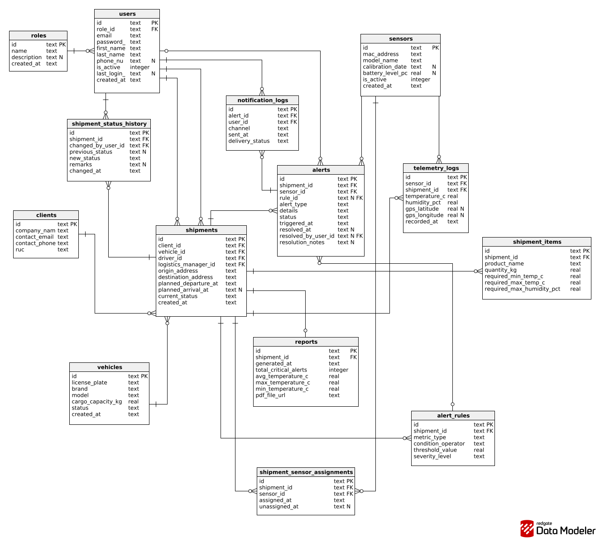
</p>

# Capitulo V: Product Implementation, Validation & Deployment

## 5.1. Software Configuration Management

A continuación, se describe el proceso por el cual organizamos, gestionamos y controlamos los cambio de desarrollo de ColdTrack.

### 5.1.1. Software Development Environment Configuration.

En esta sección se describen las herramientas utilizadas durante el desarrollo de la landing page de **ColdTrack**, producto digital de la startup **FreshGuard Technologies**. El objetivo de esta solución fue presentar de forma clara la propuesta de valor del sistema, mostrar sus principales funcionalidades y ofrecer una experiencia visual moderna, accesible y responsiva.

Las herramientas empleadas en el proyecto se clasifican en el siguiente orden:

- Producto UX/UI Design
- Software Development
- Software Deployment

**Producto UX/UI Design**

- **Figma**: utilizado como referencia visual para definir la estructura, distribución de secciones y estilo general de la landing page.

**Software Development**

- **Visual Studio Code**: editor de código utilizado para implementar el proyecto.
- **Git**: sistema de control de versiones empleado para registrar y organizar los cambios.
- **GitHub**: plataforma utilizada para alojar el repositorio remoto del proyecto.
- **HTML5**: lenguaje de marcado usado para estructurar el contenido de la página.
- **CSS3**: lenguaje de estilos utilizado para el diseño visual, la responsividad y las animaciones.
- **JavaScript**: lenguaje usado para añadir interactividad en la navegación y animaciones visuales.
- **Navegador web moderno**: entorno de validación para revisar visualización, comportamiento e interacción.

**Software Deployment**

- **GitHub Pages**: servicio de despliegue utilizado para publicar la landing page como sitio estático.

### 5.1.2. Source Code Management

Para la gestión del código fuente se utilizó **GitHub** como plataforma central de versionamiento y almacenamiento del proyecto. El repositorio principal identificado para la landing page es el siguiente:

- **Repositorio de la Landing Page**: https://github.com/1ASI0729-2610-10155/Landing-Page

El proyecto fue desarrollado mediante una estrategia de trabajo basada en ramas, permitiendo separar mejoras funcionales, optimizaciones visuales y correcciones específicas antes de su integración a la rama principal.

**Modelo de ramificación**

La estructura de ramas encontrada en el repositorio es la siguiente:

- `main`: rama principal del proyecto, donde se consolida la versión estable.
- `features/dashboard-improvements`: rama orientada a mejorar la apariencia y comportamiento del dashboard preview mostrado en la hero section.
- `features/seo-enhancements`: rama dedicada a la incorporación de mejoras SEO y etiquetas Open Graph.
- `bugfix/accessibility-improvements`: rama destinada a correcciones de accesibilidad, incluyendo estilos de foco y atributos ARIA.

Este enfoque permitió mantener el desarrollo organizado y evidenciar una evolución progresiva del producto.

**Estilo de commits**

El historial del repositorio muestra el uso de mensajes de commit consistentes, alineados con una convención tipo **Conventional Commits**. Algunos ejemplos reales del proyecto son:

- `feat: initial project setup`
- `feat: add hero section with title and CTA`
- `feat: add responsive CSS styles`
- `feat: add JavaScript interactivity`
- `fix: improve mobile responsiveness and add mobile-specific styles`
- `fix: add ARIA labels for accessibility`

Los prefijos observados se interpretan de la siguiente forma:

- `feat`: incorporación de una nueva funcionalidad o mejora visible.
- `fix`: corrección de errores o ajustes sobre funcionalidades existentes.

### 5.1.3. Source Code Style Guide & Conventions

Para garantizar coherencia, mantenibilidad y escalabilidad del código, se establecen las siguientes normas de estilo:

1.  HTML
- El archivo principal del proyecto es `index.html`.
- Se utilizan etiquetas semánticas como `header`, `nav`, `section` y `footer`.
- Las secciones de la página están organizadas de forma clara: encabezado, hero, características, cómo funciona, beneficios, CTA y footer.
- Se añadieron metadatos como `description`, `keywords`, `author` y propiedades Open Graph.
- Se incorporaron atributos de accesibilidad en elementos clave del documento.

2.  CSS
- Los estilos están centralizados en el archivo `css/styles.css`.
- Se emplean variables CSS en `:root` para colores, espaciados y transiciones.
- Las clases siguen nombres semánticos con palabras separadas por guiones, por ejemplo: `header-content`, `nav-menu`, `feature-card`, `shipment-card`.
- Se incluyen estilos responsivos para escritorio, tableta y móvil.
- Se aplican efectos visuales como transiciones, hover states, sombras y focus styles.

3.  JavaScript
- La lógica de interacción se implementa en `js/script.js`.
- Se usa `DOMContentLoaded` para iniciar la carga de eventos una vez disponible el DOM.
- Se utilizan nombres descriptivos en camelCase como `navLinks`, `featureCards`, `shipmentCards` y `observerOptions`.
- La funcionalidad incluye smooth scrolling, animaciones de entrada y actualización visual del dashboard preview.

### 5.1.4. Software Deployment Configuration

La estrategia de despliegue adoptada para ColdTrack corresponde a la publicación de una landing page estática mediante **GitHub Pages**. Esta decisión fue adecuada debido a que el proyecto está compuesto únicamente por archivos HTML, CSS y JavaScript, sin dependencias de servidor, base de datos o procesamiento backend.

#### Despliegue de la Landing Page en GitHub Pages

GitHub Pages fue seleccionado como mecanismo de publicación por su integración directa con el repositorio, facilidad de configuración y compatibilidad con sitios estáticos. Esto permite que la landing page pueda ser publicada desde la rama principal del proyecto y visualizada mediante una URL pública.

#### Consideraciones previas al despliegue

Antes del despliegue, se consideraron los siguientes aspectos:

- mantener una estructura de archivos estática y ordenada,
- asegurar rutas relativas correctas entre HTML, CSS y JavaScript,
- conservar en `main` la versión estable del proyecto,
- validar el comportamiento responsivo y la correcta carga visual de la página.

#### Pasos de despliegue

1. Crear o actualizar el repositorio remoto en GitHub.
2. Subir los archivos principales del proyecto: `index.html`, `css/styles.css` y `js/script.js`.
3. Ingresar a la configuración del repositorio.
4. Habilitar GitHub Pages.
5. Seleccionar la rama `main` y la carpeta raíz como fuente de publicación.
6. Esperar la generación de la URL pública del sitio.

#### Repositorio: https://github.com/1ASI0729-2610-10155/Landing-Page
#### URL desplegada: https://1asi0729-2610-10155.github.io/Landing-Page/

## 5.2. Landing Page, Services & Applications Implementation

La presente implementación corresponde al desarrollo de la landing page de **ColdTrack**, enfocada en comunicar la propuesta de valor del producto: monitoreo en tiempo real para el transporte de alimentos. La solución fue construida como una página estática, moderna y responsiva, diseñada para presentar de forma clara las capacidades del sistema.

### 5.2.1. Sprint 1

Dado que la evidencia disponible del proyecto se concentra en el repositorio, el historial de commits y la documentación técnica local, esta sección adapta el desarrollo realizado en un único sprint principal orientado a la implementación progresiva de la landing page.

#### 5.2.1.1. Sprint Planning 1

El equipo de desarrollo se reunió virtualmente para definir los objetivos, tareas y entregables del primer sprint, el cual tendrá una duración de una semana. El enfoque principal será el desarrollo y despliegue de la landing page del proyecto en GitHub Pages, asegurando que el producto inicial esté operativo y sirva como base sólida para las siguientes iteracciones.

| Sprint                             | Sprint 1                                                                                                                                                                                     |
| ---------------------------------- | -------------------------------------------------------------------------------------------------------------------------------------------------------------------------------------------- |
|                                    | Sprint Planning Background                                                                                                                                                                   |
| Date                               | 2026/04/17                                                                                                                                                                                   |
| Time                               | 19:28 PM                                                                                                                                                                                     |
| Location                           | El desarrollo de la reunión se hizo virtualmente por medio de Discord                                                                                                                        |
| Prepared By                        | Eslander Celis Berrospi                                                                                                                                                                      |
| Attendees (to planning meeting)    | Eslander Celis Berrospi, Gabriel Mendoza Palacios, Rodrigo Oblitas Alcalde, Aarón Avila Palacios	                                                                                          |
| Sprint n – 1 Review Summary        | En este primer sprint se asignaron responsabilidades a cada integrante y se planteó los requerimientos para el desarrollo de la Landing Page.                                                |
| Sprint n – 1 Retrospective Summary | En esta sección todos los integrantes mencionaron tener aciertos en partes del código y en otras partes poder mejorar sus habilidades realizando la Landing Page                             |
|                                    |Sprint Goal & User Stories                                                                                                                                                                    |
| Sprint 1 Goal                      | Desarrollar y desplegar la landing page funcional en Github Pages, garantizando que cumpla con los requisitos básicos de diseño, contenido y accesibilidad para servir como base de proyecto |
| Sprint 1 Velocity                  | 8                                                                                                                                                                                            |
| Sum of Story Points                | 8                                                                                                                                                                                            |

#### 5.2.1.2. Aspect Leaders and Collaborators

De acuerdo con la evidencia encontrada en el repositorio y en el `README.md` del proyecto, el desarrollo de esta landing page fue implementado principalmente por **Rodrigo Oblitas Alcalde**.

| Team Member | Referencia | Landing Page |
|------------|------------|--------------|
| Rodrigo Oblitas Alcalde | Repositorio `1ASI0730-2610-10215/Landing-Page` | L |
| Eslander Celis | Colaborador de accesibilidad y soporte documental | C |
| Aarón Avila | Colaborador en optimizaciones SEO y metadatos | C |
| Mariano Vilela | Colaborador en secciones visuales y estilos responsivos | C |
| Gabriel Mendoza | Colaborador en mejoras visuales complementarias e iconografía | C |

#### 5.2.1.3. Sprint Backlog 1

Tomando como referencia las User Stories definidas en el Product Backlog, las historias trabajadas durante el Sprint 1 para la landing page pueden resumirse de la siguiente manera:

| User Story Id | User Story Title | Task Id | Task Description | Status |
|---------------|------------------|---------|------------------|--------|
| US-019 | Ver información de la app (Landing) | T01 | Configurar la estructura inicial del proyecto de landing page. | Done |
| US-019 | Ver información de la app (Landing) | T02 | Implementar el header con navegación principal e identidad visual del producto. | Done |
| US-019 | Ver información de la app (Landing) | T03 | Desarrollar la hero section con propuesta de valor y llamada a la acción. | Done |
| US-023 | Ver funcionalidades del sistema | T04 | Implementar la sección de características principales del sistema. | Done |
| US-023 | Ver funcionalidades del sistema | T05 | Desarrollar la sección explicativa sobre el funcionamiento de ColdTrack. | Done |
| US-023 | Ver funcionalidades del sistema | T06 | Implementar la sección de beneficios operativos para los usuarios. | Done |
| US-021 | Formulario de contacto | T07 | Incorporar el CTA final y el footer con información de contacto. | Done |
| US-019 | Ver información de la app (Landing) | T08 | Desarrollar estilos responsivos para adaptar la landing page a distintos dispositivos. | Done |
| US-019 | Ver información de la app (Landing) | T09 | Incorporar animaciones e interacciones mediante JavaScript. | Done |
| US-023 | Ver funcionalidades del sistema | T10 | Mejorar la vista previa del dashboard para mostrar el valor del monitoreo. | Done |
| US-019 | Ver información de la app (Landing) | T11 | Agregar meta tags y Open Graph para optimizar la presentación del sitio. | Done |
| US-019 | Ver información de la app (Landing) | T12 | Realizar ajustes de accesibilidad y navegación por teclado. | Done |
| US-020 | Ver testimonios | T13 | Incorporar una sección de testimonios para reforzar la confianza en la solución. | Done |
| US-022 | Ver equipo de desarrollo | T14 | Incorporar una sección para presentar a los integrantes del equipo de desarrollo. | Done |

Link del Trello: https://trello.com/invite/b/69e9cc91c86525634eb4a333/ATTI779ea07a6c43c25c93856efd9e60aec6150FC41B/sprint-1-freshguard-coldtrack 

#### 5.2.1.4. Development Evidence for Sprint Review

Durante el Sprint 1, el equipo desarrolló de manera incremental la Landing Page del proyecto, implementando funcionalidades relacionadas con la estructura visual, diseño responsivo, accesibilidad y optimización SEO. Los commits realizados evidencian el progreso continuo del producto y la participación activa de los integrantes del equipo en las distintas tareas asignadas.

| Repository | Branch | Commit Id | Commit Message | Commit Message Body | Commited on (Date) |
|------------|--------|-----------|----------------|---------------------|--------------------|
| Landing-Page | `main` | `5ce9ead` | `feat: initial project setup` | Se configuró la estructura inicial del proyecto y los archivos base para el desarrollo de la Landing Page. | 12/05/2025 |
| Landing-Page | `main` | `0fd3953` | `feat: add basic HTML structure with header` | Se implementó la estructura principal en HTML incluyendo el encabezado de navegación. | 13/05/2025 |
| Landing-Page | `main` | `b0f9279` | `feat: add hero section with title and CTA` | Se agregó la sección principal “Hero” con título descriptivo y botón de llamada a la acción. | 13/05/2025 |
| Landing-Page | `main` | `be25150` | `feat: add features section` | Se desarrolló la sección de características principales del producto para presentar sus funcionalidades. | 14/05/2025 |
| Landing-Page | `main` | `5a9590e` | `feat: add responsive CSS styles` | Se añadieron estilos responsivos para mejorar la visualización en diferentes dispositivos. | 15/05/2025 |
| Landing-Page | `main` | `a9e7c80` | `feat: add JavaScript interactivity` | Se implementaron funcionalidades interactivas mediante JavaScript para mejorar la experiencia del usuario. | 15/05/2025 |
| Landing-Page | `main` | `fea423b` | `feat: add icons to feature cards` | Se incorporaron iconos visuales en las tarjetas de funcionalidades para mejorar la interfaz gráfica. | 16/05/2025 |
| Landing-Page | `features/seo-enhancements` | `df123a2` | `feat: add SEO meta tags` | Se agregaron meta etiquetas SEO para optimizar el posicionamiento y visibilidad de la página web. | 19/05/2025 |
| Landing-Page | `bugfix/accessibility-improvements` | `0cd942e` | `fix: add ARIA labels for accessibility` | Se mejoró la accesibilidad de la Landing Page mediante la implementación de etiquetas ARIA. | 20/05/2025 |

Los commits mostrados reflejan el avance progresivo del Sprint 1, evidenciando la construcción de una Landing Page funcional, accesible y optimizada, alineada con los objetivos planteados durante la planificación del sprint.

#### 5.2.1.5. Execution Evidence for Sprint Review

La implementación final de ColdTrack quedó organizada en una sola página principal compuesta por secciones claramente diferenciadas:

- **Header**: navegación principal con identidad visual del producto.
  
  
  
- **Hero Section**: presentación de la propuesta de valor y botones de llamada a la acción.
  
  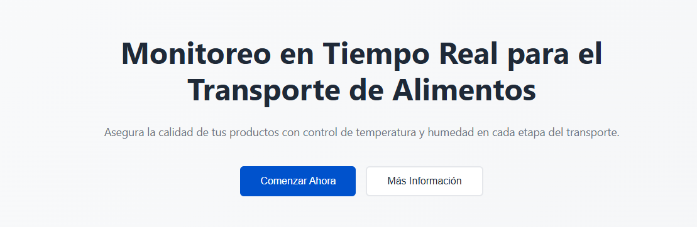
  
- **Dashboard Preview**: simulación visual de monitoreo en tiempo real mediante tarjetas de envíos activos.

  
  
- **Features Section**: exposición de las capacidades principales del sistema.

  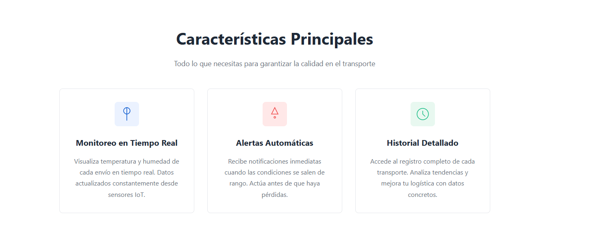
  
- **How It Works Section**: explicación resumida del flujo operativo del producto.

   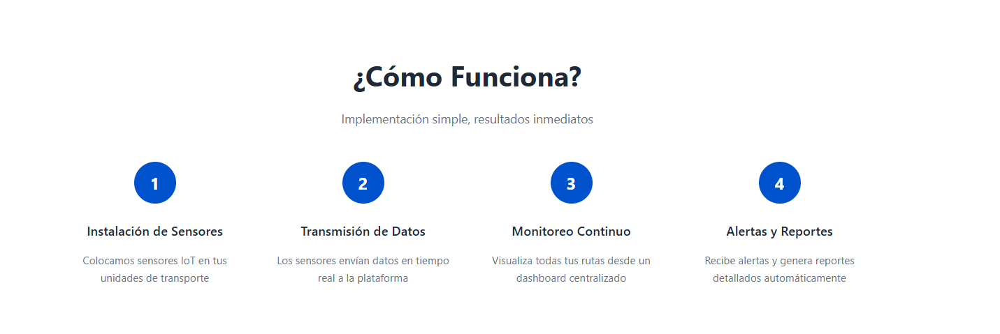
  
- **Benefits Section**: presentación de ventajas operativas para el usuario.

   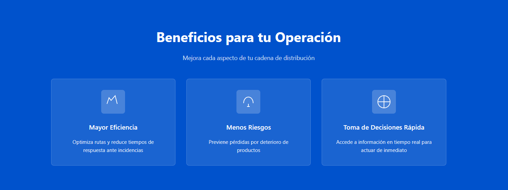
  
- **CTA Section**: sección final orientada a reforzar el interés en la solución.

  
  
- **Footer**: bloque final con navegación complementaria e información general.

  

Desde el punto de vista técnico, la implementación se concentra en:

- `index.html` como archivo estructural principal,
- `css/styles.css` como archivo de estilos,
- `js/script.js` como archivo de interactividad.

Además, el proyecto incluye una estructura HTML semántica, aproximadamente **595 líneas de CSS** y aproximadamente **97 líneas de JavaScript**, con separación clara entre contenido, presentación y comportamiento.

#### 5.2.1.6. Services Documentation Evidence for Sprint Review

Esta sección no aplica a la presente entrega, ya que el proyecto desarrollado corresponde únicamente a una landing page estática y no incorpora APIs, endpoints ni servicios backend documentados.

#### 5.2.1.7. Software Deployment Evidence for Sprint Review

La landing page fue preparada para su publicación mediante **GitHub Pages**, utilizando la rama `main` como base del despliegue.

- Plataforma de despliegue: **GitHub Pages**
- Rama de publicación: **main**
- Tipo de aplicación: **sitio web estático**
- Repositorio fuente: https://github.com/1ASI0729-2610-10155/Landing-Page
- desplegue de la landing page: https://1asi0729-2610-10155.github.io/Landing-Page/

pasos para el despliegue:

1. **Creación del Repositorio en GitHub:** Iniciamos creando un repositorio dedicado en GitHub para nuestro proyecto de landing page.
2. **Configuración de la Rama de despliegue:** Aseguramos que la rama principal del repositorio se llamara `gh-pages`, ya que GitHub Pages toma esta rama como base para el despliegue automático.
3. **Generación del Enlace de GitHub Pages:** Navegamos a la sección "Pages" en la configuración del repositorio en GitHub. Configuramos la fuente de GitHub Pages para que tomara el contenido de la rama `gh-pages`.
4. **Despliegue Automático:** GitHub Pages automáticamente detectó los cambios en la rama `gh-pages` y desplegó la landing page en la URL proporcionada por GitHub Pages.
   
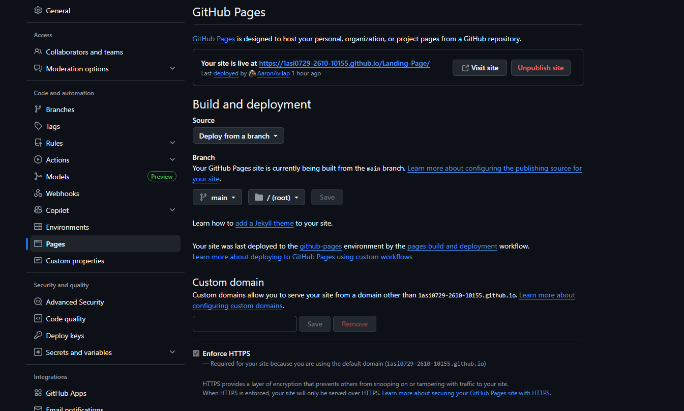


#### 5.2.1.8. Team Collaboration Insights during Sprint

Durante el Sprint 1, el equipo de desarrollo en implementar todas las funcionalidades de la landing page y la realización del documento.

#### Colaboración y Desarrollo de Actividades

1. **Asignación de Tareas**:


2. **Evidencia de commits**:

Repositorio:

**Documento**

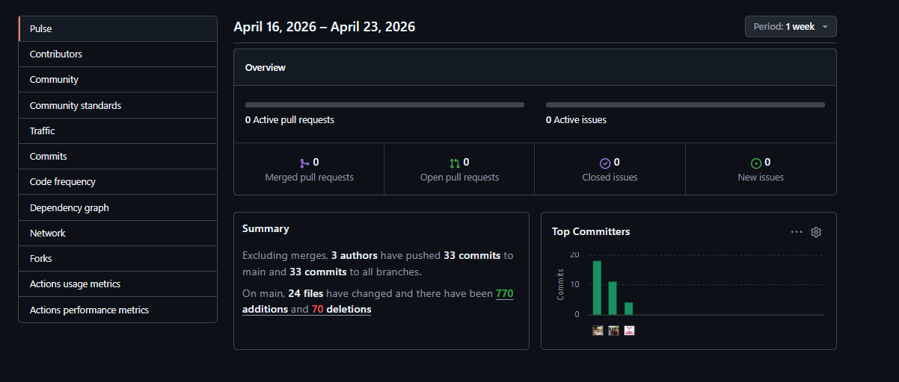

**Landing Page**

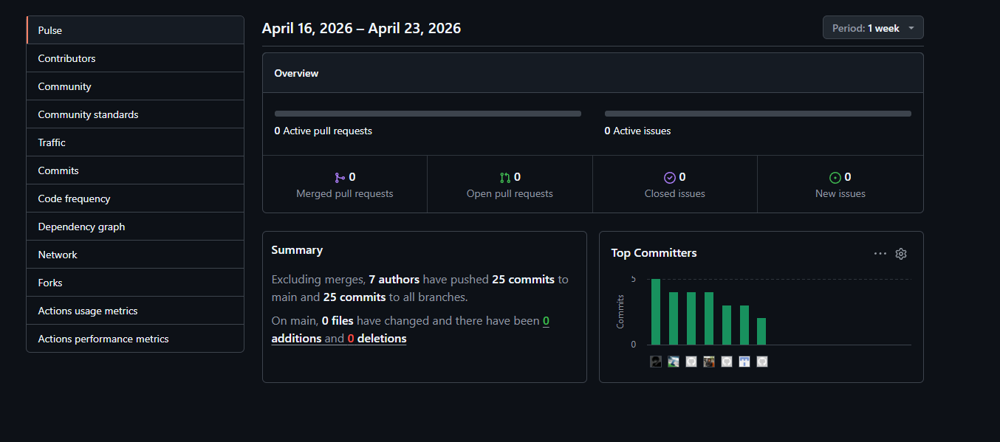

3. **Evidencia de Nertwork**:

Repositorio:

**Documento**

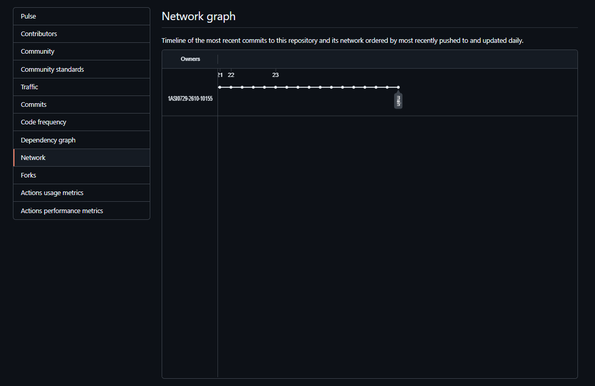

**Landing Page**

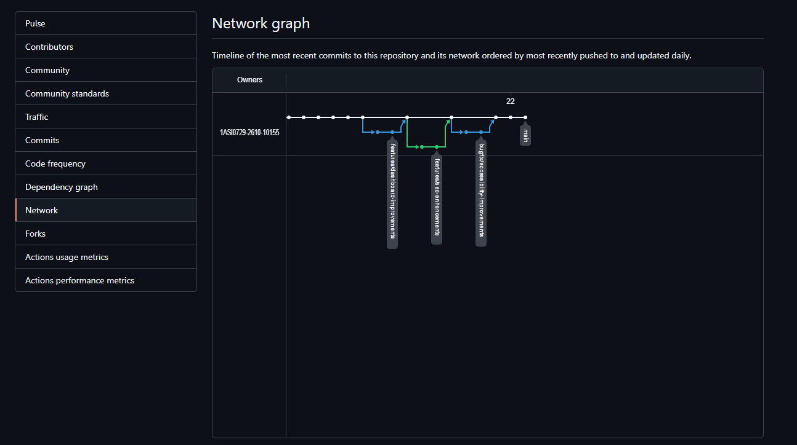

4.**Contributions**

Repositorios:

**Documento**

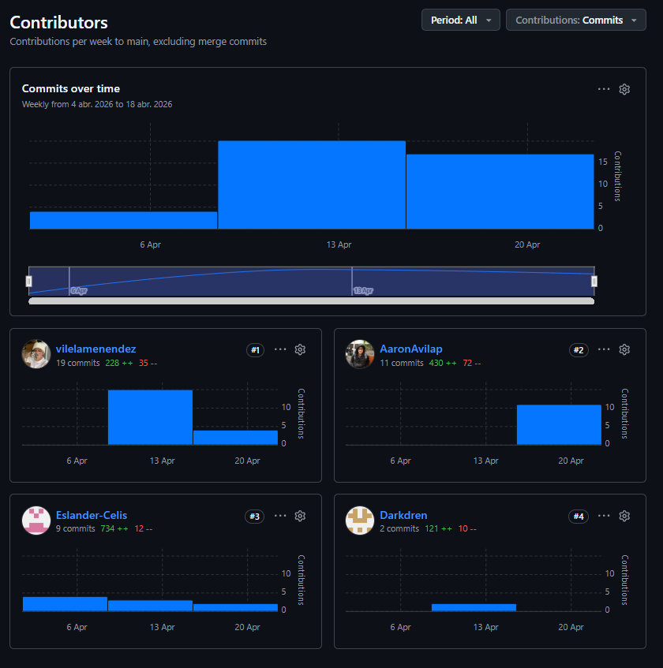

**Landing Page**

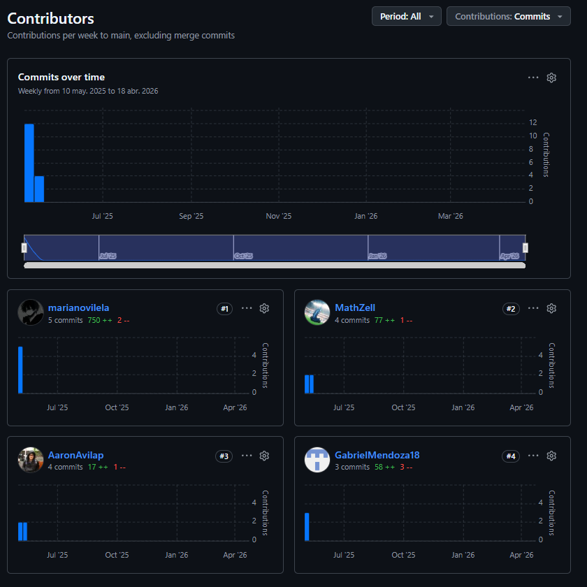

### 5.2.2. Sprint 2 
#### 5.2.2.1. Sprint Planning 2. 
El equipo de desarrollo se reunió virtualmente para definir los objetivos, tareas y entregables del segundo sprint, el cual tendrá una duración de una semana. El enfoque principal será el desarrollo del frontend de la aplicación, implementando las interfaces principales, navegación y componentes necesarios para la interacción del usuario con el sistema.

| Sprint                             | Sprint 2                                                                                                                                                                                                |
| ---------------------------------- | ------------------------------------------------------------------------------------------------------------------------------------------------------------------------------------------------------- |
|                                    | Sprint Planning Background                                                                                                                                                                              |
| Date                               | 2026/04/24                                                                                                                                                                                              |
| Time                               | 19:30 PM                                                                                                                                                                                                |
| Location                           | El desarrollo de la reunión se hizo virtualmente por medio de Discord                                                                                                                                   |
| Prepared By                        | Eslander Celis Berrospi                                                                                                                                                                                 |
| Attendees (to planning meeting)    | Eslander Celis Berrospi, Gabriel Mendoza Palacios, Rodrigo Oblitas Alcalde, Aarón Avila Palacios                                                      |
| Sprint n – 1 Review Summary        | En el sprint anterior se logró desarrollar y desplegar correctamente la Landing Page en GitHub Pages, cumpliendo con los requisitos básicos establecidos para el proyecto.                             |
| Sprint n – 1 Retrospective Summary | En esta sección los integrantes identificaron mejoras en la organización del código, distribución de tareas y optimización del tiempo para el desarrollo de las interfaces del sistema.               |
|                                    | Sprint Goal & User Stories                                                                                                                                                                             |
| Sprint 2 Goal                      | Desarrollar el frontend funcional de la aplicación, implementando las principales vistas, componentes y navegación necesarias para permitir la interacción inicial de los usuarios con el sistema. |
| Sprint 2 Velocity                  | 12                                                                                                                                                                                                      |
| Sum of Story Points                | 12                                                                                                                                                                                                      |
#### 5.2.2.2. Aspect Leaders and Collaborators. 
En el presente Sprint, el equipo trabajará en el desarrollo de la solución integral de ColdTrack, enfocándose en la implementación de funcionalidades clave para el monitoreo de temperatura en tiempo real y la gestión logística. Los principales aspectos considerados incluyen la integración de sensores IoT, el panel de administración central y la interfaz móvil para transportistas.

Cada uno de estos aspectos contará con un líder responsable de su desarrollo y colaboradores que brindarán soporte en tareas específicas, con el fin de asegurar una comunicación efectiva, una coordinación eficiente y una distribución clara de responsabilidades dentro del equipo.

A continuación, se presenta la **Leadership-and-Collaboration Matrix (LACX):**

| Team Member (Last Name, First Name) | GitHub Username | Envío & Sensores BC | Alertas & Notificaciones BC | Tracking en Tiempo Real BC | Reportes & Auditoría BC |
| :--- | :--- | :---: | :---: | :---: | :---: |
| **Vilela, Mariano** | **vilelamenendez** | **L** | **C** | **C** | **C** |
| **Avila, Aaron** | **AaronAvilap** | **C** | **C** | **C** | **L** |
| **Real Celis Berrospi, Eslander** | **Eslander-Celis** | **C** | **L** | **L** | **C** |
| **Arechaga, Mathias** | **MathZell** | **C** | **C** | **C** | **C** |
| **Oblitas, Rodrigo** | **Darkdren** | **C** | **C** | **C** | **C** |

#### 5.2.2.3. Sprint Backlog 2. 

| User Story Id | User Story Title              | Task Id | Task Description                                                      | Status |
| ------------- | ----------------------------- | ------- |-----------------------------------------------------------------------|------|
| US-016        | Ver historial de temperaturas | T03     | Desarrollar interfaz web para visualizar historial de temperaturas.   | Done |
| US-013        | Alertas de temperaturas       | T04     | Configurar lógica de generación automática de alertas de temperatura. | Done |
| US-013        | Alertas de temperaturas       | T05     | Implementar notificaciones visuales de alertas en el dashboard.       | Done |
| US-015        | Historial de alertas          | T07     | Diseñar módulo de consulta de historial de alertas.                   | Done |
| US-015        | Historial de alertas          | T08     | Implementar filtros y tipo de alerta.                                 | Done |
| US-015        | Historial de alertas          | T09     | Desarrollar tabla dinámica para visualización de alertas.             | Done |
| US-004        | Crear envío                   | T10     | Diseñar formulario de registro de nuevos envíos.                      | Done |
| US-004        | Crear envío                   | T11     | Implementar validaciones de datos para creación de envíos.            | Done |
| US-005        | Ver envíos                    | T14     | Desarrollar interfaz de visualización de envíos activos.              | Done |
| US-005        | Ver envíos                    | T15     | Agregar búsqueda de envíos por nombre.                                | Done |
| US-001        | Registro de usuario           | T16     | Diseñar formulario de registro de usuarios.                           | Done |
| US-001        | Registro de usuario           | T17     | Implementar validaciones y cifrado de contraseñas.                    | Done |
| US-002        | Inicio de sesión              | T20     | Diseñar interfaz de inicio de sesión responsive.                      | Done |
| US-002        | Inicio de sesión              | T21     | Configurar control de acceso y manejo de sesiones activas.            | Done |

#### 5.2.2.4. Development Evidence for Sprint Review

Durante el Sprint 2, el equipo se enfocó en el desarrollo del frontend de la aplicación ColdTrack, implementando las principales vistas, componentes reutilizables y funcionalidades necesarias para la interacción inicial de los usuarios con el sistema. Asimismo, se trabajó en la organización de rutas, consumo de datos simulados y mejoras visuales orientadas a la experiencia del usuario.

| Repository | Branch | Commit Id | Commit Message | Commit Message Body | Commited on (Date) |
|------------|--------|-----------|----------------|---------------------|--------------------|
| ColdTrack-Front | `main` | `8fa21bc` | `feat: initialize frontend project structure` | Se configuró la estructura inicial del proyecto frontend utilizando la arquitectura base de la aplicación. | 30/04/2026 |
| ColdTrack-Front | `main` | `1bc4d9f` | `feat: create login and register views` | Se desarrollaron las vistas de inicio de sesión y registro de usuarios. | 30/04/2026 |
| ColdTrack-Front | `develop/dashboard-module` | `2de78ab` | `feat: implement dashboard layout` | Se implementó el diseño principal del dashboard con navegación lateral y encabezado dinámico. | 01/05/2026 |
| ColdTrack-Front | `develop/dashboard-module` | `4ab91ce` | `feat: add sidebar navigation component` | Se creó un componente reutilizable para la navegación entre módulos del sistema. | 02/05/2026 |
| ColdTrack-Front | `main` | `6cd34ef` | `feat: integrate responsive styles` | Se añadieron estilos responsivos para optimizar la visualización en dispositivos móviles y escritorio. | 02/05/2026 |
| ColdTrack-Front | `feature/product-management` | `7ef45da` | `feat: create product management view` | Se implementó la vista de gestión de productos con tablas y formularios básicos. | 03/05/2026 |
| ColdTrack-Front | `feature/api-integration` | `91ab3fd` | `feat: connect frontend with mock API services` | Se integró el frontend con servicios simulados para pruebas de carga y visualización de datos. | 5/05/2026 |
| ColdTrack-Front | `feature/ui-improvements` | `ac56d2e` | `feat: improve UI components and buttons` | Se realizaron mejoras visuales en botones, tarjetas y componentes de interfaz. | 7/05/2026 |
| ColdTrack-Front | `bugfix/form-validations` | `bd781fa` | `fix: add validation to user forms` | Se corrigieron validaciones en formularios para evitar datos inválidos en los registros. | 09/05/2026 |
| ColdTrack-Front | `main` | `ce92ab4` | `feat: deploy frontend prototype` | Se realizó el despliegue inicial del frontend funcional para revisión del sprint. | 10/05/2026 |

Los commits presentados evidencian el avance progresivo del Sprint 2, mostrando la construcción de un frontend funcional con componentes reutilizables, vistas principales y mejoras enfocadas en la experiencia del usuario y la estructura de la aplicación.
#### 5.2.2.5. Execution Evidence for Sprint Review. 

La aplicación resultante permite recorrer los principales flujos operativos de ColdTrack. Para la revisión del sprint se validaron las siguientes funcionalidades:

**Levantamiento del proyecto:** 

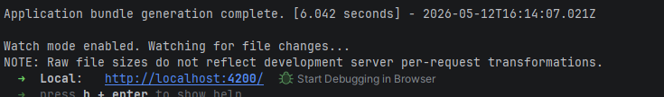

**Levantamiento del db.js:** 

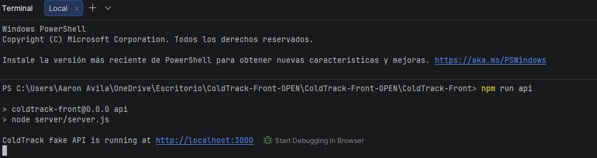

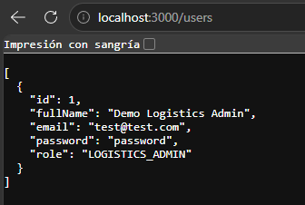

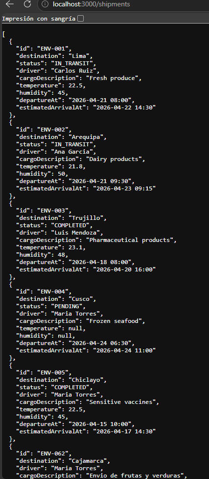

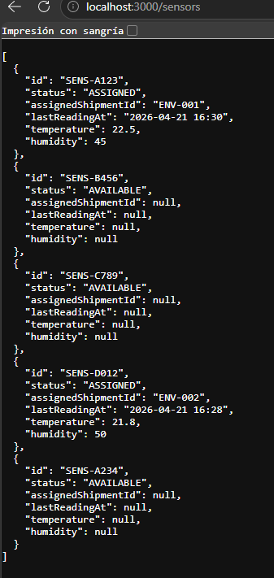

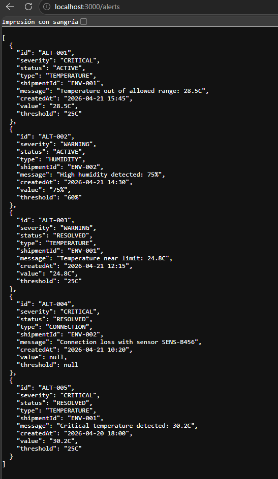

1. **Autenticación de usuario:** el usuario puede iniciar sesión con la cuenta demo `test@test.com / password`, registrar una nueva cuenta y cerrar sesión.
   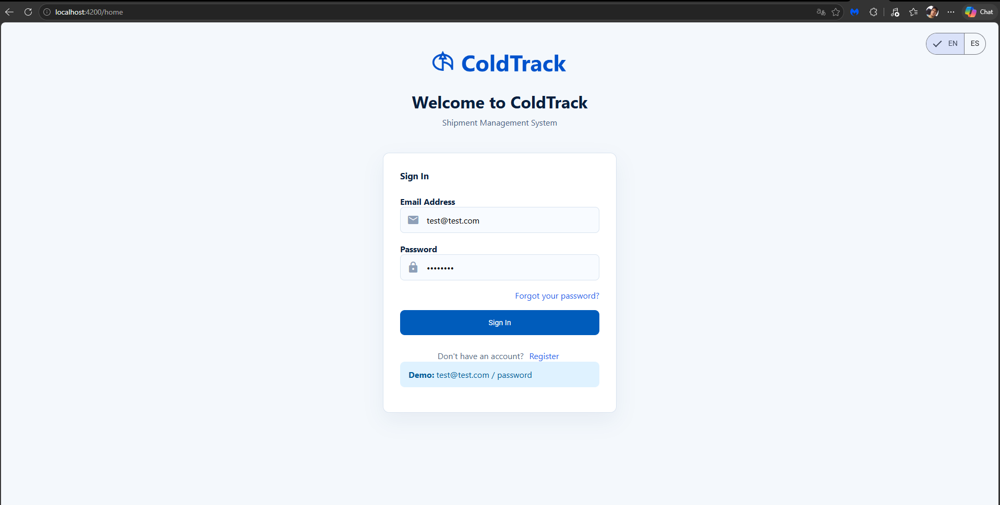
2. **Dashboard operativo:** se visualizan métricas de envíos registrados, envíos activos, envíos completados y alertas activas.
   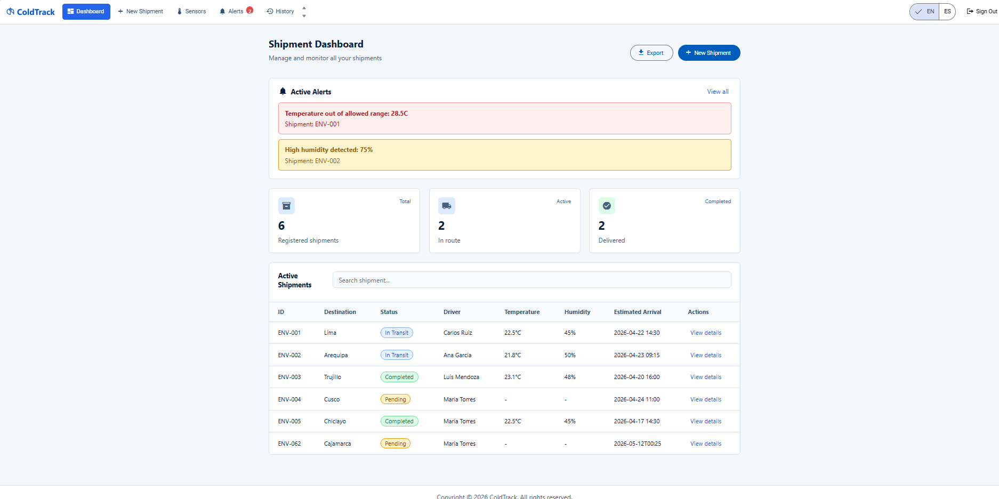
3. **Registro de envíos:** el usuario puede crear un nuevo envío indicando destino, conductor, descripción de carga, fecha de salida y fecha estimada de llegada.
    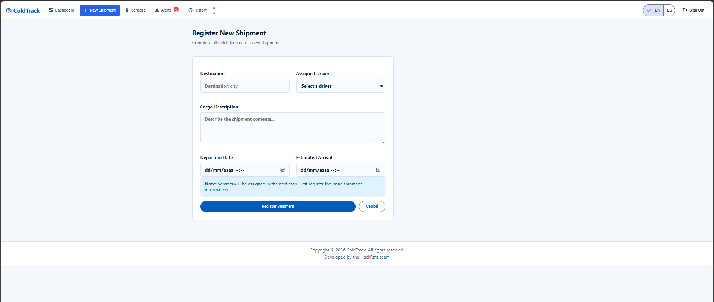
4. **Listado de envíos:** se muestra una tabla con ID, destino, estado, conductor, temperatura, humedad y fecha estimada.
   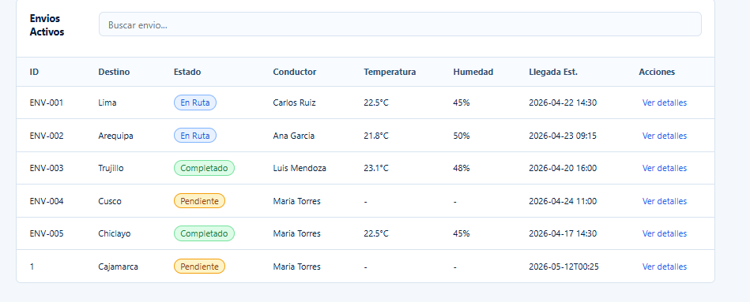
5. **Gestión de sensores:** se visualizan sensores asignados y disponibles, además de permitir registrar nuevos sensores.
    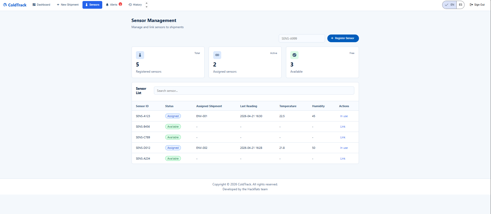
6. **Gestión de alertas:** se listan alertas activas y resueltas, con filtros por severidad, estado y búsqueda textual.
    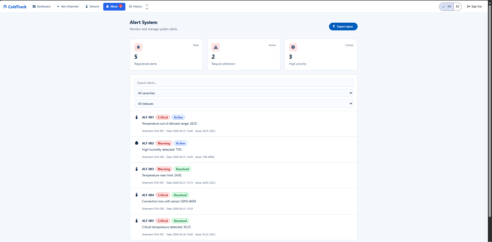
7. **Historial de envíos:** se muestran envíos completados y datos de temperatura promedio.
     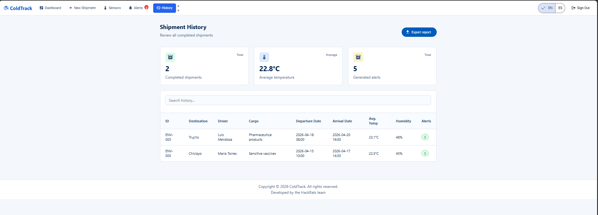
8. **Internacionalización:** la interfaz permite alternar entre inglés y español desde la barra superior.
    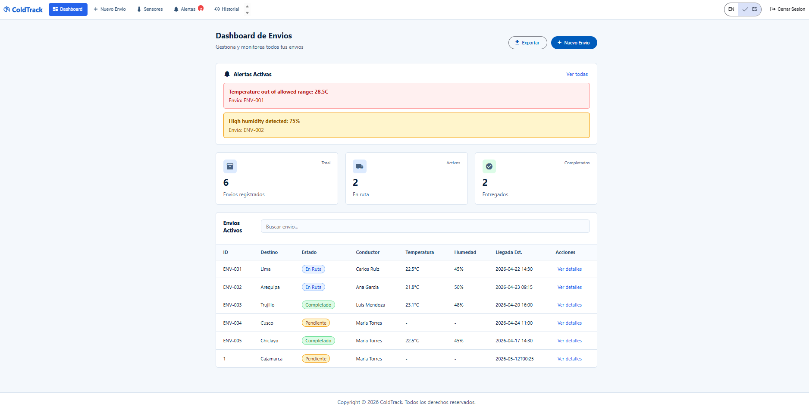

Desde el punto de vista técnico, la ejecución se validó mediante:

- Compilación de producción con `npx ng build`.
- Prueba de consumo de MockAPI.io para el usuario demo.
- Verificación del sitio desplegado en Firebase Hosting con respuesta HTTP `200 OK`.
- Revisión del bundle generado para confirmar que el endpoint productivo apunta a MockAPI.io.

#### 5.2.2.6. Services Documentation Evidence for Sprint Review. 

Durante el Sprint 2, el equipo se enfocó en el desarrollo técnico y visual del frontend y backend del proyecto, empleando Angular y TypeScript para la creación de interfaces dinámicas, componentes reutilizables y funcionalidades interactivas que mejoran la experiencia de usuario dentro de la aplicación web.

Asimismo, se preparó y configuró el repositorio destinado al desarrollo de la lógica del backend y a la implementación de servicios y endpoints REST, los cuales permitirán la comunicación e integración de los distintos módulos del sistema en los próximos sprints.

#### 5.2.2.7. Software Deployment Evidence for Sprint Review.
La Web Application fue desplegada mediante **Firebase Hosting**, ya que el proyecto Angular genera archivos estáticos optimizados para producción y Firebase permite publicarlos con reglas de navegación compatibles con Single Page Applications.

| Item | Description |
|------|-------------|
| Plataforma de despliegue | Firebase Hosting |
| Proyecto Firebase | `coldtrack-front-open` |
| Carpeta publicada | `dist/coldtrack-front/browser` |
| Comando de build | `npx ng build` |
| Comando de deploy | `npx firebase deploy --only hosting --project coldtrack-front-open` |
| URL desplegada principal | https://coldtrack-front-open.web.app |
| URL desplegada secundaria | https://coldtrack-front-open.firebaseapp.com |
| API productiva | https://6a028d0d0d92f63dd253bedc.mockapi.io/api/v1 |

**Configuración seguida para Firebase Hosting:**

1. Se instaló y verificó Firebase CLI.
2. Se identificó el proyecto Firebase `coldtrack-front-open`.
3. Se configuró `.firebaserc` con el proyecto por defecto.
4. Se configuró `firebase.json` para publicar `dist/coldtrack-front/browser`.
5. Se agregó una regla de `rewrites` para redirigir todas las rutas a `index.html`.
6. Se ejecutó `npx ng build` para generar la versión productiva.
7. Se ejecutó el despliegue mediante Firebase Hosting.
8. Se verificó que la URL pública responda correctamente.

Archivo `.firebaserc`:

```json
{
  "projects": {
    "default": "coldtrack-front-open"
  }
}
```

Archivo `firebase.json`:

```json
{
  "hosting": {
    "public": "dist/coldtrack-front/browser",
    "ignore": [
      "firebase.json",
      "**/.*",
      "**/node_modules/**"
    ],
    "rewrites": [
      {
        "source": "**",
        "destination": "/index.html"
      }
    ]
  }
}
```

Comandos utilizados:

```bash
npx ng build
npx firebase deploy --only hosting --project coldtrack-front-open
```

La regla de `rewrites` fue necesaria porque ColdTrack es una Single Page Application construida con Angular. De esta forma, Firebase entrega `index.html` cuando el usuario actualiza la página o ingresa directamente a una ruta interna de la aplicación.

 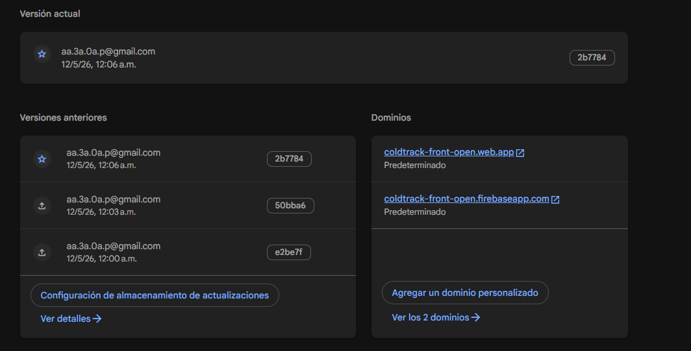

**Autenticación de usuario:** el usuario puede iniciar sesión con la cuenta demo `test@test.com / password`, registrar una nueva cuenta y cerrar sesión.

   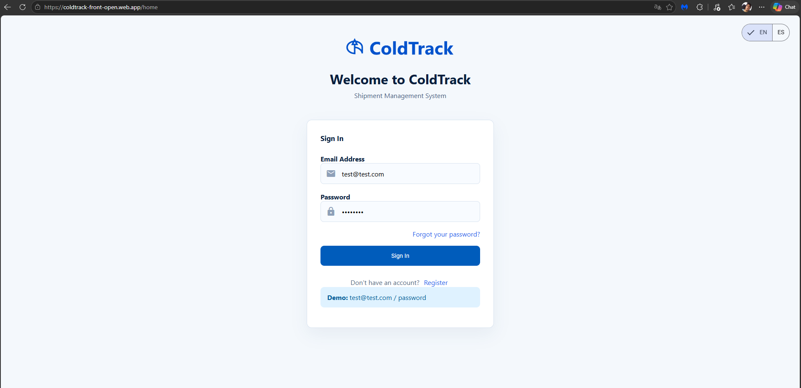
   
**Dashboard operativo:** se visualizan métricas de envíos registrados, envíos activos, envíos completados y alertas activas.

   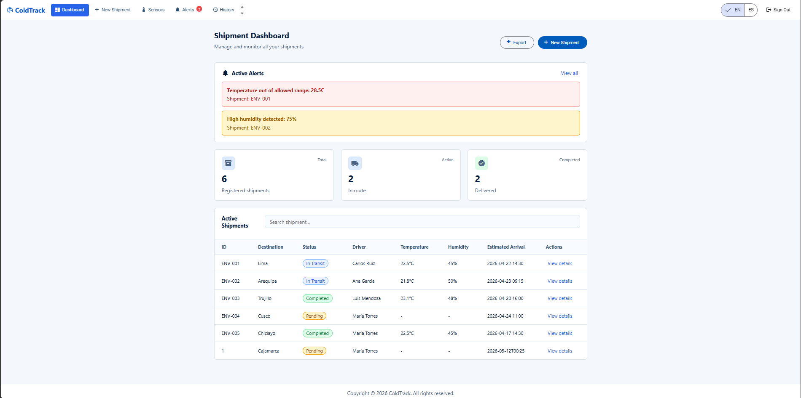
   
**Registro de envíos:** el usuario puede crear un nuevo envío indicando destino, conductor, descripción de carga, fecha de salida y fecha estimada de llegada.

  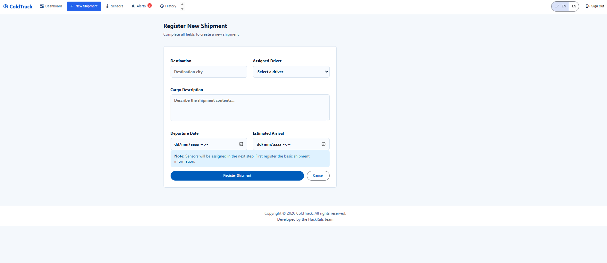
    
**Listado de envíos:** se muestra una tabla con ID, destino, estado, conductor, temperatura, humedad y fecha estimada.

   
   
**Gestión de sensores:** se visualizan sensores asignados y disponibles, además de permitir registrar nuevos sensores.

   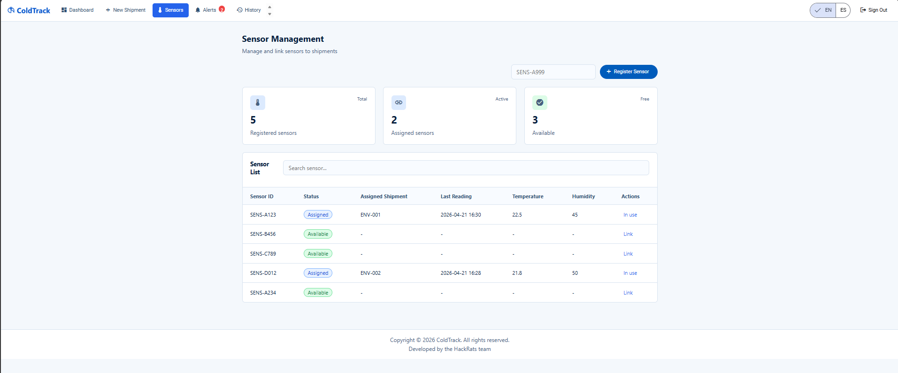
   
**Gestión de alertas:** se listan alertas activas y resueltas, con filtros por severidad, estado y búsqueda textual.

 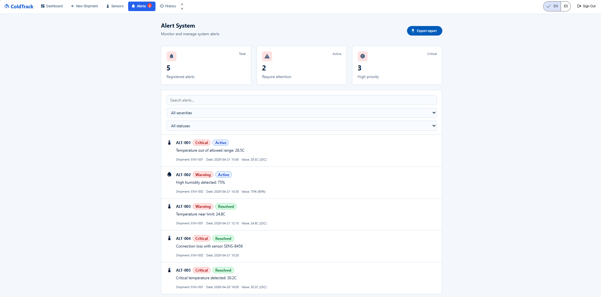
 
**Historial de envíos:** se muestran envíos completados y datos de temperatura promedio.

   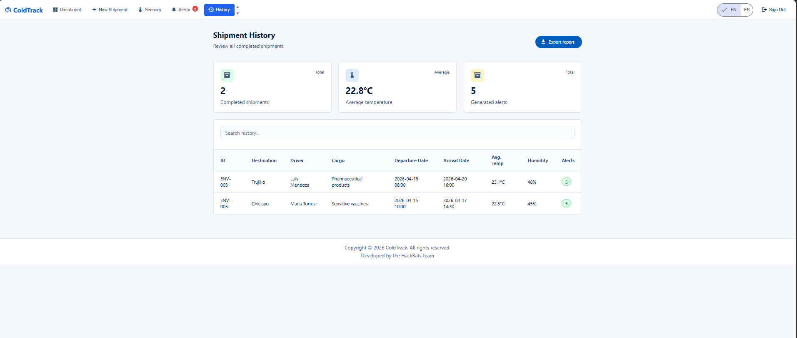
   
**Internacionalización:** la interfaz permite alternar entre inglés y español desde la barra superior.

 

#### 5.2.2.8. Team Collaboration Insights during Sprint.
En este sprint, las tareas se organizaron en torno al modelado de dominio y la configuración inicial de la arquitectura para el sistema de logística de cadena de frío. La responsabilidad del desarrollo y la implementación técnica recayó en Mariano Vilela, Aaron Avila, Eslander Celis Berrospi, Mathias Arechaga y Rodrigo Oblitas.
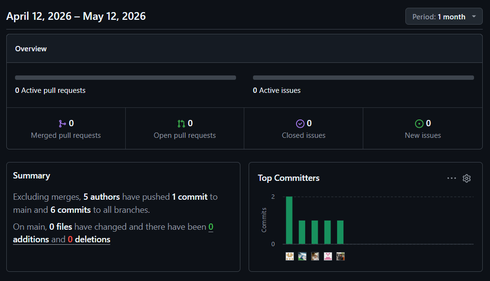
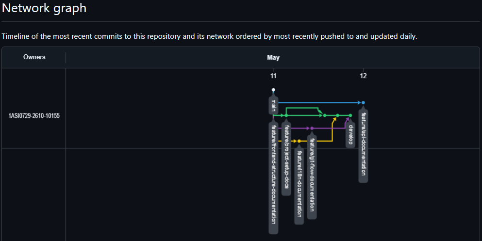

## Conclusiones

## Bibliografía

•	LucidChart. (2010). LucidChart. Lucid Software Inc. `https://www.lucidchart.com`

•	Trello(2011). Trello. Atlassian. `https://trello.com/`

•	Pivotal Tracker (2008). Pivotal Tracker. VMware, Inc. `https://www.pivotaltracker.com/`

•	Figma (2016). Figma. Figma, Inc.  `https://www.figma.com/`

•	Schwaber, K., & Sutherland, J. (2020). The Scrum Guide: The definitive guide to Scrum: The rules of the game. Scrum.org. `https://scrumguides.org/`

•	ProgressaLean. (2014). 5W+2H: Técnica de análisis de problemas. `https://www.progressalean.com/5w2h-tecnica-de-analisis-de-problemas/`

•	IBM. (2022). As-is Scenario Map. `https://www.ibm.com/design/thinking/page/toolkit/activity/as-is-scenario-map`

•	IBM. (s. f.). Empathy Map. `https://www.ibm.com/design/thinking/page/toolkit/activity/empathy-map`

•	Browne, C. (2022). What are user flows in UX design? .CareerFoundry. `https://careerfoundry.com/en/blog/ux-design/what-are-user-flows/`

•	Structurizr. (s. f.). Embedding diagrams. `https://docs.structurizr.com/cloud/embed`

•	Structurizr. (s. f.). Structurizr. `https://structurizr.com/`

• Loy, M., Niemeyer, P., & Leuck, D. (2023). Learning Java (6th edition). O’Reilly.

• Sciore, E. (2018). Java Program Design: Principles, Polymorphism, and Patterns. Apress L. P.

• Heckler, M. (2021). Spring Boot:  Up and Running (1st edition). O’Reilly Media, Inc.

• Modern API Development with Spring and Spring Boot. (2021). Packt Publishing.

• Kotaru, V. Keerti. author. (2020). Angular for Material Design Leverage Angular Material and TypeScript to Build a Rich User Interface for Web Apps  (1st ed. 2020.). Apress. `https://doi.org/10.1007/978-1-4842-5434-9`

• Karanam, R. R. (2017). Mastering Spring 5.0. Packt Publishing, Limited.

• Gutierrez, F. (2018). Pro Spring Boot 2: An Authoritative Guide to Building Microservices, Web and Enterprise Applications, and Best Practices. Apress L. P.

# Anexos
**Anexo A:**
Videos de Exposiciones
AV1: https://upcedupe-my.sharepoint.com/:v:/g/personal/u201911249_upc_edu_pe/IQBOBOCNiucHS5sxaF6NQxhAAcjIxyjyq0SMuPlVnGwHoMk?e=44emzC&nav=eyJyZWZlcnJhbEluZm8iOnsicmVmZXJyYWxBcHAiOiJTdHJlYW1XZWJBcHAiLCJyZWZlcnJhbFZpZXciOiJTaGFyZURpYWxvZy1MaW5rIiwicmVmZXJyYWxBcHBQbGF0Zm9ybSI6IldlYiIsInJlZmVycmFsTW9kZSI6InZpZXcifX0%3D
