<div align="center">
   <br><br>
   

   <p>Universidad Peruana de Ciencias Aplicadas</p>
   <p>Carrera de Ingeniería de Software</p>

   <br>
   <p><strong>1ASI0729</strong></p>
   <p><strong>Desarrollo de Aplicaciones Open Source</strong></p>
   <p>NRC</p>
   <p><strong>10155</strong></p>
   <h3>Informe del Trabajo Final</h3>
   <p>Docente</p>
   <p><strong>Mori Paiva, Hugo Allan</strong></p>
   <p>Equipo</p>
   <p><strong>FreshGuard</strong></p>

   <br>
   <p>Proyecto</p>
   <p><strong>ColdTrack</strong></p>

   <br>
   <p><strong>Integrantes</strong></p>
   <p><strong>Código&nbsp;&nbsp;&nbsp;&nbsp;&nbsp;&nbsp;&nbsp;&nbsp;Apellidos y Nombres</strong></p>
   <p>U201911249&nbsp;&nbsp;&nbsp;&nbsp;Celis Berrospi, Eslander</p>
   <p>U201918216&nbsp;&nbsp;&nbsp;&nbsp;Vilela Menendez, Mariano</p>
   <p>U20221G185&nbsp;&nbsp;&nbsp;&nbsp;Oblitas Alcalde, Rodrigo</p>
   <p>U201823654&nbsp;&nbsp;&nbsp;&nbsp;Avila Palacios, Aarón</p>
   <p>U202320699&nbsp;&nbsp;&nbsp;&nbsp;Arechaga Saavedra, Mathias</p>

   <br>
   <p><strong>Período 202610</strong></p>

   <br>
   <p><strong>Junio 2026</strong></p>
</div>

<div style="page-break-before: always;"></div>

# Registro de Versiones del Informe
| Versión | Fecha      | Autor(es)                 | Descripción                                                                                                       |
|---------|------------|---------------------------|-------------------------------------------------------------------------------------------------------------------|
| 1.1     | 12/04/2026 | Eslander Celis Berrospi   | Desarrollo del capítulo I: Introducción.                                                                          |
| 1.2     | 18/04/2026 | Eslander Celis Berrospi   | Desarrollo del capítulo III: Requirements specification.                                                          |
| 1.3     | 22/04/2026 | Eslander Celis Berrospi   | Actualización del Student Outcome y consolidación de evidencias iniciales.                                        |
| 1.4     | 22/04/2026 | Aarón Avila Palacios      | Desarrollo del capítulo V y evidencias de implementación.                                                         |
| 1.5     | 22/04/2026 | Aarón Avila Palacios      | Desarrollo del capítulo II: Empathy Mapping, As-is Scenario Mapping y Ubiquitous Language.                        |
| 1.6     | 23/04/2026 | Mathias Arechaga Saavedra | Desarrollo del capítulo IV: Web App Wireframes, Mock-ups y Wireflows.                                             |
| 1.7     | 23/04/2026 | Mathias Arechaga Saavedra | Desarrollo del capítulo II: User Personas, User Task Matrix y Journey Map.                                        |
| 2.1     | 11/05/2026 | Aarón Avila Palacios      | Desarrollo de evidencias del Sprint 2, despliegue frontend y capturas de participación de la entrega TB2.         |
| 2.2     | 12/05/2026 | Mariano Vilela Menendez   | Actualización de Team Collaboration Insights, evidencias de commits y participación del Sprint 2.                 |
| 3.0     | 18/06/2026 | Aarón Avila Palacios      | Incorporación de la estructura del Sprint 3 y evidencias iniciales para AV2.                                      |
| 3.1     | 18/06/2026 | Eslander Celis Berrospi   | Actualización del Student Outcome para AV2 y registro de aportes del equipo.                                      |
| 3.2     | 18/06/2026 | Mathias Arechaga Saavedra | Actualización del Sprint Backlog 3 y documentación de servicios del backend.                                      |
| 3.3     | 18/06/2026 | Mariano Vilela Menendez   | Actualización de imágenes, distribución de commits y Team Collaboration Insights.                                 |
| 3.4     | 18/06/2026 | Aarón Avila Palacios      | Desarrollo de evidencias de ejecución y despliegue del Sprint 3.                                                  |
| 3.5     | 18/06/2026 | Mathias Arechaga Saavedra | Actualización y desarrollo del Sprint Backlog 4 y documentación de servicios del backend.                         |
| 3.6     | 19/06/2026 | Rodrigo Oblitas Alcalde   | Desarrollo y cierre de entrevistas de validación, actualización del video y ajustes finales de AV2.               |
| 3.7     | 04/07/2026 | Aarón Avila Palacios      | Actualización final TB2: evidencias de ejecución, despliegue, releases y conclusiones.                            |
| 3.8     | 05/07/2026 | Rodrigo Oblitas Alcalde   | Corrección de carátula, Lean UX Process, registro de versiones, evidencias TB2/AV2 y Lean UX Canvas.              |
| 3.9     | 08/07/2026 | Aarón Avila Palacios      | Corrección final según rúbrica TB2: índice, evidencias de colaboración, Sprint 4, servicios, despliegue y videos. |


# Project Report Collaboration Insights

#### Repositorio del informe del proyecto
El informe del proyecto se encuentra alojado en el siguiente repositorio de la organización de GitHub del equipo:

- 🔗 Enlace de la organización: https://github.com/1ASI0729-2610-10155
- 🔗 Enlace de repositorios: https://github.com/orgs/1ASI0729-2610-10155/repositories

A continuación, se detallan las actividades realizadas en cada entrega, la participación de los miembros del equipo y las evidencias correspondientes.

## AV1
Para la primera entrega (AV1) se trabajó en la estructura inicial del informe, definiendo el índice, la organización del repositorio y la distribución de responsabilidades entre los miembros del equipo. En esta etapa se consolidó la presentación inicial de la startup FreshGuard y del producto ColdTrack, así como la descripción del problema, los segmentos objetivo y los primeros artefactos de análisis requeridos para sustentar la solución.

También se avanzó con el Lean UX Process, la identificación de necesidades de los usuarios, los primeros elementos de Requirements Elicitation & Analysis y la planificación de entregables para las siguientes fases. Esta entrega permitió establecer una base común de trabajo, ordenar el contenido del informe y alinear al equipo sobre el alcance funcional y documental del proyecto.


## TB1
Para la entrega TB1 se desarrolló el avance correspondiente al Sprint 2, enfocado principalmente en la implementación de la Web Application de ColdTrack. El equipo trabajó en la construcción del frontend, la navegación entre vistas, el registro e inicio de sesión, la gestión de envíos, el dashboard operativo, el módulo de sensores, las alertas, el historial y el soporte de los principales flujos de interacción.

Asimismo, se documentaron las evidencias de desarrollo, ejecución y despliegue, incluyendo capturas de la aplicación, configuración de entorno, conexión con datos simulados y publicación del producto para su revisión. Esta etapa permitió transformar los artefactos de diseño y requerimientos en una aplicación funcional inicial, preparada para integrarse posteriormente con los Web Services del Sprint 3.


## AV2
Para la segunda entrega (AV2) se completó la integración del producto ColdTrack, consolidando el trabajo realizado en el Sprint 3. Durante esta etapa se documentaron las evidencias de ejecución y despliegue, la conexión entre la Web Application y los Web Services, la persistencia en MySQL, la autenticación, los flujos de envíos, sensores, telemetría, alertas, historial y generación de reportes.

Además, se actualizaron las secciones de Student Outcome, conclusiones, recomendaciones, Video About-the-Product, Video About-the-Team y entrevistas de validación. La participación del equipo quedó reflejada en el historial de Git, donde se registraron contribuciones mediante commits, documentación, capturas, evidencias de despliegue y ajustes finales del informe.

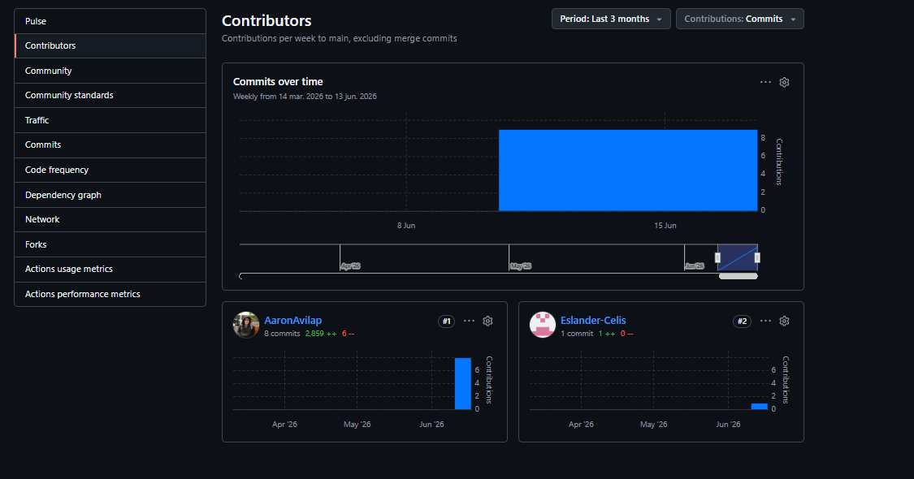

## TB2
Para la entrega final TB2 se consolidó el Release Review de ColdTrack, integrando las correcciones de los artefactos previos, la versión final del Landing Page, la Web Application, los Web Services, la base de datos MySQL, la documentación OpenAPI, las releases finales y las evidencias de colaboración del equipo.

En esta etapa se documentó la ejecución productiva de la solución, el despliegue final en Firebase Hosting y Render, la persistencia en Filess.io, la actualización de los videos About-the-Product y About-the-Team, las entrevistas de validación, las conclusiones finales y la participación del equipo en el repositorio del informe.

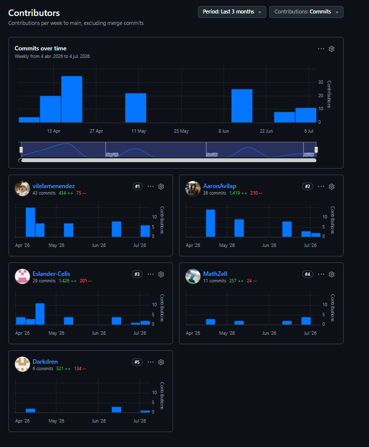


## Contenido

* [Registro de Versiones del Informe](#registro-de-versiones-del-informe)

* [Project Report Collaboration Insights](#project-report-collaboration-insights)

* [Student Outcome](#student-outcome)

* [Capitulo I: Introducción](#capitulo-i-introducción)

  * [1.1. Startup Profile](#11-startup-profile)

    * [1.1.1. Descripcion de la Startup](#111-descripcion-de-la-startup)
    * [1.1.2. Perfiles de integrantes del equipo](#112-perfiles-de-integrantes-del-equipo)
  * [1.2. Solution Profile](#12-solution-profile)

    * [1.2.1. Antecedentes y problematica](#121-antecedentes-y-problematica)
    * [1.2.2. Lean UX Process](#122-lean-ux-process)

      * [1.2.2.1. Lean UX Problem Statements](#1221-lean-ux-problem-statements)
      * [1.2.2.2. Lean UX Assumptions](#1222-lean-ux-assumptions)
      * [1.2.2.3. Lean UX Hypothesis Statements](#1223-lean-ux-hypothesis-statements)
      * [1.2.2.4. Lean UX Canvas](#1224-lean-ux-canvas)
  * [1.3. Segmentos Objetivo](#13-segmentos-objetivo)

    * [Segmento Objetivo 1: Personal de Logística y Operaciones](#segmento-objetivo-1-personal-de-logística-y-operaciones)
    * [Segmento Objetivo 2: Personal de Transporte](#segmento-objetivo-2-personal-de-transporte)

* [Capitulo II: Requirements Elicitation & Analysis](#capitulo-ii-requirements-elicitation--analysis)

  * [2.1. Competidores](#21-competidores)

    * [2.1.1. Analisis competitivo](#211-analisis-competitivo)
    * [2.1.2. Estrategias y tacticas frente a competidores](#212-estrategias-y-tacticas-frente-a-competidores)
  * [2.2. Entrevistas](#22-entrevistas)

    * [2.2.1. Diseno de entrevistas](#221-diseno-de-entrevistas)
    * [2.2.2. Registro de entrevistas](#222-registro-de-entrevistas)
    * [2.2.3. Analisis de entrevistas](#223-analisis-de-entrevistas)
  * [2.3. Needfinding](#23-needfinding)

    * [2.3.1. User Personas](#231-user-personas)
    * [2.3.2. User Task Matrix](#232-user-task-matrix)
    * [2.3.3. User Journey Mapping](#233-user-journey-mapping)
    * [2.3.4. Empathy Mapping](#234-empathy-mapping)
    * [2.3.5. As-is Scenario Mapping](#235-as-is-scenario-mapping)
  * [2.4. Big Picture Event Storming](#24-big-picture-event-storming)
  * [2.5. Ubiquitous Language](#25-ubiquitous-language)

* [Capitulo III: Requirements specification](#capitulo-iii-requirements-specification)

  * [3.1. To-Be Scenario Mapping](#31-to-be-scenario-mapping)
  * [3.2. User Stories](#32-user-stories)
  * [3.3. Impact Mapping](#33-impact-mapping)
  * [3.4. Product Backlog](#34-product-backlog)

* [Capitulo IV: Product Design](#capitulo-iv-product-design)

  * [4.1. Style Guidelines](#41-style-guidelines)

    * [4.1.1. General Style Guidelines](#411-general-style-guidelines)
    * [4.1.2. Web Style Guidelines](#412-web-style-guidelines)
  * [4.2. Information Architecture](#42-information-architecture)

    * [4.2.1. Organization Systems](#421-organization-systems)
    * [4.2.2. Labeling Systems](#422-labeling-systems)
    * [4.2.3. SEO Tags and Meta Tags](#423-seo-tags-and-meta-tags)
    * [4.2.4. Searching Systems](#424-searching-systems)
    * [4.2.5. Navigation Systems](#425-navigation-systems)
  * [4.3. Landing Page UI Design](#43-landing-page-ui-design)

    * [4.3.1. Landing Page Wireframe](#431-landing-page-wireframe)
    * [4.3.2. Landing Page Mock-up](#432-landing-page-mock-up)
  * [4.4. Web Applications UX/UI Design](#44-web-applications-uxui-design)

    * [4.4.1. Web Applications Wireframes](#441-web-applications-wireframes)
    * [4.4.2. Web Applications Wireflow Diagrams](#442-web-applications-wireflow-diagrams)
    * [4.4.3. Web Applications Mock-ups](#443-web-applications-mock-ups)
    * [4.4.4. Web Applications User Flow Diagrams](#444-web-applications-user-flow-diagrams)
  * [4.5. Web Applications Prototyping](#45-web-applications-prototyping)
  * [4.6. Domain-Driven Software Architecture](#46-domain-driven-software-architecture)

    * [4.6.1. Software Architecture Context Diagram](#461-software-architecture-context-diagram)
    * [4.6.2. Software Architecture Container Diagrams](#462-software-architecture-container-diagrams)
    * [4.6.3. Software Architecture Container Diagrams](#463-software-architecture-container-diagrams)
    * [4.6.4. Software Architecture Components Diagrams](#464-software-architecture-components-diagrams)
  * [4.7. Software Object-Oriented Design](#47-software-object-oriented-design)

    * [4.7.1. Class Diagrams](#471-class-diagrams)
    * [4.7.2. Class Dictionary](#472-class-dictionary)
  * [4.8. Database Design](#48-database-design)

    * [4.8.1. Database Diagram](#481-database-diagram)

* [Capitulo V: Product Implementation, Validation & Deployment](#capitulo-v-product-implementation-validation--deployment)

  * [5.1. Software Configuration Management](#51-software-configuration-management)

    * [5.1.1. Software Development Environment Configuration](#511-software-development-environment-configuration)
    * [5.1.2. Source Code Management](#512-source-code-management)
    * [5.1.3. Source Code Style Guide & Conventions](#513-source-code-style-guide--conventions)
    * [5.1.4. Software Deployment Configuration](#514-software-deployment-configuration)

  * [5.2. Landing Page, Services & Applications Implementation](#52-landing-page-services--applications-implementation)

    * [5.2.1. Sprint 1](#521-sprint-1)

      * [5.2.1.1. Sprint Planning 1](#5211-sprint-planning-1)
      * [5.2.1.2. Aspect Leaders and Collaborators](#5212-aspect-leaders-and-collaborators)
      * [5.2.1.3. Sprint Backlog 1](#5213-sprint-backlog-1)
      * [5.2.1.4. Development Evidence for Sprint Review](#5214-development-evidence-for-sprint-review)
      * [5.2.1.5. Execution Evidence for Sprint Review](#5215-execution-evidence-for-sprint-review)
      * [5.2.1.6. Services Documentation Evidence for Sprint Review](#5216-services-documentation-evidence-for-sprint-review)
      * [5.2.1.7. Software Deployment Evidence for Sprint Review](#5217-software-deployment-evidence-for-sprint-review)
      * [5.2.1.8. Team Collaboration Insights during Sprint](#5218-team-collaboration-insights-during-sprint)
        
    * [5.2.2. Sprint 2](#522-sprint-2)

      * [5.2.2.1. Sprint Planning 2](#5221-sprint-planning-2)
      * [5.2.2.2. Aspect Leaders and Collaborators](#5222-aspect-leaders-and-collaborators)
      * [5.2.2.3. Sprint Backlog 2](#5223-sprint-backlog-2)
      * [5.2.2.4. Development Evidence for Sprint Review](#5224-development-evidence-for-sprint-review)
      * [5.2.2.5. Execution Evidence for Sprint Review](#5225-execution-evidence-for-sprint-review)
      * [5.2.2.6. Services Documentation Evidence for Sprint Review](#5226-services-documentation-evidence-for-sprint-review)
      * [5.2.2.7. Software Deployment Evidence for Sprint Review](#5227-software-deployment-evidence-for-sprint-review)
      * [5.2.2.8. Team Collaboration Insights during Sprint](#5228-team-collaboration-insights-during-sprint)
    * [5.2.3. Sprint 3](#523-sprint-3)

      * [5.2.3.1. Sprint Planning 3](#5231-sprint-planning-3)
      * [5.2.3.2. Aspect Leaders and Collaborators](#5232-aspect-leaders-and-collaborators)
      * [5.2.3.3. Sprint Backlog 3](#5233-sprint-backlog-3)
      * [5.2.3.4. Development Evidence for Sprint Review](#5234-development-evidence-for-sprint-review)
      * [5.2.3.5. Execution Evidence for Sprint Review](#5235-execution-evidence-for-sprint-review)
      * [5.2.3.6. Services Documentation Evidence for Sprint Review](#5236-services-documentation-evidence-for-sprint-review)
      * [5.2.3.7. Software Deployment Evidence for Sprint Review](#5237-software-deployment-evidence-for-sprint-review)
      * [5.2.3.8. Team Collaboration Insights during Sprint](#5238-team-collaboration-insights-during-sprint)

    * [5.2.4. Sprint 4](#524-sprint-4)

      * [5.2.4.1. Sprint Planning 4](#5241-sprint-planning-4)
      * [5.2.4.2. Aspect Leaders and Collaborators](#5242-aspect-leaders-and-collaborators)
      * [5.2.4.3. Sprint Backlog 4](#5243-sprint-backlog-4)
      * [5.2.4.4. Development Evidence for Sprint Review](#5244-development-evidence-for-sprint-review)
      * [5.2.4.5. Execution Evidence for Sprint Review](#5245-execution-evidence-for-sprint-review)
      * [5.2.4.6. Services Documentation Evidence for Sprint Review](#5246-services-documentation-evidence-for-sprint-review)
      * [5.2.4.7. Software Deployment Evidence for Sprint Review](#5247-software-deployment-evidence-for-sprint-review)
      * [5.2.4.8. Team Collaboration Insights during Sprint](#5248-team-collaboration-insights-during-sprint)

    * [5.3. Validation Interviews](#53-validation-interviews)
    * [5.3.1. Diseño de Entrevistas](#531-diseño-de-entrevistas)
    * [5.3.2. Registro de Entrevistas](#532-registro-de-entrevistas)
    * [5.3.3. Evaluaciones según heurísticas](#533-evaluaciones-según-heurísticas)

* [5.4. Video About-the-Product](#54-video-about-the-product)
* [5.5. Video About-the-Team](#55-video-about-the-team)
* [Conclusiones](#conclusiones)
* [Bibliografía](#bibliografía)
* [Anexos](#anexos)


# Student Outcome

ABET – EAC - Student Outcome 3

Capacidad de comunicarse efectivamente con un rango de audiencias.
En el siguiente cuadro se describe las acciones realizadas y enunciados de
conclusiones por parte del grupo, que permiten sustentar el haber alcanzado el logro del ABET – EAC - Student Outcome 3.

<table>
   <tr>
        <th>CRITERIO ESPECIFICO</th>
        <th>ACCIONES REALIZADAS</th>
        <th>CONCLUSIONES</th>
    </tr>
    <tr>
        <th> Comunica oralmente con efectividad a diferentes rangos de audiencia.</th>
        <td>
         <b>Aarón Avila: AV1</b><br>
         Durante el desarrollo del proyecto, participé activamente en la explicación de herramientas como el Empathy Mapping, As-is Scenario Mapping y el Ubiquitous Language, así como en la presentación del proceso de implementación y validación del producto. Me enfoqué en transmitir las ideas de forma clara y comprensible, adaptando el lenguaje según el público, para facilitar la comprensión tanto de aspectos técnicos como de experiencia de usuario.<br><br> 
         <b>Eslander Celis: AV1</b><br>
         Durante el desarrollo del proyecto, fortalecí mi comunicación oral al presentar y explicar temas como la descripción de la startup, los antecedentes y la problemática, así como la definición de los segmentos objetivos. También participé en exposiciones sobre los User Stories, el Product Backlog y el Impact Map, procurando transmitir las ideas de forma clara y ordenada. Me enfoqué en adaptar mi discurso según el tipo de audiencia, ya sea técnica o no técnica, para asegurar que la información sea entendida y aporte al trabajo en equipo.<br><br> 
         <b>Rodrigo Oblitas: AV1</b><br>
         Durante el proyecto, desarrollé mi comunicación oral al explicar conceptos del Lean UX Process, como el Problem Statement, Assumptions e Hypothesis, además de participar en la presentación de la Landing Page. Procuré expresar las ideas de manera clara y estructurada, facilitando la comprensión de los enfoques planteados y adaptando el contenido según la audiencia.<br><br> 
         <b>Mathias Arechaga: AV1</b><br>
         Durante el desarrollo del proyecto, participé en la exposición de herramientas de diseño centrado en el usuario, como User Personas, User Journey Mapping y prototipos de la aplicación web. Me enfoqué en explicar de forma clara los flujos, interfaces y funcionalidades, adaptando mi lenguaje para que tanto aspectos técnicos como visuales sean entendidos por todos.<br><br> 
         <b>Mariano Vilela: AV1</b><br>
         Durante el proyecto, fortalecí mi comunicación oral al presentar el análisis de competidores, el diseño y resultados de entrevistas, así como el To-Be Scenario Mapping e Impact Mapping. Procuré transmitir la información de forma ordenada y clara, facilitando la comprensión de los hallazgos y su impacto en la propuesta de solución.<br><br> 
            <b>Aarón Avila: TB2</b><br>
Durante esta entrega, participé en la presentación del frontend de la aplicación ColdTrack, explicando la estructura de las vistas, la navegación entre módulos y el funcionamiento de los componentes implementados. Procuré comunicar de manera clara el propósito de cada interfaz y cómo estas mejoran la experiencia del usuario, adaptando mi explicación según el nivel técnico de la audiencia.<br><br> 

<b>Eslander Celis: TB2</b><br>
Durante el desarrollo del frontend de ColdTrack, fortalecí mi comunicación oral al exponer la implementación de las principales funcionalidades de la aplicación, incluyendo las vistas de autenticación, dashboard y gestión de productos. Expliqué de manera ordenada el flujo de navegación y la interacción entre componentes, procurando que tanto aspectos técnicos como funcionales sean comprendidos por todos los integrantes y docentes.<br><br> 

<b>Rodrigo Oblitas: TB2</b><br>
Durante esta entrega, participé en la explicación del diseño visual y la estructura del frontend, detallando la implementación de componentes reutilizables y estilos responsivos. Me enfoqué en comunicar las decisiones de diseño de manera clara y estructurada, facilitando la comprensión de la propuesta desarrollada.<br><br> 

<b>Mathias Arechaga: TB2</b><br>
Durante el desarrollo del frontend, participé en la presentación de los prototipos implementados y las funcionalidades visuales de la aplicación. Expliqué el comportamiento de las interfaces y la distribución de los elementos gráficos, utilizando un lenguaje claro para facilitar la comprensión de la experiencia de usuario planteada.<br><br> 

<b>Mariano Vilela: TB2</b><br>
Durante esta entrega, fortalecí mi comunicación oral al presentar las mejoras visuales y la organización de las vistas del frontend de ColdTrack. Expliqué cómo las interfaces fueron diseñadas para facilitar la interacción del usuario con el sistema, transmitiendo las ideas de manera ordenada y comprensible.<br><br>
<b>Aarón Avila: AV2</b><br>
Durante esta entrega, participé en la presentación del backend de ColdTrack, explicando la arquitectura general de la API REST, la configuración de autenticación con JWT y el funcionamiento de los servicios implementados. Me enfoqué en comunicar de forma clara cómo interactúan los distintos módulos del sistema, facilitando la comprensión de la lógica backend tanto para una audiencia técnica como académica.<br><br>

<b>Eslander Celis: AV2</b><br>
Durante el desarrollo del backend de ColdTrack, fortalecí mi comunicación oral al exponer la implementación de los principales módulos del sistema, incluyendo autenticación, gestión de envíos y monitoreo de sensores. Expliqué de manera ordenada el flujo entre frontend, backend y base de datos, asegurando que los aspectos técnicos y funcionales fueran comprendidos claramente por el equipo y los docentes.<br><br>

<b>Rodrigo Oblitas: AV2</b><br>
Durante esta entrega, participé en la explicación de las entrevistas de validación y del diseño de la experiencia del producto, relacionando los hallazgos de los usuarios con los ajustes propuestos para los flujos principales de ColdTrack. Me enfoqué en comunicar de forma clara cómo la validación del diseño ayudó a mejorar la comprensión de la solución y a sustentar las decisiones tomadas para AV2.<br><br>

<b>Mathias Arechaga: AV2</b><br>
Durante el desarrollo del backend, participé en la presentación de la integración entre servicios, endpoints REST y persistencia de datos. Expliqué cómo los distintos componentes del sistema se relacionan para soportar las funcionalidades principales de ColdTrack, utilizando un lenguaje claro y preciso.<br><br>

<b>Mariano Vilela: AV2</b><br>
Durante esta entrega, fortalecí mi comunicación oral al presentar la documentación técnica del backend, incluyendo Swagger/OpenAPI, validación de endpoints y pruebas funcionales. Expliqué cómo estas herramientas facilitaron la verificación y demostración del sistema implementado.<br><br> 
<b>Aarón Avila: TB2</b><br>
Durante la entrega final TB2, participé en la presentación de la versión integrada de ColdTrack, explicando el funcionamiento del frontend conectado al backend desplegado, el uso de Render, Firebase Hosting, MySQL en Filess.io y las releases finales publicadas en GitHub. Me enfoqué en comunicar de forma clara cómo los componentes del sistema trabajan juntos para soportar autenticación, gestión de envíos, sensores, telemetría, alertas y despliegue productivo.<br><br>
<b>Mathias Aréchaga: TB2</b><br>
Durante la entrega final TB2, participé y desarrollé la documentacion tecnica del sprint backlog 4 y pruebas funcionales sobre las endpoints REST .<br><br>
        </td>
        <td>
          <b>AV1</b><br>
          Durante el desarrollo del proyecto, el equipo evidenció una comunicación oral sólida al intervenir de manera constante en exposiciones, reuniones y actividades colaborativas. Cada miembro supo ajustar su forma de expresarse según el tipo de audiencia, tanto en entornos técnicos con sus compañeros como en contextos académicos frente a docentes. Esta capacidad se reflejó en la explicación ordenada y fundamentada de temas como el perfil de solución, la segmentación de usuarios, las arquitecturas planteadas y el diseño de la experiencia de usuario. Asimismo, el equipo sobresalió al compartir los resultados de entrevistas e investigaciones de forma clara, facilitando un intercambio de ideas fluido y productivo. En general, la comunicación oral fue fundamental para mantener la coherencia del trabajo, validar decisiones y transmitir propuestas de manera profesional. <br><br>
          <b>TB2:</b><br>
Durante el desarrollo del frontend de ColdTrack, el equipo demostró una comunicación oral efectiva al presentar de manera clara las funcionalidades implementadas, la estructura de navegación y el diseño de las interfaces de usuario. Cada integrante explicó distintos componentes del sistema, adaptando el nivel técnico de sus exposiciones según la audiencia, lo que permitió transmitir tanto aspectos funcionales como decisiones de diseño de forma comprensible. Asimismo, las reuniones y presentaciones realizadas facilitaron la coordinación del equipo y la validación de avances durante la implementación del producto. En conjunto, la comunicación oral contribuyó significativamente a mantener una correcta organización y comprensión del proyecto.<br><br>
<b>AV2:</b><br>
Durante el desarrollo del backend de ColdTrack, el equipo demostró una comunicación oral efectiva al presentar de forma clara la arquitectura del sistema, los servicios implementados y el proceso de integración entre frontend, backend y base de datos. Cada integrante explicó distintos aspectos técnicos, como autenticación JWT, APIs REST, deployment y persistencia, adaptando el nivel de detalle según la audiencia. Esto permitió comunicar de manera comprensible conceptos técnicos complejos y facilitó la validación del incremento desarrollado. En conjunto, la comunicación oral fue clave para evidenciar el funcionamiento integral del sistema y sustentar las decisiones técnicas adoptadas.<br><br>
<b>TB2:</b><br>
Durante la entrega final TB2, el equipo evidenció una comunicación oral efectiva al sustentar el producto completo, desde la propuesta de valor hasta la ejecución técnica final. Se explicó el funcionamiento de la Web Application, la API REST, la base de datos, las evidencias de despliegue, las releases y los resultados de validación con un lenguaje adecuado para una audiencia académica y técnica. Esta comunicación permitió demostrar que ColdTrack pasó de un prototipo inicial a una solución integrada, desplegada y verificable.<br><br>
        </td>
    </tr>
    <tr>
        <th>Comunica por escrito con efectividad a diferentes rangos de audiencia.</th>
        <td>
          <b>Aarón Avila: AV1</b><br>
          Desarrollé mi comunicación escrita al elaborar secciones como Empathy Mapping, As-is Scenario Mapping y Ubiquitous Language, así como el capítulo de implementación y validación del producto. Procuré mantener una redacción clara, ordenada y coherente, facilitando la comprensión de los conceptos tanto técnicos como funcionales dentro del proyecto.<br><br> 
          <b>Eslander Celis: AV1</b><br>
         Por otro lado, desarrollé mi comunicación escrita al redactar secciones como la descripción de la startup, el análisis de la problemática, los segmentos objetivos y la elaboración de los User Stories, Product Backlog e Impact Map. Mantuve un estilo claro, coherente y bien estructurado, lo que permitió que la información sea comprensible para distintos lectores. Esto contribuyó a una documentación consistente y alineada con los objetivos del proyecto.<br><br> 
         <b>Rodrigo Oblitas: AV1</b><br>
         Fortalecí mi comunicación escrita al redactar secciones del Lean UX Process, como Problem Statement, Assumptions e Hypothesis, además del contenido relacionado a la Landing Page. Me enfoqué en estructurar la información de manera clara y precisa, asegurando que sea entendida por distintos tipos de audiencia.<br><br> 
         <b>Mathias Arechaga: AV1</b><br>
         Desarrollé mi comunicación escrita al documentar herramientas de diseño como User Personas, User Journey Mapping y los prototipos de la aplicación web. Mantuve un enfoque claro y organizado, permitiendo que la información visual y funcional sea fácilmente comprendida por el lector.<br><br> 
         <b>Mariano Vilela: AV1</b><br>
         Fortalecí mi comunicación escrita al desarrollar el análisis de competidores, el diseño y análisis de entrevistas, así como el To-Be Scenario Mapping e Impact Mapping. Procuré presentar la información de forma clara, estructurada y coherente, facilitando la comprensión de los resultados y su aplicación en el proyecto.<br><br> 
             <b>Aarón Avila: TB2</b><br>
Desarrollé mi comunicación escrita al documentar el proceso de implementación del frontend de ColdTrack, describiendo las vistas desarrolladas, la estructura de componentes y las funcionalidades principales de la aplicación. Procuré mantener una redacción clara y organizada para facilitar la comprensión del avance realizado.<br><br> 

<b>Eslander Celis: TB2</b><br>
Fortalecí mi comunicación escrita al redactar documentación relacionada con el frontend de la aplicación, incluyendo la descripción de las vistas implementadas, la navegación del sistema y las funcionalidades desarrolladas durante el sprint. Mantuve una estructura clara y coherente para asegurar que la información sea entendida tanto por lectores técnicos como no técnicos.<br><br> 

<b>Rodrigo Oblitas: TB2</b><br>
Durante esta entrega, desarrollé mi comunicación escrita al documentar aspectos relacionados con el diseño visual, estilos responsivos y componentes reutilizables implementados en el frontend. Procuré presentar la información de manera ordenada y comprensible para facilitar la interpretación del trabajo realizado.<br><br> 

<b>Mathias Arechaga: TB2</b><br>
Fortalecí mi comunicación escrita al documentar los prototipos implementados y la organización visual de las interfaces del frontend. Me enfoqué en redactar de forma clara las funcionalidades y flujos de interacción desarrollados en la aplicación.<br><br> 

<b>Mariano Vilela: TB2</b><br>
Desarrollé mi comunicación escrita al elaborar documentación relacionada con las mejoras visuales y la experiencia de usuario del frontend de ColdTrack. Procuré estructurar la información de forma clara y coherente para facilitar la comprensión de las decisiones tomadas durante la implementación.<br><br> 
<b>Aarón Avila: AV2</b><br>
Desarrollé mi comunicación escrita al documentar la arquitectura backend de ColdTrack, incluyendo la estructura de servicios, autenticación y endpoints REST. Procuré mantener una redacción clara y organizada para facilitar la comprensión técnica del sistema.<br><br>

<b>Eslander Celis: AV2</b><br>
Fortalecí mi comunicación escrita al redactar documentación relacionada con la implementación del backend, incluyendo módulos de autenticación, gestión de envíos y monitoreo. Mantuve una estructura clara y coherente para asegurar que la información fuera comprensible tanto para lectores técnicos como no técnicos.<br><br>

<b>Rodrigo Oblitas: AV2</b><br>
Durante esta entrega, desarrollé mi comunicación escrita al documentar las entrevistas de validación y los criterios de diseño revisados para AV2. Organicé los hallazgos obtenidos de los usuarios, los relacioné con oportunidades de mejora en la experiencia y redacté la información de manera clara para sustentar cómo el diseño del producto responde a necesidades reales del segmento objetivo.<br><br>

<b>Mathias Arechaga: AV2</b><br>
Fortalecí mi comunicación escrita al documentar la integración de servicios backend, persistencia y flujo de datos del sistema. Me enfoqué en redactar de forma clara los procesos técnicos implementados.<br><br>

<b>Mariano Vilela: AV2</b><br>
Desarrollé mi comunicación escrita al elaborar documentación técnica sobre Swagger, validación funcional y pruebas de integración del backend. Procuré estructurar la información de forma clara y profesional.<br><br>
<b>Aarón Avila: TB2</b><br>
Durante la entrega final TB2, desarrollé mi comunicación escrita al documentar las evidencias finales de ejecución y despliegue del sistema, incluyendo capturas del frontend productivo, Swagger/OpenAPI, Render, Firebase Hosting y GitHub Releases. Procuré redactar el contenido de manera ordenada, técnica y comprensible, vinculando cada evidencia con el funcionamiento real del producto y con las decisiones de despliegue adoptadas por el equipo.<br><br>
<b>Mathias Aréchaga: TB2</b><br>
Durante el proceso del TB2, desarrollé mi comunicación escrita mediante la documentación del Sprint Backlog 4 y las pruebas de validación de los endpoints REST. Procuré redactar el contenido de manera ordenada, técnica y comprensible, describiendo las actividades realizadas y los resultados obtenidos para facilitar la comprensión del trabajo desarrollado por el equipo.<br><br>
        </td>
        <td>
          <b>AV1:</b><br>
          El equipo evidenció una buena capacidad de comunicación escrita al desarrollar distintos componentes del proyecto, como entrevistas, User Stories, backlog, documentación técnica, diseño de interfaces y secciones del informe final. Cada integrante utilizó un lenguaje claro, ordenado y adecuado según el tipo de público, permitiendo que la información sea entendida tanto por especialistas como por personas con menor conocimiento técnico. La claridad en la explicación de conceptos, junto con una correcta estructuración del contenido, hizo que los documentos cumplieran adecuadamente su propósito informativo y de apoyo en la toma de decisiones. En conjunto, esta habilidad fue clave para asegurar la coherencia del proyecto y lograr una documentación completa y profesional, alineada con los objetivos del equipo. <br><br>
           <b>TB2:</b><br>
        El equipo evidenció una comunicación escrita efectiva durante el desarrollo del frontend de ColdTrack, elaborando documentación clara y estructurada sobre las vistas, componentes y funcionalidades implementadas en la aplicación. Cada integrante redactó información relacionada con el diseño visual, navegación y experiencia de usuario, utilizando un lenguaje adecuado según el tipo de audiencia. La organización y claridad de los documentos permitieron comprender fácilmente el progreso del proyecto y las decisiones tomadas durante el sprint. En conjunto, la comunicación escrita contribuyó a mantener una documentación consistente, profesional y alineada con los objetivos planteados para la implementación del frontend.<br><br>
<b>AV2:</b><br>
El equipo evidenció una comunicación escrita efectiva durante el desarrollo del backend de ColdTrack, elaborando documentación técnica clara y estructurada sobre arquitectura, servicios, endpoints, deployment e integración del sistema. Cada integrante contribuyó redactando información relacionada con distintos módulos backend, utilizando un lenguaje adecuado según el tipo de audiencia. La organización y claridad de la documentación permitieron comprender el funcionamiento del sistema y las decisiones técnicas adoptadas durante el sprint. En conjunto, la comunicación escrita contribuyó a mantener una documentación consistente, profesional y alineada con los objetivos del proyecto.<br><br>
<b>TB2:</b><br>
Durante la entrega final TB2, el equipo consolidó una documentación escrita más completa y coherente, integrando evidencias de ejecución, despliegue, validación, entrevistas, releases y conclusiones finales. La redacción permitió explicar el producto desde una perspectiva funcional y técnica, facilitando que diferentes audiencias comprendan el valor de ColdTrack, su arquitectura, su estado de despliegue y las oportunidades futuras de mejora.<br><br>
        </td>
    </tr>
</table>


# Project: 
# Capitulo I: Introduccion

## 1.1. Startup Profile

### 1.1.1. Descripcion de la Startup
FreshGuard Technologies es una startup tecnológica enfocada en optimizar la calidad de los alimentos durante su transporte mediante el uso de tecnología de monitoreo en tiempo real. Su producto principal, ColdTrack, es una aplicación que se integra con sensores de temperatura y humedad instalados en las unidades de transporte, permitiendo a las empresas supervisar las condiciones de los productos desde los centros de distribución hasta su destino final. A través de esta solución, los usuarios pueden visualizar datos en tiempo real, recibir alertas ante variaciones críticas y acceder a un registro histórico de cada envío. De esta manera, FreshGuard Technologies busca reducir pérdidas, mejorar la eficiencia logística y garantizar que los alimentos lleguen en condiciones óptimas al consumidor.

- **Nombre de la startup:** FreshGuard Technologies

- **Producto:** ColdTrack

- **Misión:**
Nuestra misión es garantizar la calidad y seguridad de los alimentos durante su transporte mediante el uso de tecnología de monitoreo en tiempo real, permitiendo a las empresas tomar decisiones rápidas y efectivas para evitar pérdidas y asegurar condiciones óptimas.

- **Visión:**
Nuestra visión es convertirnos en la solución líder en monitoreo de condiciones de transporte de alimentos en Perú y Latinoamérica, destacando por nuestra innovación, confiabilidad y aporte a la seguridad alimentaria.

- **Valores:**
Responsabilidad, innovación y confiabilidad.
### 1.1.2. Perfiles de integrantes del equipo
<table border="1" cellspacing="0" cellpadding="8">
  <tr>
   <td style="text-align: center" align="center">
        <p align="center">
         Eslander Celis Berrospi - U201911249 
         <br>
         
         </p>
        </td>
        <td style="text-align: center" align="center">
         Soy Eslander, estudiante de Ingeniería de Software. Me considero una persona responsable y comprometida con mis objetivos, con una gran disposición para aprender y mejorar de manera continua. Valoro mucho la ética y el trabajo en equipo, aportando siempre ideas y soluciones para alcanzar resultados de calidad. Me esfuerzo por mantener un enfoque ordenado en mis tareas y contribuir activamente al desarrollo colectivo. Tengo conocimientos en Python, C++ y HTML, lo que me permite desarrollar soluciones tecnológicas y fortalecer mis habilidades en programación. Estoy motivado a seguir aprendiendo y asumir nuevos retos que me ayuden a crecer tanto profesional como personalmente.
        </td>
       
  </tr>
  <tr>
    <td style="text-align: center" align="center">
        <p align="center">
        Rodrigo Oblitas Alcalde - U20221G185 
         <br>
         
         </p>
        </td>
        <td style="text-align: center" align="center">
         Soy Rodrigo Oblitas, estudiante de Ingenieria de Software. Actualmente curso el sexto ciclo y me considero una persona comprometida con mi formacion academica y profesional. Me gusta programar porque me permite crear soluciones, resolver problemas y seguir aprendiendo nuevas tecnologias. Tambien disfruto entrenar, ya que me ayuda a mantener disciplina, constancia y equilibrio en mi vida diaria. Busco seguir fortaleciendo mis habilidades en programacion y aportar activamente al trabajo en equipo para lograr resultados de calidad.
        </td>
       
  </tr>

 <tr>
    <td style="text-align: center" align="center">
        <p align="center">
        Aarón Avila Palacios - U201823654
         <br>
         
         </p>
        </td>
        <td style="text-align: center" align="center">
        Soy estudiante de Ingeniería de software y estoy cursando el quinto ciclo de la carrera. Tengo 23 años. Tengo conocimientos en programación orientada a objetos en lenguaje de programación C++, también en diseño de prototipos de aplicaciones, diseño gráfico, diseño e implementación de páginas web. Todas estas habilidades ayudan al desarrollo del proyecto, dado que son de vital importancia en este curso y en nuestra carrera. Soy capaz de desarrollar de manera eficaz cualquier tarea que se me asigne. 
        </td>
 </tr>
        <tr>
    <td style="text-align: center" align="center">
        <p align="center">
        Mariano Vilela Menendez - U201918216
         <br>
         
         </p>
        </td>
        <td style="text-align: center" align="center">
        Soy Mariano Vilela Menéndez, estudiante de Ingeniería de Software. Me considero una persona responsable, proactiva y comprometida con mi formación académica y profesional. Tengo un gran interés por la tecnología y el desarrollo de software, lo que me motiva a aprender constantemente nuevas herramientas y lenguajes de programación. Disfruto resolver problemas, trabajar en equipo y aportar ideas que generen soluciones eficientes y de calidad. Busco seguir fortaleciendo mis habilidades técnicas y personales, asumiendo nuevos retos que me permitan crecer y contribuir de manera positiva en cada proyecto en el que participe.
        </td>

 <tr>
    <td style="text-align: center" align="center">
        <p align="center">
        Rodrigo Oblitas Alcalde - U20221G185 
         <br>
         
         </p>
        </td>
        <td style="text-align: center" align="center">
         Soy Mathias Arechaga, estudiante de Ingeniería de Software y actualmente cursando el quinto ciclo. Me considero una persona dedicada y orientada a crecer tanto en el ámbito académico como profesional. Me interesa el mundo de la programación porque me permite diseñar soluciones, afrontar retos y adquirir constantemente nuevos conocimientos tecnológicos. Cuento con manejo de HTML y conocimientos básicos de Python, lo que me facilita desarrollar proyectos simples mientras sigo perfeccionando mis competencias.
        </td>

  </tr>

</table>

## 1.2. Solution Profile
ColdTrack es una plataforma digital diseñada para monitorear en tiempo real las condiciones de temperatura y humedad durante el transporte de alimentos, asegurando que estos se mantengan dentro de los rangos adecuados desde los centros de distribución hasta su destino final. El sistema se integra con sensores instalados en las unidades de transporte, los cuales envían datos constantemente a la aplicación, permitiendo a los usuarios visualizar el estado de cada envío en todo momento.

La plataforma genera alertas automáticas cuando se detectan variaciones que podrían comprometer la calidad del producto, facilitando una rápida toma de decisiones para evitar pérdidas. Además, los usuarios pueden acceder a un historial detallado de cada transporte, lo que permite analizar el desempeño logístico y garantizar un mayor control en la cadena de distribución.

Con una interfaz intuitiva y fácil de usar, ColdTrack no solo mejora la supervisión del transporte de alimentos, sino que también incrementa la eficiencia operativa, reduce riesgos y asegura que los productos lleguen en condiciones óptimas al consumidor final.

### 1.2.1. Antecedentes y problematica
#### 1. What / ¿QUÉ?

##### ¿Cuál es el problema que se busca resolver?  
El problema es la falta de control y monitoreo en tiempo real de la temperatura y humedad durante el transporte de alimentos, lo que puede generar deterioro en los productos.

##### ¿Qué producto o servicio se propone?  
Se propone una aplicación llamada ColdTrack que permite monitorear en tiempo real las condiciones ambientales mediante sensores.

##### ¿Para qué se utiliza esta solución?  
Se utiliza para garantizar que los alimentos se mantengan en condiciones óptimas durante su traslado.

---

#### 2. When / ¿CUÁNDO?

##### ¿Cuándo ocurre el problema?  
El problema ocurre durante el transporte de alimentos desde los centros de distribución hasta su destino final.

##### ¿En qué momento del proceso es más crítico?  
Es más crítico durante trayectos largos o cuando ocurren fallas en los sistemas de refrigeración sin ser detectadas oportunamente.

---

#### 3. Where / ¿DÓNDE?

##### ¿Dónde surge el problema?  
El problema surge en el proceso logístico de distribución de alimentos, específicamente en las unidades de transporte.

##### ¿Dónde se utilizará la solución?  
La solución será utilizada en camiones y sistemas de transporte que trasladan alimentos desde centros de distribución.

---

#### 4. Who / ¿QUIÉN?

##### ¿Quiénes están involucrados en la situación?  
Están involucradas empresas distribuidoras de alimentos, operadores logísticos, conductores y el equipo de desarrollo de la startup.

##### ¿Quiénes son los usuarios del producto?  
Los usuarios principales son las empresas de distribución, supervisores logísticos y personal encargado del control de calidad.

---

#### 5. Why / ¿POR QUÉ?

##### ¿Por qué ocurre este problema?  
Ocurre debido a la falta de herramientas tecnológicas que permitan monitorear en tiempo real las condiciones ambientales durante el transporte.

##### ¿Por qué es importante resolverlo?  
Porque impacta directamente en la calidad de los alimentos, genera pérdidas económicas y puede afectar la salud de los consumidores.

---

#### 6. How / ¿CÓMO?

##### ¿Cómo se llevará a cabo la solución?  
Se implementará una aplicación conectada a sensores que registran temperatura y humedad en tiempo real.

##### ¿Cómo funcionará en la práctica?  
Los sensores enviarán datos constantemente a la app, la cual permitirá visualizar condiciones, generar alertas y almacenar un historial de cada transporte.

---

#### 7. How Much / ¿CUÁNTO?

##### ¿Cuánto impacta el problema?  
El problema puede generar pérdidas frecuentes de productos debido a condiciones inadecuadas durante el transporte.

##### ¿Cuánto costará implementar la solución?  
Para el prototipo, el costo será bajo, pero en una implementación real implicará inversión en sensores, infraestructura tecnológica y mantenimiento.


### 1.2.2. Lean UX Process

El Lean UX Process permite formular, validar y ajustar la propuesta de valor del producto a partir de problemas reales de los usuarios. En el caso de ColdTrack, este proceso se utiliza para analizar el modelo de negocio que será soportado por la aplicación web: una solución orientada al monitoreo de la cadena de frío durante el transporte de alimentos y productos sensibles.

Tomando como referencia el modelo de Lean UX Canvas propuesto por Gothelf y Seiden, el proceso se organiza alrededor de ocho bloques principales: Business Problem, Business Outcomes, Users, User Outcomes & Benefits, Solutions, Hypotheses, What is the most important thing we need to learn first? y What is the least amount of work we need to do to learn it? Esta estructura ayuda a evitar que el equipo piense únicamente en funcionalidades y lo obliga a conectar cada decisión con un aprendizaje verificable.

Para ColdTrack, el objetivo principal es reducir el riesgo operativo asociado a la pérdida de control sobre temperatura y humedad durante el transporte. Por ello, el proceso Lean UX se enfoca en comprobar si los usuarios pueden detectar más rápido un envío en riesgo, interpretar una alerta sin ayuda, reducir la dependencia de registros manuales y usar el historial para sustentar decisiones de calidad.

La aplicación de Lean UX se conectó con el trabajo ágil del equipo. En el Sprint 1 se validó la propuesta de valor mediante la Landing Page. En el Sprint 2 se validó la experiencia operativa inicial mediante la Web Application y datos simulados. En el Sprint 3 se validó la integración real entre frontend, backend, base de datos, Swagger, Firebase Hosting y Render. De esta manera, el equipo no solo construyó entregables, sino que aprendió progresivamente sobre el problema, los usuarios y la viabilidad de la solución.

#### 1.2.2.1. Lean UX Problem Statements

Según Lean UX, el Problem Statement debe expresar el problema de negocio de forma clara y abierta, evitando convertirlo en una lista de funcionalidades predeterminadas. Su propósito es orientar al equipo hacia el descubrimiento, la experimentación y la validación con usuarios reales. Por ello, el enunciado debe describir la situación actual, explicar por qué representa un problema, señalar a quién afecta y establecer cómo se sabrá si el problema fue resuelto.

En el caso de ColdTrack, hemos observado que las empresas que transportan alimentos refrigerados o productos sensibles a temperatura y humedad no siempre cuentan con información oportuna durante el traslado. Actualmente, gran parte del control de la cadena de frío depende de revisiones manuales, comunicación por llamadas o mensajes, reportes posteriores y registros que no siempre se encuentran centralizados. Como consecuencia, los supervisores logísticos, responsables de control de calidad y conductores pueden enterarse tarde de una variación crítica, tener dificultades para reconstruir lo ocurrido y tomar decisiones con información incompleta.

Este problema genera incertidumbre operativa durante la ruta, aumenta el riesgo de pérdida de productos, dificulta la trazabilidad de incidentes y reduce la confianza en el proceso de distribución. Para una empresa distribuidora, no basta con saber que un envío llegó a destino; también necesita conocer si las condiciones de conservación fueron adecuadas, si ocurrió alguna incidencia, cuándo sucedió y qué acción tomó el equipo responsable.

El equipo considera que resolver este problema permitirá que los usuarios actúen con mayor rapidez ante condiciones fuera de rango, reduzcan la dependencia de registros manuales y utilicen información histórica para sustentar decisiones de calidad. Sabremos que avanzamos en la dirección correcta si los supervisores revisan el estado de los envíos durante la ruta, los conductores comprenden cuándo deben responder ante una alerta y el personal de calidad utiliza el historial del sistema para analizar incidencias y mejorar sus protocolos.

Por lo tanto, el Problem Statement de ColdTrack se formula de la siguiente manera:

**Las empresas distribuidoras de alimentos que realizan transporte refrigerado necesitan mejorar la visibilidad y trazabilidad de las condiciones de sus envíos durante la ruta, porque los controles manuales y la comunicación posterior no siempre permiten detectar a tiempo variaciones críticas de temperatura o humedad. Esto afecta a supervisores logísticos, responsables de calidad y conductores, quienes necesitan tomar decisiones rápidas para proteger la carga y reducir pérdidas. ¿Cómo podríamos ayudar a estos usuarios a detectar oportunamente incidencias, interpretar la información del envío y conservar evidencia útil para mejorar el control de la cadena de frío?**


#### 1.2.2.2. Lean UX Assumptions

En esta sección se registran los supuestos que guían la primera versión de ColdTrack. Estos supuestos deberán validarse con usuarios del segmento objetivo, entrevistas, prototipos y pruebas funcionales. Si los resultados contradicen alguna suposición, el producto deberá ajustarse antes de escalar la solución.

##### Business Outcomes

1. Reducir el riesgo de pérdida de productos durante el transporte.
   El objetivo principal de ColdTrack es ayudar a las empresas a identificar a tiempo condiciones ambientales fuera de rango. Si la plataforma permite detectar alertas y actuar oportunamente, se espera disminuir la cantidad de productos deteriorados por fallas de refrigeración o falta de control.

2. Mejorar la trazabilidad de los envíos refrigerados.
   ColdTrack debe permitir que los supervisores revisen el historial de temperatura, humedad, alertas y estados de cada envío. Esto facilitará la verificación posterior de incidentes y permitirá tomar decisiones basadas en evidencia.

3. Disminuir el tiempo de respuesta ante incidencias.
   Se asume que una alerta visible y centralizada permitirá que supervisores y conductores reaccionen más rápido que con reportes manuales o comunicación tardía. El éxito se reflejará en una respuesta operativa más rápida ante desviaciones críticas.

4. Aumentar la confianza del cliente en el proceso logístico.
   Si la empresa puede demostrar que sus envíos fueron monitoreados y que las incidencias quedaron registradas, podrá brindar mayor seguridad a sus clientes y reforzar su propuesta de calidad.

##### Users

Los usuarios principales de ColdTrack se dividen en dos grupos. El primero está compuesto por supervisores logísticos, responsables de operaciones y personal de control de calidad, quienes necesitan información centralizada para tomar decisiones y verificar el cumplimiento de condiciones. El segundo grupo está compuesto por conductores o personal de transporte, quienes requieren alertas simples y acciones claras durante la ruta.

1. Supervisores logísticos y responsables de operaciones.
   Necesitan revisar varios envíos activos, conocer el estado de cada unidad, priorizar incidencias y coordinar respuestas ante problemas durante el transporte.

2. Personal de control de calidad.
   Necesita acceder a registros históricos, verificar si los productos se mantuvieron dentro de los rangos adecuados y contar con evidencia para auditorías internas o reclamos.

3. Conductores y personal de transporte.
   Necesitan recibir información directa, comprensible y oportuna cuando ocurre una variación crítica, sin depender de pantallas complejas o procesos largos.

##### User Outcomes

Los User Outcomes representan cambios esperados en el comportamiento, confianza o capacidad de decisión de los usuarios. No son pantallas ni funcionalidades, sino resultados que indican que ColdTrack está generando valor en la operación logística.

1. Los supervisores podrán visualizar en una sola plataforma el estado de los envíos activos.
2. El personal de calidad podrá revisar evidencias históricas de temperatura, humedad y alertas.
3. Los conductores podrán identificar rápidamente si existe una incidencia y actuar según indicaciones.
4. Las empresas podrán reducir la dependencia de registros manuales y mejorar la transparencia del proceso.
5. Los responsables de operación podrán priorizar envíos críticos y reducir tiempos de comunicación interna.

##### Solutions / Outputs

Las soluciones u outputs son los elementos que el equipo construye para intentar generar los outcomes anteriores. En Lean UX, estos outputs deben validarse mediante experimentos, ya que construir una funcionalidad no garantiza por sí mismo que el comportamiento del usuario cambie.

1. ¿Qué características son importantes para probar la propuesta?
   - Registro y seguimiento de envíos.
   - Asociación de sensores a envíos.
   - Visualización de temperatura y humedad.
   - Alertas automáticas ante valores fuera de rango.
   - Dashboard con estados operativos.
   - Historial de envíos, sensores, lecturas y alertas.
   - Generación de reportes para revisión posterior.
   - Autenticación para proteger el acceso a la información.

2. ¿Cómo debe verse nuestro producto y comportarse?
   ColdTrack debe verse como una herramienta operativa, clara y confiable. La interfaz debe priorizar datos críticos, estados visibles y navegación simple. Los colores deben diferenciar condiciones normales, preventivas y críticas. La aplicación debe comportarse de forma rápida, responsiva y consistente, ya que sus usuarios pueden necesitar consultar información durante una operación logística real.

##### MVP de ColdTrack

El MVP actual de ColdTrack consiste en una Web Application conectada a Web Services que permite autenticar usuarios, registrar envíos, asociar sensores, registrar lecturas de temperatura y humedad, generar alertas, consultar historial y exportar información operativa. Esta versión permite validar el flujo principal del producto sin depender todavía de una integración completa con sensores físicos reales.

La conexión con sensores reales, notificaciones en tiempo real avanzadas, roles más detallados y analítica predictiva se consideran parte de una evolución futura del producto. Para esta etapa, el aprendizaje principal se centra en comprobar si los usuarios comprenden el estado del envío, interpretan alertas y consideran útil la evidencia histórica para tomar decisiones.

##### Experimentos Lean UX

| **Experimento** | **Qué se busca aprender** | **Evidencia esperada** |
|-----------------|----------------------------|-------------------------|
| Validación de interés mediante Landing Page | Si los usuarios comprenden el problema de la cadena de frío y la propuesta de valor de ColdTrack. | Comentarios de usuarios y claridad al explicar para qué sirve el producto. |
| Entrevistas de validación | Si los segmentos objetivo reconocen el problema como relevante en su contexto operativo. | Respuestas de personal de logística, control de calidad y transporte. |
| Prueba de prototipo navegable | Si los usuarios pueden desplazarse por las vistas principales sin asistencia constante. | Finalización de tareas asignadas y observación de dudas durante la navegación. |
| Prueba del flujo de registro de envío | Si el usuario puede registrar un envío con datos suficientes para monitoreo. | Registro completado sin errores críticos o campos omitidos. |
| Prueba de interpretación de alertas | Si el usuario entiende qué ocurrió y qué acción debe tomar ante una alerta. | Explicación correcta de la alerta por parte del usuario. |
| Prueba de consulta de historial | Si el historial ayuda a justificar decisiones de calidad o revisar incidencias. | Usuario identifica eventos relevantes en un envío finalizado. |
| Prueba de exportación de información operativa | Si el reporte exportable resulta útil como evidencia posterior. | Usuario descarga la información operativa y reconoce su utilidad para revisión o auditoría. |
| Prueba del flujo frontend-backend | Si la integración técnica permite completar el flujo operativo sin depender de datos simulados. | Autenticación, registro, consulta, alerta, historial y reporte funcionando con servicios desplegados. |

##### User Assumptions

- Creemos que los supervisores logísticos necesitan consultar el estado de los envíos durante la ruta, no solo al finalizar el traslado.
- Creemos que el personal de control de calidad necesita evidencia histórica para justificar decisiones sobre aceptación, rechazo o revisión de productos.
- Creemos que los conductores necesitan alertas claras y accionables, no reportes técnicos extensos.
- Creemos que los usuarios valorarán más una vista resumida con estados críticos que una pantalla saturada con todas las lecturas disponibles.
- Creemos que los usuarios estarán dispuestos a adoptar ColdTrack si reduce llamadas, registros manuales y verificaciones repetitivas.

##### Business Assumptions

- Creemos que las empresas distribuidoras de alimentos tienen una necesidad real de reducir pérdidas por mala conservación durante el transporte.
- Creemos que una plataforma web puede generar valor si centraliza monitoreo, alertas, historial y reportes en una sola solución.
- Creemos que el modelo de negocio podría basarse en suscripciones por empresa, por número de usuarios o por cantidad de unidades monitoreadas.
- Creemos que la propuesta será más atractiva para empresas que ya reconocen la importancia de la cadena de frío, pero aún dependen de controles manuales o herramientas aisladas.
- Creemos que ColdTrack puede diferenciarse de sistemas logísticos genéricos al enfocarse en condiciones ambientales y trazabilidad de productos sensibles.

##### Technical Assumptions

- Creemos que una aplicación web permite acceso suficiente para supervisores y personal operativo desde distintos dispositivos.
- Creemos que los sensores de temperatura y humedad podrán enviar lecturas periódicas al sistema mediante una API o simulador inicial.
- Creemos que una arquitectura backend con servicios REST y persistencia en base de datos permitirá registrar envíos, sensores, lecturas y alertas.
- Creemos que la solución debe estar preparada para manejar múltiples envíos activos y crecer progresivamente según la cantidad de unidades monitoreadas.
- Creemos que la disponibilidad del sistema es importante porque las alertas pierden valor si llegan tarde o no se registran.

##### Market Assumptions

- Creemos que el mercado inicial incluye empresas peruanas de distribución de alimentos, operadores logísticos y negocios que transportan productos sensibles.
- Creemos que la demanda por trazabilidad y control de calidad seguirá aumentando en operaciones alimentarias y logísticas.
- Creemos que existen soluciones IoT y plataformas de transporte, pero muchas no se ajustan al flujo específico de empresas pequeñas o medianas que necesitan una solución simple de cadena de frío.
- Creemos que la validación con usuarios reales permitirá identificar qué funciones son indispensables y cuáles pueden postergarse para futuras versiones.

##### Design Assumptions

- Creemos que el diseño debe priorizar claridad, contraste y lectura rápida de estados.
- Creemos que los usuarios entenderán mejor el estado de un envío mediante tarjetas, indicadores visuales y alertas diferenciadas por severidad.
- Creemos que el flujo principal debe permitir crear un envío, asociar sensores, monitorear lecturas y revisar alertas sin pasos innecesarios.
- Creemos que los reportes e historiales deben organizarse por envío, fecha, sensor y severidad para facilitar el análisis posterior.
- Creemos que la solución debe ser responsive porque los usuarios podrían revisarla desde laptops, tablets o celulares durante operaciones de campo.

#### 1.2.2.3. Lean UX Hypothesis Statements

Las hipótesis convierten los supuestos anteriores en afirmaciones comprobables. Cada una relaciona un resultado esperado, un segmento de usuario, una necesidad concreta y una funcionalidad del producto. Para alinearse con Lean UX, cada hipótesis incluye un criterio verificable que puede comprobarse mediante entrevistas, tareas guiadas, pruebas de prototipo o validación funcional del MVP.

##### Business Hypothesis Statement 01

Nosotros creemos que una reducción del riesgo de pérdida de productos por condiciones inadecuadas se logrará si los supervisores logísticos pueden identificar rápidamente qué envío presenta temperatura o humedad fuera de rango.

Sabremos que estamos en lo correcto cuando 4 de 5 usuarios puedan identificar un envío en riesgo desde el dashboard en menos de 2 minutos y expliquen qué acción operativa tomarían.

##### Business Hypothesis Statement 02

Nosotros creemos que una disminución del tiempo de respuesta ante incidencias se logrará si los supervisores y conductores reciben alertas claras cuando las lecturas superen los rangos permitidos.

Sabremos que estamos en lo correcto cuando 4 de 5 usuarios puedan leer una alerta, explicar qué ocurrió y mencionar una acción de respuesta sin ayuda del entrevistador.

##### Business Hypothesis Statement 03

Nosotros creemos que una mejora en la trazabilidad logística se logrará si el personal de calidad puede consultar el historial de envíos, sensores, lecturas y alertas desde una misma plataforma.

Sabremos que estamos en lo correcto cuando 4 de 5 usuarios puedan ubicar una incidencia pasada en el historial y explicar cómo usarían esa evidencia para justificar una decisión de calidad.

##### Business Hypothesis Statement 04

Nosotros creemos que la adopción inicial de ColdTrack aumentará si los conductores y supervisores interactúan con una interfaz clara, visual y fácil de usar.

Sabremos que estamos en lo correcto cuando 4 de 5 usuarios completen las tareas principales de revisar un envío, interpretar una alerta y consultar historial sin capacitación previa extensa.

##### Business Hypothesis Statement 05

Nosotros creemos que el control operativo mejorará si las empresas pueden registrar envíos, asociar sensores y consultar su estado desde un flujo único.

Sabremos que estamos en lo correcto cuando 4 de 5 usuarios puedan registrar un envío completo en menos de 5 minutos y sin omitir datos críticos como destino, conductor, carga o sensor asociado.

##### Business Hypothesis Statement 06

Nosotros creemos que la confianza sobre la calidad del servicio aumentará si ColdTrack genera reportes o evidencias consultables después de cada envío.

Sabremos que estamos en lo correcto cuando 3 de 4 usuarios de logística o calidad indiquen que la información exportable sería útil para auditorías internas, reclamos, revisiones de desempeño o comunicación con clientes.

##### Business Hypothesis Statement 07

Nosotros creemos que la intención de adopción en pequeñas y medianas distribuidoras aumentará si ColdTrack ofrece una alternativa más simple que sistemas logísticos complejos o controles manuales.

Sabremos que estamos en lo correcto cuando 4 de 5 usuarios del segmento inicial indiquen que usarían una versión piloto para monitorear al menos un envío refrigerado real o simulado.

##### Business Hypothesis Statement 08

Nosotros creemos que la confiabilidad percibida del control ambiental aumentará si las lecturas se registran de forma periódica y se relacionan con cada envío.

Sabremos que estamos en lo correcto cuando 4 de 5 usuarios indiquen que las lecturas automáticas o simuladas les generan mayor confianza que un registro manual aislado y les ayudan a detectar patrones de riesgo durante el transporte.


#### 1.2.2.4. Lean UX Canvas

<p align="center">
  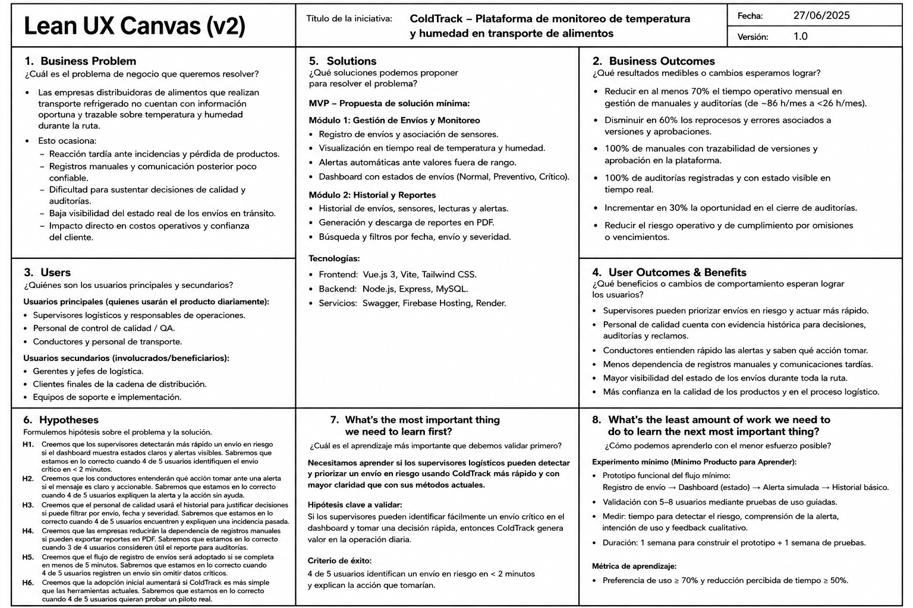
</p>


## 1.3. Segmentos Objetivo

Para ColdTrack, se identifican dos segmentos objetivo principales que utilizan la aplicación para monitorear las condiciones de temperatura y humedad durante el transporte de alimentos.

---

### Segmento Objetivo 1: Personal de Logística y Operaciones

Este segmento está compuesto por los trabajadores encargados de supervisar y gestionar el transporte de alimentos dentro de una empresa.

**Aspectos Demográficos:**

- Edad: 25 a 50 años  
- Género: Todos los géneros  
- Nivel educativo: Técnico o universitario  
- Ocupación: Personal de logística, operaciones o control de calidad  

**Aspectos Geográficos:**

- Ubicación: Perú (principalmente zonas urbanas)  
- Lugar de uso: Oficinas y centros de distribución  

**Aspectos Psicográficos:**

- Buscan tener control y visibilidad sobre los envíos.  
- Valoran herramientas que les permitan tomar decisiones rápidas.  
- Están interesados en mejorar la eficiencia del transporte.  

**Necesidades:**

- Monitorear temperatura y humedad en tiempo real.  
- Recibir alertas ante fallas.  
- Tener registro histórico de los envíos.  

**Beneficios clave:**

- Mejor control del proceso logístico.  
- Reducción de pérdidas de productos.  
- Mayor eficiencia en la operación.  

---

### Segmento Objetivo 2: Personal de Transporte

Este segmento está compuesto por las personas encargadas de trasladar los alimentos durante las rutas de distribución.

**Aspectos Demográficos:**

- Edad: 25 a 55 años  
- Género: Todos los géneros  
- Nivel educativo: Secundaria completa o técnico  
- Ocupación: Conductores o personal de transporte  

**Aspectos Geográficos:**

- Ubicación: Perú  
- Lugar de uso: Durante el transporte (en ruta)  

**Aspectos Psicográficos:**

- Se enfocan en cumplir correctamente con la entrega.  
- Prefieren herramientas simples y fáciles de usar.  
- Valoran recibir información clara y directa.  

**Necesidades:**

- Recibir alertas sobre cambios en temperatura o humedad.  
- Saber cuándo actuar ante un problema.  
- Tener acceso rápido a la información del estado del envío.  

**Beneficios clave:**

- Respuesta rápida ante fallas.  
- Mayor seguridad en el transporte.  
- Facilidad de uso durante el trabajo.  

# Capitulo II: Requirements Elicitation & Analysis

## 2.1. Competidores
En esta sección, se presenta un análisis de los principales competidores de nuestra startup, centrado en aquellos que operan con modelos de negocio basados en logística inteligente o que ofrecen servicios que se superponen con las funciones de monitoreo térmico de ColdTrack. Evaluamos tanto competidores directos, enfocados en la cadena de frío, como competidores indirectos que ofrecen soluciones de rastreo satelital generalista.

1. Hunter Monitoreo

Descripción:

Hunter es una empresa líder en el mercado peruano con una amplia trayectoria en soluciones de seguridad y rastreo vehicular. Aunque su enfoque principal es la recuperación de vehículos y la seguridad ante robos, cuentan con módulos adicionales para la gestión de flotas que incluyen sensores de temperatura para carga crítica.

Principales características:

Rastreo satelital GPS en tiempo real con cobertura nacional.

Sensores de temperatura integrados al hardware del vehículo.

Plataforma de monitoreo orientada principalmente a la seguridad patrimonial.

Soporte técnico local y centrales de monitoreo 24/7.

Reportes de paradas, rutas y cumplimiento de horarios.

Infraestructura robusta y consolidada en el sector transporte en Perú.

2. Beetrack (DispatchTrack)

Descripción:

Beetrack es una plataforma de software enfocada en la gestión de última milla y logística de distribución. Su fuerte es la optimización de rutas y la experiencia del cliente final, permitiendo a las empresas tener una trazabilidad completa del proceso de entrega mediante el uso de smartphones.

Principales características:

Monitoreo de guías de despacho en tiempo real.

Optimización de rutas para reducir tiempos de entrega.

Notificaciones al cliente final sobre el estado de su pedido.

Recolección de pruebas de entrega (fotos, firmas digitales).

Dashboard analítico sobre el desempeño de los transportistas.

Se integra fácilmente con otros sistemas de gestión empresarial (ERP).

3. Testo (Soluciones de registro)

Descripción:

Testo es un competidor indirecto de hardware que ofrece data loggers o termógrafos de alta precisión. A diferencia de las plataformas integradas, Testo se especializa en el registro físico de datos ambientales que luego son descargados por el usuario para auditorías de calidad.

Principales características:

Dispositivos de medición de temperatura y humedad de grado farmacéutico.

Alta precisión y calibración certificada.

Modelos con conexión USB o WiFi para descarga de datos.

Memoria interna para almacenamiento de lecturas en trayectos largos.

Software especializado para la creación de informes de cumplimiento sanitario.

Muy utilizado en laboratorios y grandes centros de almacenamiento.

### 2.1.1. Analisis competitivo
| ¿Por qué llevar a cabo este análisis? | Pregunta: ¿Deberíamos llevar a cabo este análisis para conocer el entorno, la competencia, tomar decisiones de desarrollo y construir nuestra propuesta de valor? |
| :--- | :--- |

| Productos | ColdTrack | Hunter Monitoreo | Beetrack | Termógrafos USB |
| :--- | :--- | :--- | :--- | :--- |
| **Perfil** | **Overview** | App + IoT especializada en monitoreo de temperatura y humedad en tiempo real para la cadena de frío alimentaria. | Empresa de seguridad y rastreo GPS con módulos de control de temperatura para flotas logísticas. | Plataforma SaaS de última milla centrada en optimización de rutas y trazabilidad de entrega al cliente. | Dispositivos físicos que registran datos térmicos localmente para descarga manual post-viaje. |
| | **Ventaja competitiva** | Especialización en inocuidad, alertas críticas en tiempo real, trazabilidad por lote y modo offline automático. | Infraestructura de seguridad robusta y soporte técnico local consolidado en Perú. | Interfaz intuitiva, enfoque en la experiencia del cliente final y optimización logística. | Bajo costo, no requiere instalación técnica y alta precisión de sensores certificados. |
| **Perfil de Marketing** | **Mercado Objetivo** | Empresas distribuidoras de alimentos, supermercados y operadores logísticos en Perú y Latam. | Empresas de transporte de carga pesada, seguridad de activos y logística general. | Empresas de retail, consumo masivo y servicios de delivery de última milla. | Laboratorios farmacéuticos y pequeños productores de alimentos para auditorías. |
| | **Estrategias de Marketing** | Alianzas con gremios alimentarios, marketing digital enfocado en B2B y demostraciones de IoT. | Campañas institucionales masivas, convenios de seguridad y marketing directo. | Marketing de contenidos, presencia en eventos logísticos y alianzas con e-commerce. | Distribución minorista, ventas por volumen en marketplaces y ferias industriales. |
| **Perfil de Producto** | **Productos & Servicios** | Monitoreo Real-time, alertas push, trazabilidad por lote, reportes de calidad e historial. | Rastreo GPS, sensores de combustible/temp, control de flotas y recuperación de robos. | Planificación de rutas, trazabilidad de despacho, prueba de entrega digital y métricas. | Registro de temperatura/humedad, generación de reportes PDF/Excel mediante conexión USB. |
| | **Precios & Costos** | Suscripción SaaS mensual por unidad monitoreada + costo único inicial por kit de sensores. | Costo elevado de instalación fija + cuotas mensuales de servicio de monitoreo 24/7. | Modelo de suscripción basado en el volumen de despachos o número de conductores. | Pago único por dispositivo (desechables o reutilizables). Sin cuotas mensuales. |
| | **Canales de distribución** | Web oficial, venta consultiva directa y partners tecnológicos de hardware IoT. | Red de oficinas físicas a nivel nacional, agentes de ventas y convenios corporativos. | Plataforma web (SaaS), equipos de ventas regionales y App Stores. | Distribuidores de suministros industriales, ferreterías técnicas y canales online. |
| **Análisis SWOT** | **Fortalezas** | Especialización nativa en alimentos, alertas en tiempo real y facilidad de uso operativo. | Respaldo de marca, amplia cobertura en Perú y capacidad de respuesta ante robos. | Excelente UI/UX, líder en optimización de rutas y alta compatibilidad con ERPs. | Precisión técnica certificada, autonomía total (no depende de red) y bajo costo. |
| | **Debilidades** | Startup nueva en el mercado, requiere validación de confianza ante grandes corporaciones. | Interfaz compleja, costo de mantenimiento alto y enfoque secundario en temperatura. | No especializado en condiciones ambientales (temperatura), depende 100% de la nube. | No permite reacción inmediata, requiere intervención manual para leer datos. |
| | **Oportunidades** | Normativas de salud más estrictas, digitalización de PYMES y expansión regional. | Integrar IA para predicción de fallas y diversificar servicios de sensorización. | Expandir funciones hacia el control de cadena de frío y nuevos mercados en Latam. | Implementar versiones con conexión Bluetooth para descarga inalámbrica básica. |
| | **Amenazas** | Competencia de empresas de GPS consolidadas y resistencia al cambio tecnológico. | Nuevas startups con tecnologías más ligeras (IoT) y precios más agresivos. | Saturación del mercado de última milla y entrada de competidores globales. | Digitalización total de la cadena que vuelva obsoletos los dispositivos "offline". |

### 2.1.2. Estrategias y tacticas frente a competidores

**Estrategia de Especialización en Inocuidad Alimentaria:**

Táctica: A diferencia de Hunter (enfocado en seguridad/robos), ColdTrack se posicionará como una herramienta de cumplimiento sanitario.

Táctica: Generación automatizada de reportes de cumplimiento térmico diseñados específicamente para auditorías de DIGESA y controles de calidad internos.

**Estrategia de Experiencia de Usuario (UX) Simplificada:**

Táctica: Implementar una interfaz "Zero-Training" con alertas visuales (código de colores) y sonoras críticas, permitiendo que el conductor actúe sin distracciones tecnológicas.

Táctica: Dashboard ejecutivo para gerentes de logística que consolida el estado de toda la flota en una sola vista, superando la complejidad de las plataformas tradicionales.

**Estrategia de Resiliencia Técnica (Modo Offline):**

Táctica: Desarrollo de un sistema de caché local en el dispositivo IoT que garantice la trazabilidad del 100% de la ruta, incluso en zonas de la geografía peruana con nula cobertura celular, superando la debilidad de competidores puramente SaaS.

Táctica: Sincronización automática de datos masivos una vez que el vehículo recupera la conexión a internet.

**Estrategia de Costo Escalable y Acceso Flexible:**

Táctica: Adopción de un modelo SaaS (Software as a Service) mensual por unidad, eliminando las barreras de entrada de contratos forzosos a largo plazo.

Táctica: Oferta de un kit de sensores de bajo costo inicial para facilitar la digitalización de pequeñas y medianas empresas (PYMES) que actualmente usan termógrafos manuales.

**Estrategia de Trazabilidad por Lote y Carga:**

Táctica: Permitir la vinculación de sensores móviles directamente a los lotes de mercancía y no solo al vehículo, ofreciendo una granularidad de datos que Beetrack o Hunter no cubren actualmente.

## 2.2. Entrevistas

### 2.2.1. Diseño de entrevistas

<h4 id="Segment">Segmento objetivo: Personal de Logística y Operaciones</h4> 

<h4 id="PreguntPersonal">Preguntas Personales:</h4> 

¿Cuál es su nombre?

¿Cuál es su edad?

¿Cuál es su cargo o rol exacto dentro de la empresa?

¿Cuántos años de experiencia tiene en el sector logístico o control de calidad de alimentos?

---

<h4 id="PreguntEspe">Preguntas específicas:</h4> 

¿Cómo gestionan actualmente el monitoreo de temperatura y humedad en sus unidades de transporte?

¿Qué tipo de herramientas o sistemas utilizan en su día a día para este control (termómetros manuales, dataloggers, hojas de Excel, software)?

¿Cuáles son los principales problemas o frustraciones que enfrenta para garantizar que no se rompa la cadena de frío?

¿Ha tenido problemas recientes de pérdida de productos por fallas en la refrigeración que no se detectaron a tiempo?

¿Qué tan rápido pueden reaccionar actualmente frente a una emergencia de temperatura en medio de una ruta?

¿Qué información o métricas le resultaría más urgente visualizar en una plataforma en tiempo real?

¿Estaría dispuesto a implementar una nueva solución tecnológica si esta no requiere una instalación compleja de hardware?

¿Qué funcionalidades considera indispensables para que su equipo confíe en esta nueva plataforma?

---

<h4 id="Segment">Segmento objetivo: Personal de Transporte (Conductores)</h4> 

<h4 id="PreguntPersonal">Preguntas Personales:</h4> 

¿Cuál es su nombre?

¿Cuál es su edad?

¿Cuántos años de experiencia tiene manejando vehículos de transporte de carga refrigerada?

¿Qué tipo de alimentos perecibles suele transportar con mayor frecuencia?

---

<h4 id="PreguntEspe">Preguntas específicas:</h4> 

Durante un viaje, ¿cómo verifica actualmente que la temperatura de la cámara frigorífica se mantenga en los niveles correctos?

¿Qué tipo de aplicaciones móviles utiliza en su celular para facilitar su trabajo diario (GPS, WhatsApp, apps de la empresa)?

¿Cuáles son los principales problemas que enfrenta en la ruta respecto al cuidado de la carga?

¿Alguna vez se le ha dañado la mercadería por un cambio de temperatura que no notó a tiempo? ¿Cómo ocurrió?

Cuando ocurre una falla técnica con la refrigeración lejos de la base, ¿cuál es el protocolo que debe seguir?

¿Suele transitar por zonas donde la señal de internet o celular es inestable? ¿Cómo maneja la comunicación en esos casos?

Si tuviera una app que le avise de problemas con la temperatura, ¿cómo le gustaría que sea la alarma para que no lo distraiga mientras maneja?

¿Qué tendría que tener esta aplicación para que sienta que le ayuda en su trabajo y no que lo está complicando?

### 2.2.2. Registro de entrevistas

#### **Primer Segmento - Personal de Logística y Operaciones:** <br>
| **ENTREVISTA 1** | |
|------------------|----------------------------|
| **Nombre entrevistado** | Gianelly Vásquez |
| **Edad** | 27 |
| **Profesión** | supervisora de control de calidad |
| **Departamento** | Lima |
| **Inicio del video** | 0:00 |
| **Fin del video** | 3:55 |
| **Link del video** | [ Entrevista 1 ](https://upcedupe-my.sharepoint.com/:v:/g/personal/u202416908_upc_edu_pe/IQBXzX9sjMywR5oHRjJ8GAxeAdWlzKxOcQMLt52n6XrGGnc?e=VBNRJi&nav=eyJyZWZlcnJhbEluZm8iOnsicmVmZXJyYWxBcHAiOiJTdHJlYW1XZWJBcHAiLCJyZWZlcnJhbFZpZXciOiJTaGFyZURpYWxvZy1MaW5rIiwicmVmZXJyYWxBcHBQbGF0Zm9ybSI6IldlYiIsInJlZmVycmFsTW9kZSI6InZpZXcifX0%3D  )   |
| **Foto entrevista** |  |
| **Resumen** | Gianelly Vásquez, supervisora de control de calidad en transporte de alimentos refrigerados que vive en Jesús María, actualmente gestiona el monitoreo de temperatura de forma manual usando termómetros digitales, dataloggers básicos y registros en Excel, sin contar con un sistema integrado en tiempo real, lo que genera dependencia del conductor y riesgo de errores humanos; su principal problema es la falta de visibilidad durante el trayecto, ya que las fallas en la cadena de frío suelen detectarse tarde, ocasionando pérdidas de productos, especialmente en rutas largas, y dificultando una reacción oportuna ante emergencias; por ello, considera que la solución ideal debería ofrecer monitoreo en tiempo real, alertas automáticas ante variaciones de temperatura, ubicación del vehículo, historial de datos y una interfaz fácil de usar desde el celular, creyendo que una aplicación como ColdTrack podría mejorar el control, reducir pérdidas y optimizar la operación logística. |

| **ENTREVISTA 2** | |
|------------------|----------------------------|
| **Nombre entrevistado** | Carlos Ramirez |
| **Edad** | 26 |
| **Profesión** | Jefe de operaciones de Logística |
| **Departamento** | Lima |
| **Inicio del video** | 4:03 |
| **Fin del video** | 9:20 |
| **Link del video** | [ Entrevista 2 ](https://upcedupe-my.sharepoint.com/:v:/g/personal/u202416908_upc_edu_pe/IQBXzX9sjMywR5oHRjJ8GAxeAdWlzKxOcQMLt52n6XrGGnc?e=VBNRJi&nav=eyJyZWZlcnJhbEluZm8iOnsicmVmZXJyYWxBcHAiOiJTdHJlYW1XZWJBcHAiLCJyZWZlcnJhbFZpZXciOiJTaGFyZURpYWxvZy1MaW5rIiwicmVmZXJyYWxBcHBQbGF0Zm9ybSI6IldlYiIsInJlZmVycmFsTW9kZSI6InZpZXcifX0%3D  )  |
| **Foto entrevista** |  |
| **Resumen** | Carlos Ramírez, jefe de operaciones de logística en la empresa Transportes Valle S.A.C., de 26 años y con base en Lima, actualmente enfrenta dificultades en la gestión de sus operaciones debido a la falta de monitoreo en tiempo real durante el transporte; esta limitación le impide tener visibilidad inmediata sobre el estado de las unidades y la trazabilidad de los procesos logísticos, generando dependencia de reportes manuales o comunicación directa con los conductores, lo que incrementa el riesgo de retrasos, errores y una toma de decisiones tardía ante incidencias en ruta; su principal problema radica en la ausencia de un sistema que le permita supervisar de manera continua y centralizada las operaciones, lo cual afecta la eficiencia y el control operativo; por ello, considera que una solución ideal debería incluir monitoreo en tiempo real, geolocalización de vehículos, alertas automáticas ante desviaciones o incidentes, y acceso a información desde dispositivos móviles, ya que una herramienta como ColdTrack podría optimizar la gestión logística, mejorar la capacidad de respuesta y fortalecer el control de las operaciones. |


| **ENTREVISTA 3**        |                                                                    |
|-------------------------|--------------------------------------------------------------------|
| **Nombre entrevistado** | Gianmarco Palacios                                                 |
| **Edad**                | 33                                                                 |
| **Profesión**           | Encargado de area de abastecimiento                                |
| **Departamento**        | Arequipa                                                           |
| **Inicio del video**    | 9:20                                                              |
| **Fin del video**       | 15:10                                                              |
| **Link del video**      |[ Entrevista 3 ](https://upcedupe-my.sharepoint.com/:v:/g/personal/u202416908_upc_edu_pe/IQBXzX9sjMywR5oHRjJ8GAxeAdWlzKxOcQMLt52n6XrGGnc?e=VBNRJi&nav=eyJyZWZlcnJhbEluZm8iOnsicmVmZXJyYWxBcHAiOiJTdHJlYW1XZWJBcHAiLCJyZWZlcnJhbFZpZXciOiJTaGFyZURpYWxvZy1MaW5rIiwicmVmZXJyYWxBcHBQbGF0Zm9ybSI6IldlYiIsInJlZmVycmFsTW9kZSI6InZpZXcifX0%3D  )                                                              |
| **Foto entrevista**     |  |
| **Resumen** | Gianmarco Palacios, con 5 años de experiencia en logística, gestiona el monitoreo de temperatura y humedad mediante sensores y módulos integrados ("in-house"). Su principal problema es la pérdida de conectividad y la demora en el envío de información en ciertas rutas, lo que dificulta el control total de la cadena de frío. Aunque no ha tenido incidentes críticos recientemente, reporta pérdidas de productos 1 o 2 veces al mes debido a fallas en el sistema o envíos incorrectos. Está abierto a implementar nuevas soluciones tecnológicas siempre que sean eficaces y de baja complejidad de hardware. Considera indispensable que una plataforma ofrezca alertas en tiempo real multicanal (app y mensajería como WhatsApp) para permitir una reacción oportuna ante cualquier contingencia. |


#### **Segundo Segmento - Personal de Transporte:** <br>

| **ENTREVISTA 1** |                            |
|------------------|----------------------------|
| **Nombre entrevistado** | Edery Abanto |
| **Edad** | 30 |
| **Profesión** | personal de transporte |
| **Departamento** | Lima |
| **Inicio del video** | 15:13 |
| **Fin del video** | 20:40 |
| **Link del video** |[ Entrevista 4 ](https://upcedupe-my.sharepoint.com/:v:/g/personal/u202416908_upc_edu_pe/IQBXzX9sjMywR5oHRjJ8GAxeAdWlzKxOcQMLt52n6XrGGnc?e=VBNRJi&nav=eyJyZWZlcnJhbEluZm8iOnsicmVmZXJyYWxBcHAiOiJTdHJlYW1XZWJBcHAiLCJyZWZlcnJhbFZpZXciOiJTaGFyZURpYWxvZy1MaW5rIiwicmVmZXJyYWxBcHBQbGF0Zm9ybSI6IldlYiIsInJlZmVycmFsTW9kZSI6InZpZXcifX0%3D  )  |
| **Foto entrevista** |  |
| **Resumen** | Edri Abanto, conductor de transporte de carga refrigerada de 30 años con 5 años de experiencia, encargado de trasladar productos perecibles como lácteos, embutidos y carnes frescas que requieren una cadena de frío estricta, actualmente monitorea la temperatura mediante un sistema integrado en la cabina que le permite visualizar el estado general sin detenerse, pero que no proporciona datos precisos, ni alertas preventivas, ni información en tiempo real compartible con la central, lo que genera una dependencia de la observación manual y aumenta el riesgo de no detectar fallas a tiempo; su principal problema es la inestabilidad de la temperatura durante la ruta debido a factores externos como el clima o paradas prolongadas, así como la falta de alertas automáticas ante fallas progresivas del sistema de refrigeración, lo que ya ha ocasionado pérdidas de mercadería en el pasado por detección tardía de incidentes; además, enfrenta limitaciones de conectividad en ciertas zonas, lo que dificulta la comunicación y el monitoreo continuo; por ello, considera que la solución ideal debería ofrecer alertas sonoras progresivas, indicadores visuales claros mediante códigos de color, monitoreo en tiempo real y una interfaz intuitiva que no requiera interacción constante, creyendo que una aplicación como ColdTrack podría brindarle mayor seguridad operativa, facilitar la toma de decisiones durante la ruta y reducir significativamente el riesgo de pérdida de productos. |

| **ENTREVISTA 2**        |                                                                    |
|-------------------------|--------------------------------------------------------------------|
| **Nombre entrevistado** | Fernando Perez                                                     |
| **Edad**                | 51                                                                 |
| **Profesión**           | personal de transporte                                             |
| **Departamento**        | Lima                                                               |
| **Inicio del video**    | 20:45                                                              |
| **Fin del video**       | 22:53                                                              |
| **Link del video**      |[ Entrevista 5 ](https://upcedupe-my.sharepoint.com/:v:/g/personal/u202416908_upc_edu_pe/IQBXzX9sjMywR5oHRjJ8GAxeAdWlzKxOcQMLt52n6XrGGnc?e=VBNRJi&nav=eyJyZWZlcnJhbEluZm8iOnsicmVmZXJyYWxBcHAiOiJTdHJlYW1XZWJBcHAiLCJyZWZlcnJhbFZpZXciOiJTaGFyZURpYWxvZy1MaW5rIiwicmVmZXJyYWxBcHBQbGF0Zm9ybSI6IldlYiIsInJlZmVycmFsTW9kZSI6InZpZXcifX0%3D  )                                                                |
| **Foto entrevista**     |  |
| **Resumen** | El entrevistado Fernando Perez, un transportista de 50 años que trabaja en la ruta Lima, explica que controla la temperatura de la carga revisando el termómetro y haciendo paradas para verificar su estado. Usa principalmente Google Maps y WhatsApp para su trabajo. Señala que los principales problemas son los cambios bruscos de temperatura, el tráfico y la falta de información inmediata ante fallas.|

### 2.2.3. Analisis de entrevistas
**Análisis Segmento 1: Personal de Logística y Operaciones**

Las entrevistas realizadas al personal de logística y operaciones evidenciaron problemáticas recurrentes relacionadas con la falta de monitoreo en tiempo real y la limitada visibilidad durante el transporte de productos, especialmente en la cadena de frío. En primer lugar, se identificó que la mayoría de los entrevistados dependen de métodos manuales o sistemas poco integrados, como registros en Excel, comunicación directa con conductores o herramientas desarrolladas internamente, lo que incrementa el riesgo de errores humanos y retrasa la detección de incidentes.

Asimismo, se observó que uno de los principales problemas es la detección tardía de fallas en la temperatura o condiciones del transporte, lo que genera pérdidas de productos y dificulta la toma de decisiones oportunas. Además, factores como la pérdida de conectividad y la falta de trazabilidad continua afectan directamente la eficiencia operativa y el control logístico.

Por otro lado, los entrevistados coinciden en la necesidad de implementar soluciones tecnológicas que permitan un monitoreo en tiempo real, con funcionalidades como geolocalización de unidades, alertas automáticas ante variaciones o incidentes, acceso a información desde dispositivos móviles y almacenamiento de historial de datos. También destacan la importancia de contar con plataformas fáciles de usar y que no requieran una alta complejidad técnica.

**Análisis Segmento 2: Personal de Transporte**

Las entrevistas realizadas al personal de transporte revelaron diversas dificultades operativas relacionadas con el monitoreo de la carga durante el traslado, especialmente en lo que respecta al control de temperatura en productos perecibles. En primer lugar, se identificó que los conductores dependen en gran medida de la observación manual o de sistemas básicos instalados en la cabina, los cuales no brindan información precisa ni alertas preventivas, lo que limita la detección temprana de fallas.

Asimismo, se evidenció que problemas como la inestabilidad de la temperatura, los cambios bruscos por factores externos, el tráfico y las paradas prolongadas afectan directamente la calidad de los productos transportados. A esto se suma la falta de conectividad en ciertas zonas, lo que dificulta la comunicación continua con la central y reduce la capacidad de reacción ante incidentes.

Por otro lado, los entrevistados resaltaron la necesidad de contar con herramientas más avanzadas que incluyan monitoreo en tiempo real, alertas automáticas (visuales y sonoras), interfaces intuitivas y fácil acceso a la información sin generar distracciones durante la conducción. También valoran la posibilidad de integrar aplicaciones de uso cotidiano como sistemas de mensajería para recibir notificaciones.


## 2.3. Needfinding

### 2.3.1. User Personas

<h5 id="SegUser">Segmento #1: Personal de Logística y Operaciones </h5>


<h5 id="SegUser">Segmento #2: Personal de transporte </h5>
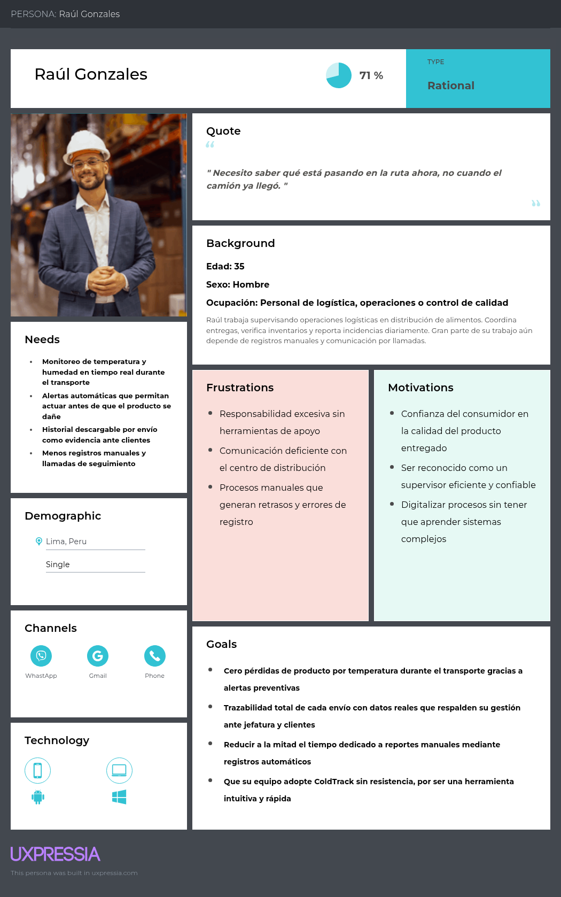


### 2.3.2. User Task Matrix
| **User Task** | **Personal de Logística y Operaciones** | **Personal de Transporte** |
|---------------|----------------------------|------------------------|
| Planificar rutas y tiempos | Frecuencia: Often          | Frecuencia: Rarely     |
| Monitorear condiciones de transporte | Frecuencia: Often          | Frecuencia: Often      |
| Analizar historial de envíos | Frecuencia: Often          | Frecuencia: Rarely     |
| Generar reportes de desempeño | Frecuencia: Often          | Frecuencia: Never      |
| Cumplir entregas puntuales | Frecuencia: Sometimes      | Frecuencia: Often      |
| Comunicar incidencias | Frecuencia: Often          | Frecuencia: Often      |
| Mantener condiciones óptimas de alimentos | Frecuencia: Sometimes      | Frecuencia: Often      |

### 2.3.3. User Journey Mapping
<h5 id="JourUser">Segmento #1: Personal de Logística y Operaciones </h5>


<h5 id="JourUser">Segmento #2: Personal de transporte </h5>


### 2.3.4. Empathy Mapping

**USER PERSONA: Raúl Gonzales**


**USER PERSONA: Andre Montes**


### 2.3.5. As-is Scenario Mapping

**USER PERSONA: Raúl Gonzales**


**USER PERSONA: Andre Montes**


## 2.4. Big Picture Event Storming

El Big Picture Event Storming permitió explorar el dominio de ColdTrack desde una perspectiva de negocio antes de profundizar en decisiones técnicas. En esta sesión el equipo identificó los eventos principales del proceso de transporte refrigerado, los actores involucrados, las acciones que desencadenan cambios de estado y los puntos donde la falta de información puede generar riesgos para la cadena de frío.

Los eventos más relevantes detectados fueron el registro del envío, la asignación de sensores, el inicio de ruta, la recepción de lecturas de temperatura y humedad, la generación de alertas, la atención de incidencias, la finalización del envío y la consulta de historial. Esta visión ayudó a conectar los hallazgos de entrevistas con las historias de usuario, los servicios REST y los límites de contexto usados posteriormente en el diseño de arquitectura.

Como resultado, el equipo pudo reconocer que ColdTrack no solo debía registrar envíos, sino también conservar evidencia de condiciones ambientales y facilitar decisiones rápidas durante la operación logística.

<p align="center">
  
</p>

<p align="center">
  
</p>

## 2.5. Ubiquitous Language

### Core Domain

- **Shipment (Envío):**  
  Conjunto de productos alimenticios que se trasladan desde un centro de distribución hasta un destino final.

- **Food Transportation (Transporte de Alimentos):**  
  Proceso logístico de traslado de alimentos asegurando que mantengan su calidad durante el trayecto.

- **Cold Chain (Cadena de Frío):**  
  Sistema de control que garantiza que los alimentos se mantengan dentro de condiciones de temperatura adecuadas durante todo el transporte.

- **Distribution Center (Centro de Distribución):**  
  Instalación donde se almacenan, preparan y despachan los productos para su envío.

- **Delivery Route (Ruta de Entrega):**  
  Recorrido que realiza la unidad de transporte desde el punto de origen hasta el destino.

---
### Monitoring and Conditions

- **Real-Time Monitoring (Monitoreo en Tiempo Real):**  
  Supervisión continua de las condiciones ambientales de un envío durante todo su trayecto.

- **Temperature (Temperatura):**  
  Nivel de calor dentro de la unidad de transporte que influye en la conservación de los alimentos.

- **Humidity (Humedad):**  
  Nivel de humedad presente en el ambiente del transporte que puede afectar la calidad del producto.

- **Environmental Conditions (Condiciones Ambientales):**  
  Conjunto de factores como temperatura y humedad que determinan el estado de los alimentos durante el transporte.

- **Optimal Range (Rango Óptimo):**  
  Valores adecuados de temperatura y humedad que garantizan la correcta conservación de los alimentos.

- **Condition Status (Estado de Condición):**  
  Situación actual del envío en función de sus condiciones ambientales (normal, advertencia o crítico).

---

### Alerts and Incidents

- **Alert (Alerta):**  
  Notificación generada cuando las condiciones del envío se alejan del rango óptimo.

- **Critical Alert (Alerta Crítica):**  
  Aviso que indica una situación grave que requiere acción inmediata para evitar pérdidas.

- **Warning Alert (Alerta de Advertencia):**  
  Notificación preventiva que indica un posible riesgo antes de llegar a una condición crítica.

- **Incident (Incidente):**  
  Evento que afecta o puede afectar negativamente el estado del envío.

- **Response Action (Acción de Respuesta):**  
  Medida tomada para corregir o mitigar un problema detectado durante el transporte.

---

### Traceability and Control

- **Traceability (Trazabilidad):**  
  Capacidad de rastrear y conocer el estado de un envío durante todo su recorrido.

- **Shipment History (Historial de Envío):**  
  Registro de las condiciones y eventos que ocurrieron durante el transporte de un envío.

- **Condition Check (Verificación de Condición):**  
  Revisión del estado ambiental del envío en un momento determinado.

---

### Stakeholders

- **Logistics Supervisor (Supervisor Logístico):**  
  Persona encargada de supervisar los envíos y asegurar que se cumplan las condiciones adecuadas.

- **Transport Personnel (Personal de Transporte):**  
  Persona responsable de trasladar físicamente los productos durante la ruta.

- **Quality Control Staff (Control de Calidad):**  
  Personal encargado de verificar que los productos cumplan con los estándares de calidad.

- **Distribution Company (Empresa Distribuidora):**  
  Organización responsable de gestionar el transporte de alimentos.

---

### Business Impact

- **Loss Event (Evento de Pérdida):**  
  Situación en la que los productos se deterioran debido a condiciones inadecuadas durante el transporte.

- **Loss Reduction (Reducción de Pérdidas):**  
  Disminución de productos dañados gracias a un mejor control de las condiciones.

- **Operational Efficiency (Eficiencia Operativa):**  
  Mejora en los procesos logísticos que permite optimizar tiempo, costos y recursos.

- **Food Safety (Seguridad Alimentaria):**  
  Garantía de que los alimentos llegan en condiciones aptas para el consumo.

- **Decision Making (Toma de Decisiones):**  
  Proceso de elegir acciones basadas en la información disponible sobre los envíos.

---

# Capitulo III: Requirements Specification

## 3.1. To-Be Scenario Mapping
1. Segmento 1: Personal de Logística y Operaciones.
 
 
2. Segmento 2: Personal de Transporte.
 
 
## 3.2. User Stories
Esta sección organiza las épicas, User Stories y Technical Stories que guían el desarrollo de ColdTrack. Las historias se formularon considerando los tres productos digitales desarrollados por el equipo: Landing Page, Web Application y Web Services. Cada historia mantiene trazabilidad con una épica y expresa criterios de aceptación verificables durante los Sprint Reviews.

| Epic/Story ID | Título | Descripción | Criterios de Aceptación | Relacionado con (Epic ID) |
|---|---|---|---|---|
| EP-001 | Landing Page y adquisición | Como visitante interesado en soluciones de cadena de frío<br>Quiero conocer la propuesta de valor, beneficios, equipo y acceso a la aplicación<br>Para decidir si ColdTrack responde a mis necesidades operativas. | N/A | N/A |
| EP-002 | Identidad, acceso y sesión | Como usuario de ColdTrack<br>Quiero registrarme, iniciar sesión, cerrar sesión y mantener una sesión segura<br>Para acceder a las funcionalidades protegidas según mi rol. | N/A | N/A |
| EP-003 | Gestión de envíos refrigerados | Como personal de logística<br>Quiero registrar, consultar, detallar y actualizar envíos refrigerados<br>Para controlar el ciclo operativo de productos sensibles. | N/A | N/A |
| EP-004 | Sensores y telemetría | Como personal de logística o transporte<br>Quiero registrar sensores, asignarlos a envíos y registrar lecturas ambientales<br>Para monitorear la temperatura y humedad durante la ruta. | N/A | N/A |
| EP-005 | Alertas e incidencias | Como usuario responsable del envío<br>Quiero visualizar, filtrar, reconocer y resolver alertas<br>Para actuar frente a variaciones críticas de la cadena de frío. | N/A | N/A |
| EP-006 | Analítica, historial y reportes | Como personal de logística<br>Quiero revisar indicadores, historial y reportes operativos<br>Para evaluar el desempeño de las operaciones completadas. | N/A | N/A |
| EP-007 | Plataforma, servicios y despliegue | Como equipo técnico<br>Quiero documentar, desplegar y operar la solución en entornos públicos<br>Para permitir validaciones reales de frontend, backend y base de datos. | N/A | N/A |
| US-001 | Visualizar propuesta de valor | Como visitante<br>Quiero entender el problema que resuelve ColdTrack y sus beneficios<br>Para evaluar si la solución se ajusta a mi operación. | Escenario 1: Dado que ingreso a la Landing Page, cuando reviso la sección principal, entonces visualizo propuesta de valor, beneficios y CTA.<br><br>Escenario 2: Dado que selecciono un CTA, cuando se ejecuta la acción, entonces soy redirigido a la Web Application desplegada. | EP-001 |
| US-002 | Navegar secciones informativas | Como visitante<br>Quiero recorrer características, funcionamiento, beneficios y documentación<br>Para comprender el alcance funcional de ColdTrack. | Escenario 1: Dado que uso la barra de navegación, cuando selecciono una sección, entonces el sitio desplaza hacia el contenido correspondiente.<br><br>Escenario 2: Dado que consulto documentación, cuando selecciono el enlace, entonces se abre el repositorio público asociado. | EP-001 |
| US-003 | Consultar información de empresa y equipo | Como visitante<br>Quiero conocer a FreshGuard y a los integrantes del equipo<br>Para generar confianza sobre la solución presentada. | Escenario 1: Dado que reviso la sección About Us, cuando se carga el contenido, entonces visualizo información de la empresa.<br><br>Escenario 2: Dado que reviso el equipo, cuando se muestran los integrantes, entonces se identifican sus nombres y participación. | EP-001 |
| US-004 | Cambiar idioma de interfaz | Como usuario o visitante<br>Quiero alternar entre inglés y español<br>Para comprender la información en mi idioma preferido. | Escenario 1: Dado que abro el producto por primera vez, cuando carga la interfaz, entonces los textos se muestran en inglés.<br><br>Escenario 2: Dado que selecciono ES o EN, cuando el sistema aplica el cambio, entonces los textos fijos se actualizan en la interfaz. | EP-001 |
| US-005 | Crear cuenta | Como usuario nuevo<br>Quiero registrar mis datos, correo, contraseña y rol<br>Para acceder al sistema ColdTrack. | Escenario 1: Dado que completo datos válidos, cuando envío el formulario, entonces el backend crea la cuenta.<br><br>Escenario 2: Dado que faltan campos o el correo ya existe, cuando se procesa la solicitud, entonces el sistema muestra un error claro. | EP-002 |
| US-006 | Iniciar sesión | Como usuario registrado<br>Quiero autenticarme con correo y contraseña<br>Para acceder al dashboard operativo. | Escenario 1: Dado que ingreso credenciales válidas, cuando inicio sesión, entonces recibo un JWT y accedo a vistas protegidas.<br><br>Escenario 2: Dado que ingreso credenciales inválidas, cuando intento acceder, entonces el sistema rechaza la operación. | EP-002 |
| US-007 | Mantener sesión segura | Como usuario autenticado<br>Quiero que mis solicitudes incluyan automáticamente el token<br>Para consumir endpoints protegidos sin repetir credenciales. | Escenario 1: Dado que existe sesión válida, cuando consulto recursos protegidos, entonces el cliente envía `Authorization: Bearer`.<br><br>Escenario 2: Dado que no existe token válido, cuando solicito una vista protegida, entonces el sistema redirige a Sign In. | EP-002 |
| US-008 | Cerrar sesión | Como usuario autenticado<br>Quiero cerrar mi sesión<br>Para proteger mi acceso cuando termino de usar la plataforma. | Escenario 1: Dado que selecciono Sign Out, cuando el sistema procesa la acción, entonces elimina la sesión local.<br><br>Escenario 2: Dado que intento volver a una vista protegida sin token, cuando navego, entonces se me redirige a Sign In. | EP-002 |
| US-009 | Registrar envío | Como personal de logística<br>Quiero crear un envío con destino, conductor, carga y fechas<br>Para iniciar el seguimiento operativo. | Escenario 1: Dado que completo campos requeridos, cuando registro el envío, entonces queda almacenado en MySQL.<br><br>Escenario 2: Dado que faltan datos, cuando intento guardar, entonces se muestran validaciones. | EP-003 |
| US-010 | Consultar dashboard de envíos | Como usuario autenticado<br>Quiero consultar indicadores, alertas activas y envíos en curso<br>Para identificar rápidamente el estado de la operación. | Escenario 1: Dado que existen envíos activos, cuando abro el dashboard, entonces veo código, destino, estado y llegada estimada.<br><br>Escenario 2: Dado que no existen envíos, cuando consulto la lista, entonces se muestra un estado vacío. | EP-003 |
| US-011 | Ver detalle del envío | Como usuario autenticado<br>Quiero revisar el detalle de un envío<br>Para conocer sensor asignado, alertas relacionadas y condiciones registradas. | Escenario 1: Dado que selecciono View details, cuando el sistema consulta el backend, entonces se muestran datos del envío, sensor y alertas.<br><br>Escenario 2: Dado que el envío no existe o la API no responde, cuando se intenta cargar, entonces se informa el problema. | EP-003 |
| US-012 | Actualizar estado de envío | Como personal de logística<br>Quiero cambiar el estado del envío<br>Para reflejar su avance hasta completarlo. | Escenario 1: Dado que el envío existe, cuando actualizo el estado, entonces el backend persiste el cambio.<br><br>Escenario 2: Dado que la transición no está permitida, cuando solicito el cambio, entonces se devuelve un error de dominio. | EP-003 |
| US-013 | Consultar historial de envíos | Como personal de logística<br>Quiero revisar envíos completados<br>Para analizar trazabilidad, fechas y resultados de operación. | Escenario 1: Dado que existen envíos completados, cuando abro History, entonces veo fechas, carga, métricas y alertas.<br><br>Escenario 2: Dado que no existen envíos completados, cuando consulto el historial, entonces se muestra un estado vacío. | EP-006 |
| US-014 | Registrar y consultar sensores | Como personal de logística<br>Quiero visualizar y registrar sensores<br>Para saber cuáles están asignados o disponibles. | Escenario 1: Dado que existen sensores, cuando abro Sensors, entonces veo código, modelo, estado, envío y última lectura.<br><br>Escenario 2: Dado que registro un sensor válido, cuando confirmo la operación, entonces queda disponible para asignación. | EP-004 |
| US-015 | Asignar sensor a envío | Como personal de logística<br>Quiero vincular un sensor disponible a un envío<br>Para comenzar el monitoreo de la carga. | Escenario 1: Dado que el sensor está disponible y el envío existe, cuando asigno el sensor, entonces ambos quedan vinculados.<br><br>Escenario 2: Dado que el sensor ya está asignado, cuando intento vincularlo, entonces se rechaza la operación. | EP-004 |
| US-016 | Registrar lectura de telemetría | Como usuario autorizado<br>Quiero registrar temperatura y humedad de un sensor<br>Para mantener actualizado el monitoreo del envío. | Escenario 1: Dado que el sensor está asignado, cuando registro temperatura y humedad, entonces la lectura se guarda.<br><br>Escenario 2: Dado que la lectura supera umbrales, cuando se procesa, entonces se genera una alerta asociada. | EP-004 |
| US-017 | Consultar lecturas de telemetría | Como usuario autenticado<br>Quiero revisar lecturas asociadas a un envío<br>Para validar la evolución ambiental de la carga. | Escenario 1: Dado que existen lecturas, cuando consulto la telemetría de un envío, entonces se listan temperatura, humedad y fecha.<br><br>Escenario 2: Dado que el envío no tiene lecturas, cuando consulto la telemetría, entonces se muestra una respuesta vacía controlada. | EP-004 |
| US-018 | Visualizar y filtrar alertas | Como usuario autenticado<br>Quiero ver alertas por severidad y estado<br>Para priorizar incidentes de cadena de frío. | Escenario 1: Dado que existen alertas, cuando filtro por severidad o estado, entonces veo resultados coincidentes.<br><br>Escenario 2: Dado que no existen coincidencias, cuando aplico filtros, entonces el sistema informa que no hay resultados. | EP-005 |
| US-019 | Reconocer alerta | Como usuario responsable<br>Quiero marcar una alerta como revisada<br>Para indicar que el incidente ya fue atendido inicialmente. | Escenario 1: Dado que una alerta está activa, cuando ejecuto acknowledgment, entonces su estado cambia a reconocido.<br><br>Escenario 2: Dado que la alerta ya fue resuelta, cuando intento reconocerla, entonces el backend rechaza la operación inválida. | EP-005 |
| US-020 | Resolver alerta | Como usuario responsable<br>Quiero resolver una alerta<br>Para cerrar el incidente luego de tomar acción. | Escenario 1: Dado que una alerta está activa o reconocida, cuando ejecuto resolution, entonces queda resuelta.<br><br>Escenario 2: Dado que la alerta no existe, cuando solicito resolverla, entonces se retorna un error controlado. | EP-005 |
| US-021 | Consultar analítica del dashboard | Como personal de logística<br>Quiero ver indicadores consolidados<br>Para evaluar el estado general de operaciones, alertas y entregas. | Escenario 1: Dado que la API responde, cuando abro el dashboard, entonces se muestran totales de envíos, activos, completados y alertas.<br><br>Escenario 2: Dado que ocurre un error, cuando se consulta la analítica, entonces se muestra un mensaje de recuperación. | EP-006 |
| US-022 | Exportar información operativa | Como personal de logística<br>Quiero exportar información de envíos y alertas<br>Para compartir resultados de la cadena de frío. | Escenario 1: Dado que existe información del período, cuando presiono Export report, entonces se genera un archivo descargable con los datos disponibles.<br><br>Escenario 2: Dado que no hay datos, cuando solicito el reporte, entonces se informa la falta de registros. | EP-006 |
| TS-001 | Implementar API REST versionada | Como equipo técnico<br>Quiero exponer recursos bajo `/api/v1`<br>Para mantener contratos claros entre frontend y backend. | La API expone endpoints versionados, responde JSON y documenta contratos con Swagger/OpenAPI. | EP-007 |
| TS-002 | Configurar persistencia MySQL | Como equipo técnico<br>Quiero almacenar entidades en MySQL<br>Para conservar datos entre sesiones y despliegues. | EF Core aplica migraciones, usa TLS y conserva usuarios, envíos, sensores, telemetría, alertas y reportes. | EP-007 |
| TS-003 | Integrar frontend con backend productivo | Como equipo técnico<br>Quiero reemplazar MockAPI por la API de Render<br>Para ejecutar el flujo completo con persistencia real. | Las variables de entorno de producción apuntan a Render y los servicios axios usan JWT. | EP-007 |
| TS-004 | Documentar y desplegar servicios | Como equipo técnico<br>Quiero publicar Swagger, Firebase Hosting y Render<br>Para facilitar pruebas, exposición pública y revisión académica. | Swagger está disponible en producción, Firebase sirve la Web Application y Render expone la API conectada a MySQL. | EP-007 |

## 3.3. Impact Mapping


## 3.4. Product Backlog
| Prioridad | User Story ID | Título HU | Story Points |
|----------|--------------|----------|-------------|
| 1 | US-001 | Visualizar propuesta de valor | 3 |
| 2 | US-002 | Navegar secciones informativas | 3 |
| 3 | US-003 | Consultar información de empresa y equipo | 2 |
| 4 | US-004 | Cambiar idioma de interfaz | 5 |
| 5 | US-005 | Crear cuenta | 5 |
| 6 | US-006 | Iniciar sesión | 5 |
| 7 | US-007 | Mantener sesión segura | 5 |
| 8 | US-008 | Cerrar sesión | 3 |
| 9 | US-009 | Registrar envío | 8 |
| 10 | US-010 | Consultar dashboard de envíos | 8 |
| 11 | US-011 | Ver detalle del envío | 5 |
| 12 | US-012 | Actualizar estado de envío | 5 |
| 13 | US-013 | Consultar historial de envíos | 5 |
| 14 | US-014 | Registrar y consultar sensores | 8 |
| 15 | US-015 | Asignar sensor a envío | 8 |
| 16 | US-016 | Registrar lectura de telemetría | 8 |
| 17 | US-017 | Consultar lecturas de telemetría | 5 |
| 18 | US-018 | Visualizar y filtrar alertas | 8 |
| 19 | US-019 | Reconocer alerta | 5 |
| 20 | US-020 | Resolver alerta | 5 |
| 21 | US-021 | Consultar analítica del dashboard | 8 |
| 22 | US-022 | Exportar información operativa | 8 |
| 23 | TS-001 | Implementar API REST versionada | 8 |
| 24 | TS-002 | Configurar persistencia MySQL | 8 |
| 25 | TS-003 | Integrar frontend con backend productivo | 8 |
| 26 | TS-004 | Documentar y desplegar servicios | 5 |

# Capitulo IV: Product Design

## 4.1. Style Guidelines

En esta sección, detallamos los lineamientos de diseño, estilo y apariencia visual de la plataforma ColdTrack. El objetivo es garantizar una interfaz intuitiva que permita a los supervisores logísticos y conductores monitorear datos críticos de temperatura sin distracciones. Para ello, hemos optado por una estética moderna y funcional, utilizando elementos visuales claros que facilitan la toma de decisiones rápida.

### 4.1.1. General Style Guidelines

**Branding:** El logotipo de **ColdTrack** ha sido diseñado para reflejar tecnología y seguridad en la cadena de frío. Los colores seleccionados transmiten profesionalismo y confianza, reforzando la identidad de una solución robusta.

<p align="center">
  
</p>

**Tono de Comunicación:**
- **Analítico y Profesional:** Para brindar seguridad sobre la precisión de los datos de los sensores.
- **Directo y Preventivo:** Uso de alertas claras para facilitar la reacción inmediata ante cambios en la temperatura.
- **Eficiente:** Enfocado en la reducción de mermas y la optimización de la logística.

**Tipografía:** Para garantizar un rendimiento óptimo y una apariencia integrada en cualquier sistema operativo, ColdTrack utiliza una **pila de fuentes nativas (System Fonts)**. Esto permite que la aplicación se sienta familiar y sea altamente legible tanto en dispositivos móviles como en escritorio, utilizando fuentes como -apple-system, BlinkMacSystemFont (macOS/iOS), Segoe UI (Windows) y Roboto (Android).

**Colores de Marca:**
Basándonos en la implementación actual de la Landing Page, la paleta se define por los siguientes códigos hexadecimales:
- **Primario (#0052CC):** Azul corporativo que representa confianza y frío controlado.
- **Secundario (#F5F5F5):** Gris claro para fondos de secciones y tarjetas.
- **Oscuro (#0F1117):** Color para el footer y elementos de alto contraste.
- **Éxito (#10B981):** Verde para estados "Normales" de los envíos.
- **Advertencia (#F59E0B):** Ámbar para alertas preventivas en el dashboard.

**Paleta de Colores:**

| Color | Código Hex | Uso Principal |
| :--- | :--- | :--- |
| Primario | #0052CC | Identidad de marca, botones CTA y navegación. |
| Secundario | #F5F5F5 | Fondos de secciones y tarjetas de características. |
| Oscuro | #0F1117 | Fondo de Footer y elementos de contraste. |
| Éxito | #10B981 | Indicadores de estado óptimo (Badge Normal). |
| Advertencia | #F59E0B | Alertas de temperatura (Badge Advertencia). |

**Espaciado y Distribución:** Se utiliza un diseño basado en contenedores (container) y una rejilla responsiva (shipments-grid). El espaciado generoso entre las tarjetas de "Envío" en el preview del dashboard asegura que el usuario pueda identificar rápidamente qué unidad requiere atención.

### 4.1.2. Web Style Guidelines

La plataforma **ColdTrack** está diseñada bajo un enfoque **Responsive**, asegurando que la visualización de los datos sea fluida en computadoras de escritorio, tablets y smartphones.

**Componentes Implementados:**

**Cabecera (Header):**
- **Navegación Fija (Sticky):** Permite acceso rápido a Características, Cómo Funciona y Beneficios.
- **Identidad:** Logo de ColdTrack y nombre de marca siempre visibles a la izquierda.
- **Acceso:** Botón de "Iniciar Sesión" destacado con fondo azul a la derecha.

**Hero Section:**
- **Propuesta de Valor:** Título principal centrado ("Monitoreo en Tiempo Real...") y descripción del impacto del producto en la calidad.
- **Dashboard Preview:** Representación visual con tarjetas individuales para envíos activos, mostrando métricas de temperatura en grados Celsius y porcentaje de humedad.

**Secciones Operativas:**
- **Características:** Tres pilares con iconos minimalistas: Monitoreo en Tiempo Real, Alertas Automáticas e Historial Detallado.
- **Cómo Funciona:** Proceso numerado del 1 al 4 (Instalación, Transmisión, Monitoreo y Reportes).
- **Beneficios:** Sección con fondo azul sólido y tarjetas translúcidas que destacan la Eficiencia, Reducción de Riesgos y Decisiones Rápidas.

---

## 4.2. Information Architecture

### 4.2.1. Organization Systems

Hemos implementado una **Estructura Jerárquica (Tree Structure)** basada en la navegación por secciones:

* **Estructura de la Landing Page:**
  * **Inicio (Hero):** Captación y visión general del dashboard.
  * **Características:** Detalle técnico de las capacidades del sistema.
  * **Proceso (Cómo Funciona):** Guía paso a paso de la implementación IoT.
  * **Valor (Beneficios):** Impacto directo en la operación logística.

* **Estructura del Dashboard:**
  * **Raíz:** Monitoreo en Vivo (Resumen de envíos activos).
  * **Nivel 1:** Tarjetas de Envío (ID, Estado con Badges de color, Temperatura, Humedad).

### 4.2.2. Labeling Systems

El sistema de etiquetado utiliza términos claros para evitar ambigüedades operativas:
- **"Dashboard - Monitoreo en Vivo":** Define el área de trabajo en tiempo real.
- **"Normal" / "Advertencia":** Etiquetas de estado (Badges) con colores verde y naranja respectivamente.
- **"Envío #XXXX":** Identificador único para trazabilidad de carga.

### 4.2.3. SEO Tags and Meta Tags

- **Title:** ColdTrack - Monitoreo en Tiempo Real para el Transporte de Alimentos.
- **Description:** Asegura la calidad de tus productos con control de temperatura y humedad en cada etapa del transporte.
- **Keywords:** monitoreo de alimentos, cadena de frío, sensores IoT, transporte refrigerado.
- **Meta Tags:** Viewport configurado para escalabilidad (width=device-width, initial-scale=1.0).

### 4.2.4. Searching Systems

- **Navegación Anclada:** Enlaces internos en el Header (#caracteristicas, #como-funciona, #beneficios) que permiten un desplazamiento suave (smooth scroll) hacia las secciones correspondientes.

### 4.2.5. Navigation Systems

- **Sticky Navbar:** Menú superior fijo que mantiene el acceso al login y a las secciones durante todo el recorrido.
- **Call to Action (CTA):** Botones principales ("Comenzar Ahora") con alta visibilidad para guiar la conversión del usuario.

---

## 4.3. Landing Page UI Design

### 4.3.1. Landing Page Wireframe

<p align="center">
  
</p>

<p align="center">
  
</p>

<p align="center">
  
</p>


### 4.3.2. Landing Page Mock-up

**Sección Hero y Detalles del Dashboard:**
Visualización principal de la propuesta de valor y estados de monitoreo activos.

<p align="center">
  
</p>

**Características y Funcionamiento:**
Explicación de las capacidades técnicas y el flujo de implementación del sistema.

<p align="center">
  
</p>

**Beneficios y Footer:**
Sección de impacto operativo y enlaces de navegación secundaria.

<p align="center">
  
</p>

<p align="center">
  
</p>

## 4.4. Web Applications UX/UI Design

### 4.4.1. Web Applications Wireframes

<p align="center">
  
</p>

### 4.4.2. Web Applications Wireflow Diagrams

<p align="center">
  
</p>

### 4.4.3. Web Applications Mock-ups

<p align="center">
  
</p>

### 4.4.4. Web Applications User Flow Diagrams

<p align="center">
  
</p>

<p align="center">
  
</p>

<p align="center">
  
</p>

## 4.5. Web Applications Prototyping

<p align="center">
  
</p>

#### Link del video explicativo: https://upcedupe-my.sharepoint.com/:v:/g/personal/u202320699_upc_edu_pe/IQACBR9pDoCKSIpvd7NcFc3CAcul48K88RqMf49wIC2AbMA?nav=eyJyZWZlcnJhbEluZm8iOnsicmVmZXJyYWxBcHAiOiJPbmVEcml2ZUZvckJ1c2luZXNzIiwicmVmZXJyYWxBcHBQbGF0Zm9ybSI6IldlYiIsInJlZmVycmFsTW9kZSI6InZpZXciLCJyZWZlcnJhbFZpZXciOiJNeUZpbGVzTGlua0NvcHkifX0&e=Ji22ya

## 4.6. Domain-Driven Software Architecture
En esta sección, el equipo profundiza en la arquitectura de software para la solución ColdTrack, tomando como base los hitos alcanzados durante el Big Picture Event Storming. 
El objetivo es realizar una transición desde el entendimiento del negocio hacia un modelo técnico riguroso bajo la perspectiva de Domain-Driven Design (DDD).

Este enfoque permite delimitar los Bounded Contexts necesarios para separar responsabilidades críticas, como el monitoreo IoT en tiempo real, la gestión logística de los envíos y el motor automatizado de alertas tempranas. 
A través de esta técnica de modelado colaborativo, se identificaron los Aggregates, Events, Commands y Queries que garantizan la integridad de la lógica de negocio en cada etapa del transporte de carga refrigerada y la conservación de la cadena de frío.

Finalmente, se presenta y explica la representación visual de la arquitectura utilizando el C4 Model. 
Esta estructura jerárquica nos permite comunicar de manera efectiva la solución a través de tres niveles de detalle: el Software Architecture Context Level Diagram, los Software Architecture Container Level Diagrams y los Software Architecture Component Diagrams.

### 4.6.1. Design-Level Event Storming
La sesión se llevó a cabo de manera colaborativa utilizando la herramienta Lucidchart y se estructuró en las siguientes actividades clave: 

1. Refinamiento de Eventos de Dominio
2. Identificación de Comandos y Actores
3. Definición de Agregados (Aggregates)
4. Delimitación de Bounded Contexts
5. Integración de Sistemas Externos y Queries

<p align="center">
  
</p>

<p align="center">
  
</p>

<p align="center">
  
</p>

<p align="center">
  
</p>

<p align="center">
  
</p>


### 4.6.2. Software Architecture Context Diagram
<p align="center">
  
</p>

### 4.6.3. Software Architecture Container Diagrams

<p align="center">
  
</p>

### 4.6.4. Software Architecture Components Diagrams

<p align="center">
  
</p>
## 4.7. Software Object-Oriented Design

### 4.7.1. Class Diagrams

<p align="center">
  
</p>

<p align="center">
  
</p>

<p align="center">
  
</p>

<p align="center">
  
</p>

<p align="center">
  
</p>

### 4.7.2. Class Dictionary

A continuación, se detalla el diccionario de clases, el cual describe la responsabilidad y el propósito de las entidades, objetos de valor, agregados y servicios definidos en el diseño orientado a objetos del sistema ColdTrack.


## 4.8. Database Design

En esta sección se presenta el modelo relacional de la base de datos de ColdTrack. El esquema detalla las entidades principales del sistema, sus atributos y las relaciones entre ellas. Este diseño asegura la integridad referencial y soporta los módulos clave definidos en la arquitectura, como la gestión de usuarios, el registro de vehículos, la asignación de sensores y el historial de telemetría y alertas.


#### 1. Shipment Management (Gestión de Envíos)
Este módulo centraliza la planificación y el estado logístico de los traslados físicos de los alimentos.

| Clase / Interfaz | Estereotipo (DDD) | Descripción y Responsabilidad |
| :--- | :--- | :--- |
| **ShipmentAppService** | Application Service | Orquesta los casos de uso logísticos. Coordina la creación de envíos, la asignación de sensores físicos y la finalización de las rutas, delegando la persistencia al repositorio. |
| **Shipment** | Aggregate Root | Representa un envío físico de alimentos. Gestiona su propio ciclo de vida (estado) y protege la invariante de negocio de que cada envío debe estar asociado a un sensor físico en la ruta. |
| **Route** | Value Object | Encapsula la información de origen y destino del transporte. Al ser inmutable, cualquier cambio en la ruta requiere la creación de un nuevo objeto de valor. |
| **ShipmentId** | Value Object | Identificador único y tipado del envío, evitando errores comunes al usar cadenas de texto (`String`) genéricas. |
| **ShipmentStatus** | Enum | Define los estados posibles del envío: `REGISTERED` (creado), `IN_TRANSIT` (en ruta), `COMPLETED` (finalizado con éxito) y `CANCELLED`. |
| **ShipmentRepository** | Repository | Abstracción de acceso a datos para persistir y recuperar los agregados `Shipment` de la base de datos SQL Server. |

#### 2. Real-Time IoT Monitoring (Monitoreo de Telemetría)
Este contexto está enfocado exclusivamente en la ingesta, validación e hidratación de los datos capturados por el hardware.

| Clase / Interfaz | Estereotipo (DDD) | Descripción y Responsabilidad |
| :--- | :--- | :--- |
| **TelemetryAppService** | Application Service | Expone los puertos de entrada para recibir lecturas ambientales desde sensores o formularios operativos mediante API REST, y facilita la consulta del historial de un sensor. |
| **TelemetryStream** | Aggregate Root | Actúa como un contenedor lógico de todas las lecturas de un sensor específico. Garantiza el orden cronológico y la agrupación de los datos durante un viaje. |
| **TelemetryLog** | Entity | Representa una captura de telemetría individual en un momento exacto del tiempo. |
| **Temperature** | Value Object | Encapsula el valor numérico de la temperatura y su unidad (Celsius). Contiene lógica intrínseca para validar si el valor se encuentra dentro de un rango seguro establecido. |
| **Humidity** | Value Object | Encapsula el porcentaje de humedad relativa, validando que el valor matemático ingresado tenga sentido (por ejemplo, entre 0% y 100%). |
| **TelemetryRepository** | Repository | Interfaz encargada de la persistencia de alto rendimiento para el gran volumen de logs de telemetría generados durante la ruta. |

#### 3. Alerting Engine (Motor de Alertas)
Responsable de evaluar anomalías en las condiciones ambientales e interactuar con servicios externos para notificar a los actores.

| Clase / Interfaz | Estereotipo (DDD) | Descripción y Responsabilidad |
| :--- | :--- | :--- |
| **AlertAppService** | Application Service | Ejecuta el flujo de evaluación. Si detecta una anomalía mediante el `ThresholdPolicy`, crea una alerta y coordina con el `NotificationGateway` el envío del mensaje. |
| **Alert** | Aggregate Root | Entidad principal que registra una incidencia crítica (ej. ruptura de cadena de frío). Controla cuándo fue disparada, si el conductor ya la reconoció y si fue resuelta. |
| **ThresholdPolicy** | Domain Service | Contiene la lógica de dominio pura (umbrales permitidos) para determinar si las condiciones de temperatura actuales violan la seguridad alimentaria. |
| **AlertId** | Value Object | Identidad única inmutable de la alerta generada. |
| **AlertType** | Enum | Categoriza la anomalía: `CRITICAL_TEMPERATURE`, `HIGH_HUMIDITY` o `SENSOR_DISCONNECTED`. |
| **AlertStatus** | Enum | Gestiona el ciclo de atención: `TRIGGERED` (disparada), `ACKNOWLEDGED` (vista por el conductor) y `RESOLVED` (solucionada). |
| **NotificationGateway** | Gateway (Interface) | Abstracción (Puerto) para integrarse con servicios externos como Twilio o Firebase para disparar SMS o notificaciones Push. |

#### 4. Analytics & Reporting (Analítica y Reportes)
Módulo encargado de consolidar la información histórica para facilitar la toma de decisiones gerenciales.

| Clase / Interfaz | Estereotipo (DDD) | Descripción y Responsabilidad |
| :--- | :--- | :--- |
| **AnalyticsAppService** | Application Service | Coordina la solicitud de reportes operativos. Filtra el historial de un envío y prepara información consolidada para revisión posterior. |
| **Report** | Aggregate Root | Un consolidado del rendimiento de un envío finalizado. Almacena métricas pre-calculadas (como el total de alertas disparadas) para consultas eficientes. |
| **HistoricalLog** | Entity | Un registro plano, desnormalizado y optimizado para la lectura, diseñado para conformar las filas de datos en los reportes exportables. |
| **DateRange** | Value Object | Encapsula una fecha de inicio y una de fin, garantizando que el inicio no sea posterior al fin del rango temporal. |
| **ReportGeneratorService** | Domain Service | Motor interno que se encarga de formatear datos de dominio y preparar información exportable para revisión operativa. |

#### 5. Identity & Access (Gestión de Identidad y Accesos)
Maneja la seguridad, controlando quién puede interactuar con el sistema según su rol.

| Clase / Interfaz | Estereotipo (DDD) | Descripción y Responsabilidad |
| :--- | :--- | :--- |
| **AuthAppService** | Application Service | Procesa las solicitudes de registro, inicio de sesión y recuperación de contraseña, apoyándose en el `TokenProvider`. |
| **UserAccount** | Aggregate Root | Representa las credenciales y el estado (activo/inactivo) de un trabajador. Controla el acceso basado en sus roles y protege la seguridad de la contraseña cifrada. |
| **EmailAddress** | Value Object | Asegura que toda cadena de texto utilizada como correo electrónico pase una validación de formato (Regex) antes de interactuar con el sistema. |
| **UserRole** | Enum | Define los niveles de acceso del sistema. Principalmente `LOGISTICS_ADMIN` (para el dashboard web) y `DRIVER` (para recibir alertas). |
| **TokenProvider** | Domain Service | Servicio responsable de emitir los JWT (JSON Web Tokens) que las aplicaciones web y móviles usarán para mantener la sesión abierta de manera segura. |

### 4.8.1. Database Diagram

<p align="center">
  
</p>

# Capitulo V: Product Implementation, Validation & Deployment

## 5.1. Software Configuration Management

A continuación, se describe el proceso por el cual organizamos, gestionamos y controlamos los cambio de desarrollo de ColdTrack.

### 5.1.1. Software Development Environment Configuration.

En esta sección se describen las herramientas utilizadas durante el desarrollo de la landing page de **ColdTrack**, producto digital de la startup **FreshGuard Technologies**. El objetivo de esta solución fue presentar de forma clara la propuesta de valor del sistema, mostrar sus principales funcionalidades y ofrecer una experiencia visual moderna, accesible y responsiva.

Las herramientas empleadas en el proyecto se clasifican en el siguiente orden:

- Producto UX/UI Design
- Software Development
- Software Deployment

**Producto UX/UI Design**

- **Figma**: utilizado como referencia visual para definir la estructura, distribución de secciones y estilo general de la landing page.

**Software Development**

- **Visual Studio Code**: editor de código utilizado para implementar el proyecto.
- **Git**: sistema de control de versiones empleado para registrar y organizar los cambios.
- **GitHub**: plataforma utilizada para alojar el repositorio remoto del proyecto.
- **HTML5**: lenguaje de marcado usado para estructurar el contenido de la página.
- **CSS3**: lenguaje de estilos utilizado para el diseño visual, la responsividad y las animaciones.
- **JavaScript**: lenguaje usado para añadir interactividad en la navegación y animaciones visuales.
- **Navegador web moderno**: entorno de validación para revisar visualización, comportamiento e interacción.

**Software Deployment**

- **GitHub Pages**: servicio de despliegue utilizado para publicar la landing page como sitio estático.

### 5.1.2. Source Code Management

Para la gestión del código fuente se utilizó **GitHub** como plataforma central de versionamiento y almacenamiento del proyecto. El repositorio principal identificado para la landing page es el siguiente:

- **Repositorio de la Landing Page**: https://github.com/1ASI0729-2610-10155/Landing-Page

El proyecto fue desarrollado mediante una estrategia de trabajo basada en ramas, permitiendo separar mejoras funcionales, optimizaciones visuales y correcciones específicas antes de su integración a la rama principal.

**Modelo de ramificación**

La estructura de ramas encontrada en el repositorio es la siguiente:

- `main`: rama principal del proyecto, donde se consolida la versión estable.
- `features/dashboard-improvements`: rama orientada a mejorar la apariencia y comportamiento del dashboard preview mostrado en la hero section.
- `features/seo-enhancements`: rama dedicada a la incorporación de mejoras SEO y etiquetas Open Graph.
- `bugfix/accessibility-improvements`: rama destinada a correcciones de accesibilidad, incluyendo estilos de foco y atributos ARIA.

Este enfoque permitió mantener el desarrollo organizado y evidenciar una evolución progresiva del producto.

**Estilo de commits**

El historial del repositorio muestra el uso de mensajes de commit consistentes, alineados con una convención tipo **Conventional Commits**. Algunos ejemplos reales del proyecto son:

- `feat: initial project setup`
- `feat: add hero section with title and CTA`
- `feat: add responsive CSS styles`
- `feat: add JavaScript interactivity`
- `fix: improve mobile responsiveness and add mobile-specific styles`
- `fix: add ARIA labels for accessibility`

Los prefijos observados se interpretan de la siguiente forma:

- `feat`: incorporación de una nueva funcionalidad o mejora visible.
- `fix`: corrección de errores o ajustes sobre funcionalidades existentes.

### 5.1.3. Source Code Style Guide & Conventions

Para garantizar coherencia, mantenibilidad y escalabilidad del código, se establecen las siguientes normas de estilo:

1.  HTML
- El archivo principal del proyecto es `index.html`.
- Se utilizan etiquetas semánticas como `header`, `nav`, `section` y `footer`.
- Las secciones de la página están organizadas de forma clara: encabezado, hero, características, cómo funciona, beneficios, CTA y footer.
- Se añadieron metadatos como `description`, `keywords`, `author` y propiedades Open Graph.
- Se incorporaron atributos de accesibilidad en elementos clave del documento.

2.  CSS
- Los estilos están centralizados en el archivo `css/styles.css`.
- Se emplean variables CSS en `:root` para colores, espaciados y transiciones.
- Las clases siguen nombres semánticos con palabras separadas por guiones, por ejemplo: `header-content`, `nav-menu`, `feature-card`, `shipment-card`.
- Se incluyen estilos responsivos para escritorio, tableta y móvil.
- Se aplican efectos visuales como transiciones, hover states, sombras y focus styles.

3.  JavaScript
- La lógica de interacción se implementa en `js/script.js`.
- Se usa `DOMContentLoaded` para iniciar la carga de eventos una vez disponible el DOM.
- Se utilizan nombres descriptivos en camelCase como `navLinks`, `featureCards`, `shipmentCards` y `observerOptions`.
- La funcionalidad incluye smooth scrolling, animaciones de entrada y actualización visual del dashboard preview.

### 5.1.4. Software Deployment Configuration

La estrategia de despliegue adoptada para ColdTrack corresponde a la publicación de una landing page estática mediante **GitHub Pages**. Esta decisión fue adecuada debido a que el proyecto está compuesto únicamente por archivos HTML, CSS y JavaScript, sin dependencias de servidor, base de datos o procesamiento backend.

#### Despliegue de la Landing Page en GitHub Pages

GitHub Pages fue seleccionado como mecanismo de publicación por su integración directa con el repositorio, facilidad de configuración y compatibilidad con sitios estáticos. Esto permite que la landing page pueda ser publicada desde la rama principal del proyecto y visualizada mediante una URL pública.

#### Consideraciones previas al despliegue

Antes del despliegue, se consideraron los siguientes aspectos:

- mantener una estructura de archivos estática y ordenada,
- asegurar rutas relativas correctas entre HTML, CSS y JavaScript,
- conservar en `main` la versión estable del proyecto,
- validar el comportamiento responsivo y la correcta carga visual de la página.

#### Pasos de despliegue

1. Crear o actualizar el repositorio remoto en GitHub.
2. Subir los archivos principales del proyecto: `index.html`, `css/styles.css` y `js/script.js`.
3. Ingresar a la configuración del repositorio.
4. Habilitar GitHub Pages.
5. Seleccionar la rama `main` y la carpeta raíz como fuente de publicación.
6. Esperar la generación de la URL pública del sitio.

#### Repositorio: https://github.com/1ASI0729-2610-10155/Landing-Page
#### URL desplegada: https://1asi0729-2610-10155.github.io/Landing-Page/

## 5.2. Landing Page, Services & Applications Implementation

La presente implementación corresponde al desarrollo de la landing page de **ColdTrack**, enfocada en comunicar la propuesta de valor del producto: monitoreo en tiempo real para el transporte de alimentos. La solución fue construida como una página estática, moderna y responsiva, diseñada para presentar de forma clara las capacidades del sistema.

### 5.2.1. Sprint 1

Dado que la evidencia disponible del proyecto se concentra en el repositorio, el historial de commits y la documentación técnica local, esta sección adapta el desarrollo realizado en un único sprint principal orientado a la implementación progresiva de la landing page.

#### 5.2.1.1. Sprint Planning 1

El equipo de desarrollo se reunió virtualmente para definir los objetivos, tareas y entregables del primer sprint, el cual tendrá una duración de una semana. El enfoque principal será el desarrollo y despliegue de la landing page del proyecto en GitHub Pages, asegurando que el producto inicial esté operativo y sirva como base sólida para las siguientes iteracciones.

| Sprint                             | Sprint 1                                                                                                                                                                                     |
| ---------------------------------- | -------------------------------------------------------------------------------------------------------------------------------------------------------------------------------------------- |
|                                    | Sprint Planning Background                                                                                                                                                                   |
| Date                               | 2026/04/17                                                                                                                                                                                   |
| Time                               | 19:28 PM                                                                                                                                                                                     |
| Location                           | El desarrollo de la reunión se hizo virtualmente por medio de Discord                                                                                                                        |
| Prepared By                        | Eslander Celis Berrospi                                                                                                                                                                      |
| Attendees (to planning meeting)    | Eslander Celis Berrospi, Gabriel Mendoza Palacios, Rodrigo Oblitas Alcalde, Aarón Avila Palacios	                                                                                          |
| Sprint n – 1 Review Summary        | En este primer sprint se asignaron responsabilidades a cada integrante y se planteó los requerimientos para el desarrollo de la Landing Page.                                                |
| Sprint n – 1 Retrospective Summary | En esta sección todos los integrantes mencionaron tener aciertos en partes del código y en otras partes poder mejorar sus habilidades realizando la Landing Page                             |
|                                    |Sprint Goal & User Stories                                                                                                                                                                    |
| Sprint 1 Goal                      | Desarrollar y desplegar la landing page funcional en Github Pages, garantizando que cumpla con los requisitos básicos de diseño, contenido y accesibilidad para servir como base de proyecto |
| Sprint 1 Velocity                  | 8                                                                                                                                                                                            |
| Sum of Story Points                | 8                                                                                                                                                                                            |

#### 5.2.1.2. Aspect Leaders and Collaborators

De acuerdo con la evidencia encontrada en el repositorio y en el `README.md` del proyecto, el desarrollo de esta landing page fue implementado principalmente por **Rodrigo Oblitas Alcalde**.

| Team Member | Referencia | Landing Page |
|------------|------------|--------------|
| Rodrigo Oblitas Alcalde | Repositorio `1ASI0730-2610-10215/Landing-Page` | L |
| Eslander Celis | Colaborador de accesibilidad y soporte documental | C |
| Aarón Avila | Colaborador en optimizaciones SEO y metadatos | C |
| Mariano Vilela | Colaborador en secciones visuales y estilos responsivos | C |
| Gabriel Mendoza | Colaborador en mejoras visuales complementarias e iconografía | C |

#### 5.2.1.3. Sprint Backlog 1

Tomando como referencia las User Stories definidas en el Product Backlog, las historias trabajadas durante el Sprint 1 para la landing page pueden resumirse de la siguiente manera:

| User Story Id | User Story Title | Task Id | Task Description | Status |
|---------------|------------------|---------|------------------|--------|
| US-019 | Ver información de la app (Landing) | T01 | Configurar la estructura inicial del proyecto de landing page. | Done |
| US-019 | Ver información de la app (Landing) | T02 | Implementar el header con navegación principal e identidad visual del producto. | Done |
| US-019 | Ver información de la app (Landing) | T03 | Desarrollar la hero section con propuesta de valor y llamada a la acción. | Done |
| US-023 | Ver funcionalidades del sistema | T04 | Implementar la sección de características principales del sistema. | Done |
| US-023 | Ver funcionalidades del sistema | T05 | Desarrollar la sección explicativa sobre el funcionamiento de ColdTrack. | Done |
| US-023 | Ver funcionalidades del sistema | T06 | Implementar la sección de beneficios operativos para los usuarios. | Done |
| US-021 | Formulario de contacto | T07 | Incorporar el CTA final y el footer con información de contacto. | Done |
| US-019 | Ver información de la app (Landing) | T08 | Desarrollar estilos responsivos para adaptar la landing page a distintos dispositivos. | Done |
| US-019 | Ver información de la app (Landing) | T09 | Incorporar animaciones e interacciones mediante JavaScript. | Done |
| US-023 | Ver funcionalidades del sistema | T10 | Mejorar la vista previa del dashboard para mostrar el valor del monitoreo. | Done |
| US-019 | Ver información de la app (Landing) | T11 | Agregar meta tags y Open Graph para optimizar la presentación del sitio. | Done |
| US-019 | Ver información de la app (Landing) | T12 | Realizar ajustes de accesibilidad y navegación por teclado. | Done |
| US-020 | Ver testimonios | T13 | Incorporar una sección de testimonios para reforzar la confianza en la solución. | Done |
| US-022 | Ver equipo de desarrollo | T14 | Incorporar una sección para presentar a los integrantes del equipo de desarrollo. | Done |

Link del Trello: https://trello.com/invite/b/69e9cc91c86525634eb4a333/ATTI779ea07a6c43c25c93856efd9e60aec6150FC41B/sprint-1-freshguard-coldtrack 

#### 5.2.1.4. Development Evidence for Sprint Review

Durante el Sprint 1, el equipo desarrolló de manera incremental la Landing Page del proyecto, implementando funcionalidades relacionadas con la estructura visual, diseño responsivo, accesibilidad y optimización SEO. Los commits realizados evidencian el progreso continuo del producto y la participación activa de los integrantes del equipo en las distintas tareas asignadas.

| Repository | Branch | Commit Id | Commit Message | Commit Message Body | Commited on (Date) |
|------------|--------|-----------|----------------|---------------------|--------------------|
| Landing-Page | `main` | `5ce9ead` | `feat: initial project setup` | Se configuró la estructura inicial del proyecto y los archivos base para el desarrollo de la Landing Page. | 12/05/2025 |
| Landing-Page | `main` | `0fd3953` | `feat: add basic HTML structure with header` | Se implementó la estructura principal en HTML incluyendo el encabezado de navegación. | 13/05/2025 |
| Landing-Page | `main` | `b0f9279` | `feat: add hero section with title and CTA` | Se agregó la sección principal “Hero” con título descriptivo y botón de llamada a la acción. | 13/05/2025 |
| Landing-Page | `main` | `be25150` | `feat: add features section` | Se desarrolló la sección de características principales del producto para presentar sus funcionalidades. | 14/05/2025 |
| Landing-Page | `main` | `5a9590e` | `feat: add responsive CSS styles` | Se añadieron estilos responsivos para mejorar la visualización en diferentes dispositivos. | 15/05/2025 |
| Landing-Page | `main` | `a9e7c80` | `feat: add JavaScript interactivity` | Se implementaron funcionalidades interactivas mediante JavaScript para mejorar la experiencia del usuario. | 15/05/2025 |
| Landing-Page | `main` | `fea423b` | `feat: add icons to feature cards` | Se incorporaron iconos visuales en las tarjetas de funcionalidades para mejorar la interfaz gráfica. | 16/05/2025 |
| Landing-Page | `features/seo-enhancements` | `df123a2` | `feat: add SEO meta tags` | Se agregaron meta etiquetas SEO para optimizar el posicionamiento y visibilidad de la página web. | 19/05/2025 |
| Landing-Page | `bugfix/accessibility-improvements` | `0cd942e` | `fix: add ARIA labels for accessibility` | Se mejoró la accesibilidad de la Landing Page mediante la implementación de etiquetas ARIA. | 20/05/2025 |

Los commits mostrados reflejan el avance progresivo del Sprint 1, evidenciando la construcción de una Landing Page funcional, accesible y optimizada, alineada con los objetivos planteados durante la planificación del sprint.

#### 5.2.1.5. Execution Evidence for Sprint Review

La implementación final de ColdTrack quedó organizada en una sola página principal compuesta por secciones claramente diferenciadas:

- **Header**: navegación principal con identidad visual del producto.
  
  
  
- **Hero Section**: presentación de la propuesta de valor y botones de llamada a la acción.
  
  
  
- **Dashboard Preview**: simulación visual de monitoreo en tiempo real mediante tarjetas de envíos activos.

  
  
- **Features Section**: exposición de las capacidades principales del sistema.

  
  
- **How It Works Section**: explicación resumida del flujo operativo del producto.

   
  
- **Benefits Section**: presentación de ventajas operativas para el usuario.

   
  
- **CTA Section**: sección final orientada a reforzar el interés en la solución.

  
  
- **Footer**: bloque final con navegación complementaria e información general.

  

Desde el punto de vista técnico, la implementación se concentra en:

- `index.html` como archivo estructural principal,
- `css/styles.css` como archivo de estilos,
- `js/script.js` como archivo de interactividad.

Además, el proyecto incluye una estructura HTML semántica, aproximadamente **595 líneas de CSS** y aproximadamente **97 líneas de JavaScript**, con separación clara entre contenido, presentación y comportamiento.

#### 5.2.1.6. Services Documentation Evidence for Sprint Review

Esta sección no aplica a la presente entrega, ya que el proyecto desarrollado corresponde únicamente a una landing page estática y no incorpora APIs, endpoints ni servicios backend documentados.

#### 5.2.1.7. Software Deployment Evidence for Sprint Review

La landing page fue preparada para su publicación mediante **GitHub Pages**, utilizando la rama `main` como base del despliegue.

- Plataforma de despliegue: **GitHub Pages**
- Rama de publicación: **main**
- Tipo de aplicación: **sitio web estático**
- Repositorio fuente: https://github.com/1ASI0729-2610-10155/Landing-Page
- desplegue de la landing page: https://1asi0729-2610-10155.github.io/Landing-Page/

pasos para el despliegue:

1. **Creación del Repositorio en GitHub:** Iniciamos creando un repositorio dedicado en GitHub para nuestro proyecto de landing page.
2. **Configuración de la Rama de despliegue:** Aseguramos que la rama principal del repositorio se llamara `gh-pages`, ya que GitHub Pages toma esta rama como base para el despliegue automático.
3. **Generación del Enlace de GitHub Pages:** Navegamos a la sección "Pages" en la configuración del repositorio en GitHub. Configuramos la fuente de GitHub Pages para que tomara el contenido de la rama `gh-pages`.
4. **Despliegue Automático:** GitHub Pages automáticamente detectó los cambios en la rama `gh-pages` y desplegó la landing page en la URL proporcionada por GitHub Pages.
   


#### 5.2.1.8. Team Collaboration Insights during Sprint

Durante el Sprint 1, el equipo de desarrollo en implementar todas las funcionalidades de la landing page y la realización del documento.

#### Colaboración y Desarrollo de Actividades

1. **Asignación de Tareas**:


2. **Evidencia de commits**:

Repositorio:

**Documento**


**Landing Page**


3. **Evidencia de Nertwork**:

Repositorio:

**Documento**


**Landing Page**


4.**Contributions**

Repositorios:

**Documento**


**Landing Page**


### 5.2.2. Sprint 2 
#### 5.2.2.1. Sprint Planning 2. 
El equipo de desarrollo se reunió virtualmente para definir los objetivos, tareas y entregables del segundo sprint, el cual tendrá una duración de una semana. El enfoque principal será el desarrollo del frontend de la aplicación, implementando las interfaces principales, navegación y componentes necesarios para la interacción del usuario con el sistema.

| Sprint                             | Sprint 2                                                                                                                                                                                                |
| ---------------------------------- | ------------------------------------------------------------------------------------------------------------------------------------------------------------------------------------------------------- |
|                                    | Sprint Planning Background                                                                                                                                                                              |
| Date                               | 2026/04/24                                                                                                                                                                                              |
| Time                               | 19:30 PM                                                                                                                                                                                                |
| Location                           | El desarrollo de la reunión se hizo virtualmente por medio de Discord                                                                                                                                   |
| Prepared By                        | Eslander Celis Berrospi                                                                                                                                                                                 |
| Attendees (to planning meeting)    | Eslander Celis Berrospi, Gabriel Mendoza Palacios, Rodrigo Oblitas Alcalde, Aarón Avila Palacios                                                      |
| Sprint n – 1 Review Summary        | En el sprint anterior se logró desarrollar y desplegar correctamente la Landing Page en GitHub Pages, cumpliendo con los requisitos básicos establecidos para el proyecto.                             |
| Sprint n – 1 Retrospective Summary | En esta sección los integrantes identificaron mejoras en la organización del código, distribución de tareas y optimización del tiempo para el desarrollo de las interfaces del sistema.               |
|                                    | Sprint Goal & User Stories                                                                                                                                                                             |
| Sprint 2 Goal                      | Desarrollar el frontend funcional de la aplicación, implementando las principales vistas, componentes y navegación necesarias para permitir la interacción inicial de los usuarios con el sistema. |
| Sprint 2 Velocity                  | 12                                                                                                                                                                                                      |
| Sum of Story Points                | 12                                                                                                                                                                                                      |
#### 5.2.2.2. Aspect Leaders and Collaborators. 
En el presente Sprint, el equipo trabajará en el desarrollo de la solución integral de ColdTrack, enfocándose en la implementación de funcionalidades clave para el monitoreo de temperatura en tiempo real y la gestión logística. Los principales aspectos considerados incluyen la integración de sensores IoT, el panel de administración central y la interfaz móvil para transportistas.

Cada uno de estos aspectos contará con un líder responsable de su desarrollo y colaboradores que brindarán soporte en tareas específicas, con el fin de asegurar una comunicación efectiva, una coordinación eficiente y una distribución clara de responsabilidades dentro del equipo.

A continuación, se presenta la **Leadership-and-Collaboration Matrix (LACX):**

| Team Member (Last Name, First Name) | GitHub Username | Envío & Sensores BC | Alertas & Notificaciones BC | Tracking en Tiempo Real BC | Reportes & Auditoría BC |
| :--- | :--- | :---: | :---: | :---: | :---: |
| **Vilela, Mariano** | **vilelamenendez** | **L** | **C** | **C** | **C** |
| **Avila, Aaron** | **AaronAvilap** | **C** | **C** | **C** | **L** |
| **Real Celis Berrospi, Eslander** | **Eslander-Celis** | **C** | **L** | **L** | **C** |
| **Arechaga, Mathias** | **MathZell** | **C** | **C** | **C** | **C** |
| **Oblitas, Rodrigo** | **Darkdren** | **C** | **C** | **C** | **C** |

#### 5.2.2.3. Sprint Backlog 2. 

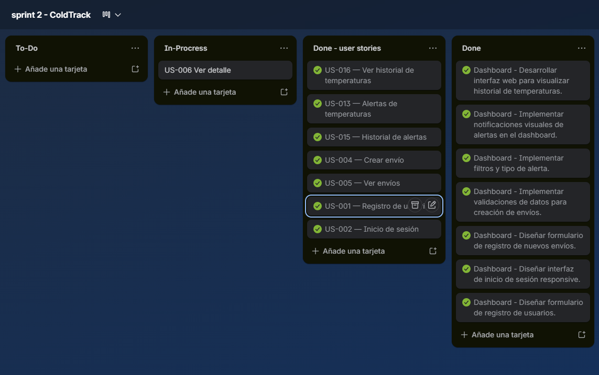

| User Story Id | User Story Title              | Task Id | Task Description                                                      | Status |
| ------------- | ----------------------------- | ------- |-----------------------------------------------------------------------|------|
| US-016        | Ver historial de temperaturas | T03     | Desarrollar interfaz web para visualizar historial de temperaturas.   | Done |
| US-013        | Alertas de temperaturas       | T04     | Configurar lógica de generación automática de alertas de temperatura. | Done |
| US-013        | Alertas de temperaturas       | T05     | Implementar notificaciones visuales de alertas en el dashboard.       | Done |
| US-015        | Historial de alertas          | T07     | Diseñar módulo de consulta de historial de alertas.                   | Done |
| US-015        | Historial de alertas          | T08     | Implementar filtros y tipo de alerta.                                 | Done |
| US-015        | Historial de alertas          | T09     | Desarrollar tabla dinámica para visualización de alertas.             | Done |
| US-004        | Crear envío                   | T10     | Diseñar formulario de registro de nuevos envíos.                      | Done |
| US-004        | Crear envío                   | T11     | Implementar validaciones de datos para creación de envíos.            | Done |
| US-005        | Ver envíos                    | T14     | Desarrollar interfaz de visualización de envíos activos.              | Done |
| US-005        | Ver envíos                    | T15     | Agregar búsqueda de envíos por nombre.                                | Done |
| US-001        | Registro de usuario           | T16     | Diseñar formulario de registro de usuarios.                           | Done |
| US-001        | Registro de usuario           | T17     | Implementar validaciones y cifrado de contraseñas.                    | Done |
| US-002        | Inicio de sesión              | T20     | Diseñar interfaz de inicio de sesión responsive.                      | Done |
| US-002        | Inicio de sesión              | T21     | Configurar control de acceso y manejo de sesiones activas.            | Done |

Link del Trello: https://trello.com/invite/b/6a03af4a9ce2a6dd40644169/ATTIb195f64c62e71f457ebee58b6d15b259984A2064/sprint-2-coldtrack

#### 5.2.2.4. Development Evidence for Sprint Review

Durante el Sprint 2, el equipo se enfocó en el desarrollo del frontend de la aplicación ColdTrack, implementando las principales vistas, componentes reutilizables y funcionalidades necesarias para la interacción inicial de los usuarios con el sistema. Asimismo, se trabajó en la organización de rutas, consumo de datos simulados y mejoras visuales orientadas a la experiencia del usuario.

| Repository | Branch | Commit Id | Commit Message | Commit Message Body | Commited on (Date) |
|------------|--------|-----------|----------------|---------------------|--------------------|
| ColdTrack-Front | `main` | `8fa21bc` | `feat: initialize frontend project structure` | Se configuró la estructura inicial del proyecto frontend utilizando la arquitectura base de la aplicación. | 30/04/2026 |
| ColdTrack-Front | `main` | `1bc4d9f` | `feat: create login and register views` | Se desarrollaron las vistas de inicio de sesión y registro de usuarios. | 30/04/2026 |
| ColdTrack-Front | `develop/dashboard-module` | `2de78ab` | `feat: implement dashboard layout` | Se implementó el diseño principal del dashboard con navegación lateral y encabezado dinámico. | 01/05/2026 |
| ColdTrack-Front | `develop/dashboard-module` | `4ab91ce` | `feat: add sidebar navigation component` | Se creó un componente reutilizable para la navegación entre módulos del sistema. | 02/05/2026 |
| ColdTrack-Front | `main` | `6cd34ef` | `feat: integrate responsive styles` | Se añadieron estilos responsivos para optimizar la visualización en dispositivos móviles y escritorio. | 02/05/2026 |
| ColdTrack-Front | `feature/product-management` | `7ef45da` | `feat: create product management view` | Se implementó la vista de gestión de productos con tablas y formularios básicos. | 03/05/2026 |
| ColdTrack-Front | `feature/api-integration` | `91ab3fd` | `feat: connect frontend with mock API services` | Se integró el frontend con servicios simulados para pruebas de carga y visualización de datos. | 5/05/2026 |
| ColdTrack-Front | `feature/ui-improvements` | `ac56d2e` | `feat: improve UI components and buttons` | Se realizaron mejoras visuales en botones, tarjetas y componentes de interfaz. | 7/05/2026 |
| ColdTrack-Front | `bugfix/form-validations` | `bd781fa` | `fix: add validation to user forms` | Se corrigieron validaciones en formularios para evitar datos inválidos en los registros. | 09/05/2026 |
| ColdTrack-Front | `main` | `ce92ab4` | `feat: deploy frontend prototype` | Se realizó el despliegue inicial del frontend funcional para revisión del sprint. | 10/05/2026 |

Los commits presentados evidencian el avance progresivo del Sprint 2, mostrando la construcción de un frontend funcional con componentes reutilizables, vistas principales y mejoras enfocadas en la experiencia del usuario y la estructura de la aplicación.
#### 5.2.2.5. Execution Evidence for Sprint Review. 

La aplicación resultante permite recorrer los principales flujos operativos de ColdTrack. Para la revisión del sprint se validaron las siguientes funcionalidades:

**Levantamiento del proyecto:** 


**Levantamiento del db.js:** 


1. **Autenticación de usuario:** el usuario puede iniciar sesión con la cuenta demo `test@test.com / password`, registrar una nueva cuenta y cerrar sesión.
   
2. **Dashboard operativo:** se visualizan métricas de envíos registrados, envíos activos, envíos completados y alertas activas.
   
3. **Registro de envíos:** el usuario puede crear un nuevo envío indicando destino, conductor, descripción de carga, fecha de salida y fecha estimada de llegada.
    
4. **Listado de envíos:** se muestra una tabla con ID, destino, estado, conductor, temperatura, humedad y fecha estimada.
   
5. **Gestión de sensores:** se visualizan sensores asignados y disponibles, además de permitir registrar nuevos sensores.
    
6. **Gestión de alertas:** se listan alertas activas y resueltas, con filtros por severidad, estado y búsqueda textual.
    
7. **Historial de envíos:** se muestran envíos completados y datos de temperatura promedio.
     
8. **Internacionalización:** la interfaz permite alternar entre inglés y español desde la barra superior.
    

Desde el punto de vista técnico, la ejecución se validó mediante:

- Compilación de producción con `npx ng build`.
- Prueba de consumo de MockAPI.io para el usuario demo.
- Verificación del sitio desplegado en Firebase Hosting con respuesta HTTP `200 OK`.
- Revisión del bundle generado para confirmar que el endpoint productivo apunta a MockAPI.io.

#### 5.2.2.6. Services Documentation Evidence for Sprint Review. 

Durante el Sprint 2, el equipo se enfocó en el desarrollo técnico y visual del frontend y backend del proyecto, empleando Angular y TypeScript para la creación de interfaces dinámicas, componentes reutilizables y funcionalidades interactivas que mejoran la experiencia de usuario dentro de la aplicación web.

Asimismo, se preparó y configuró el repositorio destinado al desarrollo de la lógica del backend y a la implementación de servicios y endpoints REST, los cuales permitirán la comunicación e integración de los distintos módulos del sistema en los próximos sprints.

#### 5.2.2.7. Software Deployment Evidence for Sprint Review.
La Web Application fue desplegada mediante **Firebase Hosting**, ya que el proyecto Angular genera archivos estáticos optimizados para producción y Firebase permite publicarlos con reglas de navegación compatibles con Single Page Applications.

| Item | Description |
|------|-------------|
| Plataforma de despliegue | Firebase Hosting |
| Proyecto Firebase | `coldtrack-front-open` |
| Carpeta publicada | `dist/coldtrack-front/browser` |
| Comando de build | `npx ng build` |
| Comando de deploy | `npx firebase deploy --only hosting --project coldtrack-front-open` |
| URL desplegada principal | https://coldtrack-front-open.web.app |
| URL desplegada secundaria | https://coldtrack-front-open.firebaseapp.com |
| API productiva | https://6a028d0d0d92f63dd253bedc.mockapi.io/api/v1 |

**Configuración seguida para Firebase Hosting:**

1. Se instaló y verificó Firebase CLI.
2. Se identificó el proyecto Firebase `coldtrack-front-open`.
3. Se configuró `.firebaserc` con el proyecto por defecto.
4. Se configuró `firebase.json` para publicar `dist/coldtrack-front/browser`.
5. Se agregó una regla de `rewrites` para redirigir todas las rutas a `index.html`.
6. Se ejecutó `npx ng build` para generar la versión productiva.
7. Se ejecutó el despliegue mediante Firebase Hosting.
8. Se verificó que la URL pública responda correctamente.

Archivo `.firebaserc`:

```json
{
  "projects": {
    "default": "coldtrack-front-open"
  }
}
```

Archivo `firebase.json`:

```json
{
  "hosting": {
    "public": "dist/coldtrack-front/browser",
    "ignore": [
      "firebase.json",
      "**/.*",
      "**/node_modules/**"
    ],
    "rewrites": [
      {
        "source": "**",
        "destination": "/index.html"
      }
    ]
  }
}
```

Comandos utilizados:

```bash
npx ng build
npx firebase deploy --only hosting --project coldtrack-front-open
```

La regla de `rewrites` fue necesaria porque ColdTrack es una Single Page Application construida con Angular. De esta forma, Firebase entrega `index.html` cuando el usuario actualiza la página o ingresa directamente a una ruta interna de la aplicación.

 

**Autenticación de usuario:** el usuario puede iniciar sesión con la cuenta demo `test@test.com / password`, registrar una nueva cuenta y cerrar sesión.

   
   
**Dashboard operativo:** se visualizan métricas de envíos registrados, envíos activos, envíos completados y alertas activas.

   
   
**Registro de envíos:** el usuario puede crear un nuevo envío indicando destino, conductor, descripción de carga, fecha de salida y fecha estimada de llegada.

  
    
**Listado de envíos:** se muestra una tabla con ID, destino, estado, conductor, temperatura, humedad y fecha estimada.

   
   
**Gestión de sensores:** se visualizan sensores asignados y disponibles, además de permitir registrar nuevos sensores.

   
   
**Gestión de alertas:** se listan alertas activas y resueltas, con filtros por severidad, estado y búsqueda textual.

 
 
**Historial de envíos:** se muestran envíos completados y datos de temperatura promedio.

   
   
**Internacionalización:** la interfaz permite alternar entre inglés y español desde la barra superior.

 

#### 5.2.2.8. Team Collaboration Insights during Sprint.
En este sprint, las tareas se organizaron en torno al modelado de dominio y la configuración inicial de la arquitectura para el sistema de logística de cadena de frío. La responsabilidad del desarrollo y la implementación técnica recayó en Mariano Vilela, Aaron Avila, Eslander Celis Berrospi, Mathias Arechaga y Rodrigo Oblitas.
2. **Evidencia de commits**:

Repositorio:

**Documento**

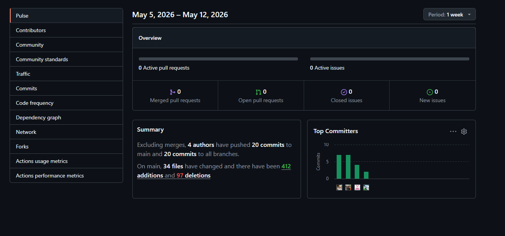

**Front**


3. **Evidencia de Nertwork**:

Repositorio:

**Documento**

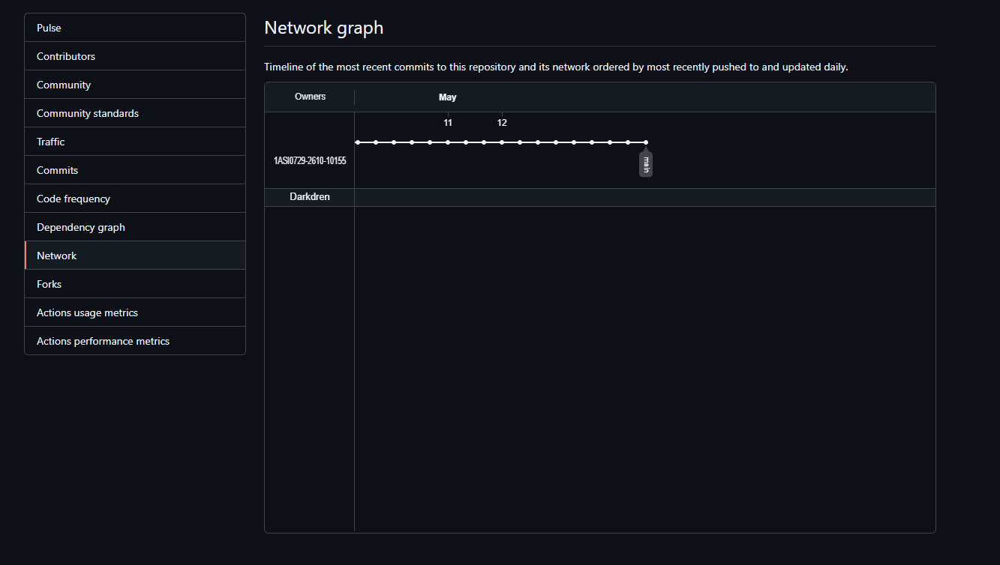

**Front**


4.**Contributions**

Repositorios:

**Documento**


## 5.2.3. Sprint 3
### 5.2.3.1. Sprint Planning 3.
| Sprint                             | Sprint 3 |
| ---------------------------------- | -------- |
|                                    | Sprint Planning Background |
| Date                               | 2026/06/01 |
| Time                               | 19:30 PM |
| Location                           | El desarrollo de la reunión se hizo virtualmente por medio de Discord |
| Prepared By                        | Eslander Celis Berrospi |
| Attendees (to planning meeting)    | Eslander Celis Berrospi, Mariano, Rodrigo Oblitas Alcalde, Aarón Avila Palacios |
| Sprint n – 1 Review Summary        | En el Sprint 2 se desarrolló exitosamente el frontend de la aplicación, implementando las principales vistas, componentes y mecanismos de navegación necesarios para la interacción de los usuarios con el sistema. |
| Sprint n – 1 Retrospective Summary | Durante la retrospectiva del Sprint 2, el equipo identificó oportunidades de mejora en la integración entre frontend y backend, la organización del código y la distribución de tareas para optimizar el desarrollo del proyecto. |
|                                    | Sprint Goal & User Stories |
| Sprint 3 Goal                      | Implementar nuevas historias de usuario relacionadas con el backend, iniciar el desarrollo de la API REST, configurar mecanismos de autenticación, establecer procedimientos para el reporte y monitoreo de servicios backend, y continuar con las tareas pendientes del frontend para lograr una integración progresiva del sistema. |
| Sprint 3 Velocity                  | 14 |
| Sum of Story Points                | 14 |
#### 5.2.3.2 Aspect Leaders and Collaborator.

En el presente Sprint, el equipo trabajará en la construcción de una Landing Page para ColdTrack que contempla diversas funcionalidades y secciones clave para la experiencia del usuario. Los principales aspectos considerados en este Sprint incluyen features, funcionalidades y secciones específicas. Cada aspecto contará con un líder responsable de su desarrollo y colaboradores que apoyarán en tareas específicas relacionadas, con el objetivo de lograr una comunicación efectiva y una distribución clara de responsabilidades en el equipo.

A continuación, se presenta la Leadership-and-Collaboration Matrix (LACX):

| Team Member (Last Name, First Name) | GitHub Username | Hero Section | Main features section | How it Works section | About Us section | Contact section | Testimonials section |
|-------------------------------------|-----------------|--------------|-----------------------|----------------------|------------------|-----------------|----------------------|
| Vilela, Mariano                     | vilelamenendez  | L            | C                     | C                    | C                | C               | L                    |
| Avila, Aaron                        | AaronAvilap     | C            | L                     | C                    | C                | C               | C                    |
| Celis Berrospi, Eslander            | Eslander-Celis  | C            | C                     | L                    | C                | C               | C                    |
| Arechaga, Mathias                   | MathZell        | C            | C                     | C                    | L                | C               | C                    |
| Oblitas, Rodrigo                    | Darkdren        | C            | C                     | C                    | C                | L               | C                    |

#### 5.2.3.3. Sprint Backlog 3.

| User Story Id | User Story Title               | Task Id    | Task Description                                                                                                       | Status |
|---------------|--------------------------------|------------|------------------------------------------------------------------------------------------------------------------------|--------|
| US-001        | Registro de usuario            | IAM-001    | Implementar el agregado UserAccount con sus reglas de negocio en el dominio de IAM.                                    | Done   |
| US-001        | Registro de usuario            | IAM-002    | Implementar el value object Email con validacion de formato.                                                           | Done   |
| US-001        | Registro de usuario            | IAM-003    | Implementar el repositorio y la configuracion de persistencia de usuarios en MySQL.                                    | Done   |
| US-001        | Registro de usuario            | IAM-004    | Implementar el servicio de hashing y verificacion segura de contrasenas.                                               | Done   |
| US-001        | Registro de usuario            | IAM-006    | Implementar el caso de uso de registro (sign-up) de nuevos usuarios.                                                   | Done   |
| US-002        | Inicio de sesion               | IAM-005    | Implementar el servicio de generacion y validacion de tokens JWT.                                                      | Done   |
| US-002        | Inicio de sesion               | IAM-007    | Implementar el caso de uso de inicio de sesion (sign-in) y generacion de token.                                        | Done   |
| US-002        | Inicio de sesion               | IAM-008    | Implementar los endpoints REST de registro e inicio de sesion.                                                         | Done   |
| US-003        | Informacion del usuario actual | IAM-009    | Implementar el endpoint para obtener la informacion del usuario autenticado.                                           | Done   |
| US-004        | Registro de envios             | SM-001     | Implementar el agregado Shipment con sus reglas de negocio en el dominio de Shipment Management.                       | Done   |
| US-004        | Registro de envios             | SM-002     | Implementar el repositorio y la configuracion de persistencia de envios en MySQL.                                      | Done   |
| US-004        | Registro de envios             | SM-003     | Implementar el caso de uso de registro de nuevos envios refrigerados.                                                  | Done   |
| US-004        | Registro de envios             | SM-004     | Implementar el endpoint REST (POST) para el registro de envios, con validaciones de datos.                             | Done   |
| US-005        | Consulta de envios             | SM-005     | Implementar el servicio de consulta de envios (listado y detalle).                                                     | Done   |
| US-005        | Consulta de envios             | SM-006     | Implementar los endpoints REST (GET) para listar e inspeccionar envios.                                                | Done   |
| US-005        | Consulta de envios             | SM-007     | Implementar filtros y paginacion para la consulta de envios.                                                           | Done   |
| US-006        | Gestion del estado del envio   | SM-008     | Implementar el value object/enum ShipmentStatus con los estados validos del ciclo de vida del envio.                   | Done   |
| US-006        | Gestion del estado del envio   | SM-009     | Implementar el caso de uso para actualizar el estado de un envio.                                                      | Done   |
| US-006        | Gestion del estado del envio   | SM-010     | Implementar el endpoint REST (PATCH) para actualizar el estado de un envio.                                            | Done   |
| US-013        | Alertas de temperaturas        | TS-004-005 | Implementar los endpoints del controlador de alertas de temperatura.                                                   | Done   |
| US-015        | Historial de alertas           | TS-007-001 | Implementar el servicio de comando para guardar el historial de alertas generadas.                                     | Done   |

Link del Trello: https://trello.com/b/IcxxPY0t/sprint-backlog-3-coldtrack


#### 5.2.3.4.Development Evidence for Sprint Review.
Durante el Sprint 3, el equipo se enfocó en el desarrollo de la plataforma backend de ColdTrack, implementando los principales servicios, entidades de dominio, mecanismos de autenticación y funcionalidades relacionadas con la gestión logística. Asimismo, se avanzó en la construcción de APIs REST, la documentación técnica y la integración de componentes necesarios para la comunicación entre los distintos módulos del sistema.

| Repository | Branch | Commit Id | Commit Message | Commit Message Body | Commited on (Date) |
|------------|--------|-----------|----------------|---------------------|--------------------|
| FreshGuard.ColdTrack.Platform | `develop` | `1664554e` | `chore: initialize Spring Boot platform foundation` | Se configuró la estructura base de la plataforma backend utilizando Spring Boot y las dependencias iniciales del proyecto. | 17/06/2026 |
| FreshGuard.ColdTrack.Platform | `feature/iam-and-profiles` | `0a26eb40` | `feat(iam): add JWT authentication roles and profiles` | Se implementó el módulo de autenticación y autorización mediante JWT, incluyendo roles y perfiles de usuario. | 17/06/2026 |
| FreshGuard.ColdTrack.Platform | `feature/logistics-and-monitoring` | `478b33ab` | `feat(core): add shipments sensors and telemetry` | Se desarrollaron las entidades y servicios relacionados con envíos, sensores y telemetría para el monitoreo logístico. | 17/06/2026 |
| FreshGuard.ColdTrack.Platform | `feature/alerting-analytics-engagement` | `9bd144f0` | `feat(platform): add alerting analytics and engagement APIs` | Se implementaron APIs para la gestión de alertas, análisis de datos y seguimiento de eventos relevantes del sistema. | 17/06/2026 |
| FreshGuard.ColdTrack.Platform | `feature/documentation-and-tests` | `fb7873a9` | `test(docs): add architecture documentation and verification suites` | Se incorporó documentación arquitectónica y pruebas de verificación para validar el correcto funcionamiento de los módulos desarrollados. | 17/06/2026 |
| FreshGuard.ColdTrack.Platform | `develop` | `6d58ae47` | `chore(release): prepare version 0.1.0` | Se realizaron ajustes finales de configuración, documentación y preparación para la liberación de la versión 0.1.0. | 17/06/2026 |
| FreshGuard.ColdTrack.Platform | `main` | `65527345` | `release: merge develop into main for v0.1.0` | Se integraron las funcionalidades desarrolladas en la rama principal como parte del primer lanzamiento estable del sistema. | 17/06/2026 |
| FreshGuard.ColdTrack.Platform | `main` | `99e170f6` | `docs: update README with author information` | Se actualizó la documentación principal del repositorio incorporando información del equipo de desarrollo. | 18/06/2026 |

#### 5.2.3.5.Execution Evidence for Sprint Review.

Durante el Sprint 3 se validó la primera versión integral de ColdTrack con un backend funcional, persistencia MySQL y comunicación real con la Web Application desarrollada en Angular. A diferencia del Sprint 2, en el que el frontend consumía datos simulados, la revisión de este sprint se realizó utilizando la API REST desplegada en Render y una base de datos MySQL administrada mediante Filess.io.

La evidencia de ejecución comprende tanto la validación independiente del backend mediante Swagger/OpenAPI como la ejecución de los principales flujos de negocio desde el frontend publicado en Firebase Hosting.

##### Entorno utilizado durante la revisión

| Componente | Tecnología o servicio | Evidencia de ejecución |
|------------|-----------------------|------------------------|
| Backend | Spring Boot 4.0.6, Java 26 y Maven | API REST desplegada y accesible públicamente |
| Seguridad | Spring Security y JWT | Autenticación y autorización de recursos protegidos |
| Persistencia | Spring Data JPA y MySQL 8 | Datos persistentes proporcionados por Filess.io |
| Documentación del API | OpenAPI 3 y Swagger UI | Contratos y operaciones disponibles desde una interfaz pública |
| Frontend | Angular 21 y TypeScript | Web Application integrada con el backend real |
| Hosting del frontend | Firebase Hosting | Aplicación pública con navegación SPA |

La siguiente captura evidencia que Swagger UI se encuentra disponible desde el dominio productivo de Render y expone los controladores de telemetría y envíos, incluyendo las operaciones de salida, finalización y cancelación:

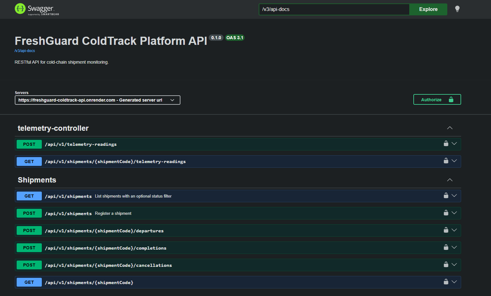

##### Verificación funcional del backend

Para la Sprint Review se ejecutaron los siguientes flujos sobre la API desplegada:

1. **Registro e inicio de sesión:** se verificó la creación de usuarios y el inicio de sesión mediante `POST /api/v1/authentication/sign-up` y `POST /api/v1/authentication/sign-in`. El inicio de sesión devuelve el usuario autenticado, un token JWT y el tipo de token `Bearer`.
2. **Autorización de recursos protegidos:** se comprobó que las operaciones de envíos, sensores, telemetría, alertas, perfiles, analítica y reportes requieren un token JWT válido.
3. **Registro y consulta de envíos:** se validó la creación de envíos refrigerados, el listado general y la consulta individual mediante el código del envío.
4. **Ciclo de vida del envío:** se verificaron las transiciones permitidas por el dominio: `REGISTERED → IN_TRANSIT → COMPLETED`. También se comprobó la operación de cancelación para envíos que aún pueden ser cancelados.
5. **Registro y asignación de sensores:** se registraron sensores con identificadores del tipo `SENS-*` y se comprobó su asignación a envíos existentes. Al asignarse, el sensor cambia de `AVAILABLE` a `ASSIGNED` y conserva el código del envío relacionado.
6. **Registro de telemetría:** se validó el envío de lecturas de temperatura y humedad. Cada lectura actualiza el sensor, actualiza las condiciones del envío y conserva la fecha de medición.
7. **Evaluación de alertas:** se comprobó que una lectura fuera de los umbrales establecidos puede generar una alerta vinculada al sensor y al envío correspondiente.
8. **Dashboard y reportes:** se verificó la consulta de métricas operativas y la disponibilidad de información consolidada para los reportes de envíos.
9. **Servicios públicos:** se validaron los endpoints públicos correspondientes a testimonios y mensajes de contacto.

##### Principales endpoints ejecutados

| Módulo | Método y endpoint | Resultado esperado |
|--------|-------------------|--------------------|
| Authentication | `POST /api/v1/authentication/sign-in` | Devuelve usuario y token JWT |
| Authentication | `POST /api/v1/authentication/sign-up` | Registra un nuevo usuario |
| Shipments | `GET /api/v1/shipments` | Lista los envíos persistidos |
| Shipments | `POST /api/v1/shipments` | Registra un envío en estado `REGISTERED` |
| Shipments | `GET /api/v1/shipments/{shipmentCode}` | Devuelve el detalle del envío |
| Shipment lifecycle | `POST /api/v1/shipments/{shipmentCode}/departures` | Cambia el estado a `IN_TRANSIT` |
| Shipment lifecycle | `POST /api/v1/shipments/{shipmentCode}/completions` | Cambia el estado a `COMPLETED` |
| Sensors | `GET /api/v1/sensors` | Lista sensores y su estado de asignación |
| Sensors | `POST /api/v1/sensors` | Registra un sensor disponible |
| Sensor assignment | `POST /api/v1/shipments/{shipmentCode}/sensor-assignments` | Asigna un sensor al envío |
| Telemetry | `POST /api/v1/telemetry-readings` | Registra temperatura, humedad y fecha |
| Alerts | `GET /api/v1/alerts` | Lista alertas operativas |
| Analytics | `GET /api/v1/analytics/dashboard` | Devuelve métricas consolidadas |
| Reports | `GET /api/v1/reports/shipments/{shipmentCode}` | Devuelve información del reporte del envío |

##### Evidencia de integración entre frontend y backend

La Web Application dejó de utilizar MockAPI y fue configurada para consumir directamente la API productiva:

```text
https://freshguard-coldtrack-api.onrender.com/api/v1
```

La integración se validó mediante los siguientes flujos desde la interfaz:

1. **Autenticación JWT:** el usuario inicia sesión y el frontend conserva de forma segura la sesión necesaria para enviar el encabezado `Authorization: Bearer <token>` en las solicitudes protegidas.
2. **Dashboard operativo:** se muestran los envíos, métricas y alertas obtenidos desde MySQL a través del backend.
3. **Creación y consulta de envíos:** el formulario Angular registra el envío utilizando la API y actualiza la vista con la respuesta del servidor.
4. **Detalle del envío:** la opción **View details / Ver detalles** presenta destino, conductor, carga, fechas, condiciones ambientales, sensor asignado y alertas relacionadas.
5. **Asignación de sensores:** la opción **Link / Vincular** permite seleccionar un envío en estado `REGISTERED` o `IN_TRANSIT`. La tabla actualiza el estado del sensor y muestra el código, destino y estado del envío asignado.
6. **Lecturas del sensor:** la opción **Add reading / Agregar lectura** registra temperatura y humedad. Después de guardar, se actualizan la última lectura, las condiciones del sensor y las condiciones del envío.
7. **Gestión del estado del envío:** desde el detalle se puede iniciar un envío registrado y posteriormente completarlo, respetando las reglas del dominio.
8. **Alertas e historial:** las vistas consumen información persistida y permiten aplicar búsquedas y filtros.
9. **Exportación:** el dashboard, las alertas y el historial permiten generar archivos CSV compatibles con herramientas de hojas de cálculo.
10. **Internacionalización:** las funcionalidades integradas se verificaron en inglés y español.
    
La ejecución integrada se evidencia en el dashboard productivo. La interfaz muestra información obtenida desde el backend, incluyendo cuatro envíos, un envío en ruta, un envío completado, condiciones de temperatura y humedad y una alerta activa generada por superar el umbral recomendado:

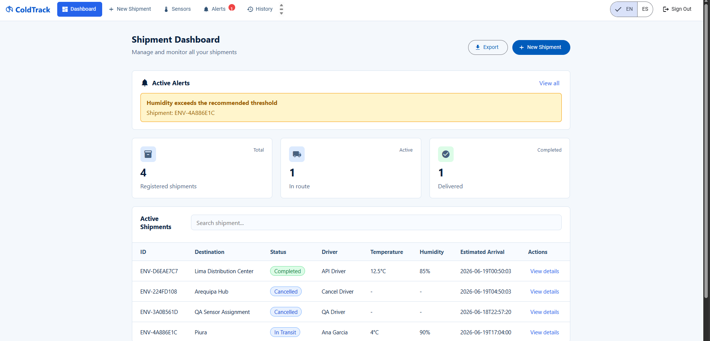

##### Resultados de la verificación técnica

La siguiente tabla resume las comprobaciones efectuadas el 18 de junio de 2026:

| Verificación | Resultado |
|--------------|-----------|
| Swagger UI público | `200 OK` |
| Documento OpenAPI `/v3/api-docs` | `200 OK` y contenido JSON |
| Firebase Hosting | `200 OK` y contenido HTML |
| Inicio de sesión con la cuenta demo | Exitoso; se obtuvo token JWT |
| Consulta autenticada de envíos | Exitosa; 4 registros disponibles al momento de la validación |
| Consulta autenticada de sensores | Exitosa; 2 registros disponibles al momento de la validación |
| Consulta autenticada de alertas | Exitosa; 2 registros disponibles al momento de la validación |
| Build de producción del frontend | Exitoso mediante `npm run build` |
| Pruebas funcionales del frontend | 12 de 12 escenarios aprobados |
| Consola del navegador durante los flujos | Sin errores ni advertencias |

Como verificación final de la versión estable, el 04 de julio de 2026 se volvió a comprobar el entorno productivo después de publicar las releases `v1.0.0` del frontend y backend. El servicio de Render quedó ejecutando el commit `b9a7093`, correspondiente a la integración final del backend, y el documento OpenAPI público respondió correctamente con la versión `1.0.0`.

| Verificación final | Resultado |
|--------------------|-----------|
| Backend desplegado en Render | Commit `b9a7093` en estado `live` |
| OpenAPI productivo | `200 OK`, versión `1.0.0` |
| Swagger UI productivo | Disponible públicamente |
| Frontend desplegado en Firebase | `200 OK` en `https://coldtrack-front-open.web.app` |
| GitHub Release del backend | `v1.0.0` publicada |
| GitHub Release del frontend | `v1.0.0` publicada |

El endpoint de Actuator no se utiliza como evidencia pública porque permanece protegido por Spring Security. La disponibilidad del servicio se comprobó mediante Swagger, OpenAPI, autenticación y consultas reales sobre los recursos protegidos.

El backend contiene pruebas JUnit para el arranque de contexto y las reglas de dominio de `Shipment` y `Sensor`. Para ejecutarlas localmente es obligatorio utilizar JDK 26, que es la versión configurada en Maven y en la imagen Docker del proyecto:

```bash
./mvnw clean test
```

El frontend se verificó mediante la compilación optimizada de Angular:

```bash
npm install
npm run build
```

En conjunto, estas evidencias demuestran que el incremento del Sprint 3 no se limita a endpoints aislados: el backend se encuentra desplegado, persiste información en MySQL y soporta los flujos operativos ejecutados desde la Web Application.

Las capturas incluidas demuestran tanto la disponibilidad de los contratos REST como la ejecución de datos reales en la Web Application. Como evidencia complementaria para una exposición oral se pueden mostrar en vivo el inicio de sesión, la asignación de sensores, el registro de telemetría y la transición `REGISTERED → IN_TRANSIT → COMPLETED`.

#### 5.2.3.6.Services Documentation Evidence for Sprint Review.

Durante el Sprint 3, el equipo concentró sus esfuerzos en la construcción de la capa de backend del sistema, abarcando la implementación de la lógica de dominio, la configuración de persistencia de datos y la exposición de servicios a través de endpoints REST, sentando así las bases funcionales de los principales módulos de la aplicación.
En lo que respecta al módulo de gestión de identidad y acceso, se llevó a cabo la implementación del agregado UserAccount junto con sus reglas de negocio, el value object Email con validación de formato, y la configuración del repositorio de usuarios sobre MySQL. Adicionalmente, se desarrolló el servicio de hashing y verificación segura de contraseñas, los casos de uso correspondientes al registro e inicio de sesión de usuarios con generación de token JWT, y los endpoints REST necesarios para exponer dichas funcionalidades, incluyendo la consulta del perfil del usuario autenticado.
En cuanto al módulo de gestión de envíos, se implementó el agregado Shipment con sus respectivas reglas de negocio, la capa de persistencia en MySQL, y los casos de uso para el registro y actualización de envíos refrigerados. Asimismo, se desarrollaron los endpoints REST bajo los métodos POST, GET y PATCH para permitir el registro, consulta y actualización del estado de los envíos, apoyándose en el value object ShipmentStatus para modelar correctamente el ciclo de vida de cada envío.
Finalmente, en el módulo de monitoreo de temperatura, se implementaron los endpoints del controlador de alertas de temperatura, así como el servicio encargado de registrar y preservar el historial de alertas generadas por el sistema.

#### 5.2.3.7.Software Deployment Evidence for Sprint Review.

Durante el Sprint 3 se desplegó una arquitectura distribuida compuesta por el frontend Angular, la API REST de Spring Boot y una base de datos MySQL administrada. El objetivo del despliegue fue disponer de un entorno público que permitiera demostrar el backend funcional y su integración con la Web Application.

##### Arquitectura desplegada

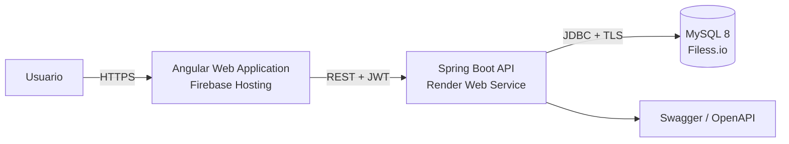
```mermaid
flowchart LR
    U[Usuario] -->|HTTPS| F[Angular Web Application<br/>Firebase Hosting]
    F -->|REST + JWT| B[Spring Boot API<br/>Render Web Service]
    B -->|JDBC + TLS| D[(MySQL 8<br/>Filess.io)]
    B --> S[Swagger / OpenAPI]
```

| Componente | Plataforma | URL o configuración principal |
|------------|------------|--------------------------------|
| Frontend Angular | Firebase Hosting | https://coldtrack-front-open.web.app |
| Frontend alternativo | Firebase Hosting | https://coldtrack-front-open.firebaseapp.com |
| Backend REST | Render Web Service | https://freshguard-coldtrack-api.onrender.com |
| Swagger UI | Render | https://freshguard-coldtrack-api.onrender.com/swagger-ui/index.html |
| OpenAPI JSON | Render | https://freshguard-coldtrack-api.onrender.com/v3/api-docs |
| Base de datos | Filess.io | MySQL 8, conexión privada mediante variables de entorno |
| Versión final del backend | GitHub Release / OpenAPI | `v1.0.0` / `1.0.0` |
| Versión final del frontend | GitHub Release / Firebase Hosting | `v1.0.0` / producción |

##### Despliegue del backend en Render

El backend se publica como un **Web Service** de Render utilizando una imagen Docker multi-stage. La primera etapa compila el proyecto con Maven y Java 26; la segunda etapa copia únicamente el archivo JAR a una imagen JRE, reduciendo el tamaño y la superficie del contenedor final.

La consola de Render evidencia que `freshguard-coldtrack-api` se encuentra configurado como Web Service mediante Docker, asociado al repositorio del backend y a la rama `main`. También muestra la URL pública utilizada por el frontend:

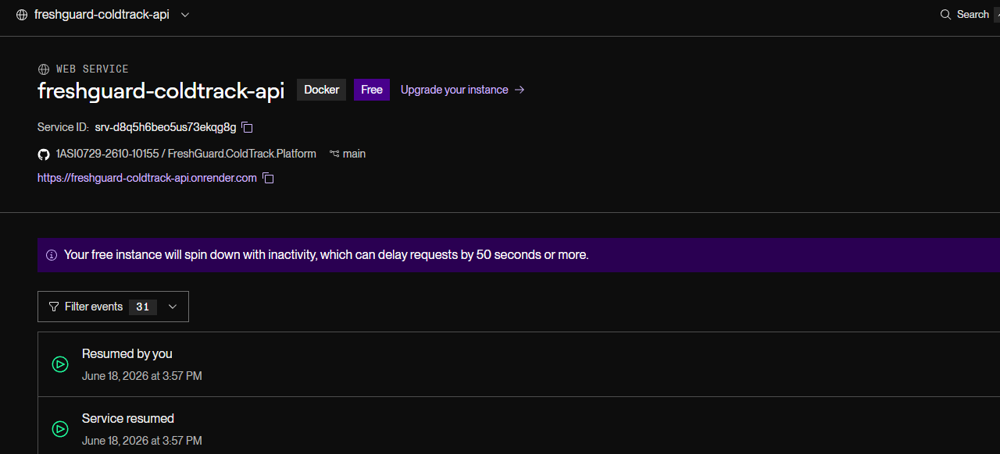

Archivo `Dockerfile` utilizado:

```dockerfile
FROM maven:3.9.16-eclipse-temurin-26 AS build
WORKDIR /app
COPY .mvn .mvn
COPY mvnw pom.xml ./
RUN chmod +x mvnw && ./mvnw dependency:go-offline
COPY src src
RUN ./mvnw clean package -DskipTests

FROM eclipse-temurin:26-jre AS runtime
WORKDIR /app
ENV SPRING_PROFILES_ACTIVE=prod
COPY --from=build /app/target/*.jar app.jar
EXPOSE 8080
ENTRYPOINT ["java", "-jar", "app.jar"]
```

El perfil productivo utiliza variables de entorno para evitar almacenar credenciales dentro del repositorio:

```properties
spring.datasource.url=jdbc:mysql://${DATABASE_URL}:${DATABASE_PORT:3306}/${DATABASE_NAME}?useSSL=true&serverTimezone=UTC
spring.datasource.username=${DATABASE_USER}
spring.datasource.password=${DATABASE_PASSWORD}
spring.datasource.driver-class-name=com.mysql.cj.jdbc.Driver
spring.jpa.show-sql=false
server.forward-headers-strategy=framework
```

Las variables configuradas en Render incluyen los datos de conexión a MySQL, el secreto utilizado para firmar los JWT, los orígenes CORS permitidos y el perfil de Spring. Los valores sensibles no se muestran como parte de la evidencia.

Proceso seguido para desplegar el backend:

1. Se preparó la versión estable en `main` mediante GitFlow, integrando previamente las ramas `feature/*` en `develop`.
2. Se creó la configuración Docker multi-stage para Java 26.
3. Se creó un Web Service en Render asociado al repositorio del backend.
4. Se configuró el perfil `prod` y las variables de entorno de base de datos, JWT y CORS.
5. Se configuró el puerto de la aplicación y el pool de conexiones de acuerdo con el límite del servicio MySQL.
6. Render construyó la imagen, generó el JAR e inició el contenedor.
7. Se verificaron Swagger UI, OpenAPI y el inicio de sesión contra la URL pública.
8. Se publicaron las versiones `v0.1.0`, `v0.1.1` y `v1.0.0` como releases del backend.
9. Se verificó que Render dejara como `live` el commit `b9a7093` y que OpenAPI mostrara la versión `1.0.0`.

##### Persistencia MySQL en Filess.io

La base de datos productiva se ejecuta sobre MySQL 8 en Filess.io. El backend accede mediante el driver oficial `mysql-connector-j` y Spring Data JPA.

La consola de Filess.io evidencia que la instancia MySQL se encuentra activa en la región de España y muestra la información general de conexión. La contraseña permanece oculta en la captura:

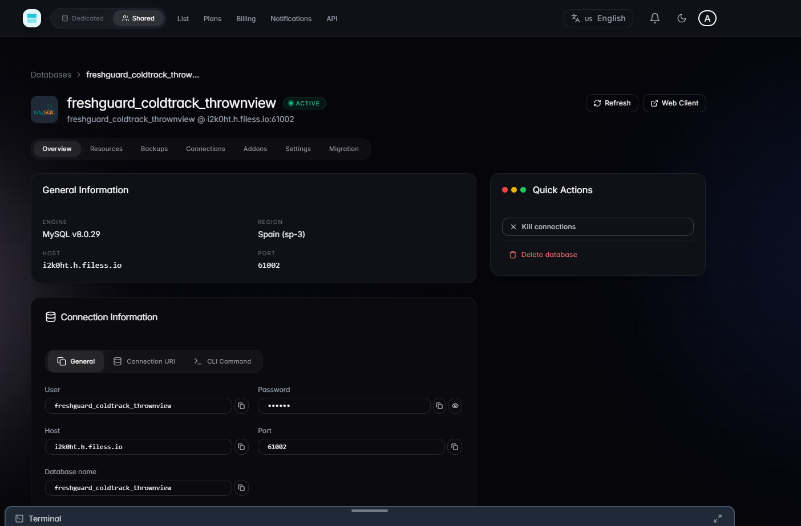

Para la configuración se utilizaron las siguientes variables, sin exponer sus valores:

| Variable | Propósito |
|----------|-----------|
| `DATABASE_URL` | Host del servidor MySQL |
| `DATABASE_PORT` | Puerto asignado por Filess.io |
| `DATABASE_NAME` | Nombre de la base de datos productiva |
| `DATABASE_USER` | Usuario con acceso a la base de datos |
| `DATABASE_PASSWORD` | Contraseña almacenada como secreto en Render |
| `DATABASE_MAX_POOL_SIZE` | Límite controlado del pool de conexiones |
| `DATABASE_MIN_IDLE` | Reduce conexiones inactivas en el entorno gratuito |

La persistencia se comprobó creando usuarios, envíos, sensores, asignaciones, lecturas y alertas; posteriormente, la información continuó disponible después de nuevas solicitudes y despliegues del frontend.

##### Despliegue e integración del frontend en Firebase

El frontend Angular se compila como un conjunto de archivos estáticos optimizados. Firebase Hosting publica el contenido de `dist/coldtrack-front/browser` y redirige las rutas internas hacia `index.html` para soportar el comportamiento de Single Page Application.

La evidencia de Firebase Hosting muestra la versión publicada el 18 de junio de 2026, el historial de despliegues y los dos dominios públicos asociados al proyecto `coldtrack-front-open`:

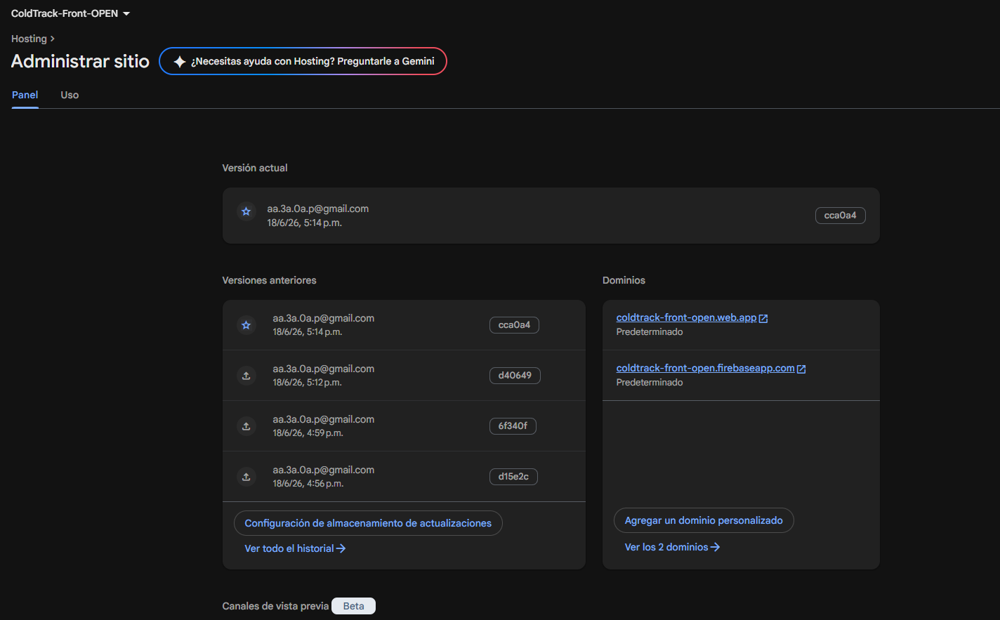


Configuración relevante de `firebase.json`:

```json
{
  "hosting": {
    "public": "dist/coldtrack-front/browser",
    "ignore": [
      "firebase.json",
      "**/.*",
      "**/node_modules/**"
    ],
    "rewrites": [
      {
        "source": "**",
        "destination": "/index.html"
      }
    ],
    "headers": [
      {
        "source": "/i18n/**",
        "headers": [
          {
            "key": "Cache-Control",
            "value": "no-cache, no-store, must-revalidate"
          }
        ]
      }
    ]
  }
}
```

Configuración del proyecto Firebase en `.firebaserc`:

```json
{
  "projects": {
    "default": "coldtrack-front-open"
  }
}
```

El entorno productivo del frontend apunta a la API desplegada:

```typescript
export const environment = {
  production: true,
  apiBaseUrl: 'https://freshguard-coldtrack-api.onrender.com/api/v1',
};
```

Comandos utilizados para compilar y desplegar:

```bash
npm install
npm run build
firebase deploy --only hosting --project coldtrack-front-open
```

Para completar la integración se configuró en el backend el origen permitido de Firebase:

```text
https://coldtrack-front-open.web.app
```

De esta forma, el navegador puede realizar solicitudes CORS hacia Render, autenticar al usuario y consumir los endpoints protegidos con JWT.

##### Estrategia de liberación y verificación

Tanto el backend como el frontend siguieron el modelo GitFlow solicitado por el equipo:

```text
main → develop → feature/* → develop → main
```

Las ramas feature se utilizaron para autenticación, logística, monitoreo, documentación, despliegue e integración. Una vez verificadas, se integraron en `develop` y posteriormente en `main` para publicar una versión estable.

Las releases finales publicadas para la revisión son:

| Repositorio | Release | URL |
|-------------|---------|-----|
| FreshGuard.ColdTrack.Platform | `v1.0.0` | https://github.com/1ASI0729-2610-10155/FreshGuard.ColdTrack.Platform/releases/tag/v1.0.0 |
| ColdTrack-Front | `v1.0.0` | https://github.com/1ASI0729-2610-10155/ColdTrack-Front/releases/tag/v1.0.0 |

Después del despliegue se realizaron las siguientes comprobaciones:

| Evidencia | Resultado |
|-----------|-----------|
| Render construye la imagen con Java 26 | Correcto |
| Swagger UI disponible públicamente | `200 OK` |
| Contrato OpenAPI disponible | `200 OK`, versión `1.0.0` |
| Inicio de sesión y emisión de JWT | Correcto |
| Acceso autenticado a envíos, sensores y alertas | Correcto |
| Firebase Hosting disponible | `200 OK` |
| Frontend conectado a la API de Render | Correcto |
| Persistencia de datos en MySQL | Correcto |
| Navegación SPA después de recargar una ruta | Correcto |
| Consola del navegador durante la validación | Sin errores |

Como resultado, ColdTrack cuenta con un entorno productivo demostrable para la Sprint Review: la Web Application está disponible en Firebase, la API se ejecuta en Render, los contratos pueden inspeccionarse mediante Swagger y los datos operativos se almacenan en MySQL mediante Filess.io.

#### 5.2.3.8.Team Collaboration Insights during Sprint.

Backend:

<p align="center">
  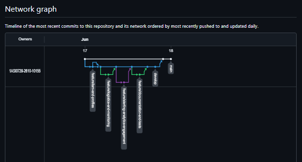
</p>
<p align="center">
  
</p>

Distribución de commits:
- Avila Aaron (AaronAvilap): 8
- Celis Berrospi Eslander (Eslander-Celis): 1 
- Oblitas Rodrigo (Darkdren): 0
- Arechaga Mathias (MathZell): 0
- Vilela Mariano (vilelamenendez): 0

Frontend:

<p align="center">
  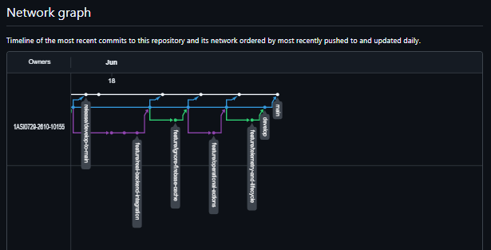
</p>
<p align="center">
  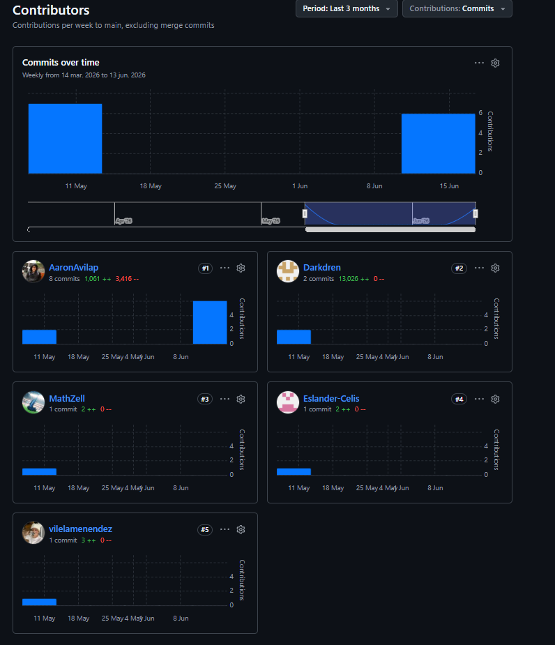
</p>

Distribución de commits:
- Avila Aaron (AaronAvilap): 8
- Oblitas Rodrigo (Darkdren): 2
- Arechaga Mathias (MathZell): 1
- Celis Berrospi Eslander (Eslander-Celis): 1
- Vilela Mariano (vilelamenendez): 1


Landing Page:

  <p align="center">
  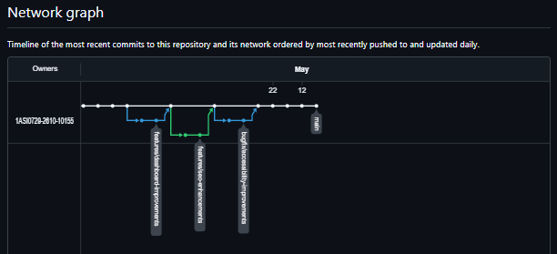
</p>
  
<p align="center">
  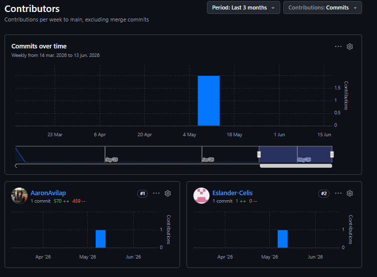
</p>
  
Distribución de commits:
- Avila Aaron (AaronAvilap): 1
- Celis Berrospi Eslander (Eslander-Celis): 1
- Oblitas Rodrigo (Darkdren): 0
- Arechaga Mathias (MathZell): 0
- Vilela Mariano (vilelamenendez): 0

## 5.2.4. Sprint 4
### 5.2.4.1. Sprint Planning 4.

| Sprint | Sprint 4 |
| ---------------------------------- | -------- |
| | Sprint Planning Background |
| Date | 2026/07/04 |
| Time | 19:30 PM |
| Location | El desarrollo de la reunión se realizó virtualmente mediante Discord. |
| Prepared By | Eslander Celis Berrospi |
| Attendees (to planning meeting) | Eslander Celis Berrospi, Mariano, Rodrigo Oblitas Alcalde, Aarón Avila Palacios, Mathias Aréchaga |
| Sprint 3 Review Summary | Durante el Sprint 3 se desarrolló exitosamente la plataforma backend de ColdTrack, implementando los principales servicios, entidades de dominio, mecanismos de autenticación, APIs REST y la integración inicial con el frontend. Asimismo, se avanzó en la documentación técnica y la configuración de la infraestructura necesaria para el funcionamiento del sistema. |
| Sprint 3 Retrospective Summary | Durante la retrospectiva del Sprint 3, el equipo concluyó que la comunicación y distribución de tareas permitió avanzar de forma constante en el desarrollo del backend. Sin embargo, se identificó la necesidad de fortalecer las pruebas de integración, optimizar algunos componentes del frontend, completar la documentación del proyecto y preparar la versión final para su entrega. |
| | Sprint Goal & User Stories |
| Sprint 4 Goal | Completar la integración entre el frontend y backend de ColdTrack, finalizar las funcionalidades pendientes del sistema, realizar pruebas funcionales y de integración, corregir incidencias detectadas durante las validaciones, optimizar la experiencia de usuario, completar la documentación técnica y preparar el despliegue de la versión final del proyecto para su presentación y entrega. |
| Sprint 4 Velocity | 21 |
| Sum of Story Points | 21 |
### 5.2.4.2. Aspect Leaders and Collaborators.

En el presente Sprint, el equipo se enfocará en completar la integración de la plataforma **ColdTrack**, realizando la conexión entre el frontend y backend, ejecutando pruebas funcionales y de integración, optimizando la experiencia del usuario, completando la documentación técnica y preparando el despliegue de la versión final del sistema.

Cada uno de estos aspectos contará con un líder responsable de coordinar las actividades correspondientes y con colaboradores que brindarán apoyo durante el desarrollo de las tareas asignadas. Esta distribución de responsabilidades permitirá mantener una comunicación efectiva, una adecuada organización del trabajo y el cumplimiento de los objetivos establecidos para el Sprint.

A continuación, se presenta la **Leadership-and-Collaboration Matrix (LACX):**

| Team Member (Last Name, First Name) | GitHub Username | Frontend-Backend Integration | Functional & Integration Testing | UX Optimization | Technical Documentation | Deployment Preparation | Final Validation |
| :---------------------------------- | :-------------: | :--------------------------: | :------------------------------: | :-------------: | :---------------------: | :--------------------: | :--------------: |
| Avila, Aaron                        | AaronAvilap   | **L** | C | C | C | C | **L** |
| Vilela, Mariano                     | vilelamenendez  | C | **L** | C | C | C | C |
| Celis Berrospi, Eslander            | Eslander-Celis  | C | C | **L** | C | C | C |
| Arechaga, Mathias                   | MathZell        | C | C | C | **L** | C | C |
| Oblitas, Rodrigo                    | Darkdren        | C | C | C | C | **L** | C |

### 5.2.4.3. Sprint Backlog 4.
##### En este item se detalla el Sprint Backlog del cuarto sprint de desarrollo del proyecto.

| User Story Id | User Story Title | Task Id | Task Description | Aspect (Frontend/Backend) | Status |
|---------------|------------------|---------|------------------|--------------------------|--------|
| US-001 | Registro de usuario | FE-001 | Optimizar el formulario de registro con validaciones en tiempo real | Frontend | Done |
| US-002 | Inicio de sesión | FE-002 | Mejorar la interfaz de inicio de sesión y manejo de errores de autenticación | Frontend | Done |
| US-004 | Crear envío | FE-003 | Validar y refinar el formulario de creación de envíos en el frontend | Frontend | Done |
| US-005 | Ver envíos activos | FE-004 | Optimizar la visualización de la tabla de envíos y agregar filtros avanzados | Frontend | Done |
| US-006 | Ver detalle del envío | FE-005 | Mejorar la vista de detalle del envío con información consolidada de monitoreo | Frontend | Done |
| US-009 | Ver temperatura actualizada | FE-006 | Mostrar temperatura obtenida desde las lecturas de telemetría registradas en el backend | Frontend | Done |
| US-010 | Ver humedad actualizada | FE-007 | Mostrar humedad obtenida desde las lecturas de telemetría registradas en el backend | Frontend | Done |
| US-013 | Alertas de temperatura | FE-008 | Mejorar visualización de alertas con indicadores visuales y sonoros | Frontend | Done |
| US-015 | Historial de alertas | FE-009 | Optimizar la tabla de historial de alertas con filtros y exportación | Frontend | Done |
| US-016 | Ver historial de envíos | FE-010 | Refinar la visualización del historial de envíos completados | Frontend | Done |
| US-017 | Descargar información operativa | FE-011 | Implementar exportación de información operativa desde el frontend | Frontend | Done |
| US-019 | Ver información de la app (Landing) | FE-012 | Validar responsividad y SEO del Landing Page en todos los dispositivos | Frontend | Done |
| TS-001 | Crear usuario | BE-001 | Optimizar el servicio de persistencia de usuarios en MySQL | Backend | Done |
| TS-002 | Autenticación | BE-002 | Validar y refinar la generación de tokens JWT con expiración correcta | Backend | Done |
| TS-003 | CRUD envíos | BE-003 | Optimizar las operaciones de lectura y escritura de envíos en la base de datos | Backend | Done |
| TS-004 | Asignación sensor | BE-004 | Refinar la lógica de asignación de sensores a envíos con validaciones de negocio | Backend | Done |
| TS-005 | Integración IoT | BE-005 | Validar la recepción de datos IoT desde sensores y almacenamiento en telemetría | Backend | Done |
| TS-006 | Telemetría | BE-006 | Validar endpoints REST para registrar y consultar lecturas ambientales | Backend | Done |
| TS-007 | Motor alertas | BE-007 | Refinar la lógica de detección de anomalías y generación automática de alertas | Backend | Done |
| TS-008 | Alertas operativas | BE-008 | Validar generación y consulta de alertas operativas desde la API | Backend | Done |
| TS-009 | Guardar historial | BE-009 | Validar persistencia correcta del historial de envíos y alertas en MySQL | Backend | Done |
| TS-010 | Reportes operativos | BE-010 | Exponer información consolidada del envío para reportes y revisión operativa | Backend | Done |
| US-002 | Inicio de sesión | BE-011 | Implementar endpoint de validación y renovación de tokens JWT | Backend | Done |
| US-007 | Asignar sensor a envío | FE-013 | Implementar interfaz gráfica para vincular sensores disponibles a envíos | Frontend | Done |
| US-008 | Finalizar envío | BE-013 | Implementar endpoint para finalizar envío y generar reporte automático | Backend | Done |
| US-011 | Estado del envío | FE-014 | Visualizar estado consolidado del envío con indicadores de color | Frontend | Done |
| US-012 | Visualizar gráficos históricos | FE-015 | Implementar gráficos interactivos de temperatura y humedad en tiempo histórico | Frontend | Done |
| US-014 | Visualización de alertas | FE-016 | Mostrar alertas críticas en la Web Application para apoyar la toma de decisiones | Frontend | Done |
| US-018 | Filtrar historial | FE-017 | Implementar filtros avanzados para búsqueda en historial de envíos y alertas | Frontend | Done |
| Integration-001 | CORS Configuration | BE-014 | Configurar CORS para permitir solicitudes desde Firebase Hosting | Backend | Done |
| Documentation-001 | OpenAPI/Swagger Documentation | BE-015 | Actualizar documentación OpenAPI a versión 1.0.0 y validar todos los endpoints | Backend | Done |
| Testing-001 | Unit Tests | BE-017 | Ejecutar pruebas unitarias del backend y validar cobertura de reglas de negocio | Backend | Done |
| Testing-002 | Integration Tests | FE-018 | Realizar pruebas de integración frontend-backend en ambiente de staging | Frontend | Done |
| Deployment-001 | Firebase Hosting Deployment | FE-019 | Desplegar versión final del frontend en Firebase Hosting | Frontend | Done |
| Deployment-002 | Render Web Service Deployment | BE-018 | Desplegar versión final del backend en Render Web Service con Docker | Backend | Done |
| Release-001 | GitHub Release Frontend | FE-020 | Crear y publicar release v1.0.0 del frontend en GitHub | Frontend | Done |
| Release-002 | GitHub Release Backend | BE-020 | Crear y publicar release v1.0.0 del backend en GitHub | Backend | Done |

Link del Trello: https://trello.com/invite/b/6a49d6b1379f3de6b3448e00/ATTI674155e888c769884578e795703837992229B9CF/sprint-backlog-4-coldtrack

### 5.2.4.4. Development Evidence for Sprint Review.
Durante el **Sprint 4**, el equipo se enfocó en la preparación de la versión final de **ColdTrack**, completando la integración entre el frontend y backend, realizando ajustes para el despliegue en producción, optimizando la experiencia de usuario y consolidando la documentación técnica del proyecto. Asimismo, se realizaron mejoras en la configuración de Render, optimizaciones finales del sistema y la actualización del informe final con la evidencia correspondiente al desarrollo del proyecto.

#### Backend Repository

| Repository | Branch | Commit Id | Commit Message | Commit Message Body | Commited on (Date) |
|------------|--------|-----------|----------------|---------------------|--------------------|
| FreshGuard.ColdTrack.Platform | `feature/render-deployment-configuration` | `bccad7d0` | `chore(deploy): prepare Render and Filess configuration` | Se preparó la configuración necesaria para el despliegue de la plataforma backend utilizando Render y Filess. | 18/06/2026 |
| FreshGuard.ColdTrack.Platform | `main` | `a58f4978` | `release: merge develop into main for v0.1.1` | Se integraron las últimas funcionalidades desarrolladas en la rama principal para la versión 0.1.1 del sistema. | 18/06/2026 |
| FreshGuard.ColdTrack.Platform | `feature/fix-render-docker-image` | `48c3af81` | `fix(deploy): use available Maven Java 26 image` | Se corrigió la imagen Docker utilizada durante el despliegue para garantizar compatibilidad con Render. | 18/06/2026 |
| FreshGuard.ColdTrack.Platform | `feature/final-backend-polish` | `3d8be85b` | `fix(deploy): limit production database pool` | Se optimizó el tamaño del pool de conexiones a la base de datos para el entorno de producción. | 23/06/2026 |
| FreshGuard.ColdTrack.Platform | `feature/final-backend-polish` | `b93aaa7c` | `fix(deploy): reduce production database pool to one` | Se redujo el número de conexiones simultáneas para mejorar la estabilidad del despliegue en Render. | 23/06/2026 |
| FreshGuard.ColdTrack.Platform | `feature/final-backend-polish` | `590dfea5` | `docs: finalize backend deployment guidance` | Se actualizó la documentación del despliegue backend con las configuraciones finales para producción. | 04/07/2026 |
| FreshGuard.ColdTrack.Platform | `main` | `b9a70930` | `merge: release final backend polish` | Se integraron las optimizaciones finales del backend en la rama principal como parte de la versión definitiva del sistema. | 04/07/2026 |

#### Frontend Repository

| Repository | Branch | Commit Id | Commit Message | Commit Message Body | Commited on (Date) |
|------------|--------|-----------|----------------|---------------------|--------------------|
| ColdTrack-Frontend | `feature/operational-actions` | `9855a7f5` | `feat: enable operational shipment actions` | Se implementaron acciones operativas relacionadas con la gestión de envíos desde la interfaz de usuario. | 18/06/2026 |
| ColdTrack-Frontend | `feature/telemetry-and-lifecycle` | `e914cf0d` | `feat: add telemetry and shipment lifecycle controls` | Se añadieron controles para la visualización de telemetría y el ciclo de vida de los envíos. | 18/06/2026 |
| ColdTrack-Frontend | `feature/final-frontend-polish` | `d4e7bcee` | `feat: polish final frontend experience` | Se realizaron mejoras finales en la experiencia de usuario, navegación e interfaz del sistema. | 04/07/2026 |
| ColdTrack-Frontend | `main` | `3b19b30d` | `merge: release final frontend polish` | Se integraron las optimizaciones finales del frontend en la rama principal para la versión final del proyecto. | 04/07/2026 |

#### Report Repository

| Repository | Branch | Commit Id | Commit Message | Commit Message Body | Commited on (Date) |
|------------|--------|-----------|----------------|---------------------|--------------------|
| Report | `main` | `fa42442f` | `docs: add sprint 4 planning section` | Se añadió la planificación correspondiente al Sprint 4 dentro del informe del proyecto. | 04/07/2026 |
| Report | `feature/update-sprint3-report` | `dd145267` | `docs: update sprint 3 deployment evidence` | Se actualizó la evidencia de desarrollo y despliegue correspondiente al Sprint 3. | 04/07/2026 |
| Report | `feature/final-report-sprint4` | `d585a871` | `docs: complete final sprint report evidence` | Se incorporó la evidencia final del Sprint 4 dentro del informe académico. | 04/07/2026 |
| Report | `hotfix/final-report-cover-outcome` | `0b04affe` | `docs: update final cover outcome and references` | Se actualizaron la portada, los Student Outcomes y las referencias finales del informe. | 04/07/2026 |
| Report | `main` | `ce4c3580` | `docs: Update Student Outcome` | Se actualizaron las evidencias correspondientes a los Student Outcomes alcanzados por el equipo. | 04/07/2026 |
| Report | `main` | `75b9410f` | `docs: add sprint backlog 4` | Se agregó el Sprint Backlog correspondiente al Sprint 4. | 04/07/2026 |
| Report | `main` | `7ba3ca76` | `docs: Add Trello Link and Update User Personas` | Se añadieron los enlaces del tablero Trello y se actualizaron las User Personas del proyecto. | 04/07/2026 |
| Report | `main` | `487e1b97` | `docs: add chapter 5.2.4.6 Documentation` | Se incorporó la documentación correspondiente al capítulo 5.2.4.6 del informe final. | 04/07/2026 |
### 5.2.4.5. Execution Evidence for Sprint Review.

Durante el Sprint 4 se validó la versión final integrada de ColdTrack, con el frontend Angular desplegado en Firebase Hosting, el backend Spring Boot publicado en Render, la base de datos MySQL activa en Filess.io y las releases finales disponibles en GitHub. Esta revisión tuvo como objetivo comprobar que el producto ya no depende de MockAPI ni de datos exclusivamente simulados en el frontend, sino que opera mediante una API REST propia, autenticación JWT, persistencia en MySQL y flujos funcionales conectados entre la Web Application y el backend.

La evidencia de ejecución se organizó alrededor de los flujos principales esperados para la presentación final: inicio de sesión, consulta del dashboard, registro y seguimiento de envíos, gestión de sensores, vinculación de sensores a envíos, registro de telemetría, generación de alertas, cambio de estado de envíos y consulta de la documentación pública del API.

##### Entorno final ejecutado

| Componente | Tecnología o servicio | Estado final |
|------------|-----------------------|--------------|
| Frontend | Angular, Angular Material y TypeScript | Desplegado en Firebase Hosting |
| Backend | Java 26, Spring Boot, Spring Security y Spring Data JPA | Desplegado en Render como Web Service Docker |
| Base de datos | MySQL 8 | Activa en Filess.io |
| Autenticación | JWT Bearer Token | Integrada entre frontend y backend |
| Documentación de API | OpenAPI 3.1 y Swagger UI | Disponible públicamente |
| Releases | GitHub Releases | `v1.0.0` publicada para frontend y backend |

##### Evidencia visual de ejecución del frontend final

La Web Application final se encuentra publicada en Firebase Hosting y consume directamente la API productiva de Render. La siguiente evidencia muestra el frontend en producción, disponible desde el dominio público del proyecto:

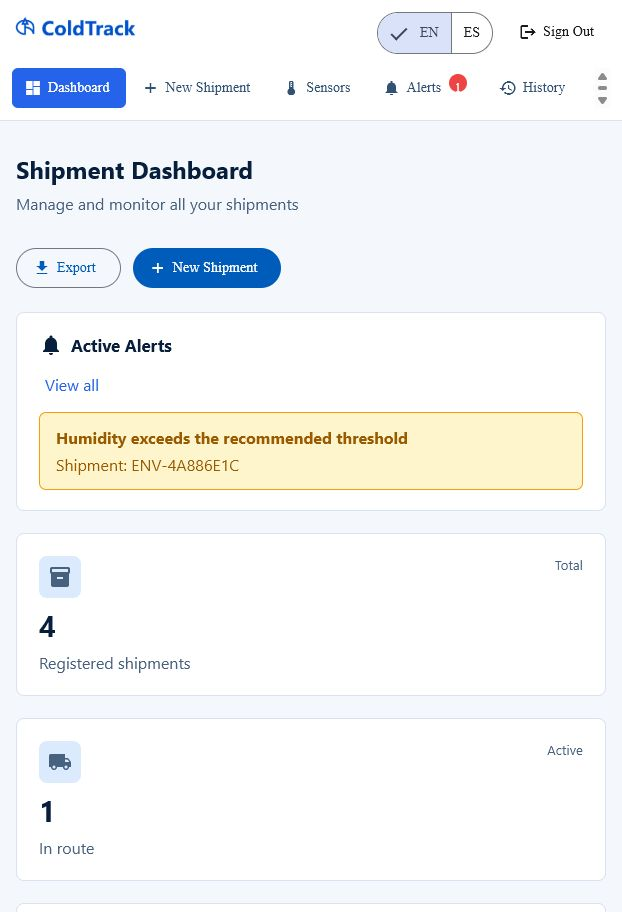

Como parte de la corrección final del producto, también se actualizó el Landing Page público para mejorar su presentación institucional y alinearlo con la versión final de ColdTrack. Se retiraron credenciales demo visibles, se amplió la información de FreshGuard Technologies, se suavizó el lenguaje visual de encabezados y badges, y se incorporó una sección **About the team** con las fotografías de los integrantes del equipo.

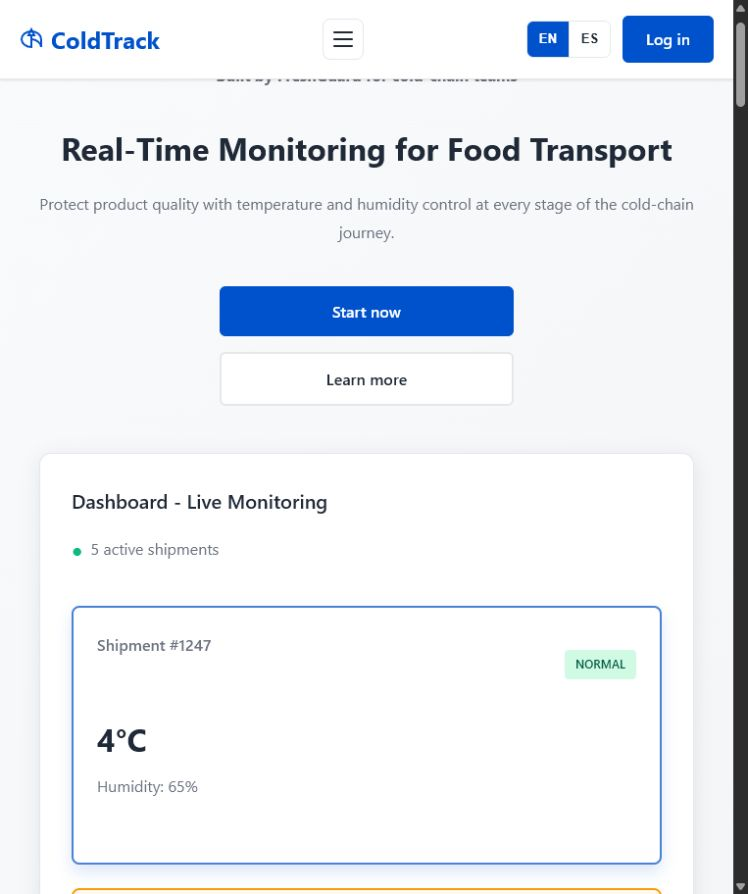

| Criterio revisado | Resultado |
|-------------------|-----------|
| Landing Page final desplegado | Disponible en GitHub Pages |
| Consistencia con Web Application | CTA principal redirige a la aplicación web desplegada |
| About the team | Incluye integrantes, códigos, roles y fotografías |
| i18n | Soporte de idioma inglés y español en la landing |
| a11y | Navegación semántica, textos alternativos y controles accesibles |

Desde esta interfaz se validaron los siguientes flujos de usuario:

1. Inicio de sesión con la cuenta demo `test@test.com / password`.
2. Carga del dashboard operativo con información obtenida desde la API REST.
3. Consulta de envíos registrados, en ruta, completados y cancelados.
4. Visualización de temperatura, humedad, conductor, destino y hora estimada.
5. Acceso al detalle de un envío mediante la acción **View details / Ver detalles**.
6. Registro de sensores y visualización de sensores disponibles/asignados.
7. Vinculación de un sensor disponible a un envío registrado o en ruta.
8. Registro de lecturas de telemetría para actualizar temperatura y humedad.
9. Cambio del estado del envío desde `REGISTERED` hacia `IN_TRANSIT` y posteriormente hacia `COMPLETED`.
10. Exportación de información operativa desde las vistas disponibles.

##### Evidencia de API ejecutable

El backend final expone sus contratos mediante Swagger UI. La versión productiva del documento OpenAPI fue actualizada a `1.0.0`, reflejando la release final del Sprint 4:

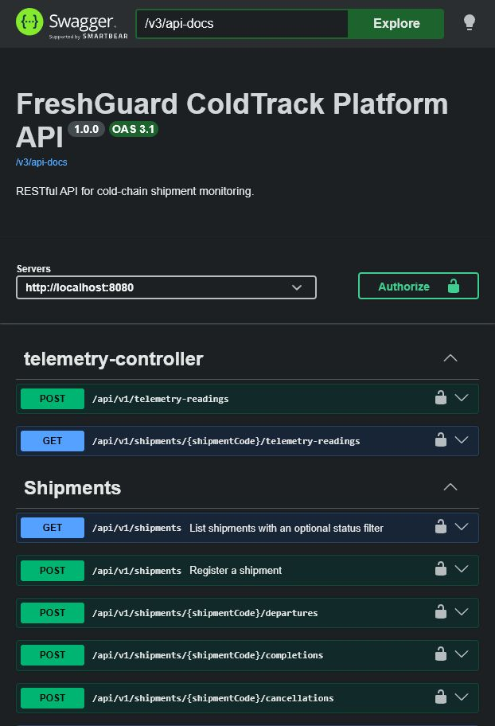

Los endpoints validados durante la ejecución final fueron:

| Módulo | Endpoint | Evidencia funcional |
|--------|----------|--------------------|
| Authentication | `POST /api/v1/authentication/sign-in` | Emite JWT para acceder a recursos protegidos |
| Shipments | `GET /api/v1/shipments` | Lista envíos persistidos en MySQL |
| Shipments | `POST /api/v1/shipments` | Registra nuevos envíos refrigerados |
| Shipment lifecycle | `POST /api/v1/shipments/{shipmentCode}/departures` | Inicia un envío registrado |
| Shipment lifecycle | `POST /api/v1/shipments/{shipmentCode}/completions` | Completa un envío en ruta |
| Sensors | `GET /api/v1/sensors` | Lista sensores disponibles y asignados |
| Sensor assignment | `POST /api/v1/shipments/{shipmentCode}/sensor-assignments` | Vincula un sensor a un envío |
| Telemetry | `POST /api/v1/telemetry-readings` | Registra temperatura y humedad |
| Alerts | `GET /api/v1/alerts` | Consulta alertas generadas por condiciones críticas |
| Analytics | `GET /api/v1/analytics/dashboard` | Devuelve métricas para el dashboard |
| Reports | `GET /api/v1/reports/shipments/{shipmentCode}` | Devuelve información consolidada del envío |

##### Resultados de la validación final

| Validación | Resultado |
|------------|-----------|
| Frontend público en Firebase | `200 OK` |
| Backend público en Render | `200 OK` |
| OpenAPI `/v3/api-docs` | `200 OK`, versión `1.0.0` |
| Swagger UI | Disponible públicamente |
| Inicio de sesión con cuenta demo | Correcto |
| Consumo de endpoints protegidos con JWT | Correcto |
| Persistencia de usuarios, envíos, sensores y telemetría | Correcta en MySQL |
| Vinculación sensor-envío | Correcta desde el frontend |
| Cambio de estado del envío | Correcto desde el frontend |
| Build de Angular | Correcto mediante `npm run build` |
| Pruebas del backend | 4 pruebas ejecutadas, 0 fallos |
| Empaquetado del backend | Correcto mediante `mvnw.cmd -DskipTests package` |

La ejecución final confirma que ColdTrack opera como un sistema integrado de extremo a extremo. El usuario interactúa con una Web Application pública, el frontend autentica y consume una API REST propia, el backend aplica reglas de negocio y persistencia, y la base de datos conserva la información operativa usada para dashboard, sensores, alertas e historial.

### 5.2.4.6. Services Documentation Evidence for Sprint Review.
Durante el Sprint Review, se recopiló y organizó toda la evidencia relacionada con los servicios implementados en el proyecto, detallando cada endpoint y respuestas esperadas.

| Módulo | Endpoint base | Acciones disponibles | Métodos HTTP | Descripción |
|---|---|---|---|---|
| Plataforma | `/health` | Verificar estado del servidor | `GET` | Estado de salud de la plataforma backend |
| Autenticación | `/api/v1/authentication` | Registrar cuenta, iniciar sesión | `POST /sign-up`<br>`POST /sign-in` | Registro y autenticación de usuarios ColdTrack mediante JWT |
| Usuarios | `/api/v1/users` | Obtener perfil del usuario autenticado | `GET /me` | Gestión del perfil del usuario autenticado |
| Envíos | `/api/v1/shipments` | Registrar envío, listar envíos, consultar un envío | `POST`<br>`GET`<br>`GET /{shipmentCode}` | Gestión principal de envíos refrigerados |
| Ciclo de vida de envíos | `/api/v1/shipments/{shipmentCode}` | Iniciar, completar o cancelar un envío | `POST /departures`<br>`POST /completions`<br>`POST /cancellations` | Control de transiciones operativas del envío |
| Sensores | `/api/v1/sensors` | Registrar sensores y listar sensores disponibles/asignados | `POST`<br>`GET` | Gestión de sensores de monitoreo |
| Asignación de sensores | `/api/v1/shipments/{shipmentCode}/sensor-assignments` | Vincular un sensor disponible a un envío | `POST` | Asociación entre sensor y envío para monitoreo |
| Telemetría | `/api/v1/telemetry-readings` | Registrar lecturas de temperatura y humedad | `POST` | Ingesta de lecturas ambientales del sensor |
| Telemetría por envío | `/api/v1/shipments/{shipmentCode}/telemetry-readings` | Consultar lecturas de un envío | `GET` | Consulta del historial ambiental asociado al envío |
| Alertas | `/api/v1/alerts` | Listar alertas generadas | `GET` | Consulta de alertas por desvíos de temperatura o humedad |
| Analítica | `/api/v1/analytics` | Obtener indicadores del dashboard | `GET /dashboard` | Indicadores operativos consolidados para la Web Application |
| Reportes | `/api/v1/reports/shipments/{shipmentCode}` | Consultar información consolidada del envío | `GET` | Datos de soporte para revisión operativa y generación de reportes |

### 5.2.4.7. Software Deployment Evidence for Sprint Review.

Durante el Sprint 4 se consolidó el despliegue final de ColdTrack, dejando publicados los tres componentes principales del sistema: Web Application, API REST y base de datos. A diferencia de sprints anteriores, en esta etapa se cerró la configuración productiva con releases finales, verificación de disponibilidad pública y documentación de las URLs necesarias para la presentación del producto.

##### Arquitectura final desplegada

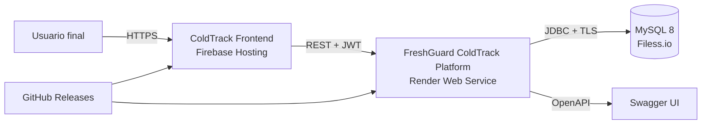
```mermaid
flowchart LR
    U[Usuario final] -->|HTTPS| F[ColdTrack Frontend<br/>Firebase Hosting]
    F -->|REST + JWT| B[FreshGuard ColdTrack Platform<br/>Render Web Service]
    B -->|JDBC + TLS| D[(MySQL 8<br/>Filess.io)]
    B -->|OpenAPI| S[Swagger UI]
    R[GitHub Releases] --> F
    R --> B
```

| Componente | Plataforma | URL o evidencia |
|------------|------------|-----------------|
| Frontend final | Firebase Hosting | https://coldtrack-front-open.web.app |
| Backend final | Render Web Service | https://freshguard-coldtrack-api.onrender.com |
| Swagger UI | Render | https://freshguard-coldtrack-api.onrender.com/swagger-ui/index.html |
| OpenAPI JSON | Render | https://freshguard-coldtrack-api.onrender.com/v3/api-docs |
| Base de datos | Filess.io | MySQL 8 administrado |
| Release backend | GitHub Releases | https://github.com/1ASI0729-2610-10155/FreshGuard.ColdTrack.Platform/releases/tag/v1.0.0 |
| Release frontend | GitHub Releases | https://github.com/1ASI0729-2610-10155/ColdTrack-Front/releases/tag/v1.0.0 |

##### Evidencia del backend desplegado en Render

El backend se ejecuta en Render como Web Service basado en Docker. La evidencia final muestra que el servicio `freshguard-coldtrack-api` quedó en estado `live` utilizando el commit `b9a7093`, correspondiente al merge final de la versión estable del backend:

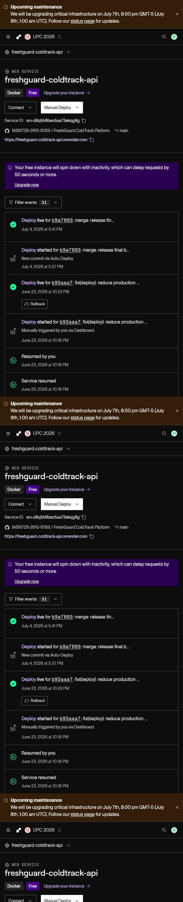

La configuración productiva utiliza variables de entorno para evitar exponer credenciales sensibles:

| Variable | Uso |
|----------|-----|
| `SPRING_PROFILES_ACTIVE=prod` | Activa la configuración productiva |
| `DATABASE_URL` | Host de MySQL en Filess.io |
| `DATABASE_PORT` | Puerto de la instancia MySQL |
| `DATABASE_NAME` | Base de datos productiva |
| `DATABASE_USER` | Usuario de conexión |
| `DATABASE_PASSWORD` | Contraseña protegida en Render |
| `DATABASE_MAX_POOL_SIZE=1` | Limita conexiones para el plan compartido |
| `DATABASE_MIN_IDLE=0` | Reduce conexiones inactivas |
| `JWT_SECRET` | Firma de tokens JWT |
| `FRONTEND_ORIGINS` | Orígenes permitidos para CORS |
| `OPENAPI_SERVERS` | Servidores mostrados en Swagger/OpenAPI |

##### Evidencia de releases finales en GitHub

Para cerrar el Sprint 4 se publicaron releases formales en GitHub para ambos repositorios principales. Esto permite identificar de forma estable la versión presentada durante la entrega final:

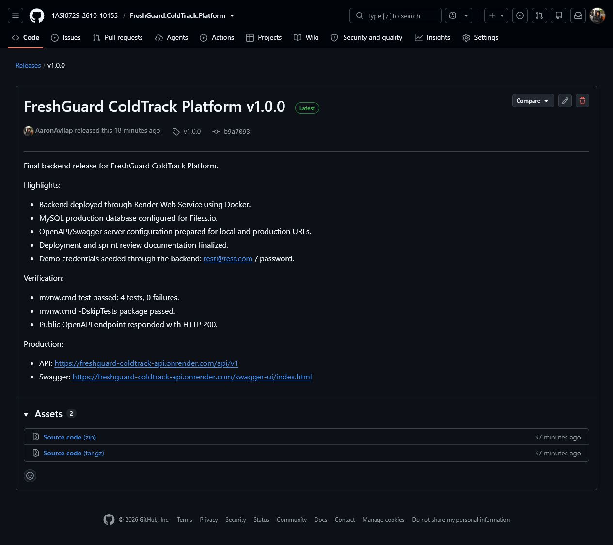

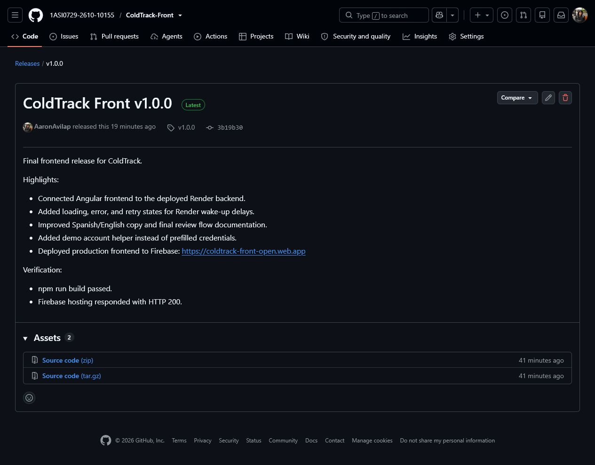

| Repositorio | Rama principal | Release final | Propósito |
|-------------|----------------|---------------|-----------|
| `FreshGuard.ColdTrack.Platform` | `main` | `v1.0.0` | Backend Spring Boot desplegado en Render |
| `ColdTrack-Front` | `main` | `v1.0.0` | Frontend Angular desplegado en Firebase |
| `report` | `main` | Documentación final | Evidencias, validación y conclusiones del producto |

##### Flujo de despliegue seguido

El equipo mantuvo el flujo de trabajo basado en GitFlow:

```text
main → develop → feature/* → develop → main → release/tag
```

El cierre de despliegue se realizó de la siguiente manera:

1. Se implementaron las mejoras finales del frontend en una rama feature.
2. Se integró la rama feature a `develop`.
3. Se integró `develop` a `main`.
4. Se creó y publicó el tag `v1.0.0` del frontend.
5. Se desplegó el frontend en Firebase Hosting.
6. Se implementaron ajustes finales de documentación/configuración del backend en una rama feature.
7. Se integró la rama feature a `develop` y luego a `main`.
8. Se creó y publicó el tag `v1.0.0` del backend.
9. Render ejecutó el auto-deploy desde `main` y dejó el commit `b9a7093` en estado `live`.
10. Se verificó que OpenAPI respondiera con versión `1.0.0`.

##### Comprobaciones posteriores al despliegue

| Comprobación | Resultado final |
|--------------|-----------------|
| `https://coldtrack-front-open.web.app` | `200 OK` |
| `https://freshguard-coldtrack-api.onrender.com/v3/api-docs` | `200 OK`, versión `1.0.0` |
| Swagger UI | Disponible desde Render |
| Render Web Service | Commit `b9a7093` en estado `live` |
| Firebase Hosting | Última versión liberada correctamente |
| Releases GitHub | `v1.0.0` publicada para frontend y backend |
| CORS frontend-backend | Configurado para Firebase y entorno local |
| Base de datos MySQL | Activa y utilizada por el backend productivo |

Como resultado, el Sprint 4 deja una versión final demostrable del sistema. ColdTrack cuenta con una aplicación pública, una API propia documentada, persistencia real y releases identificables para sustentación académica y revisión técnica.

### 5.2.4.8. Team Collaboration Insights during Sprint.
En este sprint, las tareas se organizaron en torno al modelado de dominio y la configuración inicial de la arquitectura para el sistema de logística de cadena de frío. La responsabilidad del desarrollo y la implementación técnica recayó en Mariano Vilela, Aaron Avila, Eslander Celis Berrospi, Mathias Arechaga y Rodrigo Oblitas.
2. **Evidencia de commits**:

Repositorio:

**Documento**

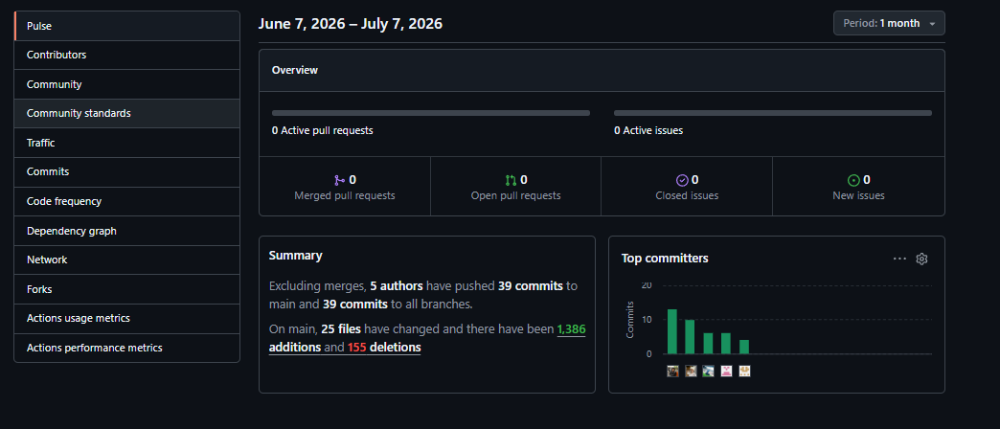

**Front**

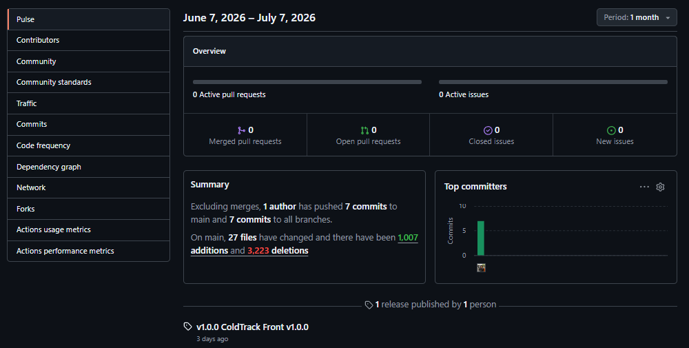

**Back**

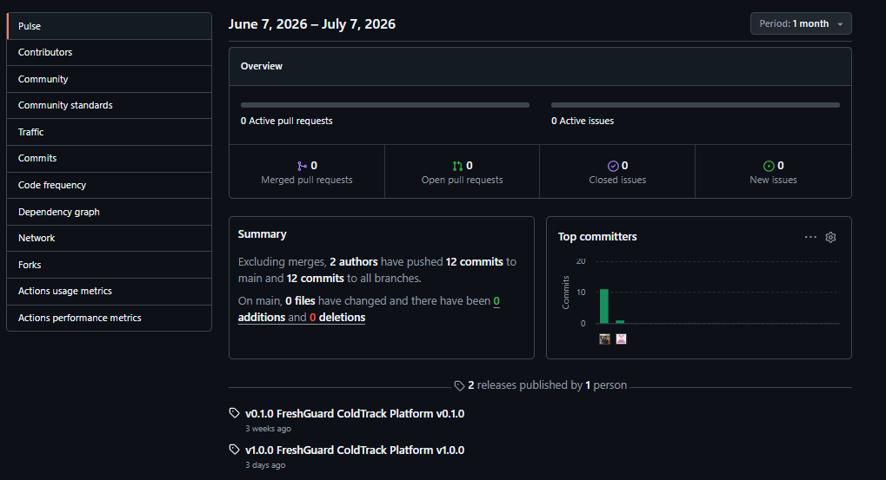

3. **Evidencia de Nertwork**:

Repositorio:

**Front**

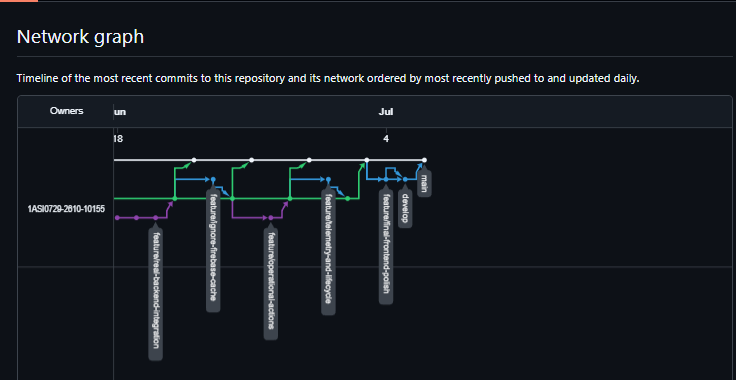

**Back**

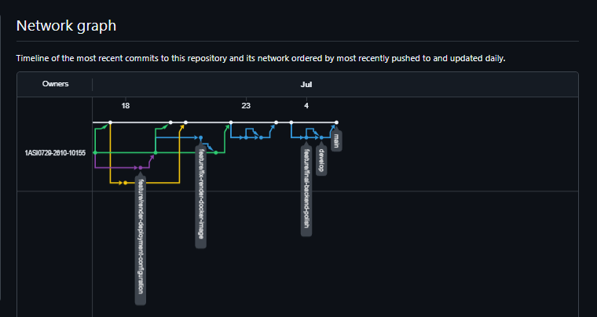

4.**Contributions**

Repositorios:

**Documento**

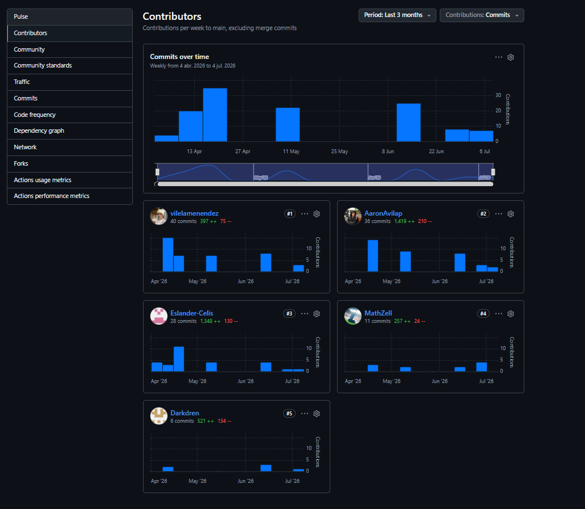


# 5.3. Validation Interviews.
## 5.3.1. Diseño de Entrevistas.

En esta sección se describe el diseño de las entrevistas de validación realizadas para ColdTrack durante la etapa final del proyecto. El objetivo de estas sesiones fue comprobar si los usuarios de los segmentos objetivo comprenden la propuesta de valor presentada en el Landing Page actualizado y si pueden interactuar con las principales funcionalidades de la Web Application integrada con el backend desplegado de manera clara, rápida y sin asistencia constante.

Las entrevistas fueron planteadas como sesiones guiadas, donde cada participante primero revisó el Landing Page de ColdTrack y luego ejecutó tareas específicas dentro de la aplicación. Durante la validación se observaron sus comentarios, dudas, tiempos de navegación, facilidad para completar los flujos y apreciaciones sobre la utilidad de la solución.

### Metodología de la sesión

Cada entrevista se desarrolló de manera remota mediante videollamada, registrando la interacción del participante con la solución web. El entrevistador explicó brevemente el objetivo de la sesión y solicitó al usuario navegar por el Landing Page y por la Web Application sin recibir instrucciones detalladas sobre dónde hacer clic, con el fin de observar si la interfaz comunicaba correctamente sus funcionalidades.

| **Etapa** | **Actividad realizada** | **Propósito** |
|-----------|--------------------------|---------------|
| Presentación del participante | Se solicitaron datos generales como nombre, edad, ocupación y relación con logística, operaciones o transporte. | Caracterizar al usuario y confirmar su pertenencia al segmento objetivo. |
| Exploración del Landing Page | El participante revisó la propuesta de valor, beneficios y explicación general de ColdTrack. | Validar si el producto web comunica claramente el problema que resuelve. |
| Ejecución de tareas en la Web Application | El usuario completó flujos relacionados con envíos, monitoreo, alertas e historial. | Evaluar la comprensión de la navegación y la facilidad para completar tareas. |
| Preguntas de cierre | Se recogieron opiniones sobre utilidad, claridad, alertas, información visible y oportunidades de mejora. | Obtener retroalimentación cualitativa para mejorar la experiencia de usuario. |

### Objetivos de la validación

| **Objetivo** | **Descripción** |
|--------------|-----------------|
| Validar la comprensión del Landing Page | Comprobar si el usuario entiende el problema que resuelve ColdTrack, la propuesta de valor y los beneficios de la solución. |
| Validar la navegación de la aplicación | Evaluar si el usuario puede desplazarse por las vistas principales sin confundirse. |
| Validar los flujos principales | Observar si el usuario puede completar tareas relacionadas con envíos, monitoreo, alertas e historial. |
| Identificar oportunidades de mejora | Recoger comentarios sobre claridad visual, organización de la información, términos usados y elementos que podrían optimizarse. |

### Segmentos considerados

| **Segmento objetivo** | **Perfil del usuario validado** | **Necesidad principal a validar** |
|-----------------------|----------------------------------|-----------------------------------|
| Personal de Logística y Operaciones | Supervisores, jefes de operaciones o personal de control de calidad relacionado con transporte refrigerado. | Supervisar envíos, revisar condiciones de temperatura y humedad, detectar alertas y consultar historial para tomar decisiones. |
| Personal de Transporte | Conductores o transportistas encargados del traslado de productos refrigerados. | Consultar el estado del envío, interpretar alertas y reaccionar oportunamente ante incidencias durante la ruta. |

### Elementos evaluados

| **Elemento** | **Aspecto validado** |
|--------------|----------------------|
| Landing Page | Claridad del mensaje, comprensión de la propuesta de valor, beneficios percibidos y relación con el problema de cadena de frío. |
| Dashboard principal | Facilidad para reconocer el estado general de los envíos, métricas principales y alertas visibles. |
| Gestión de envíos | Comprensión del listado de envíos, estado operativo y detalle de información del transporte. |
| Alertas | Interpretación de mensajes críticos, severidad y capacidad de reacción ante incidencias. |
| Historial | Utilidad de la información histórica para trazabilidad, revisión de incidentes y toma de decisiones. |

### User flows utilizados en la validación

| **Segmento** | **Elemento validado** | **User flow** | **Tarea asignada al entrevistado** |
|--------------|-----------------------|---------------|------------------------------------|
| Personal de Logística y Operaciones | Landing Page | Comprensión de propuesta de valor | Revisar el Landing Page e indicar qué problema considera que resuelve ColdTrack. |
| Personal de Logística y Operaciones | Web Application | Revisar monitoreo en tiempo real | Ingresar al dashboard y ubicar el estado actual de un envío refrigerado. |
| Personal de Logística y Operaciones | Web Application | Revisar alertas | Identificar si existe una alerta asociada a un envío y explicar qué acción tomaría. |
| Personal de Logística y Operaciones | Web Application | Consultar historial de envíos | Acceder al historial y revisar información de un envío finalizado. |
| Personal de Transporte | Landing Page | Comprensión de propuesta de valor | Revisar el Landing Page e indicar para qué sirve la solución. |
| Personal de Transporte | Web Application | Consultar estado del envío | Ubicar el envío asignado y revisar su estado general. |
| Personal de Transporte | Web Application | Interpretar alertas | Revisar una alerta de temperatura o humedad e indicar si el mensaje es comprensible. |
| Personal de Transporte | Web Application | Revisar detalle de ruta o carga | Consultar los detalles principales del envío para identificar información útil durante el transporte. |

### Criterios de observación

Durante la ejecución de las tareas se observaron los siguientes criterios:

| **Criterio** | **Descripción** |
|--------------|-----------------|
| Comprensión inicial | Si el usuario entiende rápidamente para qué sirve ColdTrack y a qué problema responde. |
| Facilidad de navegación | Si el usuario puede avanzar entre secciones sin perderse o requerir ayuda constante. |
| Claridad visual | Si los datos, estados, alertas e indicadores son visibles y fáciles de interpretar. |
| Utilidad percibida | Si el usuario considera que la plataforma puede ayudar en su trabajo real. |
| Oportunidades de mejora | Comentarios sobre información faltante, términos confusos o elementos que deberían destacarse más. |

### Guía de preguntas

Antes de iniciar las tareas, se realizaron preguntas de caracterización del participante: nombre completo, edad, ocupación o cargo, distrito o departamento y experiencia relacionada con transporte, logística o cadena de frío.

Después de la interacción con el Landing Page y la Web Application, se aplicaron preguntas de validación según el segmento:

| **Segmento** | **Preguntas posteriores a la interacción** |
|--------------|--------------------------------------------|
| Personal de Logística y Operaciones | ¿Comprendió claramente qué problema resuelve ColdTrack después de revisar el Landing Page?<br>¿Le resultó sencillo encontrar la información necesaria para monitorear un envío?<br>¿Las alertas mostradas le permitieron identificar rápidamente posibles incidencias?<br>¿Considera que la plataforma podría mejorar el control de las operaciones logísticas? ¿Por qué? |
| Personal de Transporte | ¿Entendió fácilmente para qué sirve la aplicación después de revisar el Landing Page?<br>¿Le resultó sencillo consultar el estado de un envío?<br>¿Las alertas le parecieron claras y fáciles de interpretar durante una ruta?<br>¿Considera que la aplicación le ayudaría a reaccionar más rápido ante problemas de temperatura o humedad? ¿Por qué? |

## 5.3.2. Registro de Entrevistas.

#### **Primer Segmento - Personal de Logística y Operaciones:** <br>
| **ENTREVISTA 1** | |
|------------------|----------------------------|
| **Nombre entrevistado** | Gianelly Vásquez |
| **Edad** | 27 |
| **Profesión** | supervisora de control de calidad |
| **Departamento** | Lima |
| **Inicio del video** | 0:00 |
| **Fin del video** | 3:55 |
| **Link del video** | https://drive.google.com/file/d/1XwYRweeNHZzyui3-aG7p3ch4PIPFYLEc/view?usp=drive_link |
| **Foto entrevista** |  |
| **Resumen** | Gianelly Vásquez, supervisora de control de calidad en transporte de alimentos refrigerados que vive en Jesús María, actualmente gestiona el monitoreo de temperatura de forma manual usando termómetros digitales, dataloggers básicos y registros en Excel, sin contar con un sistema integrado en tiempo real, lo que genera dependencia del conductor y riesgo de errores humanos; tras interactuar con el Landing Page de ColdTrack, indicó que comprendió claramente el problema que la plataforma busca resolver, relacionado con el monitoreo de la cadena de frío durante el transporte, además señaló que la información presentada fue fácil de encontrar y estuvo bien organizada, lo que facilitó la comprensión de los datos del envío; también destacó que las alertas mostradas son visibles y permiten identificar rápidamente posibles incidencias durante el trayecto; finalmente, considera que la plataforma puede mejorar significativamente el control de las operaciones logísticas al permitir la supervisión en tiempo real y la detección oportuna de problemas, facilitando una mejor toma de decisiones y reduciendo riesgos en la cadena de suministro. |

| **ENTREVISTA 2** | |
|------------------|----------------------------|
| **Nombre entrevistado** | Claudio Castillo |
| **Edad** | 25 |
| **Profesión** | Personal relacionado con logística, operaciones o control de calidad |
| **Departamento** | Lima |
| **Entrevistador** | Mariano Vilela |
| **Inicio del video** | 0:00 |
| **Fin del video** | 3:05 |
| **Link del video** | https://drive.google.com/file/d/1XwYRweeNHZzyui3-aG7p3ch4PIPFYLEc/view?usp=drive_link |
| **Foto entrevista** |  |
| **Resumen** | Claudio Castillo participó en la entrevista de validación del primer segmento, guiada por Mariano Vilela. Durante la sesión revisó el Landing Page y la Web Application de ColdTrack, enfocándose en los flujos de monitoreo de envíos, revisión de alertas y consulta de información operativa. A partir de la interacción, comprendió que la propuesta busca mejorar el control de la cadena de frío durante el transporte de alimentos mediante información centralizada y alertas oportunas. Asimismo, valoró que la plataforma permita visualizar el estado del envío y posibles incidencias en un solo entorno, ya que esto podría reducir la dependencia de reportes manuales o llamadas constantes al conductor. Como oportunidad de mejora, se identificó que los mensajes de alerta deben ser directos y priorizar la acción que debe tomar el responsable logístico. |

#### **Segundo Segmento - Personal de Transporte:** <br>

| **ENTREVISTA 1** |                            |
|------------------|----------------------------|
| **Nombre entrevistado** | Edery Abanto |
| **Edad** | 30 |
| **Profesión** | personal de transporte |
| **Departamento** | Lima |
| **Inicio del video** | 15:13 |
| **Fin del video** | 20:40 |
| **Link del video** | https://upcedupe-my.sharepoint.com/:v:/g/personal/u202416908_upc_edu_pe/IQBXzX9sjMywR5oHRjJ8GAxeAdWlzKxOcQMLt52n6XrGGnc?e=VBNRJi&nav=eyJyZWZlcnJhbEluZm8iOnsicmVmZXJyYWxBcHAiOiJTdHJlYW1XZWJBcHAiLCJyZWZlcnJhbFZpZXciOiJTaGFyZURpYWxBcHBQbGF0Zm9ybSI6IldlYiIsInJlZmVycmFsTW9kZSI6InZpZXcifX0%3D |
| **Foto entrevista** |  |
| **Resumen** | Edri Abanto, conductor de transporte de carga refrigerada de 30 años con 5 años de experiencia, encargado de trasladar productos perecibles como lácteos, embutidos y carnes frescas que requieren una cadena de frío estricta, actualmente monitorea la temperatura mediante un sistema integrado en la cabina que le permite visualizar el estado general sin detenerse, pero que no proporciona datos precisos, ni alertas preventivas, ni información en tiempo real compartible con la central, lo que genera una dependencia de la observación manual y aumenta el riesgo de no detectar fallas a tiempo; su principal problema es la inestabilidad de la temperatura durante la ruta debido a factores externos como el clima o paradas prolongadas, así como la falta de alertas automáticas ante fallas progresivas del sistema de refrigeración, lo que ya ha ocasionado pérdidas de mercadería en el pasado por detección tardía de incidentes; además, enfrenta limitaciones de conectividad en ciertas zonas, lo que dificulta la comunicación y el monitoreo continuo; por ello, considera que la solución ideal debería ofrecer alertas sonoras progresivas, indicadores visuales claros mediante códigos de color, monitoreo en tiempo real y una interfaz intuitiva que no requiera interacción constante, creyendo que una aplicación como ColdTrack podría brindarle mayor seguridad operativa, facilitar la toma de decisiones durante la ruta y reducir significativamente el riesgo de pérdida de productos. |

| **ENTREVISTA 2** | |
|------------------|----------------------------|
| **Nombre entrevistado** | Camila Vega |
| **Edad** | 28 |
| **Profesión** | conductora |
| **Departamento** | Lima |
| **Entrevistador** | Aarón Avila Palacios |
| **Inicio del video** | 0:00 |
| **Fin del video** | 2:18 |
| **Link del video** | https://drive.google.com/file/d/1qJee7ydMPY_k7aXL2FoFVtS1GJaTjhjl/view?usp=drive_link |
| **Foto entrevista** |  |
| **Resumen** | Camila Vega, conductora de 28 años perteneciente al segmento de personal de transporte, participó en la validación de ColdTrack revisando el Landing Page y los flujos principales de la aplicación orientados al seguimiento del estado de un envío y la interpretación de alertas. Durante la sesión identificó que la propuesta busca apoyar a los conductores durante el traslado de productos refrigerados, especialmente cuando se presentan variaciones de temperatura o humedad. Consideró importante que la información del envío sea clara, rápida de consultar y fácil de entender mientras se encuentra en ruta. Asimismo, valoró que las alertas permitan reaccionar con mayor rapidez ante incidencias, siempre que los mensajes sean directos y no requieran una interacción compleja durante la conducción. |

| **ENTREVISTA 3** | |
|------------------|----------------------------|
| **Nombre entrevistado** | Fernando Pérez |
| **Edad** | 51 |
| **Profesión** | conductor |
| **Departamento** | Lima |
| **Inicio del video** | 0:00 |
| **Fin del video** | 1:28 |
| **Link del video** | https://drive.google.com/file/d/12zC-XNC_SjH2qDJEn48HsPJ6_leXD-kd/view?usp=drive_link |
| **Foto entrevista** |  |
| **Resumen** | Fernando Pérez, conductor de 51 años perteneciente al segmento de personal de transporte, evaluó la propuesta de ColdTrack desde la perspectiva de un usuario que necesita información simple y oportuna durante una ruta. Al revisar la solución, identificó la utilidad de consultar el estado del envío y recibir alertas relacionadas con temperatura o humedad, ya que estas señales podrían ayudar a prevenir pérdidas de mercadería y comunicar incidencias a tiempo. También destacó la importancia de que la aplicación sea clara, con indicadores visuales fáciles de interpretar y mensajes concretos, debido a que el conductor no puede dedicar demasiado tiempo a navegar por varias pantallas mientras cumple sus actividades de transporte. |

## 5.3.3. Evaluaciones según heurísticas.

Para complementar las entrevistas de validación, se aplicó una evaluación basada en heurísticas de experiencia de usuario. Esta evaluación permitió analizar la propuesta de ColdTrack desde tres enfoques: usabilidad, arquitectura de información e inclusive design. El objetivo fue identificar problemas de interacción, claridad, accesibilidad y organización de contenido que pudieran afectar la experiencia de los usuarios durante el uso del Landing Page y la Web Application.

La evaluación se realizó tomando como referencia las observaciones obtenidas durante las sesiones de validación. Para ello se revisó si los usuarios podían comprender la propuesta del Landing Page, ejecutar los flujos principales de la aplicación y reconocer información crítica relacionada con el estado del envío, las alertas y el historial de monitoreo.

### Escala de severidad utilizada

| **Nivel** | **Severidad** | **Descripción** |
|-----------|---------------|-----------------|
| 0 | Sin problema | No se identifican dificultades relevantes. |
| 1 | Problema menor | Puede generar una pequeña duda, pero no impide completar la tarea. |
| 2 | Problema moderado | Puede retrasar al usuario o requerir orientación adicional. |
| 3 | Problema crítico | Dificulta significativamente la tarea y debe corregirse con prioridad. |

### Evaluación heurística

| **Criterio heurístico** | **Elemento evaluado** | **Hallazgo** | **Severidad** | **Recomendación** |
|-------------------------|-----------------------|--------------|---------------|-------------------|
| Visibilidad del estado del sistema | Dashboard y detalle de envíos | La aplicación permite reconocer el estado general de los envíos mediante indicadores de temperatura, humedad y estado operativo. | 0 | Mantener indicadores visibles y reforzar el uso de colores consistentes para estados normales, preventivos y críticos. |
| Correspondencia entre el sistema y el mundo real | Landing Page y alertas | Los usuarios comprenden que ColdTrack se relaciona con cadena de frío, transporte y monitoreo de alimentos; sin embargo, algunos términos técnicos podrían simplificarse. | 1 | Usar lenguaje más directo en mensajes de alerta y etiquetas operativas. |
| Control y libertad del usuario | Navegación de la Web Application | Los flujos principales permiten desplazarse entre dashboard, envíos, alertas e historial, aunque se debe asegurar que el usuario pueda volver fácilmente a la vista anterior. | 1 | Mantener accesos visibles al menú principal y botones de retorno en vistas de detalle. |
| Consistencia y estándares | Interfaz general | La aplicación mantiene una estructura visual consistente en las vistas principales, lo que favorece el aprendizaje durante la validación. | 0 | Conservar la misma lógica de botones, tablas, tarjetas e indicadores en futuras vistas. |
| Prevención de errores | Registro y monitoreo de envíos | Para operaciones críticas, como registrar o finalizar un envío, se requiere evitar errores de datos incompletos o acciones accidentales. | 2 | Incorporar validaciones visibles, mensajes de confirmación y advertencias antes de acciones irreversibles. |
| Reconocimiento antes que memoria | Consulta de alertas e historial | Los usuarios pueden interpretar mejor la información cuando los datos están agrupados por estado, fecha, severidad o envío. | 1 | Mantener filtros y etiquetas claras para reducir la carga de memoria del usuario. |
| Flexibilidad y eficiencia de uso | Flujos de logística | El personal de logística requiere encontrar rápidamente envíos activos, incidencias e historial para tomar decisiones. | 1 | Agregar filtros, búsqueda y ordenamiento por criticidad, fecha o estado del envío. |
| Diseño estético y minimalista | Landing Page y Web Application | La información se percibe organizada y orientada al propósito del producto, aunque debe evitarse saturar las vistas operativas con datos secundarios. | 1 | Priorizar temperatura, humedad, estado, ruta y alertas en la primera vista. |
| Ayuda para reconocer y recuperarse de errores | Alertas y mensajes del sistema | Las alertas comunican incidencias, pero deben indicar de forma clara qué ocurrió y qué acción se recomienda. | 2 | Redactar mensajes de alerta con causa, impacto y acción sugerida. |
| Inclusive design y accesibilidad | Interfaz visual | La solución debe considerar usuarios con distintos niveles de experiencia digital y condiciones de uso en campo. | 2 | Asegurar contraste adecuado, tamaños legibles, textos simples, iconos acompañados de etiquetas y diseño responsive. |

### Resultados por segmento

| **Segmento** | **Resultado de la validación** | **Principales oportunidades de mejora** |
|--------------|--------------------------------|------------------------------------------|
| Personal de Logística y Operaciones | El segmento comprendió que ColdTrack permite centralizar el monitoreo de la cadena de frío y mejorar la visibilidad del estado de los envíos. Se valoró positivamente la posibilidad de detectar incidencias mediante alertas y revisar información en tiempo real. | Reforzar filtros de búsqueda, priorizar alertas por severidad y mejorar la explicación de acciones sugeridas ante incidentes. |
| Personal de Transporte | El segmento identificó la utilidad de consultar el estado del envío y recibir alertas claras durante la ruta. Los participantes destacaron que la aplicación debe ser rápida, simple y fácil de interpretar porque el conductor no puede dedicar demasiado tiempo a navegar. | Simplificar mensajes de alerta, mantener indicadores visuales grandes, reducir pasos en la consulta del envío y asegurar buena visualización en dispositivos móviles. |

### Hallazgos principales

| **Hallazgo** | **Interpretación** | **Acción recomendada** |
|--------------|--------------------|-------------------------|
| Los usuarios entienden la propuesta general de ColdTrack. | El Landing Page comunica adecuadamente que la solución se relaciona con monitoreo de cadena de frío y prevención de incidencias. | Mantener el enfoque del mensaje y reforzar ejemplos concretos de uso para logística y transporte. |
| Las alertas son el elemento más valorado por ambos segmentos. | Los entrevistados relacionan las alertas con una respuesta más rápida ante variaciones de temperatura o humedad. | Incluir mensajes de alerta con nivel de severidad, causa probable y acción sugerida. |
| El personal de transporte requiere una experiencia más directa. | Los conductores necesitan consultar información sin navegar por muchas pantallas. | Priorizar una vista resumida del envío, estado actual y alertas activas. |
| El historial aporta valor para trazabilidad. | El personal de logística puede usar registros anteriores para revisar incidentes y sustentar decisiones. | Mejorar filtros por fecha, envío, ruta, estado y severidad. |

### Conclusión de la evaluación

La evaluación heurística muestra que ColdTrack presenta una experiencia comprensible para los usuarios de logística, operaciones y transporte, especialmente en la visualización del estado de envíos y la identificación de alertas. Los principales aspectos positivos se relacionan con la centralización de información, la visibilidad de incidencias y la relación directa entre la propuesta del Landing Page y las funcionalidades de la aplicación.

Como oportunidades de mejora, se recomienda reforzar la claridad de los mensajes de alerta, agregar validaciones en acciones críticas, mejorar filtros de búsqueda y asegurar criterios de accesibilidad visual. Estas mejoras permitirán que la plataforma sea más efectiva para usuarios que deben tomar decisiones rápidas durante operaciones de transporte refrigerado.

# 5.4. Video About-the-Product.

En esta sección se presenta el Video About-the-Product, cuyo objetivo es dar a conocer el modelo de negocio, la propuesta de valor y las principales funcionalidades desarrolladas en la solución. El video está dirigido a los visitantes del Landing Page y a los usuarios de la aplicación web, quienes podrán conocer cómo el producto permite resolver las necesidades identificadas en los segmentos objetivo.

Durante el video se muestra una explicación general del producto, el recorrido por el Landing Page, las principales funcionalidades de la aplicación y la forma en que los usuarios pueden interactuar con la plataforma. Asimismo, se incluye un testimonio positivo de un usuario que participó en las entrevistas de validación, reforzando la utilidad de la solución propuesta.

### Evidencia del video

Screenshot del video:

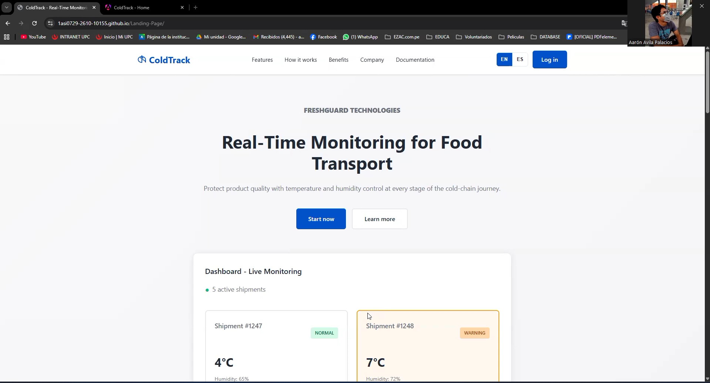


Microsoft Stream URL:
https://1drv.ms/v/c/466c954577703c8e/IQCJdrSE1GKPRZgYP4VEqUP1Afc-5qI4_2WpZSsziXpq_MQ?e=gN01d1

YouTube URL:
https://www.youtube.com/watch?v=CDCBfXDJFjQ

Timing / Duración:
3:07 minutos 

# 5.5. Video About-the-Team.

En esta sección se presenta el Video About-the-Team, cuyo objetivo es evidenciar el proceso colaborativo del equipo durante el desarrollo de ColdTrack. El video resume la organización de trabajo, la planificación de sprints, la implementación del Landing Page, la Web Application, los Web Services, la integración final, el despliegue y los aprendizajes obtenidos por cada integrante.

El contenido complementa la sección Student Outcome, ya que cada participante presenta ante cámara sus actividades realizadas, los resultados alcanzados y la forma en que el proyecto fortaleció sus competencias de comunicación oral y escrita frente a diferentes audiencias.

| Sección | Descripción | Inicio |
|---------|-------------|--------|
| Proceso colaborativo y desarrollo del proyecto | Se resume el proceso de trabajo del equipo durante el desarrollo de ColdTrack, mostrando reuniones, planificación de sprints, coordinación entre integrantes, desarrollo del frontend y backend, integración del sistema y despliegue final. | 00:00 |
| Presentación de Eslander | Explica sus actividades realizadas, contribuciones al proyecto, outcomes logrados y competencias desarrolladas. | 01:52 |
| Presentación de Rodrigo | Explica sus actividades realizadas, contribuciones al proyecto, outcomes logrados y competencias desarrolladas. | 02:50 |
| Presentación de Mathias | Explica sus actividades realizadas, contribuciones al proyecto, outcomes logrados y competencias desarrolladas. | 04:03 |
| Presentación de Aaron | Explica sus actividades realizadas, contribuciones al proyecto, outcomes logrados y competencias desarrolladas. | 05:00 |
| Presentación de Mariano | Explica sus actividades realizadas, contribuciones al proyecto, outcomes logrados y competencias desarrolladas. | 05:58 |

### Evidencia del video

Screenshot del video:


Microsoft Stream URL:  

<https://upcedupe-my.sharepoint.com/:v:/g/personal/u201911249_upc_edu_pe/IQBLyZI2bKctQYWAI6Wr6mRMAVhYhbuppTcY6C9_XdAFqbE?e=dZzXdY&nav=eyJyZWZlcnJhbEluZm8iOnsicmVmZXJyYWxBcHAiOiJTdHJlYW1XZWJBcHAiLCJyZWZlcnJhbFZpZXciOiJTaGFyZURpYWxvZy1MaW5rIiwicmVmZXJyYWxBcHBQbGF0Zm9ybSI6IldlYiIsInJlZmVycmFsTW9kZSI6InZpZXcifX0%3D>

YouTube URL:  
https://youtu.be/Mt3vnaf3Q1o

Timing / Duración:  
7:32 minutos


## Conclusiones

### Conclusiones y recomendaciones

**1.** Como equipo, confirmamos que el problema principal identificado en nuestro Lean UX Problem Statement es relevante para los segmentos objetivo. Las empresas distribuidoras, supervisores logísticos, personal de control de calidad y conductores necesitan mayor visibilidad sobre las condiciones de temperatura y humedad durante el transporte de alimentos. La versión final de ColdTrack responde a esta necesidad mediante una Web Application integrada con un backend propio, dashboard operativo, gestión de envíos, sensores, telemetría, alertas e historial.

**2.** Las assumptions de usuario se validaron con mayor solidez durante la entrega final. Los usuarios requieren una herramienta clara, rápida y centralizada para revisar el estado de los envíos antes, durante y después del transporte. ColdTrack permite consultar envíos activos, sensores disponibles, alertas críticas, lecturas ambientales y registros históricos desde una sola interfaz conectada a datos persistidos en MySQL.

**3.** Las assumptions de negocio también se mantienen vigentes. ColdTrack demuestra potencial como solución digital para reducir pérdidas, mejorar la trazabilidad y fortalecer el control de calidad durante el transporte de alimentos. A diferencia de la primera versión del frontend, la entrega final ya no depende de MockAPI como fuente principal de información, sino de una API REST propia desplegada en Render y documentada con Swagger/OpenAPI.

**4.** En relación con los Hypothesis Statements, se avanzó en la validación de las hipótesis vinculadas al monitoreo centralizado, las alertas, el historial, la trazabilidad y la claridad de la interfaz. La aplicación permite revisar varias rutas o unidades desde el dashboard, consultar alertas por severidad y estado, registrar telemetría, vincular sensores a envíos y completar el ciclo de vida operativo de un envío.

**5.** La hipótesis sobre integración con sensores de temperatura y humedad fue validada a nivel funcional mediante el registro de sensores, asignación a envíos y envío de lecturas de telemetría hacia el backend. Sin embargo, para una siguiente etapa se recomienda conectar sensores físicos o servicios IoT reales que transmitan lecturas periódicas automáticamente, permitiendo validar el comportamiento del sistema en escenarios de campo.

**6.** La implementación final con Angular, Angular Material, Angular Signals, Java 26, Spring Boot, Spring Security, Spring Data JPA, MySQL, Render, Filess.io y Firebase Hosting permitió obtener una solución funcional, desplegada y demostrable de extremo a extremo. El frontend está disponible públicamente, el backend responde desde Render, la documentación de servicios está publicada y los datos operativos se conservan en una base MySQL administrada.

**7.** El uso de GitFlow, ramas feature, merges hacia `develop` y `main`, tags y GitHub Releases permitió ordenar la liberación del producto final. Las releases `v1.0.0` del frontend y backend facilitan identificar con claridad la versión presentada para la evaluación final, reduciendo ambigüedad entre versiones de desarrollo, despliegue y documentación.

**8.** Las validaciones con usuarios y la evaluación heurística mostraron que ColdTrack comunica adecuadamente su propuesta de valor y que los flujos principales son comprensibles. No obstante, se recomienda continuar mejorando la claridad de los mensajes de alerta, los filtros de búsqueda, la priorización por severidad, las confirmaciones en acciones críticas y la accesibilidad visual para usuarios en contextos operativos.

**9.** El módulo de alertas debe evolucionar para no solo mostrar incidencias, sino también permitir registrar acciones correctivas, marcar alertas como atendidas, notificar al conductor o supervisor y generar evidencia del incidente. Esto fortalecerá la trazabilidad y permitirá medir mejor la reducción de pérdidas, tiempos de respuesta y calidad de la operación logística.

**10.** Finalmente, recomendamos que el roadmap de ColdTrack priorice la integración con sensores reales, notificaciones en tiempo real, reportes exportables más completos, control de roles por tipo de usuario, métricas comparativas por ruta, auditoría de acciones y mejoras de accesibilidad responsive. Estas funcionalidades permitirán pasar de una versión académica funcional hacia una solución más robusta, alineada con el modelo de negocio digital y con los criterios de éxito definidos en el proceso Lean UX.

## Bibliografía

• Atlassian. (s. f.). *Trello*. https://trello.com/

• CareerFoundry. (2022). *What are user flows in UX design?* https://careerfoundry.com/en/blog/ux-design/what-are-user-flows/

• Figma. (s. f.). *Figma: The collaborative interface design tool*. https://www.figma.com/

• Git. (s. f.). *Git documentation*. https://git-scm.com/doc

• GitHub Docs. (s. f.). *Managing releases in a repository*. https://docs.github.com/repositories/releasing-projects-on-github/managing-releases-in-a-repository

• Google Firebase. (s. f.). *Firebase Hosting documentation*. https://firebase.google.com/docs/hosting

• IBM. (s. f.). *As-is Scenario Map*. IBM Design Thinking. https://www.ibm.com/design/thinking/page/toolkit/activity/as-is-scenario-map

• IBM. (s. f.). *Empathy Map*. IBM Design Thinking. https://www.ibm.com/design/thinking/page/toolkit/activity/empathy-map

• Lucid Software Inc. (s. f.). *Lucidchart*. https://www.lucidchart.com

• MySQL. (s. f.). *MySQL 8.0 Reference Manual*. Oracle. https://dev.mysql.com/doc/refman/8.0/en/

• OpenAPI Initiative. (s. f.). *OpenAPI Specification*. https://spec.openapis.org/oas/latest.html

• Render. (s. f.). *Render Web Services documentation*. https://render.com/docs/web-services

• Schwaber, K., & Sutherland, J. (2020). *The Scrum Guide: The definitive guide to Scrum: The rules of the game*. Scrum.org. https://scrumguides.org/

• Spring. (s. f.). *Spring Boot Reference Documentation*. VMware Tanzu. https://docs.spring.io/spring-boot/index.html

• Spring. (s. f.). *Spring Security Reference*. VMware Tanzu. https://docs.spring.io/spring-security/reference/

• Springdoc.org. (s. f.). *Springdoc OpenAPI documentation*. https://springdoc.org/

• Structurizr. (s. f.). *Structurizr documentation*. https://docs.structurizr.com/

• Swagger. (s. f.). *Swagger UI documentation*. SmartBear Software. https://swagger.io/tools/swagger-ui/

• The Angular Team. (s. f.). *Angular documentation*. Google. https://angular.dev/

• The Angular Team. (s. f.). *Angular Material documentation*. Google. https://material.angular.dev/

• VMware Tanzu. (2008). *Pivotal Tracker*. https://www.pivotaltracker.com/

• Heckler, M. (2021). *Spring Boot: Up and Running*. O’Reilly Media.

• Kotaru, V. K. (2020). *Angular for Material Design: Leverage Angular Material and TypeScript to Build a Rich User Interface for Web Apps*. Apress. https://doi.org/10.1007/978-1-4842-5434-9

• Loy, M., Niemeyer, P., & Leuck, D. (2023). *Learning Java* (6th ed.). O’Reilly.

# Anexos

## Videos de Exposiciones

### AV2 (Avance 2)

Video correspondiente a la exposición del segundo avance, donde se evidenció principalmente el desarrollo del backend, integración de servicios, persistencia de datos y conexión entre frontend y backend.

Microsoft Stream URL:

<https://upcedupe-my.sharepoint.com/:v:/g/personal/u201911249_upc_edu_pe/IQBOBOCNiucHS5sxaF6NQxhAAcjIxyjyq0SMuPlVnGwHoMk?e=44emzC&nav=eyJyZWZlcnJhbEluZm8iOnsicmVmZXJyYWxBcHAiOiJTdHJlYW1XZWJBcHAiLCJyZWZlcnJhbFZpZXciOiJTaGFyZURpYWxvZy1MaW5rIiwicmVmZXJyYWxBcHBQbGF0Zm9ybSI6IldlYiIsInJlZmVycmFsTW9kZSI6InZpZXcifX0%3D>

### TB2 (Trabajo Final / Release Review)

Video correspondiente a la exposición final del proyecto, donde se debe presentar la versión final de ColdTrack, las correcciones realizadas sobre los artefactos previos, la demostración de los productos desplegados y la evidencia de colaboración del equipo. Para esta entrega, el video debe cubrir la Landing Page, la Web Application, los Web Services, la persistencia en MySQL, los releases finales y los principales escenarios funcionales ejecutados sobre el entorno productivo.

Microsoft Stream URL:
<https://upcedupe-my.sharepoint.com/:v:/g/personal/u201911249_upc_edu_pe/IQAlN0Lu33skT6a-VlYxxvvnARWVG4VC6XDaGPP8J7TAh-o?e=G6s3P6&nav=eyJyZWZlcnJhbEluZm8iOnsicmVmZXJyYWxBcHAiOiJTdHJlYW1XZWJBcHAiLCJyZWZlcnJhbFZpZXciOiJTaGFyZURpYWxvZy1MaW5rIiwicmVmZXJyYWxBcHBQbGF0Zm9ybSI6IldlYiIsInJlZmVycmFsTW9kZSI6InZpZXcifX0%3D>
